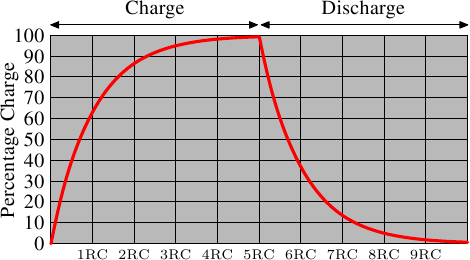
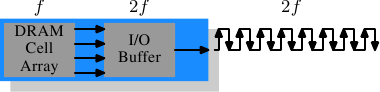
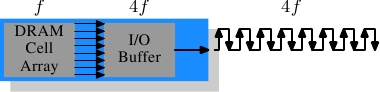

# 2. Commodity Hardware Today 现代商用硬件

Understanding commodity hardware is important because specialized hardware is in retreat. Scaling these days is most often achieved horizontally instead of vertically, meaning today it is more cost-effective to use many smaller, connected commodity computers instead of a few really large and exceptionally fast (and expensive) systems. This is the case because fast and inexpensive network hardware is widely available. There are still situations where the large specialized systems have their place and these systems still provide a business opportunity, but the overall market is dwarfed by the commodity hardware market. Red Hat, as of 2007, expects that for future products, the “standard building blocks” for most data centers will be a computer with up to four sockets, each filled with a quad core CPU that, in the case of Intel CPUs, will be hyper-threaded.[[2]](#2) This means the standard system in the data center will have up to 64 virtual processors. Bigger machines will be supported, but the quad socket, quad CPU core case is currently thought to be the sweet spot and most optimizations are targeted for such machines.

由于专用硬件正在过时,理解商用硬件变得非常重要.时至今日,水平扩展比起垂直扩展更为常见.意味着如今使用许多较小,连结在一起的商用计算机,而非少数几个非常大型且异常迅速(且昂贵)的系统,是较符合成本效益的.这是因为快速且廉价的网络硬件随处可见.虽然那些大型专用系统仍在一些情况中占有一席之地,并仍旧有其商机,但整体市场已被商用硬件市场蚕食.Red Hat 于2007 年预期,对于未来的产品,大多数据中心的"标准建构组件(*standard building block*)"将会是一台有着至多四个插槽(socket)的计算机,每个插槽插着一颗四核CPU,这些CPU,以Intel CPU 而言,都会采用超线程(hyper-thread)技术.[[2]](#2)这表示数据中心的标准系统将会有至多64 个虚拟处理器(virtual processor).当然也能够支持更大的机器,但四槽、四核CPU是当前认为最适宜的配置,并且大多的最佳化都是针对这种机器.

Large differences exist in the structure of commodity computers. That said, we will cover more than 90% of such hardware by concentrating on the most important differences. Note that these technical details tend to change rapidly, so the reader is advised to take the date of this writing into account.

由商用计算机结构上也存在着巨大差异.也就是说,我们将专注于最重大的差异上,从而涵盖超过90% 这类硬件.请注意,这些技术细节日新月异,因此奉劝读者将本文的撰写日期纳入考量.

Over the years the personal computers and smaller servers standardized on a chipset with two parts: the Northbridge and Southbridge. Figure 2.1 shows this structure.

这些年来,个人计算机以及小型服务器被一组芯片组(chipset)标准化,芯片组具有两个部份:北桥(Northbridge)与南桥(Southbridge).图2.1 表示了这个结构.


All CPUs (two in the previous example, but there can be more) are connected via a common bus (the Front Side Bus, FSB) to the Northbridge. The Northbridge contains, among other things, the memory controller, and its implementation determines the type of RAM chips used for the computer. Different types of RAM, such as DRAM, Rambus, and SDRAM, require different memory controllers.

所有(在前面的例子中有两颗,但可以有更多)CPU 都透过一条共用的总线(*bus*),前端总线(Front Side Bus,FSB),连接到北桥.北桥包含了内存控制器(memory controller),而它的实现决定了用在计算机中的RAM芯片类型.不同类型的RAM,诸如DRAM、Rambus、以及SDRAM,需要不同内存控制器.

To reach all other system devices, the Northbridge must communicate with the Southbridge. The Southbridge, often referred to as the I/O bridge, handles communication with devices through a variety of different buses. Today the PCI, PCI Express, SATA, and USB buses are of most importance, but PATA, IEEE 1394, serial, and parallel ports are also supported by the Southbridge. Older systems had AGP slots which were attached to the Northbridge. This was done for performance reasons related to insufficiently fast connections between the Northbridge and Southbridge. However, today the PCI-E slots are all connected to the Southbridge.

为了与其它系统设备联系,北桥必须与南桥通信.南桥,经常被称作 I/O 桥,通过各种不同的总线与设备通信.如今,PCI、PCI Express、SATA、与USB 等最重要的总线,以及PATA、IEEE 1394、串行端口(serial port)、与并行端口(parallel port)都被南桥所支持.较老旧的系统有附属于北桥的AGP插槽.这源于南北桥连线速度不够快速的性能因素.然而如今的PCI-E插槽都是连接到南桥上的.

Such a system structure has a number of noteworthy consequences:

这种系统结构有一些值得注意的结果:

* All data communication from one CPU to another must travel over the same bus used to communicate with the Northbridge.
* All communication with RAM must pass through the Northbridge.
* The RAM has only a single port.[[3]](#3)
* Communication between a CPU and a device attached to the Southbridge is routed through the Northbridge.
* 从一颗CPU到另一颗CPU的所有数据传输都必须经过与北桥传输用的同一条总线.
* 所有与RAM的传输都必须通过北桥.
* RAM只有一个端口.[[3]](#3)
* 一颗CPU 与一个依附于南桥的设备之间的传输会路经北桥.

A couple of bottlenecks are immediately apparent in this design. One such bottleneck involves access to RAM for devices. In the earliest days of the PC, all communication with devices on either bridge had to pass through the CPU, negatively impacting overall system performance. To work around this problem some devices became capable of direct memory access (DMA). DMA allows devices, with the help of the Northbridge, to store and receive data in RAM directly without the intervention of the CPU (and its inherent performance cost). Today all high-performance devices attached to any of the buses can utilize DMA. While this greatly reduces the workload on the CPU, it also creates contention for the bandwidth of the Northbridge as DMA requests compete with RAM access from the CPUs. This problem, therefore, must to be taken into account.

这种设计立刻显露出几个瓶颈.其中一个瓶颈牵涉到设备对RAM 的存取.在最早期的PC 中,不管在南北桥上,所有设备的传输都必须经过CPU,影响了整体的系统性能.为了避免这个问题,某些设备变得能够支持直接内存存取(Direct Memory Access,DMA).DMA 允许设备,通过北桥的帮助,在没有CPU 介入(以及其性能占用)的情况下直接储存并接收RAM 中的数据.如今所有依附于任何总线上的高性能设备都能使用DMA.虽然这大幅地降低了CPU 的工作量,这也引起了北桥带宽的争夺,这是因为DMA 请求与CPU 对RAM 的存取相互竞争.因此,这个问题必须被纳入考量.

A second bottleneck involves the bus from the Northbridge to the RAM. The exact details of the bus depend on the memory types deployed. On older systems there is only one bus to all the RAM chips, so parallel access is not possible. Recent RAM types require two separate buses (or channels as they are called for DDR2, see Figure 2.8) which doubles the available bandwidth. The Northbridge interleaves memory access across the channels. More recent memory technologies (FB-DRAM, for instance) add more channels.

第二个瓶颈涉及从北桥到RAM 的总线.总线的细节视内存类型而定.在较老旧的系统中,只有一条总线连接所有的RAM 芯片,因此并行存取是不可能的.近年来RAM 类型需要两条分离的总线(或称通道(*channel*),如同DDR2 所称呼的,见图2.8),这就加倍了可用的带宽.北桥交错地使用通道进行内存存取.更近期的内存技术(举例来说,FB-DRAM)加入了更多的通道.

With limited bandwidth available, it is important to schedule memory access in ways that minimize delays. As we will see, processors are much faster and must wait to access memory, despite the use of CPU caches. If multiple hyper-threads, cores, or processors access memory at the same time, the wait times for memory access are even longer. This is also true for DMA operations.

由于有限的可用带宽,以延迟最小化的方式调度内存存取,对性能来说是很重要的.如同将会看到的,处理器比起内存快了许多,并且必须等待存取内存,尽管使用了CPU 缓存.假如多个超线程、核心、或是处理器同时存取内存,那么内存存取的等待时间甚至会更长.对DMA 操作依旧如此.

There is more to accessing memory than concurrency, however. Access patterns themselves also greatly influence the performance of the memory subsystem, especially with multiple memory channels. Refer to Section 2.2 for more details of RAM access patterns.

然而,除了并行(*concurrency*)之外,存取内存还有许多议题.存取模式(*access pattern*)本身也会大幅地影响内存子系统的性能,尤其是有多个内存通道的情况.在2.2 节,我们将会涵盖更多RAM 存取模式的细节.

On some more expensive systems, the Northbridge does not actually contain the memory controller. Instead the Northbridge can be connected to a number of external memory controllers (in the following example, four of them).

在一些比较昂贵的系统上,北桥并不真的包含内存控制器.取而代之的是,北桥可以连接到多个外部内存控制器(在下例中,共有四个).


The advantage of this architecture is that more than one memory bus exists and therefore total bandwidth increases. This design also supports more memory. Concurrent memory access patterns reduce delays by simultaneously accessing different memory banks. This is especially true when multiple processors are directly connected to the Northbridge, as in Figure 2.2. For such a design, the primary limitation is the internal bandwidth of the Northbridge, which is phenomenal for this architecture (from Intel).

这个架构的优点是,有多个内存总线,因而提升了整体的可用带宽.这个设计也支持更多内存.并行(*concurrent*)内存存取模式由同时存取不同的内存条(*memory bank*)来减少延迟.尤其当多个处理器都直接连接到北桥上,如图2.2.对于这种设计,主要的限制是北桥的内部带宽,对限制这种(来自于Intel 的)架构而言是非常显著的.[[4]](#4)

Using multiple external memory controllers is not the only way to increase memory bandwidth. One other increasingly popular way is to integrate memory controllers into the CPUs and attach memory to each CPU. This architecture is made popular by SMP systems based on AMD's Opteron processor. Figure 2.3 shows such a system. Intel will have support for the Common System Interface (CSI) starting with the Nehalem processors; this is basically the same approach: an integrated memory controller with the possibility of local memory for each processor.

多个外部内存控制器并不是提升内存带宽的唯一方案.另一愈发受欢迎的方式是将内存控制器集成到CPU,并将内存附加到每颗CPU 上.这个架构因为基于AMD 的Opteron 处理器的SMP 系统而流行起来.图2.3 展示了这样的系统.Intel 将从Nehalem 处理器开始支持通用系统接口(*Common System Interface*,CSI);这基本上也是相同的目的: 让每个处理器都能拥有本地(local)内存的集成内存控制器.


With an architecture like this there are as many memory banks available as there are processors. On a quad-CPU machine the memory bandwidth is quadrupled without the need for a complicated Northbridge with enormous bandwidth. Having a memory controller integrated into the CPU has some additional advantages; we will not dig deeper into this technology here.

采用像这样的架构,有多少处理器,就有多少可用的内存条(*memory bank*).在一台四核CPU 的机器上,不需要拥有足够带宽的复杂北桥,内存带宽就能变成四倍.一个集成到CPU 的内存控制器也有些额外的优点;但我们不会在这里继续深入这些技术.

There are disadvantages to this architecture, too. First of all, because the machine still has to make all the memory of the system accessible to all processors, the memory is not uniform anymore (hence the name NUMA - Non-Uniform Memory Architecture - for such an architecture). Local memory (memory attached to a processor) can be accessed with the usual speed. The situation is different when memory attached to another processor is accessed. In this case the interconnects between the processors have to be used. To access memory attached to CPU2 from CPU1 requires communication across one interconnect. When the same CPU accesses memory attached to CPU4 two interconnects have to be crossed.

这个架构也有缺点.首先,因为仍需要让机器上的所有内存都能被所有的处理器存取,内存就不再是均匀的(uniform)(于是这种系统便有了NUMA,非均匀内存架构(*Non-Uniform Memory Architecture*)这个名字).本地内存(附属于处理器的内存)能够以正常的速度存取.当存取附属于其他处理器的内存时,情况就不同了.在这种情况下,就必须用到处理器之间的互相连接(*interconnect*).要从CPU 1 存取附属于CPU 2 的内存,就需要通过一条互相连接.当同样的CPU 存取附属于CPU4 的内存就得通过两条互相连接.

Each such communication has an associated cost. We talk about “NUMA factors” when we describe the extra time needed to access remote memory. The example architecture in Figure 2.3 has two levels for each CPU: immediately adjacent CPUs and one CPU which is two interconnects away. With more complicated machines the number of levels can grow significantly. There are also machine architectures (for instance IBM's x445 and SGI's Altix series) where there is more than one type of connection. CPUs are organized into nodes; within a node the time to access the memory might be uniform or have only small NUMA factors. The connection between nodes can be very expensive, though, and the NUMA factor can be quite high.

每次这样的通讯都有其对应的成本.当我们在描述存取远程(*remote*)内存所需的额外时间时,我们会称之为"NUMA 因子(*NUMA factor*)".图2.3 中的范例架构中,每个CPU 都有两个层级:邻接的CPU,以及一颗相隔两条互相连接的CPU.在更加复杂的系统中,层级会显著地成长.还有一些机器架构(像是IBM 的x445 与SGI 的Altix 系列)有着不只一种连线类型.CPU 被组织成节点;存取同一节点内的内存的时间会是一致的、或是仅需很小的NUMA 因子.然而,节点间的连线非常昂贵,同时NUMA 因子非常高.

Commodity NUMA machines exist today and will likely play an even greater role in the future. It is expected that, from late 2008 on, every SMP machine will use NUMA. The costs associated with NUMA make it important to recognize when a program is running on a NUMA machine. In Section 5 we will discuss more machine architectures and some technologies the Linux kernel provides for these programs.

如今已有商用的NUMA 机器,并可能会在未来扮演着更加重要的角色.预计在2008 年末,每台SMP 机器都会使用NUMA.由于NUMA 对应的成本,了解运行在NUMA机器上程序变得重要.我们将会在第五节讨论更多机器架构,以及一些Linux 内核(*kernel*)为这些程序提供的技术.

Beyond the technical details described in the remainder of this section, there are several additional factors which influence the performance of RAM. They are not controllable by software, which is why they are not covered in this section. The interested reader can learn about some of these factors in Section 2.1. They are really only needed to get a more complete picture of RAM technology and possibly to make better decisions when purchasing computers.

除了本节其余部分描述的技术细节之外,还有许多影响RAM 性能的额外因素.它们无法被软件所控制,这是这些内容不会被涵盖于本节的原因.感兴趣的读者可以在2.1 节学到其中一些因素.这其实仅是为了对RAM 的技术有比较完整的理解,并且可能会在购买计算机时做出更好的选择.

The following two sections discuss hardware details at the gate level and the access protocol between the memory controller and the DRAM chips. Programmers will likely find this information enlightening since these details explain why RAM access works the way it does. It is optional knowledge, though, and the reader anxious to get to topics with more immediate relevance for everyday life can jump ahead to Section 2.2.5.

接下来的两节会以逻辑门(*gate*)层级讨论硬件细节,并接触到内存控制器与DRAM 芯片之间的通讯协议(*protocol*).程序员或许会发现这些信息令人豁然开朗,因为这些细节解释了为何RAM 的存取会如此操作.不过,这都是选读的知识,急于了解与日常生活更直接相关的主题的读者可以前往2.2.5 节.

## 2.1. RAM的种类

There have been many types of RAM over the years and each type varies, sometimes significantly, from the other. The older types are today really only interesting to the historians. We will not explore the details of those. Instead we will concentrate on modern RAM types; we will only scrape the surface, exploring some details which are visible to the kernel or application developer through their performance characteristics.

这些年来已经有许多不同种类的RAM,而每种类型都各有非常显著的差异.只有历史学家会对那些较老旧的类型有兴趣.而我们将不会探究它们的细节.我们将会聚焦于现代的RAM 类型;我们仅会触及表象,或者透过它们的性能特性,探究对系统内核或是应用程序一些可见的细节.

The first interesting details are centered around the question why there are different types of RAM in the same machine. More specifically, why there are both static RAM (SRAM) and dynamic RAM (DRAM). The former is much faster and provides the same functionality. Why is not all RAM in a machine SRAM? The answer is, as one might expect, cost. SRAM is much more expensive to produce and to use than DRAM. Both these cost factors are important, the second one increasing in importance more and more. To understand these difference we look at the implementation of a bit of storage for both SRAM and DRAM.

第一个有趣的细节围绕于一个问题: 为什么在同一台机器中会有不同种类的RAM.更具体地说,为何既有静态RAM(*Static RAM*,SRAM[[5]](#5))又有动态RAM(*Dynamic RAM*,DRAM).前者更加快速,并且提供了相同的功能.为何一台机器里的RAM 不全是SRAM?也许正是你所预期,答案是: 成本.SRAM 的 __生产__ 与 __使用__ 比DRAM 更加昂贵.这两个成本因素都很重要,并且后者变得愈加重要.为了了解这些差异,我们要稍微了解一下SRAM 与DRAM 储存的实现方式.

In the remainder of this section we will discuss some low-level details of the implementation of RAM. We will keep the level of detail as low as possible. To that end, we will discuss the signals at a “logic level” and not at a level a hardware designer would have to use. That level of detail is unnecessary for our purpose here.

在本节的其余部分,我们将会讨论到一些RAM 底层的实现细节.我们将会让细节尽可能的底层.最后,我们将会从"逻辑层级"讨论信号(*signals*),而非从硬件设计师所需的那种层级.那种细节层级对我们当前目的来说并非不可或缺.

### 2.1.1. 静态RAM[[译注]](#译注200)


Figure 2.4 shows the structure of a 6 transistor SRAM cell. The core of this cell is formed by the four transistors M1 to M4 which form two cross-coupled inverters. They have two stable states, representing 0 and 1 respectively. The state is stable as long as power on Vdd is available.

图2.4 展示了一个6-晶体管(*transistor*)SRAM 存储单元(*cell*)的结构.这个存储单元的核心由四个晶体管 __M1__ 到 __M4__ 所构成,这些晶体管形成两个交叉耦合(*cross-coupled*)的变频器(*inverter*).它们有两个稳定状态,分别表示0 与1.只要 __Vdd__ 维持通电,状态就是稳定的.

If access to the state of the cell is needed the word access line WL is raised. This makes the state of the cell immediately available for reading on BL and BL. If the cell state must be overwritten the BL and BL lines are first set to the desired values and then WL is raised. Since the outside drivers are stronger than the four transistors (M1 through M4) this allows the old state to be overwritten.

若是需要存取存储单元的状态,需要提高字存取线路(*word access line*)__WL__ 的电平,这样就可以通过读取 __BL__ 与 __BLB__[[译注]](#译注210)立刻获取到这个存储单元的状态.若是覆写存储单元的状态,则要先将 __BL__ 与 __BLB__[[译注]](#译注210) 线路设置为想要的值,然后再提高 __WL__ 的电平.由于外部的设备(*driver*)[[译注]](#译注220)强于四个晶体管(__M1__ 到 __M4__),这使旧的状态被覆盖.

See [[20]](F.bibliography.md#20) for a more detailed description of the way the cell works. For the following discussion it is important to note that

更多关于存储单元运行方式的详细描述,请见[[参考资料20]](F.bibliography.md#20).为了接下来的讨论,要注意的重点是

* one cell requires six transistors. There are variants with four transistors but they have disadvantages.
* maintaining the state of the cell requires constant power.
* the cell state is available for reading almost immediately once the word access line WL is raised. The signal is as rectangular (changing quickly between the two binary states) as other transistor-controlled signals.
* the cell state is stable, no refresh cycles are needed.
* 一个存储单元需要六个晶体管.也有四个晶体管的变体,但有些缺点.
* 维持存储单元的状态需要持续供电.
* 当提高字存取线路 __WL__ 的电平时,几乎能立即存取存储单元的状态.它的信号如同其它晶体管控制信号,是直角的(*rectangular*)(在两个二进制状态间迅速地转变).
* 存储单元的状态是稳定的,不需要周期性刷新(*refresh cycle*).

There are other, slower and less power-hungry, SRAM forms available, but those are not of interest here since we are looking at fast RAM. These slow variants are mainly interesting because they can be more easily used in a system than dynamic RAM because of their simpler interface.

也有其它可用的SRAM 形式,较慢且更省电.但因为我们寻求的是快速的RAM,所以我们对它们并不感兴趣.这些慢的变种引发关注的主要原因是,它们接口较为简单,比起动态RAM 更容易被应用到系统中.

### 2.1.2. 动态RAM

Dynamic RAM is, in its structure, much simpler than static RAM. Figure 2.5 shows the structure of a usual DRAM cell design. All it consists of is one transistor and one capacitor. This huge difference in complexity of course means that it functions very differently than static RAM.

动态RAM 在结构上比静态RAM 简单许多.图2.5 表示了常见的DRAM 存储单元(*cell*)设计结构.它仅由一个晶体管以及一个电容(*capacitor*)组成.复杂度上的巨大差异,自然意味着其与静态RAM 的运行方式截然不同.


A dynamic RAM cell keeps its state in the capacitor C. The transistor M is used to guard the access to the state. To read the state of the cell the access line AL is raised; this either causes a current to flow on the data line DL or not, depending on the charge in the capacitor. To write to the cell the data line DL is appropriately set and then AL is raised for a time long enough to charge or drain the capacitor.

一个动态RAM 的存储单元在电容 __C__ 中保存其状态.晶体管 __M__ 用以控制状态的存取.为了读取存储单元的状态,要提高存取线路 __AL__ 的电平;这要不使得电流流经数据线路(data line) __DL__、要不没有,取决于电容中的电量.要写到存储单元中,则要适当地设置数据线路 __DL__,然后提高 __AL__ 的电平一段足以让电容充电或放电的时间.

There are a number of complications with the design of dynamic RAM. The use of a capacitor means that reading the cell discharges the capacitor. The procedure cannot be repeated indefinitely, the capacitor must be recharged at some point. Even worse, to accommodate the huge number of cells (chips with 10^9 or more cells are now common) the capacity to the capacitor must be low (in the femto-farad range or lower). A fully charged capacitor holds a few 10's of thousands of electrons. Even though the resistance of the capacitor is high (a couple of tera-ohms) it only takes a short time for the capacity to dissipate. This problem is called “leakage”.

动态RAM 有许多设计上的难题.使用电容意味着读取存储单元时会对电容放电.这件事无法不断重复,必须在某个时间点上对电容充电.更糟的是,为了容纳大量的存储单元(芯片有10^9 或者更多的存储单元在如今是很普遍的),电容的电量必须很低(femto[femto,10 ^-15]法拉范围内或者更小).完全充电后的电容容纳了数万个电子.尽管电容的电阻很高(几兆欧姆),耗尽电容仍旧只需要很短的时间.这个问题被称为"漏电(*leakage*)".

This leakage is why a DRAM cell must be constantly refreshed. For most DRAM chips these days this refresh
must happen every 64ms. During the refresh cycle no access to the memory is possible since a refresh is simply
a memory read operation where the result is discarded. For some workloads this overhead might stall up to 50%
of the memory accesses (see [[3]](F.bibliography.md#3)).

这种泄漏是DRAM 需要刷新的原因.对于如今大部分DRAM 芯片,每64ms 就必须周期性刷新一次.在周期性刷新期间无法存取内存,因为周期性刷新基本上就是直接丢弃结果的读取操作.对某些工作而言,这个额外成本可能会延误高达50% 的内存存取(见[[参考资料3]](F.bibliography.md#3)).

A second problem resulting from the tiny charge is that the information read from the cell is not directly usable. The data line must be connected to a sense amplifier which can distinguish between a stored 0 or 1 over the whole range of charges which still have to count as 1.

第二个问题因微小电量而造成: 从存储单元读取的信息无法直接使用.数据线路必须被连接到读出放大器(*sense amplifier*),读出放大器能够根据电量范围来分辨储存的0 或1.

A third problem is that reading a cell causes the charge of the capacitor to be depleted. This means every read
operation must be followed by an operation to recharge the capacitor. This is done automatically by feeding the
output of the sense amplifier back into the capacitor. It does mean, though, the reading memory content requires
additional energy and, more importantly, time.

第三个问题是,从存储单元进行读取会消耗电容的电量.这代表每次读取都必须紧接着对电容重新充电.这能够通过将读出放大器的输出反馈到电容而自动达成.这意味着读取内存需要额外的耗电以及,更为重要的是,额外的时间.

A  fourth  problem is that charging and draining a capacitor is not instantaneous. The signals received by the sense amplifier are not rectangular, so a conservative estimate as to when the output of the cell is usable has to be used. The formulas for charging and discharging a capacitor are

第四个问题是,对电容充放电并不是立即完成的.由于读出放大器接收到的信号并不是正交的,因此必须使用一个保守估计,获取何时可以使用存储单元的输出.对电容充放电的公式为


This means it takes some time (determined by the capacity C and resistance R) for the capacitor to be charged and discharged. It also means that the current which can be detected by the sense amplifiers is not immediately available. Figure 2.6 shows the charge and discharge curves. The X—axis is measured in units of RC (resistance multiplied by capacitance) which is a unit of time.

这意味着让电容充放电需要一些时间(由电量C 与电阻R 决定).这也意味着读出放大器不是一开始就能侦测到可用的电流.图2.6 显示了充放电曲线.X 轴以RC(电阻乘电量)为单位,这是一种时间单位.



Unlike the static RAM case where the output is immediately available when the word access line is raised, it will always take a bit of time until the capacitor discharges sufficiently. This delay severely limits how fast DRAM can be.

不同与静态RAM 在字存取线路(*word access line*)的电平提高时就能立即取得输出结果,DRAM 会花费一些时间以让电容被充分放电.这个延迟严重限制了DRAM 能够达到的速度.

The simple approach has its advantages, too. The main advantage is size. The chip real estate needed for one DRAM cell is many times smaller than that of an SRAM cell. The SRAM cells also need individual power for the transistors maintaining the state. The structure of the DRAM cell is also simpler and more regular which means packing many of them close together on a die is simpler.

简单的方法也有其优点.最主要的优点是大小.比起一个SRAM 的存储单元,一个DRAM 的存储单元所需的芯片面积要小好几倍.SRAM 存储单元也需要独特电力来维持晶体管的状态.DRAM 存储单元的结构也较为简单,这意味着可以轻易地将许多存储单元紧密地结合在一个.

Overall, the (quite dramatic) difference in cost wins. Except in specialized hardware — network routers, for example — we have to live with main memory which is based on DRAM. This has huge implications on the programmer which we will discuss in the remainder of this paper. But first we need to look into a few more details of the actual use of DRAM cells.

总体来说,DRAM 赢在(极为戏剧性的)成本差异.除了专用硬件,例如,路由器之外,我们必须采用基于DRAM 的主存.这对程序员有着巨大的影响,我们将会在本文的其余部分讨论.但首先,我们先多理解一​​些实际使用DRAM 存储单元的细节.

### 2.1.3. DRAM 存取

A program selects a memory location using a virtual address. The processor translates this into a physical address and finally the memory controller selects the RAM chip corresponding to that address. To select the individual memory cell on the RAM chip, parts of the physical address are passed on in the form of a number of address lines.

一个程序使用虚拟地址(virtual address)来选择内存位置.处理器将其转译(*translate*)成物理地址(*physical address*),最终由内存控制器选择对应这个地址的RAM 芯片.为了选择RAM 芯片中的个别存储单元,物理地址的一部分以数条地址线(*address line*)的形式被传递进去.

It would be completely impractical to address memory locations individually from the memory controller: 4GB of RAM would require 2^32 address lines. Instead the address is passed encoded as a binary number using a smaller set of address lines. The address passed to the DRAM chip this way must be demultiplexed first. A demultiplexer with N address lines will have 2^N output lines. These output lines can be used to select the memory cell. Using this direct approach is no big problem for chips with small capacities.

通过内存控制器寻址(address)内存位置是极为不切实际的: 4GB 的RAM 会需要*2^32* 条地址线.作为替代,地址被较小数量的一组地址线编码成二进制数字传递.以这种方式传递到DRAM 芯片的地址首先需要信号分离(*demultiplex*).有N 条地址线的信号分离器(demultiplexer)将会有*2^N* 条输出线(*output line*).这些输出线能被用以选择存储单元.对于小容量的芯片而言,使用这种直接的方法是没什么大问题的.

But if the number of cells grows this approach is not suitable anymore. A chip with 1Gbit capacity would need 30 address lines and 2^30 select lines. The size of a demultiplexer increases exponentially with the number of input lines when speed is not to be sacrificed. A demultiplexer for 30 address lines needs a whole lot of chip real estate in addition to the complexity (size and time) of the demultiplexer. Even more importantly, transmitting 30 impulses on the address lines synchronously is much harder than transmitting “only” 15 impulses. Fewer lines have to be laid out at exactly the same length or timed appropriately.

但随着存储单元的数量增加,这个方法就显得有些不足了.一个1Gbit[[6]](#6) 容量的芯片将会需要30 条地址线以及2^30 选择线(*select line*).在不牺牲速度的前提下,信号分离器的大小会随着输入线(*input line*)的数量以指数成长.用于30 条地址线的信号分离器需要大量的芯片空间,外加信号分离器的(大小与时间)复杂度.更重要的是,同时在地址线上传输30 个脉冲(*impulse*)比"只"传输15 个脉冲还要难得多.很少有线能以完全相同的长度部署.[[7]](#7)


Figure 2.7 shows a DRAM chip at a very high level. The DRAM cells are organized in rows and columns. They could all be aligned in one row but then the DRAM chip would need a huge demultiplexer. With the array approach the design can get by with one demultiplexer and one multiplexer of half the size. This is a huge saving on all fronts. In the example the address lines a0 and a1 through the row address selection (RAS) demultiplexer select the address lines of a whole row of cells. When reading, the content of all cells is thusly made available to the column address selection (CAS) multiplexer. Based on the address lines a2 and a3 the content of one column is then made available to the data pin of the DRAM chip. This happens many times in parallel on a number of DRAM chips to produce a total number of bits corresponding to the width of the data bus.

图2.7 显示了以较高层次表示的DRAM 芯片.DRAM 存储单元被组织在行(row)与列(column)中.虽然它们可以全都排成一行,但DRAM 芯片会因而需要一个庞大的信号分离器.内部由数组(*array*)的方式组织,便能够以各为一半大小的一个信号分离器与一个多路复用器达到这种目的.[[8]](#8)这从各方面来说都是非常大的节约.在这个例子中,地址线 __a0__ 与 __a1__ 透过行地址选择(*row address selection*)(__RAS__)[[9]](#9)信号分离器选择一整行存储单元的地址线.在读取时,所有存储单元的内容都能够被列地址选择(*column address selection*)多路复用器(multiplexer)(__CAS__)取得.基于地址线 __a2__ 与 __a3__,其中一列的内容便能够提供给DRAM 芯片的数据针脚(*pin*).这会在许多DRAM 芯片上同时地发生多次,以产生对应于数据总线宽度的所有位.[[译注]](#译注221)

For writing, the new cell value is put on the data bus and, when the cell is selected using the RAS and CAS, it is stored in the cell. A pretty straightforward design. There are in reality — obviously — many more complications. There need to be specifications for how much delay there is after the signal before the data will be available on the data bus for reading. The capacitors do not unload instantaneously, as described in the previous section. The signal from the cells is so weak that it needs to be amplified. For writing it must be specified how long the data must be available on the bus after the RAS and CAS is done to successfully store the new value in the cell (again, capacitors do not fill or drain instantaneously). These timing constants are crucial for the performance of the DRAM chip. We will talk about this in the next section.

对于写入操作,新的存储单元的值会被置于数据总线中,然后当存储单元内由 __RAS__ 与 __CAS__ 选取时,储存到存储单元中.相当直观的设计.这实际上明显有着更多的问题.需要定义发出信号之后到数据能够由数据总线读取之前有多少延迟.如同上节所述,电容无法立即充放电.来自于存储单元的信号太微弱了,所以它必须被放大(*amplify*)才行.对于写入操作,必须指定设置完 __RAS__ 与 __CAS__ 之后,数据必须在总线维持多久,才能够成功地在存储单元中储存新值(再提醒一次,电容不会立即被充放电).这些时间常数(*constant*)对于DRAM 芯片的性能而言至关重要.我们将会在下一节讨论这些.

A secondary scalability problem is that having 30 address lines connected to every RAM chip is not feasible either. Pins of a chip are a precious resources. It is “bad” enough that the data must be transferred as much as possible in parallel (e.g., in 64 bit batches). The memory controller must be able to address each RAM module (collection of RAM chips). If parallel access to multiple RAM modules is required for performance reasons and each RAM module requires its own set of 30 or more address lines, then the memory controller needs to have, for 8 RAM modules, a whopping 240+ pins only for the address handling.

次要的扩展性问题是,令30 条地址线都连接到每个RAM 芯片不大可行.一个芯片的针脚是个宝贵的资源.尽可能多地并行传输数据(像是一次64 位)已经够"糟"了.内存控制器必须能够寻址每个RAM 模块(*module*)(RAM 芯片的集合).但是如果出于性能考量,需要并行存取多个RAM 模块,并且每个RAM 模块需要它所拥有的一组30 条或者更多条地址线,那么仅为了处理地址,内存控制器就必须要有多达240+ 根针脚(以8 个RAM 模块而言).

To counter these secondary scalability problems DRAM chips have, for a long time, multiplexed the address itself. That means the address is transferred in two parts. The first part consisting of address bits a0 and a1 in the example in Figure 2.7) select the row. This selection remains active until revoked. Then the second part, address bits a2 and a3, select the column. The crucial difference is that only two external address lines are needed. A few more lines are needed to indicate when the RAS and CAS signals are available but this is a small price to pay for cutting the number of address lines in half. This address multiplexing brings its own set of problems, though. We will discuss them in Section 2.2.

为了克服这些次要的可扩展性问题,长期以来DRAM 芯片需要自行多路复用地址.这意味着地址会被转变成两个部分.由地址位(图2.7 的例子中的 __a0__ 与 __a1__)组成的第一个部分选取行.这个选择直到撤销之前都会维持有效.接着第二个部分,地址位 __a2__ 与 __a3__,选取列.决定性的差异在于,只需要两条外部的地址线.[[译注]](#译注230)需要额外一些少量的线路来代表是否可以获取 __RAS__ 或者 __CAS__ 的信号,但这对于减半地址线来说,这只是个很小的代价.不过,这种地址多路复用带来了一些问题.我们将会在2.2 节讨论这些问题.

### 2.1.4. 结论

Do not worry if the details in this section are a bit overwhelming. The important things to take away from this section are:

若是本节中的细节稍微令人喘不过气,别担心.要从本节得到的重点为: 

* there are reasons why not all memory is SRAM
* memory cells need to be individually selected to be used
* the number of address lines is directly responsible for the cost of the memory controller, motherboards, DRAM module, and DRAM chip
* it takes a while before the results of the read or write operation are available
* 为何不是所有内存都是SRAM
* 存储单元需要被特别选取使用
* 地址线的数量直接影响内存控制器、主板(motherboard)、DRAM 模块、与DRAM 芯片的成本
* 在读取或写入操作的结果有效前得等待一段时间

The following section will go into more details about the actual process of accessing DRAM memory. We are not going into more details of accessing SRAM, which is usually directly addressed. This happens for speed and because the SRAM memory is limited in size. SRAM is currently used in CPU caches and on-die where the connections are small and fully under control of the CPU designer. CPU caches are a topic which we discuss later but all we need to know is that SRAM cells have a certain maximum speed which depends on the effort spent on the SRAM. The speed can vary from only slightly slower than the CPU core to one or two orders of magnitude slower.

接下来的章节将会深入更多实际存取DRAM 内存过程的细节.我们不会深入存取SRAM 的细节,它通常是直接寻址的.这是基于速度考量,并且因为SRAM 内存受限于其大小.SRAM 目前被用于CPU 缓存并集成于片上(*on-die*),其连线较少、并且完全在CPU 设计者的掌控下.CPU 缓存是我们将会在之后谈及的主题,但我们所需知道的是,SRAM 存储单元有明确的最大速度,这取决于在SRAM 上所花的努力.速度可以从略微慢于CPU 到慢一或两个数量级.

## 2.2. DRAM 存取技术细节

In the section introducing DRAM we saw that DRAM chips multiplex the addresses in order to save resources. We also saw that accessing DRAM cells takes time since the capacitors in those cells do not discharge instantaneously to produce a stable signal; we also saw that DRAM cells must be refreshed. Now it is time to put this all together and see how all these factors determine how the DRAM access has to happen.

在介绍DRAM 的章节中,为了节省地址针脚,DRAM 芯片多路复用了地址.我们也看到因为存储单元中的电容无法立即放电以产生稳定的信号,存取DRAM 存储单元会花点时间;我们也看到了DRAM 存储单元必须被周期性刷新.现在,是时候将这全都摆在一起,看看这些因素是如何决定DRAM 存取.

We will concentrate on current technology; we will not discuss asynchronous DRAM and its variants as they are simply not relevant anymore. Readers interested in this topic are referred to [[3]](F.bibliography.md#3) and [[19]](F.bibliography.md#19). We will also not talk about Rambus DRAM (RDRAM) even though the technology is not obsolete. It is just not widely used for system memory. We will concentrate exclusively on Synchronous DRAM (SDRAM) and its successors Double Data Rate DRAM (DDR).

我们将会聚焦于当今技术,我们不会讨论非同步(*asynchronous*)DRAM 及其变种,因为它们完全与此无关.对这个主题感兴趣的读者请参见[[参考资料3]](F.bibliography.md#3) 与[[参考资料19]](F.bibliography.md#3).我们也不会谈及Rambus DRAM(RDRAM),纵使这项技术并不过时.但它并没有被广泛使用于系统内存中.我们仅会聚焦于同步DRAM(*Synchronous DRAM*,SDRAM)与其后继者双倍数据传输速率DRAM(*Double Data Rate DRAM*,DDR).

Synchronous DRAM, as the name suggests, works relative to a time source. The memory controller provides a clock, the frequency of which determines the speed of the Front Side Bus (FSB) — the memory controller interface used by the DRAM chips. As of this writing, frequencies of 800MHz, 1,066MHz, or even 1,333MHz are available with higher frequencies (1,600MHz) being announced for the next generation. This does not mean the frequency used on the bus is actually this high. Instead, today's buses are double- or quad-pumped, meaning that data is transported two or four times per cycle. Higher numbers sell so the manufacturers like to advertise a quad-pumped 200MHz bus as an “effective” 800MHz bus.

同步DRAM,如同名称所指,其操作与一种时间源(*time source*)有关.内存控制器提供一个时钟(clock),其频率决定了前端总线(*Front Side Bus*,FSB)的速度,前端总线是DRAM 芯片使用的内存控制器的接口.在撰写此文时,频率可达800MHz、1,066MHz、甚至到1,333MHz,并宣称在下一代会达到更高的频率(1,600MHz).这不代表用于总线的频率真的这么高.而是如今的总线都是二或四倍频(*double- or quad-pumped*),代表数据在每个周期传输二或四次.数字越高、卖得越好,因此厂商惯于将四倍频200MHz 总线宣传成"实质上的(*effective*)"800MHz 总线.

For SDRAM today each data transfer consists of 64 bits — 8 bytes. The transfer rate of the FSB is therefore 8 bytes multiplied by the effective bus frequency (6.4GB/s for the quad-pumped 200MHz bus). That sounds like a lot but it is the burst speed, the maximum speed which will never be surpassed. As we will see now the protocol for talking to the RAM modules has a lot of downtime when no data can be transmitted. It is exactly this downtime which we must understand and minimize to achieve the best performance.

对于如今的SDRAM 来说,每次数据传输以64 位,也就是8 字节组成.FSB 的传输率因此为8 字节乘上实际的总线频率(以四倍频200MHz 总线来说,6.4GB/s).这听起来很多,但这是峰值速度,永远无法超越的最大速度.如同我们将会看到的,定义与RAM 模块交互的协议中有许多闲置期(*downtime*),这时是没有数据可以被传输的.这个闲置期正是我们必须了解、并减小的东西,以达到最佳性能.

### 2.2.1. 读取协议


Figure 2.8 shows the activity on some of the connectors of a DRAM module which happens in three differently colored phases. As usual, time flows from left to right. A lot of details are left out. Here we only talk about the bus clock, RAS and CAS signals, and the address and data buses. A read cycle begins with the memory controller making the row address available on the address bus and lowering the RAS signal. All signals are read on the rising edge of the clock (CLK) so it does not matter if the signal is not completely square as long as it is stable at the time it is read. Setting the row address causes the RAM chip to start latching the addressed row.

图2.8 显示了DRAM 模块上的一些活动,发生在三个标上不同颜色的阶段.像往常一样,时间从左到右流动.许多细节被省略了.这里我们仅讨论总线时钟、RAS 与CAS 信号、以及地址与数据总线.读取周期从内存控制器在地址总线提供行地址、并降低RAS 信号的电平开始.所有信号都会在时钟(CLK)的上升沿(rising edge)被读取,因此若是信号并不是完全的方波也无所谓,只要在读取的这个时间点是稳定的就行了.设置行地址会使得RAM 芯片锁上(latch)指定的行.

The CAS signal can be sent after tRCD (RAS-to-CAS Delay) clock cycles. The column address is then transmitted by making it available on the address bus and lowering the CAS line. Here we can see how the two parts of the address (more or less halves, nothing else makes sense) can be transmitted over the same address bus.

经过tRCD(RAS 至CAS 的延迟)个时钟周期之后,便能发出CAS 信号.这时列地址便能由地址总线提供、以及降低CAS 线路的电平来传输.这里我们可以看到,地址的两个部分(约莫是对半分,其它因素并不影响)是如何通过同样的地址总线来传输.

Now the addressing is complete and the data can be transmitted. The RAM chip needs some time to prepare for this. The delay is usually called CAS Latency (CL). In Figure 2.8 the CAS latency is 2. It can be higher or lower, depending on the quality of the memory controller, motherboard, and DRAM module. The latency can also have half values. With CL=2.5 the first data would be available at the first falling flank in the blue area.

现在寻址已经完成,可以传输数据了.为此RAM 芯片需要一点时间准备.这个延迟通常被称作CAS 等待时间(*CAS Latency*,CL).在图2.8 中,CAS 等待时间为2.这个值可高可低,取决于内存控制器、主机板、以及DRAM 模块的品质.等待时间也可以是半周期.以CL=2.5 而言,数据将能够在蓝色区块的第一个下降沿(*falling flank*)时取得.

With all this preparation to get to the data it would be wasteful to only transfer one data word. This is why DRAM modules allow the memory controller to specify how much data is to be transmitted. Often the choice is between 2, 4, or 8 words. This allows filling entire lines in the caches without a new RAS/CAS sequence. It is also possible for the memory controller to send a new CAS signal without resetting the row selection. In this way, consecutive memory addresses can be read from or written to significantly faster because the RAS signal does not have to be sent and the row does not have to be deactivated (see below). Keeping the row “open” is something the memory controller has to decide. Speculatively leaving it open all the time has disadvantages with real-world applications (see [[3]](F.bibliography.md#3)). Sending new CAS signals is only subject to the Command Rate of the RAM module (usually specified as Tx, where x is a value like 1 or 2; it will be 1 for high-performance DRAM modules which accept new commands every cycle).

对于获取数据的准备工作而言,仅传输一个字的数据是很浪费的.这就是为什么DRAM 模块允许内存控制器指定要传输多少数据.通常选择在2、4、或8 字之间.这便能在不提供新的RAS／CAS 串行的情况下填满缓存中的整行(*line*) .内存控制器也能够在不重设行的选取(RAS)的情况下发出新的CAS 信号.由这种方式,能够非常快速地读取或写入连续的内存地址,因为不必发出RAS 信号,也不必将行无效化(*deactivate*)(见后文).内存控制器必须决定是否让行保持"开启(*open*)".一直任其开启,对实际应用程序来说有些负面影响(见[[参考资料3]](F.bibliography.md#3)).发出新的CAS 信号仅受RAM 模块的指令速率(*command rate*)控制(通常设为Tx,其中x 为1 或2 的值;每个周期都接受指令的高性能DRAM 模块会设为1).

In this example the SDRAM spits out one word per cycle. This is what the first generation does. DDR is able to transmit two words per cycle. This cuts down on the transfer time but does not change the latency. In principle, DDR2 works the same although in practice it looks different. There is no need to go into the details here. It is sufficient to note that DDR2 can be made faster, cheaper, more reliable, and is more energy efficient (see [[6]](F.bibliography.md#6) for more information).

在这个例子中,SDRAM 在每个周期吐出一个字.第一代就是这么做的.DDR 能够在每个周期传输两个字.这减少了传输时间,但没有改变等待时间.虽然在实际效果上看起来不同,但原理上DDR2 操作如此.这里没有再深入细节的必要了.能够注意到DDR2 可以变得更快、更便宜、更可靠、并且更省电(更多信息见[[参考资料6]](F.bibliography.md#6))就够了.

### 2.2.2. 预充电与有效化

Figure 2.8 does not cover the whole cycle. It only shows parts of the full cycle of accessing DRAM. Before a new RAS signal can be sent the currently latched row must be deactivated and the new row must be precharged. We can concentrate here on the case where this is done with an explicit command. There are improvements to the protocol which, in some situations, allows this extra step to be avoided. The delays introduced by precharging still affect the operation, though.

图2.8 并没有涵盖整个周期.只表示出存取DRAM 的完整循环的一部分.在能够发送新的RAS 信号之前,必须失效(*deactivate*)当前锁上的行,并对新的行预充电(precharge).这里我们仅关注明确的指令执行的情况.有些协议上的改进,在某些情况下,能够避免这个额外步骤.不过预充电引入的延迟仍然会影响操作.


Figure 2.9 shows the activity starting from one CAS signal to the CAS signal for another row. The data requested with the first CAS signal is available as before, after CL cycles. In the example two words are requested which, on a simple SDRAM, takes two cycles to transmit. Alternatively, imagine four words on a DDR chip.

图2.9 表示了从CAS 信号开始、到另一列的CAS 信号为止的活动.与先前一样,经过CL 周期后,便能够取得以第一个CAS 信号请求的数据.在这个例子中,请求了两个字,其,在一个简易的SDRAM 上,花了两个周期来传输.也可以想像成是在一个DDR 芯片上传输四个字.

Even on DRAM modules with a command rate of one the precharge command cannot be issued right away. It is necessary to wait as long as it takes to transmit the data. In this case it takes two cycles. This happens to be the same as CL but that is just a coincidence. The precharge signal has no dedicated line; instead, some implementations issue it by lowering the Write Enable (WE) and RAS line simultaneously. This combination has no useful meaning by itself (see [[18]](F.bibliography.md#18) for encoding details).

即使在指令速率(*command rate*)为1 的DRAM 模块上,也无法立即发出预充电指令.它必须等待与传输数据一样长的时间.在这个例子中,它花了两个循环.虽然与CL 相同,但这只是巧合.预充电信号没有专用的线路;有些实现是由同时降低允许写入(*Write Enable*,WE)与RAS的电平来发出这个指令.这个组合本身没什么特别意义(编码细节见[[参考资料18]](F.bibliography.md#18)).

Once the precharge command is issued it takes tRP (Row Precharge time) cycles until the row can be selected. In Figure 2.9 much of the time (indicated by the purplish color) overlaps with the memory transfer (light blue). This is good! But tRP is larger than the transfer time and so the next RAS signal is stalled for one cycle.

一旦发出预充电指令,它会花费tRP(行预充电时间)个周期,直到行能被选取为止.在图2.9 中,大部分的时间(以紫色标示)与内存传输时间(浅蓝)重叠.这很好!但tRP 比传输时间还长,所以下一个RAS 信号会被延误一个周期.

If we were to continue the timeline in the diagram we would find that the next data transfer happens 5 cycles after the previous one stops. This means the data bus is only in use two cycles out of seven. Multiply this with the FSB speed and the theoretical 6.4GB/s for a 800MHz bus become 1.8GB/s. That is bad and must be avoided. The techniques described in Section 6 help to raise this number. But the programmer usually has to do her share.

假使我们延伸图表的时间轴,我们会发现下一次数据传输发生在前一次停止的5 个周期之后.这表示在七个周期中,只有两个周期有用到数据总线.将这乘上FSB 的速度,对800MHz 总线而言,理论上的6.4GB/s 就变成1.8GB/s 了.这太糟了,并且必须避免.在第六节描述的技术能帮忙提升这个数字.程序员通常也应当尽一份力.

There is one more timing value for a SDRAM module which we have not discussed. In Figure 2.9 the precharge command was only limited by the data transfer time. Another constraint is that an SDRAM module needs time after a RAS signal before it can precharge another row (denoted as tRAS). This number is usually pretty high, in the order of two or three times the tRP value. This is a problem if, after a RAS signal, only one CAS signal follows and the data transfer is finished in a few cycles. Assume that in Figure 2.9 the initial CAS signal was preceded directly by a RAS signal and that tRAS is 8 cycles. Then the precharge command would have to be delayed by one additional cycle since the sum of tRCD, CL, and tRP (since it is larger than the data transfer time) is only 7 cycles.

对于SDRAM 模块,还有一些没有讨论过的时间值.在图2.9 中,预充电指令受限于数据传输时间.另一个限制是,在RAS 信号之后,SDRAM 模块需要一些时间才能够为另一行预充电(记作tRAS).这个数字通常非常大,为tRP 值的两到三倍.假如,在RAS 信号之后,只有一个CAS 信号,并且数据传输在少数几个周期内就完成,这就是问题了.假设在图2.9 中,起始的CAS 信号是直接接在RAS 信号之后,并且tRAS 为8 个周期.预充电指令就必须要延迟一个额外的周期,因为tRCD、CL、与tRP(因为它比数据传输时间还长)的总和只有7 个周期.

DDR modules are often described using a special notation: w-x-y-z-T. For instance: 2-3-2-8-T1. This means:

DDR 模块经常以一种特殊的标记法描述: wxyzT.举例来说: 2-3-2-8-T1.这代表: 

|     |     |                          |
| --- | --- | ------------------------ |
| w   | 2   | CAS 等待时间(CL)         |
| x   | 3   | RAS 至CAS 等待时间(tRCD) |
| y   | 2   | RAS 预充电(tRP)          |
| z   | 8   | 有效化至预充电延迟(tRAS) |
| T   | T1  | 指令速率                 |

There are numerous other timing constants which affect the way commands can be issued and are handled. Those five constants are in practice sufficient to determine the performance of the module, though.

还有许多其它会影响指令的发送或处理方式的时间常数.不过在实际中,这五个常数就足以判定模块的性能.

It is sometimes useful to know this information for the computers in use to be able to interpret certain measurements. It is definitely useful to know these details when buying computers since they, along with the FSB and SDRAM module speed, are among the most important factors determining a computer's speed.

知道这些关于计算机的信息,有时有助于解释某些测量结果.购买计算机的时候,知道这些细节显然是有用的,因为它们以及FSB 与SDRAM 模块的速度,是决定一台计算机速度的最重要因素.

The very adventurous reader could also try to tweak a system. Sometimes the BIOS allows changing some or all these values. SDRAM modules have programmable registers where these values can be set. Usually the BIOS picks the best default value. If the quality of the RAM module is high it might be possible to reduce the one or the other latency without affecting the stability of the computer. Numerous overclocking websites all around the Internet provide ample of documentation for doing this. Do it at your own risk, though and do not say you have not been warned.

大胆的读者也可以试着调校(*tweak*)系统.有时候BIOS 允许修改某些或者全部的值.SDRAM 模块拥有能够设定这些值的可编程寄存器(*register*).通常BIOS 会挑选最佳的预设值.如果RAM 模块的品质很好,可以在不影响计算机稳定性的前提下降低某些延迟.网络上众多超频网站提供了大量的相关文件.尽管如此,请自行承担风险,可别说你没被警告过.

### 2.2.3. 再充电

A mostly-overlooked topic when it comes to DRAM access is recharging. As explained in Section 2.1.2, DRAM cells must constantly be refreshed. This does not happen completely transparently for the rest of the system. At times when a row is recharged no access is possible. The study in [[3]](F.bibliography.md#3) found that “surprisingly, DRAM refresh organization can affect performance dramatically”.

谈及DRAM 存取时,一个最常被忽略的主题是再充电(recharging).如同2.1.2 节所述,DRAM 存储单元必须被持续地周期性刷新.对于系统的其余部分来说,这并不那么容易察觉.在对行[[10]](#10)周期性刷新的时候,是不能存取的.在[[参考资料3]](F.bibliography.md#3)的研究中发现"出乎意料地,DRAM 再充电的调度可能大大地影响性能".

Each DRAM cell must be refreshed every 64ms according to the JEDEC specification. If a DRAM array has 8,192 rows this means the memory controller has to issue a refresh command on average every 7.8125µs (refresh commands can be queued so in practice the maximum interval between two requests can be higher). It is the memory controller's responsibility to schedule the refresh commands. The DRAM module keeps track of the address of the last refreshed row and automatically increases the address counter for each new request.

根据JEDEC(固态技术协会,*Joint Electron Device Engineering Council*)规范,每个DRAM 存储单元每隔64ms 都必须周期性刷新.假如一个DRAM 阵列有8,192 列,这代表内存控制器(*memory controller*)平均每7.8125μs 都得发出再充电指令(再充电指令能够队列(*queue*)等待,因此在实际中,两次请求间的最大间隔能更长一些).再充电指令调度是内存控制器的职责.DRAM 模块记录最后一次再充电的行的地址,并且自动为新的请求增加地址计数器.

There is really not much the programmer can do about the refresh and the points in time when the commands are issued. But it is important to keep this part to the DRAM life cycle in mind when interpreting measurements. If a critical word has to be retrieved from a row which currently is being refreshed the processor could be stalled for quite a long time. How long each refresh takes depends on the DRAM module.

关于再充电与发出指令的时间点,程序员能做的不多.但在解释测量结果时,务必将DRAM 生命周期的这个部分记在心上.假如必须从正在被周期性刷新的行中取得一个关键的字,处理器会被延误很长一段时间.周期性刷新要花多久则视DRAM 模块而定.

### 2.2.4. 内存类型

It is worth spending some time on the current and soon-to-be current memory types in use. We will start with SDR (Single Data Rate) SDRAMs since they are the basis of the DDR (Double Data Rate) SDRAMs. SDRs were pretty simple. The memory cells and the data transfer rate were identical.

值得花点时间来看看当前以及即将到来的内存类型.我们将从SDR(单倍数据传输速率,*Single Data Rate*)SDRAM 开始,因为它们是DDR(双倍数据传输速率,*Double Data Rate*)SDRAM 的基础.SDR 十分简单.存储单元与数据传输速率是一致的.


In Figure 2.10 the DRAM cell array can output the memory content at the same rate it can be transported over the memory bus. If the DRAM cell array can operate at 100MHz, the data transfer rate of the bus is thus 100Mb/s. The frequency f for all components is the same. Increasing the throughput of the DRAM chip is expensive since the energy consumption rises with the frequency. With a huge number of array cells this is prohibitively expensive. In reality it is even more of a problem since increasing the frequency usually also requires increasing the voltage to maintain stability of the system. DDR SDRAM (called DDR1 retroactively) manages to improve the throughput without increasing any of the involved frequencies.

在图2.10 中,存储单元阵列能够以等同于内存总线传输速率输出内存内容.假如DRAM 存储单元阵列能够以100MHz 操作,单一存储单元的总线的数据传输率便为100Mb/s.所有组件的频率f 都是一样的.由于耗能会随着频率增加而增加,因此提升DRAM 芯片的吞吐量(*throughput*)的代价很高.由于大量的阵列单元,导致成本非常贵.[[11]](#11)实际上,提升频率通常也需要提升电压,以维持系统的稳定性,这更是一个问题.DDR SDRAM(追溯地称为DDR1)设法在不提高任何相关频率的情况下提升吞吐量.


The difference between SDR and DDR1 is, as can be seen in Figure 2.11 and guessed from the name, that twice the amount of data is transported per cycle. I.e., the DDR1 chip transports data on the rising and falling edge. This is sometimes called a “double-pumped” bus. To make this possible without increasing the frequency of the cell array a buffer has to be introduced. This buffer holds two bits per data line. This in turn requires that, in the cell array in Figure 2.7, the data bus consists of two lines. Implementing this is trivial: one only has the use the same column address for two DRAM cells and access them in parallel. The changes to the cell array to implement this are also minimal.

如同在图2.11 所见以及从它们名称猜测,SDR 与DDR1 之间的差异是每个周期传输两倍的数据量.也就是说,DDR1 芯片会在*上升沿* 与 *下降沿* 传输数据.这有时被称作一条"二倍频(*double-pumped*)"总线.为了不提升存储单元阵列的频率,必须引入一个缓冲区(buffer).这个缓冲区为每条数据线持有两个位.这转而要求数据总线由两条线路组成,如图2.7 的存储单元阵列.实现的方式很直观: 只要对两个DRAM 存储单元使用相同的行地址,并且并行存取它们就行了.这个实现对存储单元阵列的改变也非常小.

The SDR DRAMs were known simply by their frequency (e.g., PC100 for 100MHz SDR). To make DDR1 DRAM sound better the marketers had to come up with a new scheme since the frequency did not change. They came with a name which contains the transfer rate in bytes a DDR module (they have 64-bit busses) can sustain:

SDR DRAM 直接采用频率来命名(例如PC100 代表100MHz SDR).由于DDR1 DRAM 的频率不会改变,厂商必须想出新的命名方式,让它听起来更厉害.他们提出的名字包含一个DDR 模块(拥有64 位总线)能够维持、以字节为单位的传输速率: ```100MHz * 64 bit * 2 = 1,600MB/s```

Hence a DDR module with 100MHz frequency is called PC1600. With 1600 > 100 all marketing requirements are fulfilled; it sounds much better although the improvement is really only a factor of two.

于是一个频率为100MHz 的DDR 模块就称为PC1600.因为1600 > 100,满足一切销售需求;这听起来更棒,纵使实际上*只*提升成两倍而已.[[12]](#12)



To get even more out of the memory technology DDR2 includes a bit more innovation. The most obvious change that can be seen in Figure 2.12 is the doubling of the frequency of the bus. Doubling the frequency means doubling the bandwidth. Since this doubling of the frequency is not economical for the cell array it is now required that the I/O buffer gets four bits in each clock cycle which it then can send on the bus. This means the changes to the DDR2 modules consist of making only the I/O buffer component of the DIMM capable of running at higher speeds. This is certainly possible and will not require measurably more energy, it is just one tiny component and not the whole module. The names the marketers came up with for DDR2 are similar to the DDR1 names only in the computation of the value the factor of two is replaced by four (we now have a quad-pumped bus). Figure 2.13 shows the names of the modules in use today.

为了突破这些内存技术,DDR2 包含少许额外的革新.能从图2.12 上看到的最明显的改变是,总线的频率加倍了.频率加倍意味着带宽加倍.由于频率加倍对存储单元阵列来说并不经济,因此现在需要由I/O 缓冲区在每个时钟周期读取四位,然后才送到总线上.这代表DDR2 模块的改变是,只让DIMM(*Dual-Inline-Memory-Modules*) 的I/O 缓冲区组件拥有能以更快速度运转的能力.这当然是可能的,并且不需太多能耗,因为这只是个小组件,而非整个模块.厂商为DDR2 想出的名称与DDR1 的名称相似,只是在计算值的时候,乘以二变成乘以四(我们现在有条四倍频(*quad-pumped*)总线了).表2.1 显示了如今使用的模块名称.

| 阵列频率 | 总线频率 | 数据速率  | 名称(速率) | 名称(FSB) |
| -------- | -------- | --------- | ---------- | --------- |
| 133MHz   | 266MHz   | 4,256MB/s | PC2-4200   | DDR2-533  |
| 166MHz   | 333MHz   | 5,312MB/s | PC2-5300   | DDR2-667  |
| 200MHz   | 400MHz   | 6,400MB/s | PC2-6400   | DDR2-800  |
| 250MHz   | 500MHz   | 8,000MB/s | PC2-8000   | DDR2-1000 |
| 266MHz   | 533MHz   | 8,512MB/s | PC2-8500   | DDR2-1066 |

There is one more twist to the naming. The FSB speed used by CPU, motherboard, and DRAM module is specified by using the effective frequency. I.e., it factors in the transmission on both flanks of the clock cycle and thereby inflates the number. So, a 133MHz module with a 266MHz bus has an FSB “frequency” of 533MHz.

命名上还有个别扭之处.用于CPU、主机板、以及DRAM 模块的FSB 速度是使用*实质上的*频率来指定的.也就是将时钟周期的两个沿都纳入传输的因素,从而浮夸了数字.因此,一个拥有266MHz 总线的133MHz 模块,它的FSB"频率"为533MHz.

The specification for DDR3 (the real one, not the fake GDDR3 used in graphics cards) calls for more changes along the lines of the transition to DDR2. The voltage will be reduced from 1.8V for DDR2 to 1.5V for DDR3. Since the power consumption equation is calculated using the square of the voltage this alone brings a 30% improvement. Add to this a reduction in die size plus other electrical advances and DDR3 can manage, at the same frequency, to get by with half the power consumption. Alternatively, with higher frequencies, the same power envelope can be hit. Or with double the capacity the same heat emission can be achieved.

顺着转变到DDR2 的路线,DDR3(真正的DDR3,而非用于显卡中的假GDDR3)的规范寻求更多的改变.电压从DDR2 的1.8V 降至DDR3 的1.5V.由于功率消耗公式是使用电压的平方来算的,因此光这点就改善了30%.加上晶圆体(die)尺寸的缩小以及其它电气方面的改进,DDR3 能够在相同的频率下降低一半的功率消耗.或者,在相同功率的情况下达到更高的频率.又或者,在维持相同能耗的情况下加倍容量.

The cell array of DDR3 modules will run at a quarter of the speed of the external bus which requires an 8 bit I/O buffer, up from 4 bits for DDR2. See Figure 2.14 for the schematics.

DDR3 模块的存储单元阵列会以外部总线的四分之一速度运转,其需要将DDR2 的4 位I/O 缓冲区加大到8 位.见图2.13.



Initially DDR3 modules will likely have slightly higher CAS latencies just because the DDR2 technology is more mature. This would cause DDR3 to be useful only at frequencies which are higher than those which can be achieved with DDR2, and, even then, mostly when bandwidth is more important than latency. There is already talk about 1.3V modules which can achieve the same CAS latency as DDR2. In any case, the possibility of achieving higher speeds because of faster buses will outweigh the increased latency.

起初,DDR3 模块的CAS 等待时间可能会略高一些,因为DDR2 技术更为成熟.这导致只在频率高于DDR2 所能达到的情况并且在带宽比延迟时间更为重要的时候,DDR3 才有其用处.已有达到与DDR2 相同CAS 等待时间的1.3V 模块的传言.无论如何,由于更快的总线,达到更高速度的可能性将会超过等待时间的增加.

One possible problem with DDR3 is that, for 1,600Mb/s transfer rate or higher, the number of modules per channel may be reduced to just one. In earlier versions this requirement held for all frequencies, so one can hope that the requirement will at some point be lifted for all frequencies. Otherwise the capacity of systems will be severely limited.

一个DDR3 的可能存在的问题是,对于1,600Mb/s 或更高的传输率,每个通道的模块数量可能会减至仅剩一个.在早期的版本中,对于任何频率都有这个要求,所以可以期待在未来的某个时间,这项要求会被剔除.否则会严重限制系统的性能.

Figure 2.15 shows the names of the expected DDR3 modules. JEDEC agreed so far on the first four types. Given that Intel's 45nm processors have an FSB speed of 1,600Mb/s, the 1,866Mb/s is needed for the overclocking market. We will likely see more of this towards the end of the DDR3 lifecycle.

表2.2 列出了我们很可能会看到的DDR3 模块名称.JEDEC 到目前为止接受了前四种.鉴于Intel 的45nm 处理器拥有速度为1,600Mb/s 的FSB,1,866Mb/s 便为超频市场所需.随着DDR3 的发展,大概会看到更多的类型.

| 阵列频率 | 总线频率 | 数据速率   | 名称(速率) | 名称(FSB) |
| -------- | -------- | ---------- | ---------- | --------- |
| 100MHz   | 400MHz   | 6,400MB/s  | PC3-6400   | DDR3-800  |
| 133MHz   | 533MHz   | 8,512MB/s  | PC3-8500   | DDR3-1066 |
| 166MHz   | 667MHz   | 10,667MB/s | PC3-10667  | DDR3-1333 |
| 200MHz   | 800MHz   | 12,800MB/s | PC3-12800  | DDR3-1600 |
| 233MHz   | 933MHz   | 14,933MB/s | PC3-14900  | DDR3-1866 |

All DDR memory has one problem: the increased bus frequency makes it hard to create parallel data busses. A DDR2 module has 240 pins. All connections to data and address pins must be routed so that they have approximately the same length. Even more of a problem is that, if more than one DDR module is to be daisy-chained on the same bus, the signals get more and more distorted for each additional module. The DDR2 specification allow only two modules per bus (aka channel), the DDR3 specification only one module for high frequencies. With 240 pins per channel a single Northbridge cannot reasonably drive more than two channels. The alternative is to have external memory controllers (as in Figure 2.2) but this is expensive.

所有的DDR 内存都有个问题: 总线频率的提升,会使得建立并行数据总线变得困难.DDR2 模块有240 根针脚.必须要规划所有连结到数据与地址针脚的布线,以让它们有大略相同的长度.还有个问题是,假如多过一个DDR 模块被菊花链结(*daisy-chain*)在同一条总线上,对于每个附加的模块而言,信号会变得越来越歪曲.DDR2 规范只允许在每个总线(亦称作通道)上有两个模块,DDR3 规范在高频时只能有一个.由于每个通道有240 根针脚,使得单一北桥无法合理地驱动多于两个通道.替代方式是拥有外部的内存控制器(如图2.2),但这是有代价的.

What this means is that commodity motherboards are restricted to hold at most four DDR2 or DDR3 modules. This restriction severely limits the amount of memory a system can have. Even old 32-bit IA-32 processors can handle 64GB of RAM and memory demand even for home use is growing, so something has to be done.

这所代表的是,商用主机板受限,最多持有四个DDR2 或DDR3 模块.这大大地限制了一个系统能够拥有的内存总量.即使是老旧的32 位IA-32 处理器都能拥有64GB 的RAM,即使对于家用,内存需求也在持续增长,所以必须作点什么.

One answer is to add memory controllers into each processor as explained in Section 2. AMD does it with the Opteron line and Intel will do it with their CSI technology. This will help as long as the reasonable amount of memory a processor is able to use can be connected to a single processor. In some situations this is not the case and this setup will introduce a NUMA architecture and its negative effects. For some situations another solution is needed.

一个解决办法是将内存控制器(*memory controller*)加到每个处理器中,如第二节所述.AMD 的Opteron 系列就是这么做的,Intel 也用CSI 技术来达成.只要处理器所能使用的、适当的内存容量都能被连接到单一处理器上,这会有所帮助.在某些情况下并非如此,这个设置会引入NUMA 架构,伴随着其负面影响.对某些情况来说,则需要另外的解法.

Intel's answer to this problem for big server machines, at least for the next years, is called Fully Buffered DRAM (FB-DRAM). The FB-DRAM modules use the same components as today's DDR2 modules which makes them relatively cheap to produce. The difference is in the connection with the memory controller. Instead of a parallel data bus FB-DRAM utilizes a serial bus (Rambus DRAM had this back when, too, and SATA is the successor of PATA, as is PCI Express for PCI/AGP). The serial bus can be driven at a much higher frequency, reverting the negative impact of the serialization and even increasing the bandwidth. The main effects of using a serial bus are

在现在Intel 针对大型服务器机器的解决方案被称为全缓冲DRAM(*Fully Buffered DRAM*,FB-DRAM).FB-DRAM 模块使用与如今DDR2 模块相同的内存芯片,这使得它的生产相对便宜.差异在连结到内存控制器的连线中.FB-DRAM 使用的并非并行数据总线,而是一条串行总线(也能追溯Rambus DRAM、PATA 的后继者SATA 以及PCI/AGP 的后继者PCI Express).串行总线能以极高频驱动、恢复串行的负面影响,甚至提升带宽.使用串行总线的主要影响为

more modules per channel can be used.

more channels per Northbridge/memory controller can be used.

the serial bus is designed to be fully-duplex (two lines).

1. 每个通道能使用更多模块.
2. 每个北桥／内存控制器能使用更多通道.
3. 串行总线是被设计成全双工的(*fully-duplex*)(两条线).
4. 实现一条差动(*differential*)总线(每个方向两条线)足够便宜,因而能提高速度.

An FB-DRAM module has only 69 pins, compared with the 240 for DDR2. Daisy chaining FB-DRAM modules is much easier since the electrical effects of the bus can be handled much better. The FB-DRAM specification allows up to 8 DRAM modules per channel.

相比于DDR2 的240 根针脚,一个FB-DRAM 模块只有69 根针脚.由于能较为妥善地处理总线的电气影响,菊花链结(*daisy chaining*)的FB-DRAM 模块要简单许多.FB-DRAM 规范允许每通道至多8 个DRAM 模块.

Compared with the connectivity requirements of a dual-channel Northbridge it is now possible to drive 6 channels of FB-DRAM with fewer pins: 2×240 pins versus 6×69 pins. The routing for each channel is much simpler which could also help reducing the cost of the motherboards.

以双通道北桥的连线需求来比较,现在可能以更少的针脚来驱动FB-DRAM 的六个通道: 2 × 240 根针脚对比于6 × 69 根针脚.每个通道的布线更为简单,这也有助于降低主机板的成本.

Fully duplex parallel busses are prohibitively expensive for the traditional DRAM modules, duplicating all those lines is too costly. With serial lines (even if they are differential, as FB-DRAM requires) this is not the case and so the serial bus is designed to be fully duplexed, which means, in some situations, that the bandwidth is theoretically doubled alone by this. But it is not the only place where parallelism is used for bandwidth increase. Since an FB-DRAM controller can run up to six channels at the same time the bandwidth can be increased even for systems with smaller amounts of RAM by using FB-DRAM. Where a DDR2 system with four modules has two channels, the same capacity can handled via four channels using an ordinary FB-DRAM controller. The actual bandwidth of the serial bus depends on the type of DDR2 (or DDR3) chips used on the FB-DRAM module.

对于传统DRAM 模块来说,全双工并行总线贵得吓人,因为要将所有线路变为两倍的成本高昂.使用串行线路(即使是如FB-DRAM 所需的差动式)情况就不同了,串行总线因而被设计为全双工,意味着在某些情况下,理论上光是如此带宽就能加倍.但这并非唯一使用并行化来提升带宽之处.由于一个FB-DRAM 控制器能够同时连接多达六个通道,即使对于较小RAM 容量的系统,使用FB-DRAM 也能够提升带宽.在具有四个模块的DDR2 系统拥有两个通道的情况下,相同的能力得以使用一个普通的FB-DRAM 控制器,经由四个通道来达成.串行总线的实际带宽取决于用在FB-DRAM 模块的DDR2(或DDR3) 芯片类型.

We can summarize the advantages like this:

我们能像这样总结优点:

 |                     | DDR2            | FB-DRAM |
 | ------------------- | --------------- | ------- |
 | 针脚数              | 240             | 69      |
 | 通道数              | 2               | 6       |
 | DIMM                | 2               | 8       |
 | 最大内存[[13]](#13) | 16GB[[14]](#14) | 192GB   |
 | 吞吐量[[15]](#15)   | ~10GB/s         | ~40GB/s |

There are a few drawbacks to FB-DRAMs if multiple DIMMs on one channel are used. The signal is delayed—albeit minimally—at each DIMM in the chain, which means the latency increases. But for the same amount of memory with the same frequency FB-DRAM can always be faster than DDR2 and DDR3 since only one DIMM per channel is needed; for large memory systems DDR simply has no answer using commodity components.

如果要在一个通道上使用多个DIMM,FB-DRAM 有几个缺点.在链结的每个DIMM 上信号会被延迟,尽管很小,但还是会增加等待时间.第二个问题是,芯片驱动串行总线需要大量的能耗,这是由于频率高、以及驱动总线的需求.但有着同样频率、同样内存容量的FB-DRAM 总是比DDR2 与DDR3 还快,至多四个的DIMM 每个都能拥有自己的通道,对于大型内存系统,DDR 完全没有任何使用商用组件的解决方法.

### 2.2.5. 结论

This section should have shown that accessing DRAM is not an arbitrarily fast process. At least not fast compared with the speed the processor is running and with which it can access registers and cache. It is important to keep in mind the differences between CPU and memory frequencies. An Intel Core 2 processor running at 2.933GHz and a 1.066GHz FSB have a clock ratio of 11:1 (note: the 1.066GHz bus is quad-pumped). Each stall of one cycle on the memory bus means a stall of 11 cycles for the processor. For most machines the actual DRAMs used are slower, thusly increasing the delay. Keep these numbers in mind when we are talking about stalls in the upcoming sections.

这一节应该已经显示出存取DRAM 并不是一个非常快速的过程.至少与处理器执行、以及存取寄存器与缓存的速度相比并不怎么快.务必将CPU 与内存频率之间的差异放在心上.一颗以2.933GHz 操作的Intel Core 2 处理器以及一条1.066GHz FSB 的时钟比率(*clock ratio*)为11:1(注: 1.066GHz 总线是四倍频的).每在内存总线延误一个周期,意味着延误处理器11 个周期.对于大多数机器来说,实际使用的DRAM 要更慢一些,也因此增加了延迟.当我们在接下来的章节中谈论延误的时候,请务必把这些数字记在心中.

The timing charts for the read command have shown that DRAM modules are capable of high sustained data rates. Entire DRAM rows could be transported without a single stall. The data bus could be kept occupied 100%. For DDR modules this means two 64-bit words transferred each cycle. With DDR2-800 modules and two channels this means a rate of 12.8GB/s.

读取指令的时序图显示了DRAM 模块的持续数据传输速率(*sustained data rate*)很高.整个DRAM 行能够在毫无延误的情况下传输.数据总线能够100% 持续使用.对于DDR 模块而言,这代表每个周期传输两个64 位的字.以DDR2-800 模块与双通道来说,这代表速率为12.8GB/s.

But, unless designed this way, DRAM access is not always sequential. Non-continuous memory regions are used which means precharging and new RAS signals are needed. This is when things slow down and when the DRAM modules need help. The sooner the precharging can happen and the RAS signal sent the smaller the penalty when the row is actually used.

但是,除了为此而设计的情况,DRAM 并非总是顺序存取的.使用不连续的内存区域,意味着需要预充电以及新的RAS 信号.这到了工作慢了下来、并且DRAM 需要协助的时候了.能越早进行预充电以及发送RAS,等到那行数据时损失(*penalty*)越小.

Hardware and software prefetching (see Section 6.3) can be used to create more overlap in the timing and reduce the stall. Prefetching also helps shift memory operations in time so that there is less contention at later times, right before the data is actually needed. This is a frequent problem when the data produced in one round has to be stored and the data required for the next round has to be read. By shifting the read in time, the write and read operations do not have to be issued at basically the same time.

硬件与软件预取(*prefetch*)(见6.3 节)能够用以创造更多时间上的重叠并减少延迟.预取也有助于及时提前执行内存操作,从而在数据真的被需要之前少点争抢.必须储存这一轮所产生的数据、且必须读取下一轮所需的数据时,这就成为一个常见的问题.及时提前执行读取操作,就不必在基本上相同的时间发出写入与读取操作.

## 2.3. 其它主存使用者

Beside the CPUs there are other system components which can access the main memory. High-performance cards such as network and mass-storage controllers cannot afford to pipe all the data they need or provide through the CPU. Instead, they read or write the data directly from/to the main memory (Direct Memory Access, DMA). In Figure 2.1 we can see that the cards can talk through the South- and Northbridge directly with the memory. Other buses, like USB, also require FSB bandwidth—even though they do not use DMA—since the Southbridge is connected to the Northbridge through the FSB, too.

除了CPU 之外,还有其它能够存取主存的系统组件.像是网络与大容量储存设备控制器等高性能扩展卡(*card*),无法负担透过CPU 输送所有它所需要或提供的数据的成本.作为替代,它们会直接从／向主存读取或写入数据(直接内存存取[Direct Memory Access],DMA).图2.1 中,我们能够看到,扩展卡能够透过南北桥直接与内存沟通.其它总线,像是USB,也需要FSB 带宽,即使它们并不使用DMA,因为南桥也会经由北桥、透过FSB 连接到处理器.

While DMA is certainly beneficial, it means that there is more competition for the FSB bandwidth. In times with high DMA traffic the CPU might stall more than usual while waiting for data from the main memory. There are ways around this given the right hardware. With an architecture as in Figure 2.3 one can make sure the computation uses memory on nodes which are not affected by DMA. It is also possible to attach a Southbridge to each node, equally distributing the load on the FSB of all the nodes. There are a myriad of possibilities. In Section 6 we will introduce techniques and programming interfaces which help achieving the improvements which are possible in software.

虽然DMA 无疑是有益的,但它意味着有更多FSB 带宽的竞争.在DMA 流量很大的时候,CPU 可能会在等待从主存来的数据时,延误得比平常更久.假如使用合适的硬件有许多绕过这个问题的方法.由如图2.3 的架构,可以设法确保使用不受DMA 影响的节点上的内存来进行运算.也可能让一个南桥依附在每一个节点上,均等地分配FSB 在每个节点上的负载.还有无数的可能性.在第六节,我们将会介绍改进的技术与程序设计接口,协助达成该目标.

Finally it should be mentioned that some cheap systems have graphics systems without separate, dedicated video RAM. Those systems use parts of the main memory as video RAM. Since access to the video RAM is frequent (for a 1024x768 display with 16 bpp at 60Hz we are talking 94MB/s) and system memory, unlike RAM on graphics cards, does not have two ports this can substantially influence the systems performance and especially the latency. It is best to ignore such systems when performance is a priority. They are more trouble than they are worth. People buying those machines know they will not get the best performance.

最后需要提一下,有些廉价系统的图形系统(*graphics system*)并没有独立的、专用的视频RAM(video RAM).这些系统会使用主存的一部分作为视频RAM.由于视频RAM 的存取很频繁(对于一个16 bpp、60Hz 的1024x768 的显示器而言,即为94MB/s),并且系统内存,不像显示卡上的RAM,并不具有两个端口,而这会严重地影响系统性能,尤其是等待时间.当以性能为优先时,最好不要考虑这种系统.它们的问题比它们的价值还要突出.购买这些机器的人们知道无法获得最好的性能.

## 注释

### 2

{Hyper-threading enables a single processor core to be used for two or more concurrent executions with just a little extra hardware.}

超线程使得一颗处理器核心仅需少量的额外硬件,就能被用来同时处理两个或多个任务.

### 3

{We will not discuss multi-port RAM in this document as this type of RAM is not found in commodity hardware, at least not in places where the programmer has access to it. It can be found in specialized hardware such as network routers which depend on utmost speed.}

我们不会在本文讨论到多端口RAM,因为这种RAM 并不见于商用硬件中,至少不在程序员得存取之处.它可以在仰赖极限速度的专用硬件,像是网络路由器,中找到.

### 4

{For completeness it should be mentioned that such a memory controller arrangement can be used for other purposes such as “memory RAID” which is useful in combination with hotplug memory.}

完整起见,这里需要提到一下,这类内存控制器布局可以被用于其它用途,像是"内存RAID",它很适合与热插拔(hotplug)内存组合使用.

### 5

{In other contexts SRAM might mean “synchronous RAM”.}

根据不同前后文,SRAM 指的可能是"同步(synchronous)RAM".

### 译注200

这一章节对于SRAM 工作原理讲解并不是特别清楚,因此特意开了一个[ISSUE](https://github.com/dp9u0/cpumemory.zh-cn/issues/1),进行更深入探讨

### 译注210

这里应该是 BL 上面有一道横线,无奈 markdown 不支持输入这种格式,又不想使用markdown + html,so

### 译注220

从上下文来说,好像是电平?

### 6

{I hate those SI prefixes. For me a giga-bit will always be 2^30 and not 10^9 bits.}

我讨厌这些SI 前缀(prefix).对我来说一个giga-bit 永远是2^30 而非10^9 位.

### 7

{Modern DRAM types like DDR3 can automatically adjust the timing but there is a limit as to what can be tolerated.}

Modern DRAM types like DDR3 can automatically adjust the timing but there is a limit as to what can be tolerated.

### 8

{Multiplexers and demultiplexers are equivalent and the multiplexer here needs to work as a demultiplexer when writing. So we will drop the differentiation from now on.}

多路复用器与信号分离器是对等的,并且这里的多路复用器在写入时需要如信号分离器一般操作.所以从现在开始我们要忽略其差异.

### 9

{The line over the name indicates that the signal is negated}

名字上的线表示信号是反相的(negated).

### 译注221

RAS CAS 是低电平有效的,应该使用 RAS 上面加个横线表示,然而,markdown 不支持. 后面不在特殊说明

### 译注230

可能比较难理解.以图2.7 为例,内存由4 × 4 的存储单元组成.对外仅提供两条地址线.在选择存储单元时,首先由两条外部地址线指定行,并将结果暂存起来.接着,再利用同样的两条外部地址线指定列.便能够只用两条外部地址线来寻址16 个存储单元中的一个.详见2.2 节.

### 10

{Rows are the granularity this happens with despite what [[3]](F.bibliography.md#3) and other literature says (see [[18]](F.bibliography.md#18)).}

不管[[参考资料3]](F.bibliography.md#3) 与其它文献怎么说,列都是这项操作的对象(见[[参考资料18]](F.bibliography.md#18)).

### 11

{Power = Dynamic Capacity × Voltage2 × Frequency.} 

```功率= 动态电容 * 电压^2 * 频率```

### 12

{I will take the factor of two but I do not have to like the inflated numbers.}

我会使用二作为倍率,但我不喜欢浮夸的数字.

### 13

假设为4GB 模块.

### 14

 一份Intel 的简报,基于某些我不理解的原因,说是8GB...

### 15

假设为DDR2-800 模块.