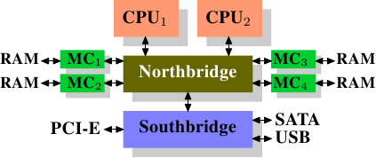

# 2.现代商用硬件

由于专用的硬件正在退潮,理解商用硬件是很重要的.时至今日,水平发展比起垂直发展更为常见.意味着现今使用许多较小的、连结在一起的商用电脑,而非少数几个非常大型且异常迅速(且昂贵)的系统,是较符合成本效益的.这是因为快速且廉价的网络硬件随处可见.虽然那些大型专用系统仍在一些情况中占有一席之地,并仍旧有其商机,但整体市场已被商用硬件市场蚕食.Red Hat 于2007 年预期,对于未来的产品,大多数据中心的「标准建构组件(building block)」将会是一台有着至多四个插槽(socket)的电脑,每个插槽插着一颗四核CPU,这些CPU––以Intel CPU 而言––都会采用超线程(hyper-thread)技术.[^2]这表示数据中心的标准系统将会有至多64 个虚拟处理器(virtual processor).当然也能够支持更大的机器,但四槽、四核CPU是当前认为最适宜的配置,并且大多的最佳化都是针对这种机器.

由商用组件建构出的电脑,结构上也存在着巨大差异.即便如此,我们将专注于最重大的差异上,从而涵盖超过90% 这类硬件.请注意,这些技术细节日新月异,因此奉劝读者将本文的撰写日期纳入考量.

这些年来,个人电脑以及小型服务器被标准化为一张芯片组(chipset),其具有两个部份:北桥(Northbridge)与南桥(Southbridge).图2.1 示意了这个结构.

所有(在前面的例子中有两颗,但可以有更多)CPU 都透过一条共用的总线(bus)––前端总线(Front Side Bus,FSB)––连接到北桥.北桥包含了内存控制器(memory controller),而它的实作决定了用在电脑中的RAM芯片类型.不同类型的RAM––诸如DRAM、Rambus、以及SDRAM––需要不同内存控制器.为了与其它系统设备联系,北桥必须与南桥传输.南桥––经常被称作 I/O 桥––通过各种不同的总线与各个设备传输.
现今,PCI、PCI Express、SATA、与USB 等最重要的总线,以及PATA、IEEE 1394、序列端口(serial port)、与并行端口(parallel port)都被南桥所支持.较老旧的系统有附属于北桥的AGP插槽.这源于南北桥连线速度不够快速的性能因素.然而现今的PCI-E插槽都是连接到南桥上的.

这种系统结构有一些值得注意的结果:

* 从一颗CPU到另一颗CPU的所有数据传输都必须经过与北桥传输用的同一条总线.
* 所有与RAM的传输都必须通过北桥.
* RAM只有一个端口.[^3]
* 一颗CPU 与一个依附于南桥的设备之间的传输会路经北桥.

几个瓶颈立刻显露在这个设计上.其中一个瓶颈牵涉到设备对RAM 的存取.在最早期的PC 中,不管在南北桥上,所有设备的传输都必须经过CPU,负面地影响了整体的系统性能.为了绕过这个问题,某些设备变得能够支持直接内存存取(Direct Memory Access,DMA).DMA 允许设备––由北桥的帮助––在没有CPU 介入(以及相应性能成本)的情况下直接储存并接收RAM 中的数据.现今所有依附于任何总线上的高性能设备都能使用DMA.虽然这大幅地降低了CPU 的工作量,这也引起了北桥带宽的争夺,由于DMA 请求与来自CPU 的RAM 存取相互竞争的缘故.因此,这个问题必须被纳入考量.

第二个瓶颈涉及从北桥到RAM 的总线.总线的确切细节视部属的内存类型而定.在较老旧的系统中,只有一条总线连接所有的RAM 芯片,因此并行存取是不可能的.近来的内存类型需要两条分离的总线(或称通道〔channel〕,如同DDR2 所称呼的,见图2.8),其加倍了可用的带宽.北桥交错地使用通道进行内存存取.更加近代的内存技术(举例来说,FB-DRAM)加入了更多的通道.

由于有限的可用带宽,以延迟最小化的方式安排内存存取,对性能来说是很重要的.如同我们将会看到的,处理器比起内存快了许多,而且必须等待存取内存––尽管使用了CPU 快取.假如多个超线程、核心、或是处理器同时存取内存,那么内存存取的等待时间甚至会更长.对DMA 操作依旧如此.

然而,除了并行(concurrency)之外,存取内存还有许多议题.存取模式(access pattern)本身也会大幅地影响内存子系统的性能,尤其是有多个内存通道的情况.在2.2 节,我们将会涵盖更多RAM 存取模式的细节.

在一些比较昂贵的系统上,北桥并不真的包含内存控制器.作为替代,北桥可以连接到多个外部内存控制器(在下例中,共有四个).

这个架构的优点是,有多于一个内存总线,因而提升了整体的可用带宽.这个设计也支持多个内存.并行(concurrent)内存存取模式由同时存取不同的内存库(memory bank)来减少延迟.尤其是多个处理器都直接连接到北桥上的情况,如图2.2.对于这种设计,主要的限制是北桥的内部带宽––其对这种(来自于Intel 的)架构而言是非常大的.[^4]

使用多个外部内存控制器并不是提升内存带宽的唯一作法.另一个越来越受欢迎的方式是将内存控制器整合到CPU,并将内存附加到每颗CPU 上.这个架构因为基于AMD 的Opteron 处理器的SMP 系统而流行起来.图2.3 展示了这样的系统.
Intel 将从Nehalem 处理器开始支持通用系统介面(Common System Interface,CSI)；这基本上也是相同的方法:一个让每个处理器都能拥有区域(local)内存的整合式内存控制器.

采用像这样的架构,有多少处理器,就有多少可用的内存库.在一台四核CPU 的机器上,不需有着巨大带宽的复杂北桥,内存带宽就能变成四倍.一个整合到CPU 的内存控制器也有些额外的优点；但我们不会在这里继续深入这些技术.

这个架构也有缺点.首先,因为机器仍需要让系统上的所有内存都能被所有的处理器存取,内存就不再是均匀的(uniform)(于是这种系统便有了NUMA––非均匀内存架构〔Non-Uniform Memory Architecture〕––这个名字).区域内存(附属于处理器的内存)能够以正常的速度存取.当存取附属于其他处理器的内存时,情况就不同了.在这种情况下,就必须用到处理器之间的交互连线(interconnect).要从CPU 1 存取附属于CPU 2 的内存,就需要通过一条交互连线.当同样的CPU 存取附属于CPU4 的内存就得通过两条交互连线.

每次这样的通讯都有其对应的成本.当我们在描述存取远端(remote)内存所需的额外时间时,我们会称之为「NUMA 因子(factor)」.图2.3 中的范例架构中,每个CPU 都有两个层级:紧邻的CPU,以及一颗相隔两条交互连线的CPU.在更加复杂的系统中,层级会显著地成长.还有一些机器架构(像是IBM 的x445 与SGI 的Altix 系列)有着不只一种连线类型.CPU 被组织成节点；存取同一节点内的内存的时间会是一致的、或是仅需很小的NUMA 因子.然而,节点间的连线非常昂贵,而且NUMA 因子非常高.

如今已有商用的NUMA 机器,而且可能会在未来扮演着更加重要的角色.预计在2008 年末,每台SMP 机器都会使用NUMA.当一支程式执行在一台NUMA 机器上时,认识到NUMA 相应的成本是很重要的.我们将会在第五节讨论更多机器架构,以及一些Linux 核心(kernel)为这些程式提供的技术.

除了本节其余部分描述的技术细节之外,还有许多影响RAM 性能的额外因素.它们无法被软体所控制,这也是其不会被涵盖于本节的原因.感兴趣的读者可以在2.1 节学到其中一些因素.这其实仅是为了对RAM 的技术有比较完整的理解,而且可能会在购买电脑时做出更好的选择.

接下来的两节会以闸(gate)层级讨论硬件细节,并接触到内存控制器与DRAM 芯片之间的通讯协议(protocol).程式设计师或许会发现这些资讯令人豁然开朗,因为这些细节解释了为何RAM 的存取会如此运作.不过,这都是选读的知识,急着了解与日常生活更直接相关主题的读者可以往前跳到2.2.5 节.

[^2]: 超线程使得一颗处理器核心仅需少量的额外硬件,就能被用来同时处理两个或多个任务.
[^3]: 我们不会在本文讨论到多端口RAM,因为这种RAM 并不见于商用硬件中,至少不在程式设计师得存取之处.它可以在仰赖极限速度的专用硬件––像是网络路由器––中找到.
[^4]: 完整起见,这里需要提到一下,这类内存控制器布局可以被用于其它用途,像是「内存RAID」,它很适合与热插拔(hotplug)内存组合使用.
