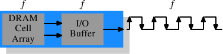

# 2. 现代商用硬件

Understanding commodity hardware is important because specialized hardware is in retreat. Scaling these days is most often achieved horizontally instead of vertically, meaning today it is more cost-effective to use many smaller, connected commodity computers instead of a few really large and exceptionally fast (and expensive) systems. This is the case because fast and inexpensive network hardware is widely available. There are still situations where the large specialized systems have their place and these systems still provide a business opportunity, but the overall market is dwarfed by the commodity hardware market. Red Hat, as of 2007, expects that for future products, the “standard building blocks” for most data centers will be a computer with up to four sockets, each filled with a quad core CPU that, in the case of Intel CPUs, will be hyper-threaded.[[2]](#2) This means the standard system in the data center will have up to 64 virtual processors. Bigger machines will be supported, but the quad socket, quad CPU core case is currently thought to be the sweet spot and most optimizations are targeted for such machines.

由于专用硬件正在过时,理解商用硬件变得非常重要.时至今日,水平扩展比起垂直扩展更为常见.意味着如今使用许多较小,连结在一起的商用电脑,而非少数几个非常大型且异常迅速(且昂贵)的系统,是较符合成本效益的.这是因为快速且廉价的网络硬件随处可见.虽然那些大型专用系统仍在一些情况中占有一席之地,并仍旧有其商机,但整体市场已被商用硬件市场蚕食.Red Hat 于2007 年预期,对于未来的产品,大多数据中心的"标准建构组件(building block)"将会是一台有着至多四个插槽(socket)的电脑,每个插槽插着一颗四核CPU,这些CPU,以Intel CPU 而言,都会采用超线程(hyper-thread)技术.[[2]](#2)这表示数据中心的标准系统将会有至多64 个虚拟处理器(virtual processor).当然也能够支持更大的机器,但四槽、四核CPU是当前认为最适宜的配置,并且大多的最佳化都是针对这种机器.

Large differences exist in the structure of commodity computers. That said, we will cover more than 90% of such hardware by concentrating on the most important differences. Note that these technical details tend to change rapidly, so the reader is advised to take the date of this writing into account.

由商用电脑结构上也存在着巨大差异.也就是说,我们将专注于最重大的差异上,从而涵盖超过90% 这类硬件.请注意,这些技术细节日新月异,因此奉劝读者将本文的撰写日期纳入考量.

Over the years the personal computers and smaller servers standardized on a chipset with two parts: the Northbridge and Southbridge. Figure 2.1 shows this structure.

这些年来,个人电脑以及小型服务器被一组芯片组(chipset)标准化,芯片组具有两个部份:北桥(Northbridge)与南桥(Southbridge).图2.1 表示了这个结构.


All CPUs (two in the previous example, but there can be more) are connected via a common bus (the Front Side Bus, FSB) to the Northbridge. The Northbridge contains, among other things, the memory controller, and its implementation determines the type of RAM chips used for the computer. Different types of RAM, such as DRAM, Rambus, and SDRAM, require different memory controllers.

所有(在前面的例子中有两颗,但可以有更多)CPU 都透过一条共用的总线(*bus*),前端总线(Front Side Bus,FSB),连接到北桥.北桥包含了内存控制器(memory controller),而它的实现决定了用在电脑中的RAM芯片类型.不同类型的RAM,诸如DRAM、Rambus、以及SDRAM,需要不同内存控制器.

To reach all other system devices, the Northbridge must communicate with the Southbridge. The Southbridge, often referred to as the I/O bridge, handles communication with devices through a variety of different buses. Today the PCI, PCI Express, SATA, and USB buses are of most importance, but PATA, IEEE 1394, serial, and parallel ports are also supported by the Southbridge. Older systems had AGP slots which were attached to the Northbridge. This was done for performance reasons related to insufficiently fast connections between the Northbridge and Southbridge. However, today the PCI-E slots are all connected to the Southbridge.

为了与其它系统设备联系,北桥必须与南桥通信.南桥,经常被称作 I/O 桥,通过各种不同的总线与设备通信.如今,PCI、PCI Express、SATA、与USB 等最重要的总线,以及PATA、IEEE 1394、串行端口(serial port)、与并行端口(parallel port)都被南桥所支持.较老旧的系统有附属于北桥的AGP插槽.这源于南北桥连线速度不够快速的性能因素.然而如今的PCI-E插槽都是连接到南桥上的.

Such a system structure has a number of noteworthy consequences:

这种系统结构有一些值得注意的结果:

* All data communication from one CPU to another must travel over the same bus used to communicate with the Northbridge.
* All communication with RAM must pass through the Northbridge.
* The RAM has only a single port.[[3]](#3)
* Communication between a CPU and a device attached to the Southbridge is routed through the Northbridge.

* 从一颗CPU到另一颗CPU的所有数据传输都必须经过与北桥传输用的同一条总线.
* 所有与RAM的传输都必须通过北桥.
* RAM只有一个端口.[[3]](#3)
* 一颗CPU 与一个依附于南桥的设备之间的传输会路经北桥.

A couple of bottlenecks are immediately apparent in this design. One such bottleneck involves access to RAM for devices. In the earliest days of the PC, all communication with devices on either bridge had to pass through the CPU, negatively impacting overall system performance. To work around this problem some devices became capable of direct memory access (DMA). DMA allows devices, with the help of the Northbridge, to store and receive data in RAM directly without the intervention of the CPU (and its inherent performance cost). Today all high-performance devices attached to any of the buses can utilize DMA. While this greatly reduces the workload on the CPU, it also creates contention for the bandwidth of the Northbridge as DMA requests compete with RAM access from the CPUs. This problem, therefore, must to be taken into account.

这种设计立刻显露出几个瓶颈.其中一个瓶颈牵涉到设备对RAM 的存取.在最早期的PC 中,不管在南北桥上,所有设备的传输都必须经过CPU,影响了整体的系统性能.为了避免这个问题,某些设备变得能够支持直接内存存取(Direct Memory Access,DMA).DMA 允许设备,通过北桥的帮助,在没有CPU 介入(以及其性能占用)的情况下直接储存并接收RAM 中的数据.如今所有依附于任何总线上的高性能设备都能使用DMA.虽然这大幅地降低了CPU 的工作量,这也引起了北桥带宽的争夺,这是因为DMA 请求与CPU 对RAM 的存取相互竞争.因此,这个问题必须被纳入考量.

A second bottleneck involves the bus from the Northbridge to the RAM. The exact details of the bus depend on the memory types deployed. On older systems there is only one bus to all the RAM chips, so parallel access is not possible. Recent RAM types require two separate buses (or channels as they are called for DDR2, see Figure 2.8) which doubles the available bandwidth. The Northbridge interleaves memory access across the channels. More recent memory technologies (FB-DRAM, for instance) add more channels.

第二个瓶颈涉及从北桥到RAM 的总线.总线的细节视内存类型而定.在较老旧的系统中,只有一条总线连接所有的RAM 芯片,因此并行存取是不可能的.近年来RAM 类型需要两条分离的总线(或称通道[channel],如同DDR2 所称呼的,见图2.8),这就加倍了可用的带宽.北桥交错地使用通道进行内存存取.更近期的内存技术(举例来说,FB-DRAM)加入了更多的通道.

With limited bandwidth available, it is important to schedule memory access in ways that minimize delays. As we will see, processors are much faster and must wait to access memory, despite the use of CPU caches. If multiple hyper-threads, cores, or processors access memory at the same time, the wait times for memory access are even longer. This is also true for DMA operations.

由于有限的可用带宽,以延迟最小化的方式调度内存存取,对性能来说是很重要的.如同将会看到的,处理器比起内存快了许多,而且必须等待存取内存,尽管使用了CPU 缓存.假如多个超线程、核心、或是处理器同时存取内存,那么内存存取的等待时间甚至会更长.对DMA 操作依旧如此.

There is more to accessing memory than concurrency, however. Access patterns themselves also greatly influence the performance of the memory subsystem, especially with multiple memory channels. Refer to Section 2.2 for more details of RAM access patterns.

然而,除了并行(*concurrency*)之外,存取内存还有许多议题.存取模式(*access pattern*)本身也会大幅地影响内存子系统的性能,尤其是有多个内存通道的情况.在2.2 节,我们将会涵盖更多RAM 存取模式的细节.

On some more expensive systems, the Northbridge does not actually contain the memory controller. Instead the Northbridge can be connected to a number of external memory controllers (in the following example, four of them).

在一些比较昂贵的系统上,北桥并不真的包含内存控制器.取而代之的是,北桥可以连接到多个外部内存控制器(在下例中,共有四个).


The advantage of this architecture is that more than one memory bus exists and therefore total bandwidth increases. This design also supports more memory. Concurrent memory access patterns reduce delays by simultaneously accessing different memory banks. This is especially true when multiple processors are directly connected to the Northbridge, as in Figure 2.2. For such a design, the primary limitation is the internal bandwidth of the Northbridge, which is phenomenal for this architecture (from Intel).

这个架构的优点是,有多个内存总线,因而提升了整体的可用带宽.这个设计也支持更多内存.并行(*concurrent*)内存存取模式由同时存取不同的内存(*memory bank*)来减少延迟.尤其当多个处理器都直接连接到北桥上,如图2.2.对于这种设计,主要的限制是北桥的内部带宽,对限制这种(来自于Intel 的)架构而言是非常显著的.[[4]](#4)

Using multiple external memory controllers is not the only way to increase memory bandwidth. One other increasingly popular way is to integrate memory controllers into the CPUs and attach memory to each CPU. This architecture is made popular by SMP systems based on AMD's Opteron processor. Figure 2.3 shows such a system. Intel will have support for the Common System Interface (CSI) starting with the Nehalem processors; this is basically the same approach: an integrated memory controller with the possibility of local memory for each processor.

多个外部内存控制器并不是提升内存带宽的唯一方案.另一愈发受欢迎的方式是将内存控制器整合到CPU,并将内存附加到每颗CPU 上.这个架构因为基于AMD 的Opteron 处理器的SMP 系统而流行起来.图2.3 展示了这样的系统.Intel 将从Nehalem 处理器开始支持通用系统接口(*Common System Interface*,CSI);这基本上也是相同的目的: 让每个处理器都能拥有本地(local)内存的集成内存控制器.


采用像这样的架构,有多少处理器,就有多少可用的内存库.在一台四核CPU 的机器上,不需有着巨大带宽的复杂北桥,内存带宽就能变成四倍.一个整合到CPU 的内存控制器也有些额外的优点;但我们不会在这里继续深入这些技术.

这个架构也有缺点.首先,因为机器仍需要让系统上的所有内存都能被所有的处理器存取,内存就不再是均匀的(uniform)(于是这种系统便有了NUMA,非均匀内存架构[Non-Uniform Memory Architecture],这个名字).本地内存(附属于处理器的内存)能够以正常的速度存取.当存取附属于其他处理器的内存时,情况就不同了.在这种情况下,就必须用到处理器之间的交互连线(interconnect).要从CPU 1 存取附属于CPU 2 的内存,就需要通过一条交互连线.当同样的CPU 存取附属于CPU4 的内存就得通过两条交互连线.

每次这样的通讯都有其对应的成本.当我们在描述存取远端(remote)内存所需的额外时间时,我们会称之为"NUMA 因子(factor)".图2.3 中的范例架构中,每个CPU 都有两个层级:紧邻的CPU,以及一颗相隔两条交互连线的CPU.在更加复杂的系统中,层级会显著地成长.还有一些机器架构(像是IBM 的x445 与SGI 的Altix 系列)有着不只一种连线类型.CPU 被组织成节点;存取同一节点内的内存的时间会是一致的、或是仅需很小的NUMA 因子.然而,节点间的连线非常昂贵,而且NUMA 因子非常高.

如今已有商用的NUMA 机器,而且可能会在未来扮演着更加重要的角色.预计在2008 年末,每台SMP 机器都会使用NUMA.当一个程序执行在一台NUMA 机器上时,认识到NUMA 相应的成本是很重要的.我们将会在第五节讨论更多机器架构,以及一些Linux 核心(kernel)为这些程序提供的技术.

除了本节其余部分描述的技术细节之外,还有许多影响RAM 性能的额外因素.它们无法被软体所控制,这也是其不会被涵盖于本节的原因.感兴趣的读者可以在2.1 节学到其中一些因素.这其实仅是为了对RAM 的技术有比较完整的理解,而且可能会在购买电脑时做出更好的选择.

接下来的两节会以闸(gate)层级讨论硬件细节,并接触到内存控制器与DRAM 芯片之间的通讯协议(protocol).程序员或许会发现这些信息令人豁然开朗,因为这些细节解释了为何RAM 的存取会如此操作.不过,这都是选读的知识,急着了解与日常生活更直接相关主题的读者可以往前跳到2.2.5 节.

## 2.1. RAM的种类

这些年来,已经有许多不同种类的RAM,而每种类型都各有,有时是非常显著的,差异.只有历史学家会对那些较老旧的类型有兴趣.而我们将不会探究它们的细节.我们将会聚焦于现代的RAM 类型;我们仅会触及其问题的表面,探究系统核心或是应用程序能透过其性能特性看见的一些细节.

第一个有趣的事情是,围绕于在同一台机器中会有不同种类的RAM 的原因.更具体地说,为何既有静态RAM(Static RAM,SRAM[[5]](#5))又有动态RAM(Dynamic RAM,DRAM).前者更加快速,而且提供了相同的功能.为何一台机器里的RAM 不全是SRAM?答案是,也许正是你所预期的,成本.生产与使用SRAM 比起DRAM 都更加昂贵.这两个成本因素都很重要,而且后者变得越来越重要.为了了解这些差异,我们要稍微研究一下SRAM 与DRAM 储存的实现方式.

在本节的其余部分,我们将会讨论到一些RAM 实现的底层细节.我们将会让细节尽可能地底层.最后,我们将会从"逻辑层级"讨论信号(signal),而非从硬件设计师所需的那种层级.那种细节层级对我们当前的目的来说是不必要的.

### 2.1.1. 静态RAM


图2.4 展示了一个6-晶体管(transistor)SRAM 内存单元(cell)的结构.这个内存单元的核心由四个晶体管 __M1__ 到 __M4__ 所构成,其形成两个交叉耦合(cross-coupled)的变频器(inverter).它们有两个稳定状态,分别表示0 与1.只要 __Vdd__ 维持通电,状态就是稳定的.

若是需要存取内存单元的状态,就提高字存取线路(word access line)__WL__ 的电平.若是必须复写内存单元的状态,则要先将 __BL__ 与 __BL__ 线路设为想要的值,然后再提高 __WL__ 的电平.由于外部的驱动(driver)强于四个晶体管(__M1__ 到 __M4__),这使得旧的状态得以被覆盖.

需要更多内存单元运行方式的详细描述,请见[20].为了接下来的讨论,要注意的重点是

* 一个内存单元需要六个晶体管.也有四个晶体管的变体,但其有些缺点.
* 维持内存单元的状态需要持续供电.
* 当提高字存取线路 __WL__ 的电平时,几乎能立即取得内存单元的状态.其信号如同其它晶体管控制的信号,是直角的(rectangular)(在两个二进制状态间迅速地转变).
* 内存单元的状态是稳定的,不需要再充电周期(refresh cycle).

也有其它可用的SRAM 形式,较慢且较省电.但因为我们寻求的是更快的RAM,所以在此我们对它并不感兴趣.这些慢的变种引发关注的主要原因是,它们比起动态RAM 更容易被用在系统中,因为它们的接口较为简单.

### 2.1.2. 动态RAM

动态RAM 在其结构上比静态RAM 简单许多.图2.5 表示了常见的DRAM 内存单元设计结构.它仅由一个晶体管以及一个电容(capacitor)组成.复杂度上的巨大差异,自然意味着其与静态RAM 的运行方式非常不同.


一个动态RAM 的内存单元在电容 __C__ 中保存其状态.晶体管 __M__ 用以控制状态的存取.为了读取内存单元的状态,要提高存取线路 __AL__ 的电平;这要不使得电流流经数据线路(data line) __DL__、要不没有,取决于电容中的电量.要写到内存单元中,则要适当地设置数据线路 __DL__,然后提高 __AL__ 的电平一段足以让电容充电或放电的时间.

动态RAM 有许多设计上的难题.使用电容意味着读取内存单元时会对电容放电.这件事无法不断重复,必须在某个时间点上对电容重新充电.更糟的是,为了容纳大量的内存单元(芯片有着10^9 或者更多的内存单元在如今是很普遍的),电容的电量必须很低(femto[femto,10 ^-15]法拉范围内或者更小).完全充电后的电容容纳了数万个电子.尽管电容的电阻很高(几兆欧姆),耗尽电容仍旧只需要很短的时间.这个问题被称为"漏电(leakage)".

这种泄漏是DRAM 必须被持续充电的原因.对于如今大部分DRAM 芯片,每64ms 就必须重新充电一次.在重新充电的期间内是无法存取内存的,因为重新充电基本上就是直接丢弃结果的读取操作.对某些工作而言,这个额外成本可能会延误高达50% 的内存存取(见[3]).

第二个,因微小电量而造成,的问题是,从内存单元读取的信息无法直接使用.数据线路必须被连接到感测放大器(sense amplifier),其能够根据仍需计作1 的电量范围来分辨储存的0 或1.

第三个问题是,从内存单元进行读取会消耗电容的电量.这代表每次的读取操作都必须接着进行重新对电容充电的操作.这能够透过将感测放大器的输出喂回到电容里头来自动达成.虽然这代表读取内存内容需要额外的电力以及,更为重要地,时间.

第四个问题是,对电容充放电并不是立即完成的.由于感测放大器接收到的信号并不是直角的,因此必须使用一个谨慎的估计,以得知何时可以使用内存单元的输出.对电容充放电的公式为


这代表让电容充电或放电需要一些时间(由电量C 与电阻R 决定).这也代表无法立即使用能被感测放大器侦测的电流.图2.6 显示了充电与放电的曲线.X 轴以RC(电阻乘上电量)为单位,这是一种时间单位.


不像静态RAM 能够在字存取线路的电平提高时立即取得输出结果,它会花费一些时间以让电容被充分放电.这个延迟严重地限制了DRAM 能够达到的速度.

简单的方法也有其优点.最主要的优点是大小.比起一个SRAM 的内存单元,一个DRAM 的内存单元所需的芯片面积要小好几倍.SRAM 内存单元也需要个别的电力来维持晶体管的状态.DRAM 内存单元的结构也较为简单,这代表能较轻易地将许多内存单元紧密地塞在一起.

总体来说,赢在(极为戏剧性的)成本差异.除了在专门的硬件,举例来说,网络路由器,之外,我们必须采用基于DRAM 的主存.这对程序员有着巨大的影响,我们将会在本文的其余部分讨论它们.但首先,我们需要先多理解一​​些实际使用DRAM 内存单元的细节.

### 2.1.3. DRAM 存取

一个程序使用虚拟地址(virtual address)来选择内存位置.处理器将其转译(translate)成实体地址(physical address),最终由内存控制器选择对应于这个地址的RAM 芯片.为了选择RAM 芯片中的个别内存单元,实体地址的一部分会以数条地址线(address line)的形式被传递进去.

由内存控制器个别定址(address)内存位置是极为不切实际的：4GB 的RAM 会需要2^32 条地址线.作为替代,地址会使用较小的一组地址线,编码成二进制数字传递.以这种方式传递到DRAM 芯片的地址必须先被解多路复用(demultiplex).有N 条地址线的信号分离器(demultiplexer)将会有 2^N  条输出线(output line).这些输出线能被用以选择内存单元.对于小容量的芯片而言,使用这种直接的方法是没什么大问题的.

但假如内存单元的数量增加,这个方法就不再合适.一个1Gbit[[6]](#6) 容量的芯片将会需要30 条地址线以及2^30 选择线(select line).在不牺牲速度的前提下,信号分离器的大小会随着输入线(input line)的数量以指数成长.用于30 条地址线的信号分离器需要大量的芯片空间,外加信号分离器的(尺寸与时间)复杂度.更重要的是,同时在地址线上传输30 个脉冲(impulse)比"只"传输15 个脉冲还要难得多.很少有线能以完全相同的长度布置.[[7]](#7)


图2.7 显示了以较高层次表示的DRAM 芯片.DRAM 内存单元被组织在列(row)与行(column)中.虽然它们可以全都排成一列,但DRAM 芯片会因而需要一个庞大的信号分离器.内由阵列(array)的方式,便能够以各为一半大小的一个信号分离器与一个多路复用器达到这种目的.[[8]](#8)这从各方面来说都是个大大的节约.在这个例子中,地址线 __a0__ 与 __a1__ 透过*列地址选择(row address selection)*(RAS)[[9]](#9)信号分离器选择一整列内存单元的地址线.在读取时,所有内存单元的内容都能够被*行地址选择(column address selection)*多路复用器(multiplexer)(CAS)取得.基于地址线 __a2__ 与 __a3__,其中一行的内容便能够提供给DRAM 芯片的数据针脚(pin).这会在许多DRAM 芯片上并行地发生多次,以产生对应于数据总线宽度的所有位.

对于写入操作,新的内存单元的值会被置于数据总线中,然后,当内存单元内由 RAS 与 CAS选取时,储存到数据单元中.相当直观的设计.这实际上有着,显然地,更多的困难.需要规范发出信号之后,在数据能够由数据总线读取之前有多少延迟.如同上节所述,电容无法立即充放电.来自于内存单元的信号太微弱了,以致于它非得被放大(amplify)不可.对于写入操作,必须指定设置完 RAS 与 CAS 之后,数据必须在总线维持多久,才能够成功地在内存单元中储存新值(再提醒一次,电容不会立即被充放电).这些时间常数(constant)对于DRAM 芯片的性能而言是至关重要的.我们将会在下一节讨论这些.

一个次要的可扩展性问题是,令30 条地址线都连接到每个RAM 芯片也不大可行.一个芯片的针脚是个宝贵的资源.必须尽可能多地并行传输数据(像是一次64 位)已经够"糟"了.内存控制器必须能够定址每个RAM 模组(module)(RAM 芯片的集合).假如因为性能因素,需要并行存取多个RAM 模组,并且每个RAM 模组需要它所拥有的一组30 条或者更多条地址线,那么仅为了处理地址,内存控制器就必须要有,以8 个RAM 模组而言,多达240+ 根针脚.

为了克服这些次要的可扩展性问题,DRAM 芯片,长期以来,必须自行多路复用地址.这代表地址会被转变成两个部分.由地址位(图2.7 的例子中的 __a0__ 与 __a1__)组成的第一个部分选取列.这个选择直到撤销之前都会维持有效.接着第二个部分,地址位 __a2__ 与 __a3__,选取行.决定性的差异在于,只需要两条外部的地址线.[[译注1]](#译注1)需要额外一些少量的线路来代表能否取得 RAS 与 CAS 的线路,但这对于减半地址线来说,这只是个很小的代价.不过,这种地址多路复用带来了一些自身的问题.我们将会在2.2 节讨论这些问题.

### 2.1.4. 结论

若是本节中的细节稍微令人喘不过气,别担心.要从本节得到的重点为：

* 有着为何不是所有内存都为SRAM 的理由
* 内存单元需要被个别选取使用
* 地址线的数量直接反映了内存控制器、主机板(motherboard)、DRAM 模组、与DRAM 芯片的成本
* 在读取或写入操作的结果有效之前得花上一段时间

接下来的章节将会深入更多存取DRAM 内存的实际过程的细节.我们不会深入存取SRAM 的细节,它通常是直接定址的.这是基于速度考量,并且因为SRAM 内存受限于其大小.SRAM 目前被用于CPU 缓存并内建于芯片上(on-die),其连线较少、并且完全在CPU 设计者的控制中.CPU 缓存是我们将会在之后谈及的主题,但我们所需知道的是,SRAM 内存单元有着确切的最大速度,这取决于在SRAM 上所花的努力.速度可以从略微慢于CPU 核心到慢于一或两个数量级.

## 2.2. DRAM 存取技术细节

在介绍DRAM 的章节中，我们看到为了节省地址针脚，DRAM 芯片多路复用了地址.我们也看到因为内存单元中的电容无法立即放电以产生稳定的信号，存取DRAM 内存单元会花点时间;我们也看到了DRAM 内存单元必须被重新充电.现在，是时候将这全都摆在一起，看看这些因子是如何决定DRAM 存取是怎么操作的.

我们将会聚焦于当前的技术上;我们不会讨论非同步(asynchronous)DRAM 及其变种，因为它们完全与此无关.对这个主题感兴趣的读者请参见[3] 与[19].我们也不会谈及Rambus DRAM(RDRAM)，纵使这项技术并不过时.只是它并没有被广泛使用于系统内存中.我们仅会聚焦于同步DRAM(Synchronous DRAM，SDRAM)与其后继者双倍数据传输速率DRAM(Double Data Rate DRAM，DDR).

同步DRAM，如同名称所暗示的，其操作与一种时间源(time source)有关.内存控制器提供一个时钟(clock)，其频率决定了前端总线(FSB),DRAM 芯片使用的内存控制器接口,的速度.在撰写此文时，频率可达800MHz、1,066MHz、甚至到1,333MHz，并宣称在下个世代会达到更高的频率(1,600MHz).这不代表用于总线的频率真的这么高.而是如今的总线都是二或四倍频(double- or quad-pumped)，代表数据在每个周期传输二或四次.数字越高、卖得越好，因此厂商惯于将四倍频200MHz 总线宣传成"实质上的(effective)"800MHz 总线.

对于如今的SDRAM 来说，每次数据传输以64 位,8 字节,组成.FSB 的传输率因此为8 字节乘上实际的总线频率(以四倍频200MHz 总线来说，6.4GB/s).这听起来很多，但这是尖峰速度,永远无法超越的最大速度.如同我们将会看到的，如今与RAM 模组沟通的协议中有许多的闲置期(downtime)，这时是没有数据可以被传输的.这个闲置期正是我们必须了解、并减到最小，以达到最佳性能的东西.

### 2.2.1. 读取协议


图2.8 显示了DRAM 模组上一些连线的活动，发生在三个标上不同颜色的阶段.像往常一样，时间从左到右流动.许多细节被省略了.这里我们仅讨论总线时钟、RAS 与CAS 信号、以及地址与数据总线.读取周期从内存控制器在地址总线提供列地址、并降低RAS 信号的电平开始.所有信号都会在时钟(CLK)的上升沿(rising edge)被读取，因此若是信号并不是完全的方波也无所谓，只要在读取的这个时间点是稳定的就行了.设置列地址会使得RAM 芯片锁上(latch)指定的列.

经过tRCD(RAS 至CAS 的延迟)个时脉周期之后，便能发出CAS 信号.这时行地址便能由地址总线提供、以及降低CAS 线路的电平来传输.这里我们可以看到，地址的两个部分(约莫是对半分，其余的情况并不合理)是如何透过同样的地址总线来传输.

现在定址已经完成，可以传输数据了.为此RAM 芯片需要一点时间准备.这个延迟通常被称作CAS 等待时间(CAS Latency，CL).在图2.8 中，CAS 等待时间为2.这个值可高可低，取决于内存控制器、主机板、以及DRAM 模组的品质.等待时间也可以是半周期.以CL=2.5 而言，数据将能够在蓝色区块的第一个*下降*沿时取得.

对于取得数据的这些准备工作而言，仅传输一个字的数据是很浪费的.这即是为何DRAM 模组允许内存控制器指定要传输多少数据.通常选择在2、4、或8 字之间.这便能在不提供新的RAS／CAS 序列的情况下填满缓存中的整行(line) .内存控制器也能够在不重设列的选取的情况下发出新的CAS 信号.由这种方式，能够非常快速地读取或写入连续的内存地址，因为不必发出RAS 信号，也不必将列无效化(deactivate)(见后文).内存控制器必须决定是否让列保持"开启(open)".一直任其开启，对实际的应用程序来说有些负面影响(见[3]).发出新的CAS 信号仅受RAM 模组的命令速率(command rate)控制(通常设为T*x*，其中*x* 为像是1 或2 的值;每个周期都接受命令的高性能DRAM 模组会设为1).

在这个例子中，SDRAM 在每个周期吐出一个字.第一世代就是这么做的.DDR 能够在每个周期传输两个字.这减少了传输时间，但没有改变等待时间.虽然在实务上看起来不同，但原理上DDR2 操作如斯.这里没有再深入细节的必要了.能够注意到DDR2 可以变得更快、更便宜、更可靠、并且更省电(更多信息见[6])就够了.

### 2.2.2. 预充电与有效化

图2.8 并没有涵盖整个周期.它只显示出存取DRAM 的完整循环的一部分.在能够发送新的RAS 信号之前，必须无效化(deactivate)当前锁上的列，并对新的列预充电(precharge).这里我们仅聚焦在由明确命令来执行的情况.有些协议上的改进,在某些情况下,能够避免这个额外步骤.不过由预充电引入的延迟仍然会影响操作.


图2.9 表示了从CAS 信号开始、到另一列的CAS 信号为止的活动.与先前一样，经过CL 周期后，便能够取得以第一个CAS 信号请求的数据.在这个例子中，请求了两个字，其,在一个简易的SDRAM 上,花了两个周期来传输.也可以想像成是在一张DDR 芯片上传输四个字.

即使在命令速率为1 的DRAM 模组上，也无法立即发出预充电命令.它必须等待与传输数据一样长的时间.在这个例子中，它花了两个循环.虽然与CL 相同，但这只是巧合.预充电信号没有专用的线路;有些实现是由同时降低允写(Write Enable，WE)与RAS的电平来发出这个命令.这个组合本身没什么特别意义(编码细节见[18]).

一旦发出预充电命令，它会花费tRP(列预充电时间)个周期，直到列能被选取为止.在图2.9 中，大部分的时间(以紫色标示)与内存传输时间(浅蓝)重叠.这满好的！但tRP 比传输时间还长，所以下一个RAS 信号会被延误一个周期.

假使我们延伸图表的时间轴，我们会发现下一次数据传输发生在前一次停止的5 个周期之后.这表示在七个周期中，只有两个周期有用到数据总线.将这乘上FSB 的速度，对800MHz 总线而言，理论上的6.4GB/s 就变成1.8GB/s 了.这太糟了，而且必须避免.在第六节描述的技术能帮忙提升这个数字.程序员通常也得尽一份力.

对于SDRAM 模组，还有一些没有讨论过的时间值.在图2.9 中，预充电命令受限于数据传输时间.另一个限制是，在RAS 信号之后，SDRAM 模组需要一些时间才能够为另一列预充电(记作tRAS).这个数字通常非常大，为tRP 值的两到三倍.假如,在RAS 信号之后,只有一个CAS 信号，并且数据传输在少数几个周期内就完成，这就是问题了.假设在图2.9 中，起始的CAS 信号是直接接在RAS 信号之后，并且tRAS< /sub> 为8 个周期.预充电命令就必须要延迟一个额外的周期，因为tRCD、CL、与tRP(因为它比数据传输时间还长)的总和只有7 个周期.

DDR 模组经常以一种特殊的标记法描述：wxyzT.举例来说：2-3-2-8-T1.这代表：

|     |     |                          |
| --- | --- | ------------------------ |
| w   | 2   | CAS 等待时间(CL)         |
| x   | 3   | RAS 至CAS 等待时间(tRCD) |
| y   | 2   | RAS 预充电(tRP)          |
| z   | 8   | 有效化至预充电延迟(tRAS) |
| T   | T1  | 命令速率                 |

还有许多其它会影响命令的发送或处理方式的时间常数.不过在实务上，这五个常数就足以判定模组的性能.

知道这些关于电脑的信息，有时有助于解释某些量测结果.购买电脑的时候，知道这些细节显然是有用的，因为它们,以及FSB 与SDRAM 模组的速度,是决定一台电脑速度的最重要因素.

非常大胆的读者也可以试着调校(tweak)系统.有时候BIOS 允许修改某些或者全部的值.SDRAM 模组拥有能够设定这些值的可程序化暂存器(register).通常BIOS 会挑选最佳的预设值.如果RAM 模组的品质很好，可能可以在不影响电脑稳定性的前提下降低某些延迟.网络上众多的超频网站提供了大量的相关文件.尽管如此，请自行承担风险，可别说你没被警告过.

### 2.2.3. 再充电

谈及DRAM 存取时，一个最常被忽略的主题是再充电(recharging).如同2.1.2 节所述，DRAM 内存单元必须被持续地重新充电.对于系统的其余部分来说，这并不那么容易察觉.在对列[[10]](#10)重新充电的时候，是不能对它存取的.在[3] 的研究中发现"*出乎意料地，DRAM 再充电的安排可能大大地影响性能*".

根据JEDEC(固态技术协会，Joint Electron Device Engineering Council)规范，每个DRAM 内存单元每隔64ms 都必须重新充电.假如一个DRAM 阵列有8,192 列，这代表内存控制器平均每7.8125μs 都得发出再充电命令(再充电命令能够列队等待[queue]，因此在实务上，两次请求间的最大间隔能更长一些).为再充电命令排程是内存控制器的职责.DRAM 模组纪录最后一次再充电的列的地址，并且自动为新的请求增加地址计数器.

关于再充电与发出命令的时间点，程序员能做的真的不多.但在解释量测结果时，务必将DRAM 生命周期的这个部分记在心上.假如必须从正在被重新充电的列中取得一个关键的字，处理器会被延误很长一段时间.重新充电要花多久则视DRAM 模组而定.

### 2.2.4. 内存类型

值得花点时间来看看当前以及即将到来的内存类型.我们将从SDR(单倍数据传输速率，Single Data Rate)SDRAM 开始，因为它们是DDR(双倍数据传输速率，Double Data Rate)SDRAM 的基础.SDR 十分简单.内存单元与数据传输速率是一致的.


在图2.10 中，内存单元阵列能够以等同于经由内存总线传输的速率输出内存内容.假如DRAM 内存单元阵列能够以100MHz 操作，单一内存单元的总线的数据传输率便为100Mb/s.所有元件的频率f 都是一样的.由于耗能会随着频率增加而增加，因此提升DRAM 芯片的吞吐量(throughput)的代价很高.由于大量的阵列单元，成本贵得吓人.[[11]](#11)实际上，提升频率通常也需要提升电压，以维持系统的稳定性，这更是一个问题.DDR SDRAM(追溯地称为DDR1)设法在不提高任何相关频率的情况下提升吞吐量.



SDR 与DDR1 之间的差异是,如同在图2.11 所见、以及从它们名称来猜测的,每个周期传输两倍的数据量.也就是说，DDR1 芯片会在上升*与*下降沿传输数据.这有时被称作一条"二倍频(double-pumped)"总线.为了不提升内存单元阵列的频率，必须引入一个缓冲区(buffer).这个缓冲区会持有每条数据线的两个位.这转而要求令,图2.7 的内存单元阵列中的,数据总线由两条线路组成.实现的方式很直观：只要对两个DRAM 内存单元使用相同的行地址，并且并行存取它们就行了.这个实现对内存单元阵列的改变也非常小.

SDR DRAM 直接采用其频率来命名(例如PC100 代表100MHz SDR).由于DDR1 DRAM 的频率不会改变，厂商必须想出新的命名方式，让它听起来更厉害.他们提出的名字包含一个DDR 模组(拥有64 位总线)能够维持、以字节为单位的传输速率：```100MHz * 64 bit * 2 = 1,600MB/s```

于是一个频率为100MHz 的DDR 模组就称为PC1600.因为1600 > 100，满足一切销售需求;这听起来更棒，纵使实际上*只*提升成两倍而已.[[12]](#12)


为了突破这些内存技术，DDR2 包含少许额外的革新.能从图2.12 上看到的最明显的改变是，总线的频率加倍了.频率加倍意味着频宽加倍.由于频率加倍对内存单元阵列来说并不经济，因此现在需要由I/O 缓冲区在每个时脉周期读取四个位，然后才送到总线上.这代表DDR2 模组的改变是，只让DIMM 的I/O 缓冲区元件拥有能以更快速度运转的能力.这当然是可能的，而且不需太多能量，因为这只是个小元件，而非整个模组.厂商为DDR2 想出的名称与DDR1 的名称相似，只是在计算值的时候，乘以二变成乘以四(我们现在有条四倍频[quad-pumped]总线了).表2.1 显示了如今使用的模组名称.

| 阵列频率 | 总线频率 | 数据速率  | 名称(速率) | 名称(FSB) |
| -------- | -------- | --------- | ---------- | --------- |
| 133MHz   | 266MHz   | 4,256MB/s | PC2-4200   | DDR2-533  |
| 166MHz   | 333MHz   | 5,312MB/s | PC2-5300   | DDR2-667  |
| 200MHz   | 400MHz   | 6,400MB/s | PC2-6400   | DDR2-800  |
| 250MHz   | 500MHz   | 8,000MB/s | PC2-8000   | DDR2-1000 |
| 266MHz   | 533MHz   | 8,512MB/s | PC2-8500   | DDR2-1066 |

命名上还有个别扭之处.用于CPU、主机板、以及DRAM 模组的FSB 速度是使用*实质上的*频率来指定的.也就是将时脉周期的两个沿都纳入传输的因素，从而浮夸了数字.因此，一个拥有266MHz 总线的133MHz 模组，它的FSB"频率"为533MHz.

沿着转变到DDR2 的路线，DDR3(真正的DDR3，而非用于显卡中的假GDDR3)的规范寻求更多的改变.电压从DDR2 的1.8V 降至DDR3 的1.5V.由于功率消耗公式是使用电压的平方来算的，因此光这点就改善了30%.加上晶粒(die)尺寸的缩小以及其它电气相关的改进，DDR3 能够在相同的频率下降低一半的功率消耗.或者，在相同功率包络(envelope)的情况下达到更高的频率.又或者，在维持相同热能排放量的情况下加倍容量.

DDR3 模组的内存单元阵列会以外部总线的四分之一速度运转，其需要将DDR2 的4 位I/O 缓冲区加大到8 位.表示图见图2.13.


起初，DDR3 模组的CAS 等待时间可能会略高一些，因为DDR2 技术更为成熟.这导致只在频率高于DDR2 所能达到的情况，并且,尽管如此,一般在频宽比延迟时间更为重要的时候，DDR3 才有其用处.已有达到与DDR2 相同CAS 等待时间的1.3V 模组的风声.无论如何，由于更快的总线，达到更高速度的可能性将会超过增加的等待时间.

一个DDR3 的可能问题是，对于1,600Mb/s 或更高的传输率，每个通道的模组数量可能会减至仅剩一个.在早期的版本中，对于任何频率都有这个要求，所以可以期待在某个时间点，这项要求会被剔除.否则会严重地限制系统的能力.

表2.2 列出了我们很可能会看到的DDR3 模组名称.JEDEC 到目前为止接受了前四种.鉴于Intel 的45nm 处理器拥有速度为1,600Mb/s 的FSB，1,866Mb/s 便为超频市场所需.随着DDR3 的发展，我们大概会看到更多的类型.

| 阵列频率 | 总线频率 | 数据速率   | 名称(速率) | 名称(FSB) |
| -------- | -------- | ---------- | ---------- | --------- |
| 100MHz   | 400MHz   | 6,400MB/s  | PC3-6400   | DDR3-800  |
| 133MHz   | 533MHz   | 8,512MB/s  | PC3-8500   | DDR3-1066 |
| 166MHz   | 667MHz   | 10,667MB/s | PC3-10667  | DDR3-1333 |
| 200MHz   | 800MHz   | 12,800MB/s | PC3-12800  | DDR3-1600 |
| 233MHz   | 933MHz   | 14,933MB/s | PC3-14900  | DDR3-1866 |

所有的DDR 内存都有个问题：总线频率的提升，会使得建立并行数据总线变得困难.DDR2 模组有240 根针脚.必须要规划所有连结到数据与地址针脚的布线，以让它们有大略相同的长度.还有个问题是，假如多过一个DDR 模组被菊花链结(daisy-chain)在同一条总线上，对于每个附加的模组而言，信号会变得越来越歪曲.DDR2 规范只允许在每个总线(亦称作通道)上有两个模组，DDR3 规范在高频时只能有一个.由于每个通道有240 根针脚，使得单一北桥无法合理地驱动多于两个通道.替代方式是拥有外部的内存控制器(如图2.2)，但这代价不小.

这所代表的是，商用主机板受限于至多持有四个DDR2 或DDR3 模组.这大大地限制了一个系统能够拥有的内存总量.即使是老旧的32 位IA-32 处理器都能拥有64GB 的RAM，即使对于家用，内存需求也在持续增长，所以必须作点什么.

一个解决办法是将内存控制器加到每个处理器中，如同第二节所述.AMD 的Opteron 系列就是这么做的，Intel 也将以他们的CSI 技术来达成.只要处理器所能使用的、适当的内存容量都能被连接到单一处理器上，这会有所帮助.在某些情况下并非如此，这个设置会引入NUMA 架构，伴随着其负面影响.对某些情况来说，则需要另外的解法.

Intel 针对大型服务器机器的解法,至少在现在,被称为全缓冲DRAM (Fully Buffered DRAM，FB-DRAM).FB-DRAM 模组使用与如今DDR2 模组相同的内存芯片，这使得它的生产相对便宜.差异在连结到内存控制器的连线中.FB-DRAM 使用的并非并行数据总线，而是一条序列总线(也能追溯Rambus DRAM、PATA 的后继者SATA 以及PCI/AGP 的后继者PCI Express).序列总线能以极高频驱动、恢复序列化的负面影响，甚至提升频宽.使用序列总线的主要影响为

1. 每个通道能使用更多模组.
2. 每个北桥／内存控制器能使用更多通道.
3. 序列总线是被设计成全双工的(fully-duplex)(两条线).
4. 实现一条差动(differential)总线(每个方向两条线)足够便宜，因而能提高速度.

相比于DDR2 的240 根针脚，一个FB-DRAM 模组只有69 根针脚.由于能较为妥善地处理总线的电气影响，菊花链结FB-DRAM 模组要简单许多.FB-DRAM 规范允许每通道至多8 个DRAM 模组.

以双通道北桥的连线需求来比较，现在可能以更少的针脚来驱动FB-DRAM 的六个通道：2 × 240 根针脚对比于6 × 69 根针脚.每个通道的布线更为简单，这也有助于降低主机板的成本.

对于传统DRAM 模组来说，全双工并行总线贵得吓人，因为要将所有线路变为两倍的成本高昂.使用序列线路(即使是如FB-DRAM 所需的差动式)情况就不同了，序列总线因而被设计为全双工，意味着在某些情况下，理论上光是如此频宽就能加倍.但这并非唯一使用并行化来提升频宽之处.由于一个FB-DRAM 控制器能够同时连接多达六个通道，即使对于较小RAM 容量的系统，使用FB-DRAM 也能够提升频宽.在具有四个模组的DDR2 系统拥有两个通道的情况下，相同的能力得以使用一个普通的FB-DRAM 控制器，经由四个通道来达成.序列总线的实际频宽取决于用在FB-DRAM 模组的DDR2(或DDR3) 芯片类型.

我们能像这样总结优点：

 | DDR2                   | FB-DRAM         |         |
 | ---------------------- | --------------- | ------- |
 | 针脚数                 | 240             | 69      |
 | 通道数                 | 2               | 6       |
 | DIMM 数／通道数        | 2               | 8       |
 | 最大内存[[13]](#13)] | 16GB[[14]](#14) | 192GB   |
 | 吞吐量[[15]](#15)      | ~10GB/s         | ~40GB/s |

如果要在一个通道上使用多个DIMM，FB-DRAM 有几个缺点.在链结的每个DIMM 上，信号会被延迟,尽管很小，因而增加等待时间.第二个问题是，芯片驱动序列总线需要大量的能量，因为频率非常高、以及驱动总线的需求.但有着同样频率、同样内存容量的FB-DRAM 总是比DDR2 与DDR3 还快，至多四个的DIMM 每个都能拥有自己的通道;对于大型内存系统，DDR 完全没有任何使用商用元件的解决方法.

### 2.2.5. 结论

这一节应该已经显示出存取DRAM 并不是一个非常快速的过程.至少与处理器执行、以及存取暂存器与缓存的速度相比并不怎么快.务必将CPU 与内存频率之间的差异放在心上.一颗以2.933GHz 操作的Intel Core 2 处理器以及一条1.066GHz FSB 的时脉比率(clock ratio)为11:1(注：1.066GHz 总线是四倍频的).每在内存总线延误一个周期，意味着延误处理器11 个周期.对于大多数机器来说，实际使用的DRAM 要更慢一些，也因此增加了延迟.当我们在接下来的章节中谈论延误的时候，要把这些数字记在心中.

读取命令的时序图显示了DRAM 模组的持续数据传输速率(sustained data rate)很高.整个DRAM 列能够在毫无延误的情况下传输.数据总线能够100% 持续使用.对于DDR 模组而言，这代表每个周期传输两个64 位的字.以DDR2-800 模组与双通道来说，这代表速率为12.8GB/s.

但是，除了为此而设计的情况，DRAM 并非总是循序存取的.使用不连续的内存本地，意味着需要预充电以及新的RAS 信号.这即是工作慢了下来、并且DRAM 需要协助的时候了.能越早进行预充电以及发送RAS，真的需要那列时的损失(penalty)就越小.

硬件与软体预取(prefetch)(见6.3 节)能够用以创造更多时间上的重叠并减少延误.预取也有助于及时搬移内存操作，以让之后,在数据真的被需要之前,少点争夺.当必须储存这一轮所产生的数据、并且必须读取下一轮所需的数据时，这是个常见的问题.由及时搬移读取操作，就不必在基本上相同的时间发出写入与读取操作.

## 2.3. 其它主存使用者

除了CPU 之外，还有其它能够存取主存的系统元件.像是网络与大容量储存设备控制器等高性能扩展卡(card)无法负担透过CPU 输送所有它所需要或提供的数据的成本.作为替代，它们会直接从／向主存读取或写入数据(直接内存存取[Direct Memory Access]，DMA).图2.1 中，我们能够看到，扩展卡能够透过南北桥直接与内存沟通.其它总线，像是USB，也需要FSB 频宽,即使它们并不使用DMA，因为南桥也会经由北桥、透过FSB 连接到处理器.

虽然DMA 无疑是有益的，但它意味着有更多FSB 频宽的竞争.在DMA 流量很大的时候，CPU 可能会在等待从主存来的数据时，延误得比平常更久.假如有对的硬件的话，有许多绕过这个问题的方法.由如图2.3 的架构，可以设法确保使用不受DMA 影响的节点上的内存来进行运算.也可能让一个南桥依附在每一个节点上，均等地分配FSB 在每个节点上的负载.还有无数的可能性.在第六节，我们将会介绍可望从软体上协助达成改进的技术与程序设计接口.

最后需要提一下，有些廉价系统的图形系统(graphics system)并没有独立的、专门的视频RAM(video RAM).这些系统会使用主存的一部分作为视频RAM.由于视频RAM 的存取很频繁(对于一个16 bpp、60Hz 的1024x768 的显示器而言，即为94MB/s)，而且系统内存,不像显示卡上的RAM,并不具有两个端口，而这会严重地影响系统性能，尤其是等待时间.当以性能为优先时，最好是忽略这种系统.它们的问题比它们的价值还多.购买这些机器的人们知道它们无法获得最好的性能.

## 注释

### 2

Hyper-threading enables a single processor core to be used for two or more concurrent executions with just a little extra hardware.

超线程使得一颗处理器核心仅需少量的额外硬件,就能被用来同时处理两个或多个任务.

### 3

We will not discuss multi-port RAM in this document as this type of RAM is not found in commodity hardware, at least not in places where the programmer has access to it. It can be found in specialized hardware such as network routers which depend on utmost speed.

我们不会在本文讨论到多端口RAM,因为这种RAM 并不见于商用硬件中,至少不在程序员得存取之处.它可以在仰赖极限速度的专用硬件,像是网络路由器,中找到.

### 4

{For completeness it should be mentioned that such a memory controller arrangement can be used for other purposes such as “memory RAID” which is useful in combination with hotplug memory.}

完整起见,这里需要提到一下,这类内存控制器布局可以被用于其它用途,像是"内存RAID",它很适合与热插拔(hotplug)内存组合使用.

### 5

根据不同前后文,SRAM 指的可能是"同步(synchronous)RAM".

### 6

我厌恶这些SI 前缀(prefix).对我来说一个giga-bit 永远是2^30 而非10^9 位.

### 7

Modern DRAM types like DDR3 can automatically adjust the timing but there is a limit as to what can be tolerated.

### 8

多路复用器与信号分离器是对等的,并且这里的多路复用器在写入时需要如信号分离器一般操作.所以从现在开始我们要忽略其差异.

### 9

名字上的线表示信号是反相的(negated).

### 译注1

这里的意思单看字面可能比较难理解.以图2.7 为例,内存由4 × 4 的内存单元组成.对外仅提供两条地址线.在选择内存单元时,首先由两条外部地址线指定列,并将结果暂存起来.接着,再利用同样的两条外部地址线指定行.便能够只用两条外部地址线来指定16 个内存单元中的一个.详见2.2 节.

### 10

不管[3] 与其它文献怎么说，列都是这项操作的对象(见[18]).

### 11

```功率= 动态电容 * 电压^2 * 频率```

### 12

我会使用二作为倍率，但我不必喜欢浮夸的数字.

### 13

假设为4GB 模组.

### 14

 一份Intel 的简报,基于某些我不理解的原因,说是8GB...

### 15

假设为DDR2-800 模组.