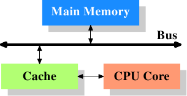
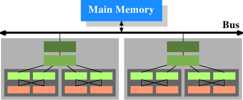
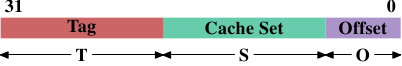
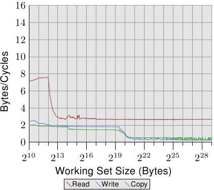
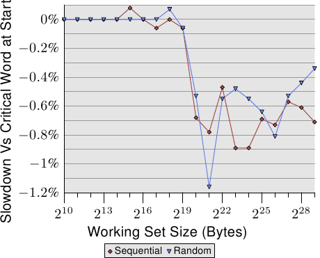

# 3. CPU 缓存

CPUs are today much more sophisticated than they were only 25 years ago. In those days, the frequency of the CPU core was at a level equivalent to that of the memory bus. Memory access was only a bit slower than register access. But this changed dramatically in the early 90s, when CPU designers increased the frequency of the CPU core but the frequency of the memory bus and the performance of RAM chips did not increase proportionally. This is not due to the fact that faster RAM could not be built, as explained in the previous section. It is possible but it is not economical. RAM as fast as current CPU cores is orders of magnitude more expensive than any dynamic RAM.

与25 年前的CPU相比,现如今的CPU 复杂得多.在当时,CPU 核心的频率与内存总线在相同水平.内存存取只比寄存器存取慢了一点.但这点在90 年代初期大大的改变了,CPU 设计者提升了CPU 核心的频率,但内存总线的频率以及RAM 芯片的性能并没有等比例的成长.这不是因为无法发展出更快的RAM,而是如前一节所解释的.这是可能的,但并不怎么经济.与当前CPU 核心一样快的RAM,比起任何动态RAM 都要贵上好几个数量级.

If the choice is between a machine with very little, very fast RAM and a machine with a lot of relatively fast RAM, the second will always win given a working set size which exceeds the small RAM size and the cost of accessing secondary storage media such as hard drives. The problem here is the speed of secondary storage, usually hard disks, which must be used to hold the swapped out part of the working set. Accessing those disks is orders of magnitude slower than even DRAM access.

一台有着非常小,非常快的RAM 的机器,以及一台有着许多相对快速的RAM 的机器,如果要在两者间择一,在给定超过小尺寸RAM 容量的工作集(*working set*)大小,以及存取硬盘这类次级储存(*secondary storage*)的开销之后,后者永远是赢家.这里的问题在于次级储存设备,通常是硬盘的速度,它必须保存部分被移出(*swap out*)的工作集.存取这些硬盘甚至比DRAM 存取要慢上好几个数量级.

Fortunately it does not have to be an all-or-nothing decision. A computer can have a small amount of high-speed SRAM in addition to the large amount of DRAM. One possible implementation would be to dedicate a certain area of the address space of the processor as containing the SRAM and the rest the DRAM. The task of the operating system would then be to optimally distribute data to make use of the SRAM. Basically, the SRAM serves in this situation as an extension of the register set of the processor.

幸运的是,不必做出非全有即全无的(*all-or-nothing*)选择.一台计算机可以有一个小容量的高速SRAM,再加上大容量的DRAM.一个可能的实现会是,将处理器地址址空间的某块区域划分来容纳SRAM,剩下的则给DRAM.任务系统的任务就会是优化分配数据从而合理利用SRAM.基本上,在这种情境下,SRAM 是作为处理器的寄存器集的扩展来使用的.

While this is a possible implementation, it is not viable. Ignoring the problem of mapping the physical resources of such SRAM-backed memory to the virtual address spaces of the processes (which by itself is terribly hard) this approach would require each process to administer in software the allocation of this memory region. The size of the memory region can vary from processor to processor (i.e., processors have different amounts of the expensive SRAM-backed memory). Each module which makes up part of a program will claim its share of the fast memory, which introduces additional costs through synchronization requirements. In short, the gains of having fast memory would be eaten up completely by the overhead of administering the resources.

虽然这是可能的实现,但并不可行.忽略将SRAM 内存的物理资源映射到处理器的虚拟(*virtual*)地址址空间的问题(这本身就非常难),这个方法会需要每个进程(process)在软件上管理内存区域的分配.内存区域的大小因处理器而异(也就是说,处理器有着不同容量的昂贵SRAM 内存).组成一个程序的每个模块都会要求它的那份快速内存,这会由于同步的需求而引入额外的成本.简而言之,拥有快速内存的获益将会完全被管理资源的间接成本(*overhead*)给抵消掉.

So, instead of putting the SRAM under the control of the OS or user, it becomes a resource which is transparently used and administered by the processors. In this mode, SRAM is used to make temporary copies of (to cache, in other words) data in main memory which is likely to be used soon by the processor. This is possible because program code and data has temporal and spatial locality. This means that, over short periods of time, there is a good chance that the same code or data gets reused. For code this means that there are most likely loops in the code so that the same code gets executed over and over again (the perfect case for spatial locality). Data accesses are also ideally limited to small regions. Even if the memory used over short time periods is not close together there is a high chance that the same data will be reused before long (temporal locality). For code this means, for instance, that in a loop a function call is made and that function is located elsewhere in the address space. The function may be distant in memory, but calls to that function will be close in time. For data it means that the total amount of memory used at one time (the working set size) is ideally limited but the memory used, as a result of the random access nature of RAM, is not close together. Realizing that locality exists is key to the concept of CPU caches as we use them today.

所以,并非将SRAM 置于OS 或者用户的控制之下,而是让它变成被处理器透明使用与管理的资源.在这种方式下,SRAM 是用来存放主存中可能不久就会被处理器用到的数据的临时副本.因为代码与数据具有时间(*temporal*)与空间局部性(*spatial locality*).这表示,在短时间内,很可能会重复用到同样的代码或数据.对代码来说,这表示有可能会在代码中循环(*loop*),使得相同的代码一次又一次的执行(空间局部性的完美例子).数据存取在理想上也会被限定在一小块区域中.即使在短时间内用到的内存并非邻近,同样的数据也有很高的机会在不久后再次用到(时间局部性).对代码,举例来说,在一轮循环中会产生一次函数调用(*function call*),这个函数在内存中可能很远,但调用这个函数在时间上则会很接近.对数据来说,一次使用的内存总量(工作集大小)理想上是有限的,但使用的内存,由于RAM 随机存取的本质,并不是相邻的.理解局部性的存在是CPU 缓存概念的关键,因为我们至今仍在使用它们.

A simple computation can show how effective caches can theoretically be. Assume access to main memory takes 200 cycles and access to the cache memory take 15 cycles. Then code using 100 data elements 100 times each will spend 2,000,000 cycles on memory operations if there is no cache and only 168,500 cycles if all data can be cached. That is an improvement of 91.5%.

一个简单的计算就能看出缓存在理论上有多有效.假设存取主存花费200 个周期,而存取缓存内存花费15 个周期.接着,程序使用100 个数据元素各100 次,若是没有缓存,将会在内存操作上耗费2,000,000 个循环,而若是所有数据都被缓存过,只要168,500 个周期.提升了91.5%.

The size of the SRAM used for caches is many times smaller than the main memory. In the author's experience with workstations with CPU caches the cache size has always been around 1/1000th of the size of the main memory (today: 4MB cache and 4GB main memory). This alone does not constitute a problem. If the size of the working set (the set of data currently worked on) is smaller than the cache size it does not matter. But computers do not have large main memories for no reason. The working set is bound to be larger than the cache. This is especially true for systems running multiple processes where the size of the working set is the sum of the sizes of all the individual processes and the kernel.

用作缓存的SRAM 大小比起主存小了好几倍.根据作者使用具有CPU 缓存的工作站(*workstation*)的经验,缓存的大小总是主存大小的1/1000 左右(现今:4MB 缓存与4GB 主存).单是如此并不会形成问题.假如工作集(正在处理的数据集)的大小比缓存大小还小,这无伤大雅.但是计算机没理由不拥有大量的主存.工作集必定会比缓存还大.尤其是执行多个进程的系统,其工作集的大小为所有个别的处理器与系统内核的大小总和.

What is needed to deal with the limited size of the cache is a set of good strategies to determine what should be cached at any given time. Since not all data of the working set is used at exactly the same time we can use techniques to temporarily replace some data in the cache with other data. And maybe this can be done before the data is actually needed. This prefetching would remove some of the costs of accessing main memory since it happens asynchronously with respect to the execution of the program. All these techniques and more can be used to make the cache appear bigger than it actually is. We will discuss them in Section 3.3. Once all these techniques are exploited it is up to the programmer to help the processor. How this can be done will be discussed in Section 6.

应对缓存的大小限制所需要的是一组策略: 在任何给定的时间点决定什么该缓存.由于并非所有工作集的数据都会正好在相同的时间点使用,所以我们可以使用技术来暂时的将部分缓存中的数据替换成别的数据.而且这能在真的需要数据之前就搞定.这种预取会去除一些存取主存的成本,因为对程序的执行而言,这是非同步进行的.这所有的技术都能用来让缓存看起来比实际上还大.我们将会在3.3 节讨论它们.一旦探究完这全部的技术,协助处理器就是程序员的责任了.这些作法将会在第六节中讨论.

## 3.1. 总览CPU 缓存

Before diving into technical details of the implementation of CPU caches some readers might find it useful to first see in some more details how caches fit into the “big picture” of a modern computer system.

在深入CPU 缓存的技术细节之前,某些读者或许会发现,先理解缓存是如何融入现代计算机系统的"大局(*big picture*)"是有所帮助的.



Figure 3.1 shows the minimum cache configuration. It corresponds to the architecture which could be found in early systems which deployed CPU caches. The CPU core is no longer directly connected to the main memory. All loads and stores have to go through the cache. The connection between the CPU core and the cache is a special, fast connection. In a simplified representation, the main memory and the cache are connected to the system bus which can also be used for communication with other components of the system. We introduced the system bus as “FSB” which is the name in use today; see Section 2.2. In this section we ignore the Northbridge; it is assumed to be present to facilitate the communication of the CPU(s) with the main memory.

图3.1 显示了最简易的缓存配置.其与能在早期找到的,采用CPU 缓存的系统架构是一致的.CPU 核心不再直接连结到主存.[[16]](#16)所有的载入与储存都必须经过缓存.CPU 核心与缓存之间的连线是一条特殊的快速连线.在这个简化的示意图上,主存与缓存都被连结到系统总线,其也会用来跟其它系统元件通讯.我们已经以"FSB"介绍过系统总线,这是它现今使用的名称,具体可以回看见2.2 节.在这一节中,我们会省略北桥,假定它存在,方便CPU 与主存的沟通.

Even though computers for the last several decades have used the von Neumann architecture, experience has shown that it is of advantage to separate the caches used for code and for data. Intel has used separate code and data caches since 1993 and never looked back. The memory regions needed for code and data are pretty much independent of each other, which is why independent caches work better. In recent years another advantage emerged: the instruction decoding step for the most common processors is slow; caching decoded instructions can speed up the execution, especially when the pipeline is empty due to incorrectly predicted or impossible-to-predict branches.

即便过去数十年来的大多计算机都采用冯诺依曼架构(*von Neumann architecture*),但实验证实分离代码与数据的缓存是比较好的.Intel 自1993 年起采用分离代码与数据的缓存,就再也没有回头过.代码与数据所需的内存区域彼此相当独立,这也是独立的缓存运作得更好的原因.近年来,另一个优点逐渐浮现:对大多数常见的处理器而言,指令解码(*decoding*)的步骤是很慢的;缓存解码过的指令能够让执行加速,在不正确的预测或者无法预测的分支(*branch*)导致流水线(*pipeline*)为空的情况下尤其如此.

Soon after the introduction of the cache, the system got more complicated. The speed difference between the cache and the main memory increased again, to a point that another level of cache was added, bigger and slower than the first-level cache. Only increasing the size of the first-level cache was not an option for economical reasons. Today, there are even machines with three levels of cache in regular use. A system with such a processor looks like Figure 3.2. With the increase on the number of cores in a single CPU the number of cache levels might increase in the future even more.

在引入缓存之后不久,系统变得越来越复杂.缓存与主存之间的速度差异再次增加,直到加入了另一层级的缓存,比起第一层缓存来得更大也更慢.仅仅提升第一层缓存的大小,以经济因素来说并非一个可行的办法.今日甚至有正常使用具有三层缓存的机器.具有这种处理器的系统看起来就像图3.2 那样.随着单一CPU 中的核心数增加,未来缓存层级也许会变得更多.


Figure 3.2 shows three levels of cache and introduces the nomenclature we will use in the remainder of the document. L1d is the level 1 data cache, L1i the level 1 instruction cache, etc. Note that this is a schematic; the data flow in reality need not pass through any of the higher-level caches on the way from the core to the main memory. CPU designers have a lot of freedom designing the interfaces of the caches. For programmers these design choices are invisible.

图3.2 显示了三层缓存,并引入了我们将会在本文其余部分使用的术语.L1d 是一阶数据缓存,L1i 是一阶指令缓存等等.注意,这只是张示意图;实际上数据流从核心到主存的路上并不需要通过任何较高层级的缓存.CPU 设计者在缓存接口的设计上有着很大的自由.对程序员来说,是看不到这些设计上的抉择的.

In addition we have processors which have multiple cores and each core can have multiple “threads”. The difference between a core and a thread is that separate cores have separate copies of (almost) all the hardware resources. The cores can run completely independently unless they are using the same resources—e.g., the connections to the outside—at the same time. Threads, on the other hand, share almost all of the processor's resources. Intel's implementation of threads has only separate registers for the threads and even that is limited, some registers are shared. The complete picture for a modern CPU therefore looks like Figure 3.3.

此外,我们有多核心的处理器,每个核心都能拥有多个"线程(*thread*)".一个核心与一个线程的差别在于,不同的核心拥有(几乎[[17]](#17))所有硬件资源的副本.除非同时用到相同的资源,像是对外连接,否则核心是能够完全独立运行的.另一方面,线程则共享几乎所有处理器的资源.Intel 的线程实现只让其拥有个别的寄存器,甚至还是有限的,某些寄存器是共享的.所以,现代CPU 的完整架构看起来就像图3.3.



In this figure we have two processors, each with two cores, each of which has two threads. The threads share the Level 1 caches. The cores (shaded in the darker gray) have individual Level 1 caches. All cores of the CPU share the higher-level caches. The two processors (the two big boxes shaded in the lighter gray) of course do not share any caches. All this will be important, especially when we are discussing the cache effects on multi-process and multi-thread applications.

在这张图中,我们有两颗处理器,每颗两个核心,各自拥有两个线程.线程共享一阶缓存.核心(以深灰色为底)拥有独立的一阶缓存.所有CPU 的核心共享更高层级的缓存.两颗处理器(两个浅灰色为底的大方块)自然不会共享任何缓存.这些全都很重要,在我们讨论缓存对多进程与多线程应用程序的影响时尤为如此.

## 3.2. 高阶缓存操作

To understand the costs and savings of using a cache we have to combine the knowledge about the machine architecture and RAM technology from Section 2 with the structure of caches described in the previous section.

我们必须结合第二节所学到的机器架构与RAM 技术,以及前一节所描述的缓存结构,以了解使用缓存的开销与节省.

By default all data read or written by the CPU cores is stored in the cache. There are memory regions which cannot be cached but this is something only the OS implementers have to be concerned about; it is not visible to the application programmer. There are also instructions which allow the programmer to deliberately bypass certain caches. This will be discussed in Section 6.

预设情况下,由CPU 核心读取或写入的所有数据都存在缓存中.有些内存区域无法被缓存,但只有OS 实现者得去考虑这点;这对应用程序员而言是不可见的.也有一些指令能令程序员绕过某些缓存.这些将会在第六节中讨论.

If the CPU needs a data word the caches are searched first. Obviously, the cache cannot contain the content of the entire main memory (otherwise we would need no cache), but since all memory addresses are cacheable, each cache entry is tagged using the address of the data word in the main memory. This way a request to read or write to an address can search the caches for a matching tag. The address in this context can be either the virtual or physical address, varying based on the cache implementation.

假如CPU 需要一个数据字,会先从缓存开始搜寻.显然缓存无法容纳整个主存的内容(不然我们就不需要缓存了),但由于所有内存地址都能被缓存,所以每个缓存项(*entry*)都会使用数据字在主存地址来标记(*tag*).如此一来,读取或写入到某个地址的请求便会在缓存中搜寻符合的标记.在这个情境中,地址可以是虚拟或物理的,视缓存的实现而有所不同.

Since the tag requires space in addition to the actual memory, it is inefficient to chose a word as the granularity of the cache. For a 32-bit word on an x86 machine the tag itself might need 32 bits or more. Furthermore, since spatial locality is one of the principles on which caches are based, it would be bad to not take this into account. Since neighboring memory is likely to be used together it should also be loaded into the cache together. Remember also what we learned in Section 2.2.1: RAM modules are much more effective if they can transport many data words in a row without a new CAS or even RAS signal. So the entries stored in the caches are not single words but, instead, “lines” of several contiguous words. In early caches these lines were 32 bytes long; now the norm is 64 bytes. If the memory bus is 64 bits wide this means 8 transfers per cache line. DDR supports this transport mode efficiently.

除了真正的内存之外,标记也会需要额外的空间,因此使用一个字作为缓存的粒度(*granularity*)是很浪费的.对于一台x86 机器上的一个32 位字而言,标记本身可能会需要32 位以上.再者,由于空间局部性是作为缓存基础的其中一个原理,不将此纳入考量并不太好.由于邻近的内存很可能会一起被用到,所以它也应该一起被载入到缓存中.也要记得我们在2.2.1 节所学到的:假如RAM 模块能够在不需新的CAS,甚至是RAS信号的情况下传输多个数据字,这是更有效率的.所以储存在缓存中的项并非单一字,而是多个连续字的"行(line)".在早期的缓存中,这些行的长度为32 字节;如今一般是64 字节.假如内存总线的宽度是64 位,这表示每个缓存行要传输8 次.DDR 有效的支持了这种传输方式.

When memory content is needed by the processor the entire cache line is loaded into the L1d. The memory address for each cache line is computed by masking the address value according to the cache line size. For a 64 byte cache line this means the low 6 bits are zeroed. The discarded bits are used as the offset into the cache line. The remaining bits are in some cases used to locate the line in the cache and as the tag. In practice an address value is split into three parts. For a 32-bit address it might look as follows:

当内存内容为处理器所需时,整个缓存行都会被载入到L1d 中.每个缓存行的内存地址会根据缓存行的大小,以掩码(*mask*)地址值的方式来计算.对于一个64 字节的缓存行来说,这表示低6 位为零.舍弃的位则用作缓存行内的偏移量(*offset*)[[译注]](#译注1).剩余的位在某些情况下用以定位缓存中的行,以及作为标记.在实际上,一个地址值会被切成三个部分.对于一个32 位的地址来说,这看来如下:



With a cache line size of 2O the low O bits are used as the offset into the cache line. The next S bits select the “cache set”. We will go into more detail soon on why sets, and not single slots, are used for cache lines. For now it is sufficient to understand there are 2S sets of cache lines. This leaves the top 32 - S - O = T bits which form the tag. These T bits are the value associated with each cache line to distinguish all the aliases which are cached in the same cache set. The S bits used to address the cache set do not have to be stored since they are the same for all cache lines in the same set.

一个大小为2^O的缓存行,低O位用作缓存行内的偏移量.接下来的S位选择"缓存集(*cache set*)".我们马上就会深入了解为何缓存行会使用集合,而非一个一组(*single slot*)的细节.现在只要知道有2^S个缓存行的集合就够了.剩下的 `32 - S - O = T` 字节成标记.这T 个位是与每个缓存行相关联,以区分在同一缓存集中所有别名(*alias*)[[18]](#18)的值.不必储存用以定址缓存集的S位,因为它们对同个集合中的所有缓存行而言都是相同的.

When an instruction modifies memory the processor still has to load a cache line first because no instruction modifies an entire cache line at once (exception to the rule: write-combining as explained in Section 6.1). The content of the cache line before the write operation therefore has to be loaded. It is not possible for a cache to hold partial cache lines. A cache line which has been written to and which has not been written back to main memory is said to be “dirty”. Once it is written the dirty flag is cleared.

当一个指令修改内存时,处理器依旧得先载入一个缓存行,因为没有指令能够一次修改一整个缓存行(这个规则有个例外:合并写入(*write-combining*),会在6.1节说明).因此在写入操作之前,得先载入缓存行的内容.缓存无法持有不完全的缓存行.写入并且仍未写回主存的缓存行被称为"脏的(*dirty*)".一旦将其写入,脏标志(*dirty flag*)便会被清除.

To be able to load new data in a cache it is almost always first necessary to make room in the cache. An eviction from L1d pushes the cache line down into L2 (which uses the same cache line size). This of course means room has to be made in L2. This in turn might push the content into L3 and ultimately into main memory. Each eviction is progressively more expensive. What is described here is the model for an exclusive cache as is preferred by modern AMD and VIA processors. Intel implements inclusive caches where each cache line in L1d is also present in L2. Therefore evicting from L1d is much faster. With enough L2 cache the disadvantage of wasting memory for content held in two places is minimal and it pays off when evicting. A possible advantage of an exclusive cache is that loading a new cache line only has to touch the L1d and not the L2, which could be faster.

为了能够在缓存中载入新的数据,几乎总是得先在缓存中腾出空间.从L1d 的换出操作(*eviction*)会将缓存行往下推入L2(使用相同的缓存行大小).这自然代表L2 也得腾出空间.这可能转而将内容推入L3,最终到主存中.每次换出操作都会越来越昂贵.这里所描述的是现代AMD 与VIA 处理器所优先采用的独占式缓存(*exclusive cache*)模型.Intel 实现了包含式缓存(*inclusive caches*)[[19]](#19),其中每个在L1d 中的缓存行也会存在L2 中.因此,从L1d 进行换出操作更为快速.有了足够的L2 缓存,将内容存在两处而造成内存浪费的缺点是很小的,而这将在换出操作时带来回报.独占式缓存的一个可能的优点是,载入一个新的缓存行只需L1d 而不需要L2,这会快上一些.

The CPUs are allowed to manage the caches as they like as long as the memory model defined for the processor architecture is not changed. It is, for instance, perfectly fine for a processor to take advantage of little or no memory bus activity and proactively write dirty cache lines back to main memory. The wide variety of cache architectures among the processors for the x86 and x86-64, between manufacturers and even within the models of the same manufacturer, are testament to the power of the memory model abstraction.

只要处理器架构而规定的内存模型没有改变,CPU 能以想要的方式来管理缓存.举例来说,善用少量或没有内存总线活动的时段,并主动的将脏的缓存行写回到主存中,对处理器来说是非常好的.x86 与x86-64的不同厂商甚至是同一厂商的不同型号之间的处理器之间有着各式各样的缓存架构,证明了内存模型抽象化的能力.

In symmetric multi-processor (SMP) systems the caches of the CPUs cannot work independently from each other. All processors are supposed to see the same memory content at all times. The maintenance of this uniform view of memory is called “cache coherency”. If a processor were to look simply at its own caches and main memory it would not see the content of dirty cache lines in other processors. Providing direct access to the caches of one processor from another processor would be terribly expensive and a huge bottleneck. Instead, processors detect when another processor wants to read or write to a certain cache line.

在对称式多处理器(*Symmetric Multi-Processor*,SMP)系统中,CPU 的缓存无法独立于彼此运作.所有处理器在任何时间都假定要看到相同的内存内容.这种内存一致观点的维持被称为"缓存一致性(*cache coherency*)".假如一个处理器只看它自己拥有的缓存与主存,它就不会看到其它处理器中的脏缓存行的内容.提供从一个处理器到另一个处理器缓存的直接存取会非常昂贵而且是个极大的瓶颈.取而代之的,处理器会侦测到另一个处理器要读取或写入到某个缓存行的行为.

If a write access is detected and the processor has a clean copy of the cache line in its cache, this cache line is marked invalid. Future references will require the cache line to be reloaded. Note that a read access on another CPU does not necessitate an invalidation, multiple clean copies can very well be kept around.

假如侦测到一次写入,并且处理器在其缓存中有这个缓存行的干净副本,这个缓存行就会被标为无效(*invalid*).未来的读取会需要重新载入这个缓存行.注意到在另一颗CPU 上的读取存取并不需要进行无效化,多个干净副本能够被保存得很好.

More sophisticated cache implementations allow another possibility to happen. If the cache line which another processor wants to read from or write to is currently marked dirty in the first processor's cache a different course of action is needed. In this case the main memory is out-of-date and the requesting processor must, instead, get the cache line content from the first processor. Through snooping, the first processor notices this situation and automatically sends the requesting processor the data. This action bypasses main memory, though in some implementations the memory controller is supposed to notice this direct transfer and store the updated cache line content in main memory. If the access is for writing the first processor then invalidates its copy of the local cache line.

更加复杂的缓存实现容许其它的可能性的发生.假设在一个处理器缓存中的一个缓存行是脏的,并且第二个处理器想要读取或写入这个缓存行.在这个情况下,主存的内容太旧了,而请求的处理器必须从第一个处理器取得缓存行的内容作为替代.第一个处理器侦测到了这个状况,并自动的将数据发送给请求的处理器.这个动作绕过了主存.然而在某些实现中,假定内存控制器会注意到这个直接传输并将更新的缓存行内容储存到主存中.假如是为了写入而进行存取,第一个处理器便会将它的区域缓存行的副本无效化.

Over time a number of cache coherency protocols have been developed. The most important is MESI, which we will introduce in Section 3.3.4. The outcome of all this can be summarized in a few simple rules:

许多缓存一致化的协议随着时间被开发出来.最重要的为MESI,我们将会3.3.4 节中介绍它.这所有的结果可以被总结为一些简单的规则:

* A dirty cache line is not present in any other processor's cache.
* Clean copies of the same cache line can reside in arbitrarily many caches.
* 一个脏的缓存行不会出现在任何其它处理器的缓存中.
* 相同缓存行的干净副本能够存在任意数量的缓存中.

If these rules can be maintained, processors can use their caches efficiently even in multi-processor systems. All the processors need to do is to monitor each others' write accesses and compare the addresses with those in their local caches. In the next section we will go into a few more details about the implementation and especially the costs.

假如能够维持这些规则,即便在多处理器的系统中,处理器也能够有效的使用它们的缓存.所有处理器所需要做的,就是去监控其它处理器的写入并将这个地址与它们区域缓存中的地址做比较.在下一节,我们将会深入更多实现尤其是成本的一​​些细节.

Finally, we should at least give an impression of the costs associated with cache hits and misses. These are the numbers Intel lists for a Pentium M:

最后,我们应该对缓存命中(*hit*)与不命中(*miss*)相关成本有个初步认识.这些是Intel 针对Pentium M 列出的数字:

| 到哪里 | 周期 |
| ------ | ---- |
| 寄存器 | <= 1 |
| L1d    | ~3   |
| L2     | ~14  |
| 主存   | ~240 |

These are the actual access times measured in CPU cycles. It is interesting to note that for the on-die L2 cache a large part (probably even the majority) of the access time is caused by wire delays. This is a physical limitation which can only get worse with increasing cache sizes. Only process shrinking (for instance, going from 60nm for Merom to 45nm for Penryn in Intel's lineup) can improve those numbers.

这些是以CPU 周期测量的实际存取时间.有趣的是,对内建于芯片上的L2 缓存而言,大部分(甚至可能超过一半)的存取时间都是由线路延迟造成的.这是一个只会随着缓存大小变大而变糟的物理限制.只有制程的提升(举例来说,从Intel 系列中Merom 的60nm 到Penryn 的45nm)能提升这些数字.

The numbers in the table look high but, fortunately, the entire cost does not have to be paid for each occurrence of the cache load and miss. Some parts of the cost can be hidden. Today's processors all use internal pipelines of different lengths where the instructions are decoded and prepared for execution. Part of the preparation is loading values from memory (or cache) if they are transferred to a register. If the memory load operation can be started early enough in the pipeline, it may happen in parallel with other operations and the entire cost of the load might be hidden. This is often possible for L1d; for some processors with long pipelines for L2 as well.

表格中的数字看起来很大,但幸运的是不必在每次发生缓存载入与不命中时都负担全部的成本.一部分的成本可以被隐藏.现今的处理器全都会使用不同长度的内部流水线,指令会在流水线中被解码,并且为执行而准备.部份的准备是从内存(或缓存)载入值,假如它们要被传输到寄存器的话.假如内存载入操作能够足够早就在流水线中开始,它也许会与其它操作并行进行,而整个载入成本就可能被隐藏了.这对L1d 通常是可行的;对某些有着长流水线的处理器来说,L2 亦是如此.

There are many obstacles to starting the memory read early. It might be as simple as not having sufficient resources for the memory access or it might be that the final address of the load becomes available late as the result of another instruction. In these cases the load costs cannot be hidden (completely).

提早开始内存读取有着诸多阻碍.也许简单得像是没有足够的资源来存取内存,或者可能是载入的最终地址之后才会作为另一个指令的结果取得.在这些情况中,载入成本无法被(完全的)隐藏.

For write operations the CPU does not necessarily have to wait until the value is safely stored in memory. As long as the execution of the following instructions appears to have the same effect as if the value were stored in memory there is nothing which prevents the CPU from taking shortcuts. It can start executing the next instruction early. With the help of shadow registers which can hold values no longer available in a regular register it is even possible to change the value which is to be stored in the incomplete write operation.

对于写入操作,CPU 不必一直等到值储存进内存中为止.只要接下来指令的执行就像是与值已被存入内存有着看似相同的效果,就没有什么能阻止CPU 走捷径了.它能够早点开始执行下个指令.有着影子寄存器(*shadow register*,能够持有一般寄存器无法取得的值)的帮助,甚至可能改变未完成的写入操作所要储存的值.


有关缓存行为影响的图表,见图3.4.我们稍候会谈到产生数据的程序;这是个不停的以随机的方式存取可控制内存总量的程序的简易模拟.每笔数据有着固定的大小.元素的数量视选择的工作集大小而定.Y 轴表示处理一个元素所花费的CPU 周期的平均;注意到Y 轴为对数刻度.这同样适用于所有这类图表的X 轴.工作集的大小总是以二的幂次表示.

For an illustration of the effects of cache behavior see Figure 3.4. We will talk about the program which generated the data later; it is a simple simulation of a program which accesses a configurable amount of memory repeatedly in a random fashion. Each data item has a fixed size. The number of elements depends on the selected working set size. The Y–axis shows the average number of CPU cycles it takes to process one element; note that the scale for the Y–axis is logarithmic. The same applies in all the diagrams of this kind to the X–axis. The size of the working set is always shown in powers of two.

这张图显示了三个不同的平稳阶段.这并不让人意外:这个处理器有L1d 与L2 缓存,但没有L3.经由一些经验,我们可以推论这个L1d 大小为2^13 字节,而L2 大小为2^20 字节.假如整个工作集能塞进L1d 中,对每个元素的每次操作的周期数会低于10.一旦超过了L1d 的大小,处理器就必须从L2 载入数据,而平均时间则迅速成长到28 左右.一旦L2 也不够大了,时间便飙升到480 个周期以上.这就是许多或者说大部分操作必须从主存载入数据的时候了.更糟的是:由于数据被修改了,脏的缓存行也必须被写回.

The graph shows three distinct plateaus. This is not surprising: the specific processor has L1d and L2 caches, but no L3. With some experience we can deduce that the L1d is 213 bytes in size and that the L2 is 220 bytes in size. If the entire working set fits into the L1d the cycles per operation on each element is below 10. Once the L1d size is exceeded the processor has to load data from L2 and the average time springs up to around 28. Once the L2 is not sufficient anymore the times jump to 480 cycles and more. This is when many or most operations have to load data from main memory. And worse: since data is being modified dirty cache lines have to be written back, too.

这张图提供了充分动机: 探究程序编写的改进以协助提升缓存使用方式.我们在这里所谈论的并不是几个少得可怜的百分点;我们说的是有时可能的几个数量级的提升.在第六节,我们将会讨论能让我们写出更有效率的程序的技术.下一节会深入更多CPU 缓存设计的细节.有这些知识很好,但对于本文其余部分并非必要.所以这一节可以跳过.

This graph should give sufficient motivation to look into coding improvements which help improve cache usage. We are not talking about a few measly percent here; we are talking about orders-of-magnitude improvements which are sometimes possible. In Section 6 we will discuss techniques which allow writing more efficient code. The next section goes into more details of CPU cache designs. The knowledge is good to have but not necessary for the rest of the paper. So this section could be skipped.

## 3.3. CPU 缓存实现细节

Cache implementers have the problem that each cell in the huge main memory potentially has to be cached. If the working set of a program is large enough this means there are many main memory locations which fight for each place in the cache. Previously it was noted that a ratio of 1-to-1000 for cache versus main memory size is not uncommon.

缓存实现者有个麻烦是: 在庞大的主存中每个存储单元都可能得被缓存.假如一个程序的工作集足够大,这表示有许多为了缓存而竞争的主存.先前曾经提过,缓存与主存大小的比率为1 比1000 的情况并不罕见.

### 3.3.1. 关联度

It would be possible to implement a cache where each cache line can hold a copy of any memory location. This is called a fully associative cache. To access a cache line the processor core would have to compare the tags of each and every cache line with the tag for the requested address. The tag would be comprised of the entire part of the address which is not the offset into the cache line (that means, S in the figure on Section 3.2 is zero).

实现一个每个缓存行都能保存任意内存位置副本的缓存是有可能的(见图3.5).这被称为一个全相联缓存(*fully associative cache*).要存取一个缓存行,处理器核心必须要将每个缓存行的标记与请求地址的标记进行比较.标记会由地址中不是缓存行偏移量的整个部分组成(这表示在3.2 节图示中的S为零).

There are caches which are implemented like this but, by looking at the numbers for an L2 in use today, will show that this is impractical. Given a 4MB cache with 64B cache lines the cache would have 65,536 entries. To achieve adequate performance the cache logic would have to be able to pick from all these entries the one matching a given tag in just a few cycles. The effort to implement this would be enormous.

有些缓存是像这样实现的,但是看看现今使用的L2 数量,证明这是不切实际的.给定一个有着64B 缓存行的4MB 缓存,这个缓存将会有65,536 个项.为了达到足够的性能,缓存逻辑必须要能够在短短几个周期内,从这所有的项中挑出符合给定标记的那一个.实现这点要付出庞大的精力.


For each cache line a comparator is needed to compare the large tag (note, S is zero). The letter next to each connection indicates the width in bits. If none is given it is a single bit line. Each comparator has to compare two T-bit-wide values. Then, based on the result, the appropriate cache line content is selected and made available. This requires merging as many sets of O data lines as there are cache buckets. The number of transistors needed to implement a single comparator is large especially since it must work very fast. No iterative comparator is usable. The only way to save on the number of comparators is to reduce the number of them by iteratively comparing the tags. This is not suitable for the same reason that iterative comparators are not: it takes too long.

对每个缓存行来说,都需要一个比较器(*comparator*)来比对很大的标记(注意,S为零).紧邻着每条连线的字母代表以位为单位的宽度.假如没有给定,那么它就是一条单一位的线路.每个比较器都必须比对两个T位宽的值.接着,基于这个结果,选择合适的缓存行内容,并令它能被取得.有多少缓存行,都得合并多少组O数据线.实现一个比较器所需的电晶体数量很大,特别是它必须运作的非常快的时候.叠代比较器(iterative comparator)是不可用的.节省比较器数量的唯一方式,就是反覆的比较标记以减少比较器的数量.这与叠代比较器并不合适的理由相同:它太花时间了.

Fully associative caches are practical for small caches (for instance, the TLB caches on some Intel processors are fully associative) but those caches are small, really small. We are talking about a few dozen entries at most.

全相联缓存对小缓存(例如在某些Intel 处理器的TLB 缓存就是全关联式的)来说是有实用价值的,但那些缓存都很小,非常小.我们所指的是至多只有几十个项的情况.

For L1i, L1d, and higher level caches a different approach is needed. What can be done is to restrict the search. In the most extreme restriction each tag maps to exactly one cache entry. The computation is simple: given the 4MB/64B cache with 65,536 entries we can directly address each entry by using bits 6 to 21 of the address (16 bits). The low 6 bits are the index into the cache line.

对L1i,L1d,以及更高层级的缓存来说,需要采用不同的方法.我们所能做的是限缩搜寻.在最极端的限制中,每个标记都恰好映射到一个缓存项.计算方式很简单:给定4MB／64B,有着65,536 个项的缓存,我们能够直接使用地址的6 到21 位(16 个位)来直接定址每个项.低6 位是缓存行内部的索引.


Such a direct-mapped cache is fast and relatively easy to implement as can be seen in Figure 3.6. It requires exactly one comparator, one multiplexer (two in this diagram where tag and data are separated, but this is not a hard requirement on the design), and some logic to select only valid cache line content. The comparator is complex due to the speed requirements but there is only one of them now; as a result more effort can be spent on making it fast. The real complexity in this approach lies in the multiplexers. The number of transistors in a simple multiplexer grows with O(log N), where N is the number of cache lines. This is tolerable but might get slow, in which case speed can be increased by spending more real estate on transistors in the multiplexers to parallelize some of the work and to increase the speed. The total number of transistors can grow slowly with a growing cache size which makes this solution very attractive. But it has a drawback: it only works well if the addresses used by the program are evenly distributed with respect to the bits used for the direct mapping. If they are not, and this is usually the case, some cache entries are heavily used and therefore repeatedly evicted while others are hardly used at all or remain empty.

如图3.6 所见到的,这种直接映射缓存(*direct-mapped cache*)很快,而且实现起来相对简单.它需要一个比较器,一个多工器(在这张示意图中有两个,标记与数据是分离的,但在这个设计上,这点并不是个硬性要求),以及一些用以选择有效缓存行内容的逻辑.比较器是因速度要求而复杂,但现在只有一个;因此,便能够花费更多的精力来让它变快.在这个方法中,实际的复杂之处都落在多工器上.在一个简易的多工器上,电晶体的数量以O(log N) 成长,其中N 为缓存行的数量.这能够容忍,但可能会慢了点,在这种情况下,由在多工器中增加更多的电晶体以并行化某些工作,便能够提升速度.电晶体的总数能够缓慢的随着缓存大小的成长而成长,使得这种解法非常有吸引力.但它有个缺点:只有在程序用到的地址,对于用以直接映射的位来说是均匀分布的情况下,它才能运作得很好.若非如此,而且经常这样的话,某些缓存项会因为频繁的使用而被重复的换出,而其余的项则几乎完全没用到,或者一直是空的.


This problem can be solved by making the cache set associative. A set-associative cache combines the features of the full associative and direct-mapped caches to largely avoid the weaknesses of those designs. Figure 3.7 shows the design of a set-associative cache. The tag and data storage are divided into sets which are selected by the address. This is similar to the direct-mapped cache. But instead of only having one element for each set value in the cache a small number of values is cached for the same set value. The tags for all the set members are compared in parallel, which is similar to the functioning of the fully associative cache.

这个问题能由让缓存组相联(*set associative*)来解决.一个组相联缓存结合了全关联式以及直接映射缓存的良好特质,以在很大程度上避免了那些设计的弱点.图3.7 显示了一个组相联缓存的设计.标记与数据的储存被分成集合,其中之一会被缓存行的地址所选择.这与直接映射缓存相似.但少数的值能以相同的集合编号缓存,而非令缓存中的每个集合编号都只有一个元素.所有集合内成员的标记会并行的比对,这与全相联缓存的运作方式相似.

The result is a cache which is not easily defeated by unfortunate or deliberate selection of addresses with the same set numbers and at the same time the size of the cache is not limited by the number of comparators which can be implemented in parallel. If the cache grows it is (in this figure) only the number of columns which increases, not the number of rows. The number of rows only increases if the associativity of the cache is increased. Today processors are using associativity levels of up to 16 for L2 caches or higher. L1 caches usually get by with 8.

结果是,缓存不容易被不幸的,或者蓄意的,以相同集合编号的地址选择所击败,同时缓存的大小也不会受限于能被经济的实现的比较器的数量.假如缓存增长,它(在这张图中)只有行数会增加,列数则否.行数(以及比较器)只会在缓存的关联度(*associativity*)增加的时候才会增加.现今的处理器为L2 或者更高层级的缓存所使用的关联度层级高达24.L1 缓存通常使用8 个集合.

Given our 4MB/64B cache and 8-way set associativity the cache we are left with has 8,192 sets and only 13 bits of the tag are used in addressing the cache set. To determine which (if any) of the entries in the cache set contains the addressed cache line 8 tags have to be compared. That is feasible to do in very short time. With an experiment we can see that this makes sense.

给定我们的4MB／64B 缓存以及8 路(8-way)集合关联度,于是这个缓存便拥有8,192 个集合,并且仅有13 位的标记被用于定址缓存集.要决定缓存集中的哪个(如果有的话)项包含被定址的缓存行,必须要比较8 个标记.在非常短的时间内做到如此是可行的.由实验我们能够看到,这是合理的.

| L2 缓存大小 | 直接       | 直接       | 2          | 2          | 4           | 4          | 8          | 8          |
| ----------- | ---------- | ---------- | ---------- | ---------- | ----------- | ---------- | ---------- | ---------- |
|             | CL=32      | CL=64      | CL=32      | CL=64      | CL=32       | CL=64      | CL=32      | CL=64      |
| 512k        | 27,794,595 | 20,422,527 | 25,222,611 | 18,303,581 | 24,096,510  | 17,356,121 | 23,666,929 | 17,029,334 |
| 1M          | 19,007,315 | 13,903,854 | 16,566,738 | 12,127,174 | >15,537,500 | 11,436,705 | 15,162,895 | 11,233,896 |
| 2M          | 12,230,962 | 8,801,403  | 9,081,881  | 6,491,011  | 7,878,601   | 5,675,181  | 7,391,389  | 5,382,064  |
| 4M          | 7,749,986  | 5,427,836  | 4,736,187  | 3,159,507  | 3,788,122   | 2,418,898  | 3,430,713  | 2,125,103  |
| 8M          | 4,731,904  | 3,209,693  | 2,690,498  | 1,602,957  | 2,207,655   | 1,228,190  | 2,111,075  | 1,155,847  |
| 16M         | 2,620,587  | 1,528,592  | 1,958,293  | 1,089,580  | 1,704,878   | 883,530    | 1,671,541  | 862,324    |

Table 3.1 shows the number of L2 cache misses for a program (gcc in this case, the most important benchmark of them all, according to the Linux kernel people) for changing cache size, cache line size, and associativity set size. In Section 7.2 we will introduce the tool to simulate the caches as required for this test.

表3.1 显示了对于一个程序(在这个例子中是gcc,根据Linux 系统内核的人们的说法,它是所有基准中最重要的一个)在改变缓存大小,缓存行大小,以及关联度集合大小时,L2 缓存不命中的次数.在7.2 节中,我们将会介绍对于这个测试,所需要用以模拟缓存的工具.

Just in case this is not yet obvious, the relationship of all these values is that the cache size is

以防这些值的关联仍不明显,这所有的值的关系是,缓存的大小为

```缓存行大小 * 关联度 * 集合的数量```

The addresses are mapped into the cache by using in the way the figure in Section 3.2 shows.

地址是以3.2 节的图中示意的方式,使用来映射到缓存中的.


Figure 3.8 makes the data of the table more comprehensible. It shows the data for a fixed cache line size of 32 bytes. Looking at the numbers for a given cache size we can see that associativity can indeed help to reduce the number of cache misses significantly. For an 8MB cache going from direct mapping to 2-way set associative cache saves almost 44% of the cache misses. The processor can keep more of the working set in the cache with a set associative cache compared with a direct mapped cache.

图3.8 让这个表格的数据更容易理解.它显示了缓存行大小固定为32 字节的数据.看看对于给定缓存大小的数字,我们可以发现关联度确实有助于显著的降低缓存不命中的次数.以一个8MB 缓存来说,从直接映射式变成2 路组相联避免了几乎44% 的缓存不命中.相比于一个直接对应式缓存,使用一个组相联缓存的话,处理器能够在缓存中保存更多的工作集.

In the literature one can occasionally read that introducing associativity has the same effect as doubling cache size. This is true in some extreme cases as can be seen in the jump from the 4MB to the 8MB cache. But it certainly is not true for further doubling of the associativity. As we can see in the data, the successive gains are much smaller. We should not completely discount the effects, though. In the example program the peak memory use is 5.6M. So with a 8MB cache there are unlikely to be many (more than two) uses for the same cache set. With a larger working set the savings can be higher as we can see from the larger benefits of associativity for the smaller cache sizes.

在文献中,偶尔会读到引入关联度与加倍缓存大小有着相同的影响.在某些极端的例子中,如同能够从4MB 跳到8MB 缓存所看到的,确实如此.但再一次加倍关联度的话,显然就不是如此了.如同我们能从数据中所看到的,接下来的提升要小得多.不过,我们不该完全低估这个影响.在范例程序中,内存使用的峰值为5.6M.所以使用一个8MB 缓存,同样的缓存集不大可能被多次(超过两次)使用.有个较大的工作集的话,能够节约的更多.如同我们能够看到的,对于较小的缓存大小来说,关联度的获益较大.

In general, increasing the associativity of a cache above 8 seems to have little effects for a single-thread workload. With the introduction of multi-core processors which use a shared L2 the situation changes. Now you basically have two programs hitting on the same cache which causes the associativity in practice to be halved (or quartered for quad-core processors). So it can be expected that, with increasing numbers of cores, the associativity of the shared caches should grow. Once this is not possible anymore (16-way set associativity is already hard) processor designers have to start using shared L3 caches and beyond, while L2 caches are potentially shared by a subset of the cores.

一般来说,将一个缓存的关联度提升到8 以上,似乎对一个单线程的工作量来说只有很小的影响.随着共享第一层缓存的超线程处理器,以及使用一个共享L2 缓存的多核心处理器的引入,形势转变了.现在你基本上会有两个程序命中相同的缓存,这导致关联度会在实际上打对折(对四核处理器来说是四分之一).所以能够预期,提升核心的数量,共享缓存的关联度也应该成长.一旦这不再可能(16 路集合关联度已经很难了),处理器设计师就必须开始使用共享的L3 或者更高层级的缓存,而L2 缓存则是潜在的由核心的子集所共享.

Another effect we can study in Figure 3.8 is how the increase in cache size helps with performance. This data cannot be interpreted without knowing about the working set size. Obviously, a cache as large as the main memory would lead to better results than a smaller cache, so there is in general no limit to the largest cache size with measurable benefits.

我们能在图3.8 学到的另一个影响是,增加缓存大小是如何提升性能的.这个数据无法在不知道工作集大小的情况下解释.显然的,一个与主存一样大的缓存,会导致比一个较小缓存更好的结果,所以一般来说不会有带着可预见优势的最大缓存大小的限制.

As already mentioned above, the size of the working set at its peak is 5.6M. This does not give us any absolute number of the maximum beneficial cache size but it allows us to estimate the number. The problem is that not all the memory used is contiguous and, therefore, we have, even with a 16M cache and a 5.6M working set, conflicts (see the benefit of the 2-way set associative 16MB cache over the direct mapped version). But it is a safe bet that with the same workload the benefits of a 32MB cache would be negligible. But who says the working set has to stay the same? Workloads are growing over time and so should the cache size. When buying machines, and one has to choose the cache size one is willing to pay for, it is worthwhile to measure the working set size. Why this is important can be seen in the figures on Figure 3.10.

如同上面所提到的,工作集大小的峰值为5.6M.这并没有给我们任何最佳缓存大小的确切数字,但它能让我们估算出这个数字.问题是,并非所有被用到的内存都是连续的,因此我们会有,即使是以一个16M 的缓存与一个5.6M 的工作集,冲突(conflict)[^译注2](看看2 路组相联的16MB 缓存相较于直接映射版本的优势).但有把握的是,以同样的工作量,一个32MB 缓存的获益是可以忽略不计的.但谁说过工作集大小必须维持不变了?工作量是随着时间成长的,缓存大小也应该如此.在购买机器,并且在你得去挑选愿意为此买单的缓存大小时,是值得去衡量工作集大小的.在图3.10 中能够看到这件事何以重要.


Two types of tests are run. In the first test the elements are processed sequentially. The test program follows the pointer n but the array elements are chained so that they are traversed in the order in which they are found in memory. This can be seen in the lower part of Figure 3.9. There is one back reference from the last element. In the second test (upper part of the figure) the array elements are traversed in a random order. In both cases the array elements form a circular single-linked list.

执行了两种类型的测试.在第一个测试中,元素是顺序处理的.测试程序沿着指针(pointer)`n` 前进,但数组元素会以令它们以在内存中排列的顺序被遍历的方式链结.这能够在图3.9 的下半部看到.有个来自最后一个元素的回溯参考.在第二个测试中(图中的上半部),数组元素是以随机顺序遍历的.在这两种情况中,数组元素都会形成一个循环的单向链表(single-linked list).

### 3.3.2. 缓存影响的测量

All the figures are created by measuring a program which can simulate working sets of arbitrary size, read and write access, and sequential or random access. We have already seen some results in Figure 3.4. The program creates an array corresponding to the working set size of elements of this type:

所有的图表都是由一个能模拟任意大小的工作集,读取与写入存取,以及顺序或随机存取的程序所产生的.我们已经在图3.4 中看过一些结果.这个程序会产生与工作集大小相同,这种类型的数组:

```c

struct l {
  struct l *n;
  long int pad[NPAD];
};

```
All entries are chained in a circular list using the n element, either in sequential or random order. Advancing from one entry to the next always uses the pointer, even if the elements are laid out sequentially. The pad element is the payload and it can grow arbitrarily large. In some tests the data is modified, in others the program only performs read operations.

所有的项都使用`n` 元素,以顺序或是随机的顺序,链结在一个循环的列表中.即使元素是顺序排列的,从一个项前进到下一个项总是会用到这个指针.`pad` 元素为数据负载(payload),并且能成长为任意大小.在某些测试中,数据会被修改,而在其余的情况中,程序只会执行读取操作.

In the performance measurements we are talking about working set sizes. The working set is made up of an array of struct l elements. A working set of 2^N bytes contains elements. Obviously sizeof(struct l) depends on the value of NPAD. For 32-bit systems, NPAD=7 means the size of each array element is 32 bytes, for 64-bit systems the size is 64 bytes.

在性能测量中,我们讨论的是工作集的大小.工作集是由一个`struct l` 元素的数组所组成的.一个2^N 字节的工作集包含2^N / `sizeof(struct l)` 个元素.显而易见的,`sizeof(struct l)` 视`NPAD` 的值而定.以32 位的系统来说,`NPAD`=7 代表每个数组元素的大小为32 字节,以64 位的系统来说,大小为64 字节.

#### 单线程顺序存取


The simplest case is a simple walk over all the entries in the list. The list elements are laid out sequentially, densely packed. Whether the order of processing is forward or backward does not matter, the processor can deal with both directions equally well. What we measure here—and in all the following tests—is how long it takes to handle a single list element. The time unit is a processor cycle. Figure 3.10 shows the result. Unless otherwise specified, all measurements are made on a Pentium 4 machine in 64-bit mode which means the structure l with NPAD=0 is eight bytes in size.

最简单的情况就是直接遍历列表中的所有项.列表元素是顺序排列,紧密的塞在一起的.不管处理的顺序是正向或反向都无所谓,处理器在两个方向上都能处理得一样好.我们这里,以及在接下来的所有测试中,所要测量的是,处理一个单向列表元素要花多久.时间单位为处理器周期.图3.10 显示了这个结果.除非有另外说明,否则所有的测量都是在一台Pentium 4 以64 位模式获得的,这表示`NPAD`=0 的结构`l` 大小为八字节.

The first two measurements are polluted by noise. The measured workload is simply too small to filter the effects of the rest of the system out. We can safely assume that the values are all at the 4 cycles level. With this in mind we can see three distinct levels:

前两个测量结果受到了干扰的污染.测量的工作量太小了,因而无法过滤掉其余系统的影响.我们能够放心的假设这些值都在4 个周期左右.考虑到这点,我们能够看到三个不同的水平(level):

* Up to a working set size of 2^14 bytes.
* From 2^15 bytes to 2^20 bytes.
* From 2^21 bytes and up.
* 工作集大小至多到2^14 字节.
* 从2^15 字节到2^20 字节.
* 2^21 字节以上.

These steps can be easily explained: the processor has a 16kB L1d and 1MB L2. We do not see sharp edges in the transition from one level to the other because the caches are used by other parts of the system as well and so the cache is not exclusively available for the program data. Specifically the L2 cache is a unified cache and also used for the instructions (NB: Intel uses inclusive caches).

这些阶段能够轻易的解读:处理器拥有一个16kB L1d 与1MB L2.我们没有在从一个水平到另一个水平的转变之处看到尖锐的边缘,因为缓存也会被系统的其它部分用到,因此缓存并不是专门给这个程序的数据所使用的.特别是L2 缓存,它是一个统一缓存(unified cache),也会被用来存放指令(注:Intel 使用包含式缓存).

What is perhaps not quite expected are the actual times for the different working set sizes. The times for the L1d hits are expected: load times after an L1d hit are around 4 cycles on the P4. But what about the L2 accesses? Once the L1d is not sufficient to hold the data one might expect it would take 14 cycles or more per element since this is the access time for the L2. But the results show that only about 9 cycles are required. This discrepancy can be explained by the advanced logic in the processors. In anticipation of using consecutive memory regions, the processor prefetches the next cache line. This means that when the next line is actually used it is already halfway loaded. The delay required to wait for the next cache line to be loaded is therefore much less than the L2 access time.

或许完全没有预期到的是,对于不同工作集大小的实际时间.L1d 命中的时间是预期中的:在P4 上,L1d 命中之后的载入时间大约是4 个周期.但L2 存取怎么样呢?一旦L1d 不足以保存数据,可以预期这会让每个元素花上14 个周期以上,因为这是L2 的存取时间.但结果显示只需要大约9 个周期.这个差异能够以处理器中的先进逻辑来解释.预期使用连续的内存区域时,处理器会*预取*下一个缓存行.这表示,当真的用到下个缓存行时,它已经载入一半了.等待下一个缓存行载入所需的延迟因而比L2 存取时间要少得多.

The effect of prefetching is even more visible once the working set size grows beyond the L2 size. Before we said that a main memory access takes 200+ cycles. Only with effective prefetching is it possible for the processor to keep the access times as low as 9 cycles. As we can see from the difference between 200 and 9, this works out nicely.

一旦工作集大小成长到超过L2 的大小,预取的效果甚至更明显.先前我们说过,一次主存存取要花费200+ 个周期.只有利用有效的预取,处理器才可能让存取时间维持在低至9 个周期.如同我们能从200 与9 之间的差异所看到的,它的效果很好.


We can observe the processor while prefetching, at least indirectly. In Figure 3.11 we see the times for the same working set sizes but this time we see the graphs for different sizes of the structure l. This means we have fewer but larger elements in the list. The different sizes have the effect that the distance between the n elements in the (still consecutive) list grows. In the four cases of the graph the distance is 0, 56, 120, and 248 bytes respectively.

我们能够在预取的时候,至少间接的,观察处理器.在图3.11 中,我们看到的是相同工作集大小的时间,但这次我们看到的是不同`l` 结构大小的曲线.这表示在列表中有比较少,但比较大的元素.不同大小有着令(仍然连续的)列表中的`n` 元素之间的距离成长的影响.在图中的四种情况,距离分别为0,56,120,248 字节.

At the bottom we can see the line from the previous graph, but this time it appears more or less as a flat line. The times for the other cases are simply so much worse. We can see in this graph, too, the three different levels and we see the large errors in the tests with the small working set sizes (ignore them again). The lines more or less all match each other as long as only the L1d is involved. There is no prefetching necessary so all element sizes just hit the L1d for each access.

在底部我们可以看到图3.10 的线,但这时它看起来差不多像是条平坦的线.其它情况的时间要糟得多了.我们也能在这张图中看到三个不同的水平,我们也看到在工作集大小很小的情况下有着很大的误差(再次忽略它们).只要仅有L1d 牵涉其中,这些线差不多都相互重合.
There is no prefetching necessary so all element sizes just hit the L1d for each access.

For the L2 cache hits we see that the three new lines all pretty much match each other but that they are at a higher level (about 28). This is the level of the access time for the L2. This means prefetching from L2 into L1d is basically disabled. Even with NPAD=7 we need a new cache line for each iteration of the loop; for NPAD=0, instead, the loop has to iterate eight times before the next cache line is needed. The prefetch logic cannot load a new cache line every cycle. Therefore we see a stall to load from L2 in every iteration.

在L2 缓存命中的情况下,我们看到三条新的线相互重合得很好,但它们位在比较高的水平上(大约28).这是L2 存取时间的水平.这表示从L2 到L1d 的预取基本上失效了.即使是`NPAD`=7,我们在循环的每一次叠代都需要一个新的缓存行;以`NPAD`=0 而言,在需要下一个缓存行之前,循环得叠代八次.预取逻辑无法每个周期都载入一个新的缓存行.因此,我们看到的便是在每次叠代时,从L2 载入的延误.

It gets even more interesting once the working set size exceeds the L2 capacity. Now all four lines vary widely. The different element sizes play obviously a big role in the difference in performance. The processor should recognize the size of the strides and not fetch unnecessary cache lines for NPAD=15 and 31 since the element size is smaller than the prefetch window (see Section 6.3.1). Where the element size is hampering the prefetching efforts is a result of a limitation of hardware prefetching: it cannot cross page boundaries. We are reducing the effectiveness of the hardware scheduler by 50% for each size increase. If the hardware prefetcher were allowed to cross page boundaries and the next page is not resident or valid the OS would have to get involved in locating the page. That means the program would experience a page fault it did not initiate itself. This is completely unacceptable since the processor does not know whether a page is not present or does not exist. In the latter case the OS would have to abort the process. In any case, given that, for NPAD=7 and higher, we need one cache line per list element the hardware prefetcher cannot do much. There simply is no time to load the data from memory since all the processor does is read one word and then load the next element.

一旦工作集大小超过L2 的容量,甚至变得更有趣了.现在四条线全都离得很远.不同的元素大小显然在性能差异上扮演着一个重大的角色.处理器应该要识别出步伐(stride)的大小,不为`NPAD`=15 与31 获取不必要的缓存行,因为元素的大小是比预取窗(prefetch window)还小的(见6.3. 1 节).元素大小妨碍预取效果之处,是一个硬件预取限制的结果:它无法横跨分页(page)边界.我们在每次增加大小时,都减少了50% 硬件计划器(scheduler)的效率.假如硬件预取器(prefetcher)被允许横跨分页边界,并且下一个分页不存在或者无效时,OS 就得被卷入分页的定位中.这表示程序要经历并非由它自己产生的分页错误(page fault).这是完全无法接受的,因为处理器并不知道一个分页是不在内存内还是不存在.在后者的情况下,OS 必须要中断进程.在任何情况下,假定,以`NPAD`=7 或以上而言,每个列表元素都需要一个缓存行,硬件预取器便爱莫能助了.由于处理器一直忙着读取一个字,然后载入下一个元素,根本没有时间去从内存载入数据.

Another big reason for the slowdown are the misses of the TLB cache. This is a cache where the results of the translation of a virtual address to a physical address are stored, as is explained in more detail in Section 4. The TLB cache is quite small since it has to be extremely fast. If more pages are accessed repeatedly than the TLB cache has entries for the translation from virtual to physical address has to be constantly repeated. This is a very costly operation. With larger element sizes the cost of a TLB lookup is amortized over fewer elements. That means the total number of TLB entries which have to be computed per list element is higher.

变慢的另一个主要原因是TLB 缓存的不命中.这是一个储存了从虚拟地址到物理地址的转译结果的缓存,如同在第四节所详细解释的那样.由于TLB 缓存必须非常的快,所以它非常的小.假如重复存取的分页数比TLB 缓存拥有的还多,就必须不断的重算代表着虚拟到物理地址的转译结果的项.这是一个非常昂贵的操作.对比较大的元素大小而言,一次TLB 查询的成本是分摊在较少的元素上的.这表示对于每个列表元素,必须要计算的TLB 项总数较多.

To observe the TLB effects we can run a different test. For one measurement we lay out the elements sequentially as usual. We use NPAD=7 for elements which occupy one entire cache line. For the second measurement we place each list element on a separate page. The rest of each page is left untouched and we do not count it in the total for the working set size. {Yes, this is a bit inconsistent because in the other tests we count the unused part of the struct in the element size and we could define NPAD so that each element fills a page. In that case the working set sizes would be very different. This is not the point of this test, though, and since prefetching is ineffective anyway this makes little difference.} The consequence is that, for the first measurement, each list iteration requires a new cache line and, for every 64 elements, a new page. For the second measurement each iteration requires loading a new cache line which is on a new page.

为了观察TLB 的影响,我们可以执行一个不同的测试.对于第一个测量,我们像往常一样顺序的摆放元素.我们使用`NPAD`=7 作为占据一整个缓存行的元素.对于第二个测量,我们将每个列表元素放置在个别的分页中.每个分页的其余部分维持原样,我们不会将它算在工作集大小的总和中.[^20]结果是,对于第一个测量,每次列表叠代都需要一个新的缓存行,并且每64 个元素一个新的分页.对第二个测量而言,每次叠代都需要载入一个在另一个分页上的缓存行.


The result can be seen in Figure 3.12. The measurements were performed on the same machine as Figure 3.11. Due to limitations of the available RAM the working set size had to be restricted to 224 bytes which requires 1GB to place the objects on separate pages. The lower, red curve corresponds exactly to the NPAD=7 curve in Figure 3.11. We see the distinct steps showing the sizes of the L1d and L2 caches. The second curve looks radically different. The important feature is the huge spike starting when the working set size reaches 213 bytes. This is when the TLB cache overflows. With an element size of 64 bytes we can compute that the TLB cache has 64 entries. There are no page faults affecting the cost since the program locks the memory to prevent it from being swapped out.

结果可以在图3.12 中看到.测量都是在与图3.11 相同的机器上执行的.由于可用RAM 的限制,工作集大小必须限制在2^24 字节,其需要1GB 以将对象放置在个别的分页上.下方的红色曲线正好对应到图3.11 中的`NPAD`=7 曲线.我们看到了显示了L1d 与L2 缓存大小的不同阶段.第二条曲线看起来完全不同.重要的特征是,当工作集大小达到2^13 字节时开始的大幅飙升.这即是TLB 缓存溢出(overflow)的时候了.由于一个元素大小为64 字节,我们能够计算出TLB 缓存有64 个项.由于程序锁定了内存以避免它被移出,所以成本不会受分页错误影响.

As can be seen the number of cycles it takes to compute the physical address and store it in the TLB is very high. The graph in Figure 3.12 shows the extreme case, but it should now be clear that a significant factor in the slowdown for larger NPAD values is the reduced efficiency of the TLB cache. Since the physical address has to be computed before a cache line can be read for either L2 or main memory the address translation penalties are additive to the memory access times. This in part explains why the total cost per list element for NPAD=31 is higher than the theoretical access time for the RAM.

可以看出,计算物理地址,并将它储存在TLB 中所花的周期数非常高.图3.12 中的曲线显示了极端的例子,但现在应该能清楚的一点是,对于较大的`NPAD` 值而言,一个变慢的重大因素即是TLB 缓存效率的降低.由于物理地址必须要在缓存行能从L2 或主存读取前算出来,因此地址转译的损失就被附加到了内存存取时间上.这在某种程度上解释了,为何每个列表元素在`NPAD`=31 的总成本会比RAM 在理论上的存取时间还高的原因.


We can glimpse a few more details of the prefetch implementation by looking at the data of test runs where the list elements are modified. Figure 3.13 shows three lines. The element width is in all cases 16 bytes. The first line is the now familiar list walk which serves as a baseline. The second line, labeled “Inc”, simply increments the pad[0] member of the current element before going on to the next. The third line, labeled “Addnext0”, takes the pad[0] list element of the next element and adds it to the pad[0] member of the current list element.

我们可以透过观察修改列表元素的测试执行的数据,来一瞥预取实现的多一些细节.图3.13 显示了三条线.在所有情况中的元素宽度都是16 字节.第一条线是现在已经很熟悉的列表遍历,它会被当作一条基准线.第二条线,标为"Inc",仅会在前往下一个元素前,增加当前元素的`pad[0]` 成员的值.第三条线,标为"Addnext0",会取下一个元素的`pad[0]` 的值,并加到当前列表元素的`pad[0]` 成员中.

The naïve assumption would be that the “Addnext0” test runs slower because it has more work to do. Before advancing to the next list element a value from that element has to be loaded. This is why it is surprising to see that this test actually runs, for some working set sizes, faster than the “Inc” test. The explanation for this is that the load from the next list element is basically a forced prefetch. Whenever the program advances to the next list element we know for sure that element is already in the L1d cache. As a result we see that the “Addnext0” performs as well as the simple “Follow” test as long as the working set size fits into the L2 cache.

天真的假设大概是"Addnext0"测试跑得比较慢,因为它有更多工作得做.在前进到下一个列表元素之前,就必须载入这个元素的值.这即是看到这个测试实际上,对于某些工作集大小而言,比"Inc"测试还快这点会令人吃惊的原因了.对此的解释是,载入下个列表元素基本上就是一次强制的预取.无论程序在何时前进到下个列表元素,我们都确切的知道这个元素已经在L1d 缓存中了.因此我们看到,只要工作集大小能塞进L2 缓存,"Addnext0"就执行得跟单纯的"Follow"一样好.

The “Addnext0” test runs out of L2 faster than the “Inc” test, though. It needs more data loaded from main memory. This is why the “Addnext0” test reaches the 28 cycles level for a working set size of 221 bytes. The 28 cycles level is twice as high as the 14 cycles level the “Follow” test reaches. This is easy to explain, too. Since the other two tests modify memory an L2 cache eviction to make room for new cache lines cannot simply discard the data. Instead it has to be written to memory. This means the available bandwidth on the FSB is cut in half, hence doubling the time it takes to transfer the data from main memory to L2.

不过"Addnext0"测试比"Inc"测试更快耗尽L2.因为它需要从主存载入更多的数据.这即是在工作集大小为2^21 字节时,"Addnext0"测试达到28 个循环水平的原因了.28 循环水平是"Follow"测试所达到的14 循环水平的两倍高.这也很容易解释.由于其它两个测试都修改了内存,L2 缓存为了腾出空间给新的缓存行的换出操作便不能直接把数据丢掉.它必须被写到内存中.这表示FSB 中的可用带宽被砍了一半,因此加倍了数据从主存传输到L2 所花的时间.


One last aspect of the sequential, efficient cache handling is the size of the cache. This should be obvious but it still should be pointed out. Figure 3.14 shows the timing for the Increment benchmark with 128-byte elements (NPAD=15 on 64-bit machines). This time we see the measurement from three different machines. The first two machines are P4s, the last one a Core2 processor. The first two differentiate themselves by having different cache sizes. The first processor has a 32k L1d and an 1M L2. The second one has 16k L1d, 512k L2, and 2M L3. The Core2 processor has 32k L1d and 4M L2.

顺序,有效的缓存管理的最后一个面向是缓存的大小.虽然这应该很明显,但仍需要被提出来.图3.14 显示了以128 字节元素(在64 位机器上,`NPAD`=15)进行Increment 测试的时间.这次我们看到测量结果来自三台不同的机器.前两台机器为P4,最后一台为Core2 处理器.前两台由不同的缓存大小来区分它们自己.第一个处理器有一个32k L1d 与一个1M L2.第二个处理器有16k L1d,512k L2,与2M L3.Core2 处理器有32k L1d 与4M L2.

The interesting part of the graph is not necessarily how well the Core2 processor performs relative to the other two (although it is impressive). The main point of interest here is the region where the working set size is too large for the respective last level cache and the main memory gets heavily involved.

这张图有趣的部分不必然是Core2 处理器相对于其它两个表现得有多好(虽然这令人印象深刻).这里主要有兴趣的的方是,工作集大小对于各自的最后一层缓存来说太大,并使得主存得大大的涉入其中之处.

As expected, the larger the last level cache is the longer the curve stays at the low level corresponding to the L2 access costs. The important part to notice is the performance advantage this provides. The second processor (which is slightly older) can perform the work on the working set of 220 bytes twice as fast as the first processor. All thanks to the increased last level cache size. The Core2 processor with its 4M L2 performs even better.

如同预期,最后一层的缓存越大,曲线在相应于L2 存取成本的低水平停留得越久.要注意的重要部分是它所提供的性能优势.第二个处理器(它稍微旧了一点)在2^20 字节的工作集上能够以两倍于第一个处理器的速度执行.这全都归功于最后一层缓存大小的提升.有着4M L2 的Core2 处理器甚至表现得更好.

For a random workload this might not mean that much. But if the workload can be tailored to the size of the last level cache the program performance can be increased quite dramatically. This is why it sometimes is worthwhile to spend the extra money for a processor with a larger cache.

对于随机的工作量而言,这可能不代表什么.但若是工作量能被裁剪成最后一层缓存的大小,程序性能便能够极为大幅的提升.这也是有时候值得为拥有较大缓存的处理器花费额外金钱的原因.

#### 单线程随机存取

We have seen that the processor is able to hide most of the main memory and even L2 access latency by prefetching cache lines into L2 and L1d. This can work well only when the memory access is predictable, though.

我们已经看过,处理器能够由预取缓存行到L2 与L1d,来隐藏大部分主存,甚至是L2 的存取等待时间.不过,这只有在能够预测内存的存取时才能良好运作.


If the access is unpredictable or random the situation is quite different. Figure 3.15 compares the per-list-element times for the sequential access (same as in Figure 3.10) with the times when the list elements are randomly distributed in the working set. The order is determined by the linked list which is randomized. There is no way for the processor to reliably prefetch data. This can only work by chance if elements which are used shortly after one another are also close to each other in memory.

若是存取模式是不可预测,或者随机的,情况便大大的不同.图3.15 比较了顺序存取每个列表元素的时间(如图3.10)以及当列表元素是随机分布在工作集时的时间.顺序是由随机化的链结列表所决定的.没有让处理器能够确实的预取数据的方法.只有一个元素偶然在另一个在内存中也彼此邻近的元素不久之后用到,这才能起得了作用.

There are two important points to note in Figure 3.15. First, the large number is cycles needed for growing working set sizes. The machine makes it possible to access the main memory in 200-300 cycles but here we reach 450 cycles and more. We have seen this phenomenon before (compare Figure 3.11). The automatic prefetching is actually working to a disadvantage here.

在图3.15 中,有两个要注意的重点.第一点是,增长工作集大小需要大量的周期数.机器能够在200-300 个周期内存取主存,但这里我们达到了450 个周期以上.我们先前已经看过这个现象了(对比图3.11).自动预取在这里实际上起了反效果.


The second interesting point is that the curve is not flattening at various plateaus as it has been for the sequential access cases. The curve keeps on rising. To explain this we can measure the L2 access of the program for the various working set sizes. The result can be seen in Figure 3.16 and Table 3.2.

第二个有趣的的方是,曲线并不像在顺序存取的例子中那样,在多个平缓阶段变得平坦.曲线持续上升.为了解释这点,我们能够针对不同的工作集大小测量程序的L2 存取次数.结果能够在图3.16 与表3.2 看到.

The figure shows that, when the working set size is larger than the L2 size, the cache miss ratio (L2 misses / L2 access) starts to grow. The curve has a similar form to the one in Figure 3.15: it rises quickly, declines slightly, and starts to rise again. There is a strong correlation with the cycles per list element graph. The L2 miss rate will grow until it eventually reaches close to 100%. Given a large enough working set (and RAM) the probability that any of the randomly picked cache lines is in L2 or is in the process of being loaded can be reduced arbitrarily.

图表显示,当工作集大小大于L2 的大小时,缓存不命中率(L2 存取数/ L2 不命中数)就开始成长了.这条曲线与图3.15 的曲线有着相似的形式:它快速的上升,略微下降,然后再度开始上升.这与每列表元素所需循环数的曲线图有着密切的关联.L2 不命中率最终会一直成长到接近100% 为止.给定一个足够大的工作集(以及RAM),任何随机选取的缓存行在L2 或是载入过程中的机率便能够被随心所欲的降低.

| 集合大小 | L2 命中数 | L2 不命中数 | 叠代次数 | 不命中／命中比率 | 每叠代L2 存取数 | L2 命中数 | L2 不命中数 | 叠代次数 | 不命中／命中比率 | 每叠代L2 存取数 |
| -------- | --------- | ----------- | -------- | ---------------- | --------------- | --------- | ----------- | -------- | ---------------- | --------------- |
| 2^20     | 88,636    | 843         | 16,384   | 0.94%            | 5.5             | 30,462    | 4721        | 1,024    | 13.42%           | 34.4            |
| 2^21     | 88,105    | 1,584       | 8,192    | 1.77%            | 10.9            | 21,817    | 15,151      | 512      | 40.98%           | 72.2            |
| 2^22     | 88,106    | 1,600       | 4,096    | 1.78%            | 21.9            | 22,258    | 22,285      | 256      | 50.03%           | 174.0           |
| 2^23     | 88,104    | 1,614       | 2,048    | 1.80%            | 43.8            | 27,521    | 26,274      | 128      | 48.84%           | 420.3           |
| 2^24     | 88,114    | 1,655       | 1,024    | 1.84%            | 87.7            | 33,166    | 29,115      | 64       | 46.75%           | 973.1           |
| 2^25     | 88,112    | 1,730       | 512      | 1.93%            | 175.5           | 39,858    | 32,360      | 32       | 44.81%           | 2,256.8         |
| 2^26     | 88,112    | 1,906       | 256      | 2.12%            | 351.6           | 48,539    | 38,151      | 16       | 44.01%           | 5,418.1         |
| 2^27     | 88,114    | 2,244       | 128      | 2.48%            | 705.9           | 62,423    | 52,049      | 8        | 45.47%           | 14,309.0        |
| 2^28     | 88,120    | 2,939       | 64       | 3.23%            | 1,422.8         | 81,906    | 87,167      | 4        | 51.56%           | 42,268.3        |
| 2^29     | 88,137    | 4,318       | 32       | 4.67%            | 2,889.2         | 119,079   | 163,398     | 2        | 57.84%           | 141,238.5       |

The increasing cache miss rate alone explains some of the costs. But there is another factor. Looking at Table 3.2 we can see in the L2/#Iter columns that the total number of L2 uses per iteration of the program is growing. Each working set is twice as large as the one before. So, without caching we would expect double the main memory accesses. With caches and (almost) perfect predictability we see the modest increase in the L2 use shown in the data for sequential access. The increase is due to the increase of the working set size and nothing else.

光是缓存不命中率的提高就能够解释一部分成本.但有着另一个因素.看看表3.2,我们能够看到在L2 / 叠代数那栏,程序每次叠代所使用的L2 总数都在成长.每个工作集都是前一个的两倍大.所以,在没有缓存的情况下,我们预期主存的存取次数会加倍.有了缓存以及(几乎)完美的可预测性,我们看到显示在顺序存取的数据中,L2 使用次数增长得很保守.其增长除了工作集大小的增加以外,就没有别的原因了.


For random access the per-element time increases by more than 100% for each doubling of the working set size. This means the average access time per list element increases since the working set size only doubles. The reason behind this is a rising rate of TLB misses. In Figure 3.17 we see the cost for random accesses for NPAD=7. Only this time the randomization is modified. While in the normal case the entire list of randomized as one block (indicated by the label ∞) the other 11 curves show randomizations which are performed in smaller blocks. For the curve labeled '60' each set of 60 pages (245.760 bytes) is randomized individually. That means all list elements in the block are traversed before going over to an element in the next block. This has the effect that number of TLB entries which are used at any one time is limited.

对于随机存取,每次工作集大小加倍的时候,每个元素的存取时间都超过两倍.这表示每个列表元素的平均存取时间增加了,因为工作集大小只有变成两倍而已.背后的原因是TLB 不命中率提高了.在图3.17 中,我们看到在`NPAD`=7 时随机存取的成本.只是这次,随机化的方式被修改了.一般的情况下,是将整个列表作为一个区块(block)随机化(以标记(label) \infty 表示),而其它的11 条曲线则表示在比较小的区块内进行随机化.标记为"60"的曲线,代表每组由60 个分页(245,760 字节)组成的集合会分别进行随机化.这表示在走到下一个区块的元素之前,会先遍历过所有区块内的列表元素.这使得在任何一个时间点使用的TLB 项的数量有所限制.

The element size for NPAD=7 is 64 bytes, which corresponds to the cache line size. Due to the randomized order of the list elements it is unlikely that the hardware prefetcher has any effect, most certainly not for more than a handful of elements. This means the L2 cache miss rate does not differ significantly from the randomization of the entire list in one block. The performance of the test with increasing block size approaches asymptotically the curve for the one-block randomization. This means the performance of this latter test case is significantly influenced by the TLB misses. If the TLB misses can be lowered the performance increases significantly (in one test we will see later up to 38%).

在`NPAD`=7 时的元素大小为64 字节,这与缓存行大小一致.由于列表元素的顺序被随机化了,因此硬件预取器不大可能有任何效果,尤其在有一堆元素的情况下.这表示L2 缓存的不命中率与在一个区块内的整个列表随机化相比并不会有显著的不同.测试的性能随着区块大小增加而逐渐的逼近单一区块随机化的曲线.这表示后者的测试案例的性能显著的受到了TLB 不命中的影响.假如TLB 不命中次数能够降低,性能便会显著的提升(在我们稍候将会看到的测试中,高达38%).

### 3.3.3. 写入行为

Before we start looking at the cache behavior when multiple execution contexts (threads or processes) use the same memory we have to explore a detail of cache implementations. Caches are supposed to be coherent and this coherency is supposed to be completely transparent for the userlevel code. Kernel code is a different story; it occasionally requires cache flushes.

在我们开始研究在多执行环境(execution context)(线程或进程)使用相同内存的缓存行为之前,我们必须先探究一个缓存实现的细节.缓存是假定为一致的(coherent),而且对用户层级的程序而言,这个一致性是假定为完全透明的.系统内核程序是不同的情况;它偶尔会要求缓存冲出(flush).

This specifically means that, if a cache line is modified, the result for the system after this point in time is the same as if there were no cache at all and the main memory location itself had been modified. This can be implemented in two ways or policies:

这具体意味着,假如一个缓存行被修改了,在这个时间点之后,对系统而言的结果与根本没有缓存,并且是主存位置本身被修改的情况是相同的.这能以两种方式或策略来实行:

* write-through cache implementation;
* write-back cache implementation.
* 直写式(write-through)缓存实现;
* 回写式(write-back)缓存实现.

The write-through cache is the simplest way to implement cache coherency. If the cache line is written to, the processor immediately also writes the cache line into main memory. This ensures that, at all times, the main memory and cache are in sync. The cache content could simply be discarded whenever a cache line is replaced. This cache policy is simple but not very fast. A program which, for instance, modifies a local variable over and over again would create a lot of traffic on the FSB even though the data is likely not used anywhere else and might be short-lived.

直写式缓存是最简单的缓存一致性的实行方式.若是缓存行被写入的话,处理器也会立即将缓存行写到主存中.这保证了主存与缓存永远保持一致.能够在任何缓存行被取代的时候直接丢弃缓存的内容.这个缓存策略很简单,但并不是非常快.举例来说,一个不断的修改一个区域变量的程序会在FSB 产生大量的流量,尽管数据很可能不会在别处用到,而且可能只会短暂存在.

The write-back policy is more sophisticated. Here the processor does not immediately write the modified cache line back to main memory. Instead, the cache line is only marked as dirty. When the cache line is dropped from the cache at some point in the future the dirty bit will instruct the processor to write the data back at that time instead of just discarding the content.

回写式策略更为复杂.这时处理器不会立即将被修改的缓存行写回到主存里.取而代之的,缓存行只会被标记为脏的.当缓存行在未来的某个时间点从缓存被丢弃时,脏位(dirty bit)将会在这时通知处理器去把数据写回去,而不是直接丢弃内容.

Write-back caches have the chance to be significantly better performing, which is why most memory in a system with a decent processor is cached this way. The processor can even take advantage of free capacity on the FSB to store the content of a cache line before the line has to be evacuated. This allows the dirty bit to be cleared and the processor can just drop the cache line when the room in the cache is needed.

写回式缓存有机会做得好非常多,这即是大多有着像样处理器的系统中,内存都会以这种方式缓存的原因了.处理器甚至能在缓存行必须被清除之前,利用FSB 的闲置容量来储存缓存行的内容.这使得脏位被清除,并且在需要缓存中的空间的时候,处理器能够直接丢弃这个缓存行.

But there is a significant problem with the write-back implementation. When more than one processor (or core or hyper-thread) is available and accessing the same memory it must still be assured that both processors see the same memory content at all times. If a cache line is dirty on one processor (i.e., it has not been written back yet) and a second processor tries to read the same memory location, the read operation cannot just go out to the main memory. Instead the content of the first processor's cache line is needed. In the next section we will see how this is currently implemented.

但回写式实现也有个重大的问题.当有多于一个处理器(或是核心或超线程),并且存取到同样的内存时,它仍旧必须保证每个处理器看到的一直都是相同的内存内容.假如一个缓存行在一个处理器上是脏的(也就是说,它还没被写回去),并且第二个处理器试着读取相同的内存位置,这个读取操作就不能直接送到主存去.而是需要第一个处理器的缓存行的内容.在下一节,我们将会看到这在当前是如何实现的.

Before we get to this there are two more cache policies to mention:

在此之前,还有两种缓存策略要提一下:

* write-combining; and
* uncacheable.
* 合并写入(write-combining);以及
* 不可缓存(uncacheable)

Both these policies are used for special regions of the address space which are not backed by real RAM. The kernel sets up these policies for the address ranges (on x86 processors using the Memory Type Range Registers, MTRRs) and the rest happens automatically. The MTRRs are also usable to select between write-through and write-back policies.

这两种策略都是用在地址址空间中,并非被真正的RAM 所支持的特殊区域.系统内核为这些地址范围设置了这些策略(在使用了内存型态范围寄存器(Memory Type Range Register,MTRR)的x86 处理器上),剩下的部分自动的进行.MTRR 也能用于在直写式与回写式策略之间选择.

Write-combining is a limited caching optimization more often used for RAM on devices such as graphics cards. Since the transfer costs to the devices are much higher than the local RAM access it is even more important to avoid doing too many transfers. Transferring an entire cache line just because a word in the line has been written is wasteful if the next operation modifies the next word. One can easily imagine that this is a common occurrence, the memory for horizontal neighboring pixels on a screen are in most cases neighbors, too. As the name suggests, write-combining combines multiple write accesses before the cache line is written out. In ideal cases the entire cache line is modified word by word and, only after the last word is written, the cache line is written to the device. This can speed up access to RAM on devices significantly.

合并写入是一种受限的缓存优化,更常用于显示卡一类设备上的RAM.由于对设备来说,传输成本比区域RAM 存取的成本还高得多,因此避免过多的传输是更为重要的.仅因为缓存行中的一个字被修改,就传输一整个缓存行,在下一个操作修改了下一个字的情况下是很浪费的.能够轻易的想像,一种常见的情况是,表示萤幕上水平相邻的像素点的内存,在多数情况下也是相邻的.如同名字所暗示的,合并写入会在缓存行被写出去之前合并多个写入存取.在理想情况下,缓存行会被一个字接着一个字的修改,并且只有在写入最后一个字之后,缓存行才会被写到设备中.这能够显著的加速设备对RAM 的存取.

Finally there is uncacheable memory. This usually means the memory location is not backed by RAM at all. It might be a special address which is hardcoded to have some functionality outside the CPU. For commodity hardware this most often is the case for memory mapped address ranges which translate to accesses to cards and devices attached to a bus (PCIe etc). On embedded boards one sometimes finds such a memory address which can be used to turn an LED on and off. Caching such an address would obviously be a bad idea. LEDs in this context are used for debugging or status reports and one wants to see this as soon as possible. The memory on PCIe cards can change without the CPU's interaction, so this memory should not be cached.

最后,不可缓存的内存.这通常表示内存位置根本不被RAM 所支持.它可能是一个被写死的特殊地址,以拥有某个在CPU 外部实现的功能.对商用硬件来说,最常见的例子是内存映射的(memory-mapped)地址范围,转译为对附属于总线上的扩展卡以及设备(PCIe 等等)的存取.在嵌入式单板(embedded board)上,有时候会发现能够用来开关LED 的内存地址.缓存这类地址显然是个坏点子.在这种情境下的LED 是用以除错或者状态回报的,会想要尽可能快的看到它.在PCIe 扩展卡上的内存能够在不与CPU 互动的情况下改变,因此这种内存不应该被缓存.

### 3.3.4. 多处理器支持

In the previous section we have already pointed out the problem we have when multiple processors come into play. Even multi-core processors have the problem for those cache levels which are not shared (at least the L1d).

在上一节,我们已经指出,当多处理器开始起作用时我们会遇到的问题.多核处理器甚至有那些并没有被共享的缓存层级(至少L1d)的问题.

It is completely impractical to provide direct access from one processor to the cache of another processor. The connection is simply not fast enough, for a start. The practical alternative is to transfer the cache content over to the other processor in case it is needed. Note that this also applies to caches which are not shared on the same processor.

提供从一个处理器到另一个处理器的缓存的直接存取是完全不切实际的.首先,连线根本不够快.实际的替代方案是,将缓存内容传输给另一个处理器,假如需要的话.注意到这也同样适用于不在相同处理器上共享的缓存.

The question now is when does this cache line transfer have to happen? This question is pretty easy to answer: when one processor needs a cache line which is dirty in another processor's cache for reading or writing. But how can a processor determine whether a cache line is dirty in another processor's cache? Assuming it is just because a cache line is loaded by another processor would be suboptimal (at best). Usually the majority of memory accesses are read accesses and the resulting cache lines are not dirty. Processor operations on cache lines are frequent (of course, why else would we have this paper?) which means broadcasting information about changed cache lines after each write access would be impractical.

现在的问题是,什么时候得传输这个缓存行?这是个相当容易回答的问题:当一个处理器需要读取或写入一个缓存行,而其在另一个处理器的缓存上是脏的.但处理器要怎么样才能判断一个缓存行在另一个处理器的缓存上是脏的呢?仅因为一个缓存行被另一个处理器载入就假定如此,(至多)也是次佳的(suboptimal).通常,大多数的内存存取都是读取操作,产生的缓存行也不是脏的.处理器对缓存行的操作是很频繁的(那当然,不然我们怎么会有这篇论文?),这表示在每次写入操作之后,都去广播被改变的缓存行的资讯是不切实际的.

What developed over the years is the MESI cache coherency protocol (Modified, Exclusive, Shared, Invalid). The protocol is named after the four states a cache line can be in when using the MESI protocol:

这些年来所发展出来的就是MESI 缓存一致性协议(修改(Modified),独占(Exclusive),共享(Shared),无效(Invalid)).这个协议的名称来自采用MESI 协议时,一个缓存行能够变成的四个状态:

* Modified: The local processor has modified the cache line. This also implies it is the only copy in any cache.
* Exclusive: The cache line is not modified but known to not be loaded into any other processor's cache.
* Shared: The cache line is not modified and might exist in another processor's cache.
* Invalid: The cache line is invalid, i.e., unused.
* __修改__: 本的的处理器已经修改过缓存行.这也暗指它是在任何缓存中的唯一副本.
* __独占__: 缓存行没有被修改过,但已知没有被载入到任何其它处理器的缓存中.
* __共享__: 缓存行没有被修改过,并且可能存在于另一个处理器的缓存中.
* __无效__: 缓存行是无效的,也就是说,没有被使用.

This protocol developed over the years from simpler versions which were less complicated but also less efficient. With these four states it is possible to efficiently implement write-back caches while also supporting concurrent use of read-only data on different processors.

多年来,这个协议从比较不复杂,但也比较没效率的较简易版本开始发展.有了这四个状态,便可能有效率的实现回写式缓存,而又支持同时在不同的处理器上使用只读的数据.


The state changes are accomplished without too much effort by the processors listening, or snooping, on the other processors' work. Certain operations a processor performs are announced on external pins and thus make the processor's cache handling visible to the outside. The address of the cache line in question is visible on the address bus. In the following description of the states and their transitions (shown in Figure 3.18) we will point out when the bus is involved.

由处理器监听,或者窥探,其它处理器的运作,不用太多精力便得以完成状态改变.处理器执行的某些操作会被发布在外部针脚上,因而让处理器的缓存处理能被外界看到.处理中的缓存行地址能在地址总线上看到.在接下来对状态与其转换(显示在图3.18)的描述中,我们会指出总线是何时被牵扯进来的.

Initially all cache lines are empty and hence also Invalid. If data is loaded into the cache for writing the cache changes to Modified. If the data is loaded for reading the new state depends on whether another processor has the cache line loaded as well. If this is the case then the new state is Shared, otherwise Exclusive.

起初所有缓存行都是空的,因此也是**无效**的.若是数据是为了写入而载入缓存,则改为**修改**.若是数据是为了读取而载入,新的状态则取决于另一个处理器是否也已载入这个缓存行.如果是的话,新的状态为**共享**,否则为**独占**.

If a Modified cache line is read from or written to on the local processor, the instruction can use the current cache content and the state does not change. If a second processor wants to read from the cache line the first processor has to send the content of its cache to the second processor and then it can change the state to Shared. The data sent to the second processor is also received and processed by the memory controller which stores the content in memory. If this did not happen the cache line could not be marked as Shared. If the second processor wants to write to the cache line the first processor sends the cache line content and marks the cache line locally as Invalid. This is the infamous “Request For Ownership” (RFO) operation. Performing this operation in the last level cache, just like the I→M transition is comparatively expensive. For write-through caches we also have to add the time it takes to write the new cache line content to the next higher-level cache or the main memory, further increasing the cost.

若是一个**修改**的缓存行从本的处理器被读取或写入,这个指令能够使用当前的缓存内容,并且状态不变.若是第二个处理器想要读取这个缓存行,第一个处理器就必须将它的缓存内容寄送给第二个处理器,然后它就能将状态改为**共享** .寄送给第二个处理器的数据也会被内存控制器接收并处理,其会将内容储存在内存中.假如没有这么做,缓存行就不能被标为**共享**.若是第二个处理器想要写入缓存行,第一个处理器便会寄送缓存行的内容,并将自己的缓存行标为**无效**.这即是恶名昭彰的"所有权请求(Request For Ownership,RFO)"操作.在最后一个层级的缓存中执行这个操作,就像是I→M 的转换一样,相当昂贵.对直写式缓存而言,我们也得加上它将新的缓存行内容写入到更高阶缓存或主存所花费的时间,进而提高了成本.

If a cache line is in the Shared state and the local processor reads from it no state change is necessary and the read request can be fulfilled from the cache. If the cache line is locally written to the cache line can be used as well but the state changes to Modified. It also requires that all other possible copies of the cache line in other processors are marked as Invalid. Therefore the write operation has to be announced to the other processors via an RFO message. If the cache line is requested for reading by a second processor nothing has to happen. The main memory contains the current data and the local state is already Shared. In case a second processor wants to write to the cache line (RFO) the cache line is simply marked Invalid. No bus operation is needed.

若是一个缓存行处于**共享**状态,并且本的处理器要读取它,那么就不必改变状态,读取请求能够由这个缓存来达成.若是缓存行要在本的写入,也能够使用这个缓存行,但状态会被改成**修改**.这也需要令其它处理器的所有可能的缓存行副本被标为**无效**.因此,写入操作必须要透过一个RFO 信息发布给其它处理器.若是缓存行被第二个处理器请求读取,那么什么也不必做.主存包含了当前的数据,本的的状态也已经是**共享**了.在第二个处理器想要写入到缓存行的情况下(RFO),就直接将缓存行标为**无效**.不需要总线操作.

The Exclusive state is mostly identical to the Shared state with one crucial difference: a local write operation does not have to be announced on the bus. The local cache copy is known to be the only one. This can be a huge advantage so the processor will try to keep as many cache lines as possible in the Exclusive state instead of the Shared state. The latter is the fallback in case the information is not available at that moment. The Exclusive state can also be left out completely without causing functional problems. It is only the performance that will suffer since the E→M transition is much faster than the S→M transition.

**独占**状态与**共享**状态大致相同,只有一个重大的不同:本的的写入操作不必发布到总线上.因为已经知道本的缓存是唯一一个持有这个独有的缓存行的了.这会是一个巨大的优势,所以处理器会试着令尽可能多的缓存行维持在**独占**状态,而非**共享**.后者是在这种时刻,无法取得这个资讯的退而求其次.**独占**状态也能够在完全不引发功能问题的情况下被省去.唯一会变糟的只有性能,因为E→M 转换比S→M 转换要快得多了.

From this description of the state transitions it should be clear where the costs specific to multi-processor operations are. Yes, filling caches is still expensive but now we also have to look out for RFO messages. Whenever such a message has to be sent things are going to be slow.

从这些状态转换的描述中,应该很清楚多处理器操作特有的成本在哪了.是的,填入缓存仍旧昂贵,但现在我们也必须留意RFO 信息.每当必须发送这种信息时,工作就会变慢.

There are two situations when RFO messages are necessary:

有两种必须要RFO 信息的情况:

* A thread is migrated from one processor to another and all the cache lines have to be moved over to the new processor once.
* A cache line is truly needed in two different processors. {At a smaller level the same is true for two cores on the same processor. The costs are just a bit smaller. The RFO message is likely to be sent many times.}
* 一个线程从一个处理器迁移到另一个,并且所有缓存行都必须一起移动到新的处理器上.
* 一个缓存行真的被两个不同的处理器所需要.[^21]

In multi-thread or multi-process programs there is always some need for synchronization; this synchronization is implemented using memory. So there are some valid RFO messages. They still have to be kept as infrequent as possible. There are other sources of RFO messages, though. In Section 6 we will explain these scenarios. The Cache coherency protocol messages must be distributed among the processors of the system. A MESI transition cannot happen until it is clear that all the processors in the system have had a chance to reply to the message. That means that the longest possible time a reply can take determines the speed of the coherency protocol. {Which is why we see nowadays, for instance, AMD Opteron systems with three sockets. Each processor is exactly one hop away given that the processors only have three hyperlinks and one is needed for the Southbridge connection.} Collisions on the bus are possible, latency can be high in NUMA systems, and of course sheer traffic volume can slow things down. All good reasons to focus on avoiding unnecessary traffic.

在多线程或多进程的程序中,总是有一些同步的需求;这种同步是使用内存实现的.所以有些有根据的RFO 信息.它们仍旧得尽可能的降低频率.不过,还有其他RFO 信息的来源.我们将会在第六节解释这些情况.缓存一致性协议的信息必须被分发给系统中的处理器.MESI 转换直到确定系统中的所有处理器都有机会回覆信息之前都不会发生.这表示一个回覆能花上的最长可能时间决定了一致性协议的速度.[^22]可能会有总线上的冲突,NUMA 系统的等待时间会很长,而且突发的流量当然也会让事情变慢.这全都是专注在避免不必要流量的好理由.

There is one more problem related to having more than one processor in play. The effects are highly machine specific but in principle the problem always exists: the FSB is a shared resource. In most machines all processors are connected via one single bus to the memory controller (see Figure 2.1). If a single processor can saturate the bus (as is usually the case) then two or four processors sharing the same bus will restrict the bandwidth available to each processor even more.

还有一个与拥有多于一个处理器有关的问题.这个影响是与机器高度相关的,但原理上这个问题总是存在:FSB 是一个共享的资源.在大多数机器上,所有处理器会透过单一一条总线连结到内存控制器(见图2.1).假如单一个处理器能够占满总线(通常是这样),那么共享相同总线的二或四个处理器甚至会更加的限制每个处理器的可用带宽.

Even if each processor has its own bus to the memory controller as in Figure 2.2 there is still the bus to the memory modules. Usually this is one bus but, even in the extended model in Figure 2.2, concurrent accesses to the same memory module will limit the bandwidth.

即使每个处理器都如图2.2 一样,有它自己的,连结到内存控制器的总线,但仍旧有连结到内存模块的总线.通常这是唯一一条总线,而,即使在图2.2 的扩展模型中,同时存取相同的内存模块将会限制带宽.

The same is true with the AMD model where each processor can have local memory. Yes, all processors can concurrently access their local memory quickly. But multi-thread and multi-process programs--at least from time to time--have to access the same memory regions to synchronize.

每个处理器都能拥有本的内存的AMD 模型亦是如此.所有处理器确实能快速的并发存取它们的本的内存,尤其在使用整合式内存控制器的情况.但多线程与多进程程序,至少偶尔,必须存取相同的内存区域以进行同步.

Concurrency is severely limited by the finite bandwidth available for the implementation of the necessary synchronization. Programs need to be carefully designed to minimize accesses from different processors and cores to the same memory locations. The following measurements will show this and the other cache effects related to multi-threaded code.

并发是受可用于必要的同步实现的有限带宽所严重的限制的.程序需要被小心的设计,以将不同处理器与核心对相同内存位置的存取降到最小.接下来的测量将会显示这点,以及其它与多线程程序有关的缓存影响.

#### 多线程存取

To ensure that the gravity of the problems introduced by concurrently using the same cache lines on different processors is understood, we will look here at some more performance graphs for the same program we used before. This time, though, more than one thread is running at the same time. What is measured is the fastest runtime of any of the threads. This means the time for a complete run when all threads are done is even higher. The machine used has four processors; the tests use up to four threads. All processors share one bus to the memory controller and there is only one bus to the memory modules.

为了确保大家理解在不同处理器上同时使用相同缓存行所引入的问题的严重性,我们将会在这里多看到一些针对我们先前用过的相同程序的性能图表.不过,这次会同时执行多于一个线程.所要测量的是最快的线程的执行时间.这意味着完成所有线程的完整执行时间还会更长.使用的机器有四个处理器;测试使用至多四个线程.所有处理器共享连结到内存控制器的总线,而且仅有一条连结到内存模块的总线.


Figure 3.19 shows the performance for sequential read-only access for 128 bytes entries (NPAD=15 on 64-bit machines). For the curve for one thread we can expect a curve similar to Figure 3.11. The measurements are for a different machine so the actual numbers vary.

图3.19 显示了顺序只读存取128 字节项的性能(在64 位机器上,`NPAD`=15).对于单线程的曲线,我们能预期是条与图3.11 相似的曲线.测量使用了一台不同的机器,所以实际的数字会有所不同.

The important part in this figure is of course the behavior when running multiple threads. Note that no memory is modified and no attempts are made to keep the threads in sync when walking the linked list. Even though no RFO messages are necessary and all the cache lines can be shared, we see up to an 18% performance decrease for the fastest thread when two threads are used and up to 34% when four threads are used. Since no cache lines have to be transported between the processors this slowdown is solely caused by one or both of the two bottlenecks: the shared bus from the processor to the memory controller and bus from the memory controller to the memory modules. Once the working set size is larger than the L3 cache in this machine all three threads will be prefetching new list elements. Even with two threads the available bandwidth is not sufficient to scale linearly (i.e., have no penalty from running multiple threads).

这张图中重要的部分当然是执行多个线程时的行为.注意到在走访链结列表时,没有内存会被修改,亦无让线程保持同步的企图.尽管不必有RFO 信息,而且所有的缓存行都能被共享,但我们看到当使用两个线程时,性能减低了高达18%,而使用四个线程时则高达34%.由于没有必须在处理器之间传输的缓存行,因此变慢仅仅是由两个瓶颈中的一或二者所引起的:从处理器到内存控制的共享总线,以及从内存控制器到内存模块的总线.

Once the working set size is larger than the L3 cache in this machine all three threads will be prefetching new list elements.

即便只有两个线程,可用带宽也不足以线性延展(scale)(即,没有执行多个线程带来的损失).


When we modify memory things get even uglier. Figure 3.20 shows the results for the sequential Increment test.

当我们修改内存时,情况变得更可怕了.图3.20 显示了顺序Increase 测试的结果.

This graph is using a logarithmic scale for the Y axis. So, do not be fooled by the apparently small differences. We still have about a 18% penalty for running two threads and now an amazing 93% penalty for running four threads. This means the prefetch traffic together with the write-back traffic is pretty much saturating the bus when four threads are used.

这个图表的Y 轴使用了对数尺度.所以,别被看似很小的差异给骗了.我们在执行两个线程的时候仍有大约18% 的损失,而执行四个线程则是惊人的93% 损失.这表示,在使用四个线程时,预取流量加上回写流量就把总线占得非常满了.

We use the logarithmic scale to show the results for the L1d range. What can be seen is that, as soon as more than one thread is running, the L1d is basically ineffective. The single-thread access times exceed 20 cycles only when the L1d is not sufficient to hold the working set. When multiple threads are running, those access times are hit immediately, even with the smallest working set sizes.

我们使用对数尺度来显示L1d 范围的结果.能够看到的是,一旦执行了多于一个线程,L1d 基本上就没什么效果了.只有在L1d 不足以容纳工作集的时候,单线程的存取时间才会超过20 个周期.当执行了多个线程时,存取时间却立即就达到了,即便使用的是最小的工作集大小.

One aspect of the problem is not shown here. It is hard to measure with this specific test program. Even though the test modifies memory and we therefore must expect RFO messages we do not see higher costs for the L2 range when more than one thread is used. The program would have to use a large amount of memory and all threads must access the same memory in parallel. This is hard to achieve without a lot of synchronization which would then dominate the execution time.

这里没有显示出问题的一个面向.这个特定的测试程序是难以测量的.即使测试修改了内存,而我们因此预期必定会有RFO 信息,但当使用了多于一个线程时,我们并没有在L2 范围内看到更高的成本.程序必须要使用大量的内存,并且所有线程必须要并行的存取相同的内存.没有大量的同步,其会占据大多的执行时间,这是很难实现的.


Finally in Figure 3.21 we have the numbers for the Addnextlast test with random access of memory. This figure is provided mainly to show to the appallingly high numbers. It now take around 1,500 cycles to process a single list element in the extreme case. The use of more threads is even more questionable. We can summarize the efficiency of multiple thread use in a table.

最后在图3.21,我们有Addnextlast 测试以随机的方式存取内存的数据.提供这张图主要是为了显示出这些高得吓人的数字.现在在极端的状况下,处理一个单一的列表元素要花上大约1,500 个周期.使用更多线程的情况还要更加严重.我们能使用一张表格来总结多个线程的效率.

| #线程 | 顺序读取 | 顺序递增 | 随机增加 |
| ----- | -------- | -------- | -------- |
| 2     | 1.69     | 1.69     | 1.54     |
| 4     | 2.98     | 2.07     | 1.65     |

The table shows the efficiency for the multi-thread run with the largest working set size in the three figures on Figure 3.21. The number shows the best possible speed-up the test program incurs for the largest working set size by using two or four threads. For two threads the theoretical limits for the speed-up are 2 and, for four threads, 4. The numbers for two threads are not that bad. But for four threads the numbers for the last test show that it is almost not worth it to scale beyond two threads. The additional benefit is minuscule. We can see this more easily if we represent the data in Figure 3.21 a bit differently.

表格显示了在图3.19,3.20,与3.21 中,多线程以最大工作集大小执行的效率.数据表示在使用二或四个线程处理最大的工作集大小时,测试程序可能达到的最佳加速.以两个线程而言,加速的理论极限为2,对于四个线程而言为4.两个线程的数据并没有那么糟.但对于四个线程,最后一个测试的数据显示了,几乎不值得扩展到超过两个线程.额外的获益是非常小的.如果我们以略为不同的方式表示图3.21 的数据,我们便能更轻易的看出这点.


he curves in Figure 3.22 show the speed-up factors, i.e., relative performance compared to the code executed by a single thread. We have to ignore the smallest sizes, the measurements are not accurate enough. For the range of the L2 and L3 cache we can see that we indeed achieve almost linear acceleration. We almost reach factors of 2 and 4 respectively. But as soon as the L3 cache is not sufficient to hold the working set the numbers crash. They crash to the point that the speed-up of two and four threads is identical (see the fourth column in Table 3.3). This is one of the reasons why one can hardly find motherboard with sockets for more than four CPUs all using the same memory controller. Machines with more processors have to be built differently (see Section 5).

图3.22 的曲线显示了加速因子,也就是相比于以单一线程执行的程序的相对性能.我们得忽略最小大小的情况,因为测量结果不够精确.以L2 与L3 缓存的范围而言,我们能够看到我们确实达到了几乎是线性的加速.我们分别达到了差不多2 与4 倍速.但一旦L3 缓存不足以容纳工作集,数字就往下掉了.两条与四个线程的加速因子都掉到一样的值(见表3.3 的第四行).这是难以找到主机板有着超过四个全都使用同个内存控制器的CPU 插槽的其中一个理由.有着更多处理器的机器必须要以不同的方式来做(见第五节).

These numbers are not universal. In some cases even working sets which fit into the last level cache will not allow linear speed-ups. In fact, this is the norm since threads are usually not as decoupled as is the case in this test program. On the other hand it is possible to work with large working sets and still take advantage of more than two threads. Doing this requires thought, though. We will talk about some approaches in Section 6.

这些数字并不普遍.在某些情况下,甚至连能塞进最后一层缓存的工作集都无法做到线性加速.事实上,这才是常态,因为线程通常并不若这个测试程序的例子一般解耦(decoupled).另一方面,是可能运作在大工作集上,而仍旧拥有多于两个线程的优势的.不过,做到这点需要一些思考.我们会在第六节讨论一些方法.

#### 特例:超线程

Hyper-Threads (sometimes called Symmetric Multi-Threading, SMT) are implemented by the CPU and are a special case since the individual threads cannot really run concurrently. They all share almost all the processing resources except for the register set. Individual cores and CPUs still work in parallel but the threads implemented on each core are limited by this restriction. In theory there can be many threads per core but, so far, Intel's CPUs at most have two threads per core. The CPU is responsible for time-multiplexing the threads. This alone would not make much sense, though. The real advantage is that the CPU can schedule another hyper-thread when the currently running hyper-thread is delayed. In most cases this is a delay caused by memory accesses.

超线程(有时被称为对称多线程(Symmetric Multi-Threading,SMT))由CPU 实现,并且是个特例,因为个别线程无法真的同时执行.它们全都共享着寄存器集以外,几乎所有的处理资源.个别的核心与CPU 仍然并行的运作,但实现在每颗核心上的线程会受到这个限制.理论上,每颗核心可以有许多线程,但是,到目前为止,Intel CPU 的每颗核心至多仅有两个线程.CPU 有时域多工(time-multiplex)线程的职责.不过单是如此并没太大意义.实际的优点是,当同时执行的超线程被延迟时,CPU 可以调度另一个超线程,并善用像是算数逻辑一类的可用资源.在大多情况下,这是由内存存取造成的延迟.

If two threads are running on one hyper-threaded core the program is only more efficient than the single-threaded code if the combined runtime of both threads is lower than the runtime of the single-threaded code. This is possible by overlapping the wait times for different memory accesses which usually would happen sequentially. A simple calculation shows the minimum requirement on the cache hit rate to achieve a certain speed-up.

假如两个线程执行在一颗超线程核心上,那么只有在两个线程合并的(*combined*)执行时间小于单线程程序的执行时间时,程序才会比单线程程序还有效率.由重叠经常重复发生的不同内存存取的等待时间,这是可能的.一个简单的计算显示了为了达到某程度的加速,缓存命中率的最小需求.

The execution time for a program can be approximated with a simple model with only one level of cache as follows (see [htimpact]):
一个程序的执行时间能够以一个仅有一层缓存的简易模型来估算,如下(见[16]):


The meaning of the variables is as follows:

变量的意义如下:


For it to make any sense to use two threads the execution time of each of the two threads must be at most half of that of the single-threaded code. The only variable on either side is the number of cache hits. If we solve the equation for the minimum cache hit rate required to not slow down the thread execution by 50% or more we get the graph in Figure 3.23.

为了要让使用两个线程有任何意义,两个线程任一的执行时间都必须至多为单线程代码的一半.在任一边的唯一变量为缓存命中的数量.若是我们求解方程序,以得到令线程的执行不减慢超过50% 以上所需的最小缓存命中率,我们会得到图3.23 的结果.


The X–axis represents the cache hit rate Ghit of the single-thread code. The Y–axis shows the required cache hit rate for the multi-threaded code. This value can never be higher than the single-threaded hit rate since, otherwise, the single-threaded code would use that improved code, too. For single-threaded hit rates below 55% the program can in all cases benefit from using threads. The CPU is more or less idle enough due to cache misses to enable running a second hyper-thread.

输入,刻在X 轴上,为单线程代码的缓存命中率G_{\text{hit}} $$.Y 轴显示了多线程代码的缓存命中率.这个值永远不能高于单线程的命中率,不然单线程代码也会使用这个改良的代码.以单线程的命中率,在这个特定的情况下,低于55% 而言,在所有情况下程序都能够因为使用线程而获益.由于缓存不命中,CPU 或多或少有足够的空闲来执行第二个超线程.

The green area is the target. If the slowdown for the thread is less than 50% and the workload of each thread is halved the combined runtime might be less than the single-thread runtime. For the modeled system here (numbers for a P4 with hyper-threads were used) a program with a hit rate of 60% for the single-threaded code requires a hit rate of at least 10% for the dual-threaded program. That is usually doable. But if the single-threaded code has a hit rate of 95% then the multi-threaded code needs a hit rate of at least 80%. That is harder. Especially, and this is the problem with hyper-threads, because now the effective cache size (L1d here, in practice also L2 and so on) available to each hyper-thread is cut in half. Both hyper-threads use the same cache to load their data. If the working set of the two threads is non-overlapping the original 95% hit rate could also be cut in half and is therefore much lower than the required 80%.

绿色的区域是目标.假如对线程而言的减慢小于50%,且每个线程的工作量都减半,那么合并的执行时间就可能会小于单线程的执行时间.以用作模型的处理器(使用一个有着超线程的P4 的数据)而言,一个命中率为60% 的单线程程序,对双线程程序来说需要至少10% 的命中率.这通常是做得到的.但若是单线程程序的命中率为95%,那么多线程程序就需要至少80% 的命中率.这更难了.尤其,这是使用超线程的问题,因为现在每个超线程可用的有效缓存大小(这里是L1d,在实际上L2 也是如此)被砍半了.超线程都使用相同的缓存来载入它们的数据.若是两个线程的工作集没有重叠,那么原始的95% 命中率也会打对折,因而远低于所需要的80%.

Hyper-Threads are therefore only useful in a limited range of situations. The cache hit rate of the single-threaded code must be low enough that given the equations above and reduced cache size the new hit rate still meets the goal. Then and only then can it make any sense at all to use hyper-threads. Whether the result is faster in practice depends on whether the processor is sufficiently able to overlap the wait times in one thread with execution times in the other threads. The overhead of parallelizing the code must be added to the new total runtime and this additional cost often cannot be neglected.

超线程因而只有在有限范围的情境中有用.单线程程序的缓存命中率必须足够低,以在给定上面的等式,以及减小的缓存大小时,新的命中率仍然满足要求.这时,也只有这时,才有任何使用超线程的意义.实际上结果是否比较快,取决于处理器是否足以能将一个线程的等待时间重叠在另一个线程的执行时间上.并行化代码的间接成本必须被加到新的总执行时间上,这个额外成本经常无法忽视.

In Section 6.3.4 we will see a technique where threads collaborate closely and the tight coupling through the common cache is actually an advantage. This technique can be applicable to many situations if only the programmers are willing to put in the time and energy to extend their code.

在6.3.4 节,我们将会看到一种线程紧密合作,而通过共有缓存的紧密耦合竟然是个优点的技术.这个技术能够用于多种情境,只要程序员乐于将时间与精力投入到扩展他们的代码的话.

What should be clear is that if the two hyper-threads execute completely different code (i.e., the two threads are treated like separate processors by the OS to execute separate processes) the cache size is indeed cut in half which means a significant increase in cache misses. Such OS scheduling practices are questionable unless the caches are sufficiently large. Unless the workload for the machine consists of processes which, through their design, can indeed benefit from hyper-threads it might be best to turn off hyper-threads in the computer's BIOS. {Another reason to keep hyper-threads enabled is debugging. SMT is astonishingly good at finding some sets of problems in parallel code.}

应该清楚的是,假如两个超线程执行了完全不同的代码(也就是说,两个线程被OS 如同单独的处理器一般对待,以执行个别的进程),缓存大小固然会减半,这表示缓存不命中的显著攀升.除非缓存足够大,不然这种OS 计划的实行是有问题的.除非机器由进程组成的负载确实,经由它们的设计,能够获益于超线程,否则最好在计算机的BIOS 把超线程关掉.[^23]

### 3.3.5. 其它细节

So far we talked about the address as consisting of three parts, tag, set index, and cache line offset. But what address is actually used? All relevant processors today provide virtual address spaces to processes, which means that there are two different kinds of addresses: virtual and physical.

到目前为止,我们已经讨论过由三个部分,标记,集合索引,以及缓存行偏移量,组成的地址.但实际使用的地址是什么呢?所有有关的处理器现今都是将虚拟地址址空间提供给进程,这代表有两种不同的地址:虚拟的以及物理的.

The problem with virtual addresses is that they are not unique. A virtual address can, over time, refer to different physical memory addresses. The same address in different process also likely refers to different physical addresses. So it is always better to use the physical memory address, right?

虚拟内存的问题是,它们不是唯一的.虚拟内存能够,随着时间,指涉到不同的物理内存地址.在不同进程中的相同地址也可能会指涉到不同的物理地址.所以使用物理内存地址永远比较好,对吧?

The problem here is that instructions use virtual addresses and these have to be translated with the help of the Memory Management Unit (MMU) into physical addresses. This is a non-trivial operation. In the pipeline to execute an instruction the physical address might only be available at a later stage. This means that the cache logic has to be very quick in determining whether the memory location is cached. If virtual addresses could be used the cache lookup can happen much earlier in the pipeline and in case of a cache hit the memory content can be made available. The result is that more of the memory access costs could be hidden by the pipeline.

这里的问题是,在执行期间使用的虚拟内存必须在内存管理单元(Memory Management Unit,MMU)的帮助下转译成物理地址.这是个不单纯的操作.在执行一个指令的流水线中,物理地址可能只有在之后的阶段才能取得.这表示缓存逻辑必须非常快速的判定这个内存位置是否被缓存了.若是能够使用虚拟地址,缓存查询就能够早点在流水线中进行,并且在缓存命中的情况下,就能够取得内存内容了.结果是,流水线能够隐藏更多内存存取的成本.

Processor designers are currently using virtual address tagging for the first level caches. These caches are rather small and can be cleared without too much pain. At least partial clearing the cache is necessary if the page table tree of a process changes. It might be possible to avoid a complete flush if the processor has an instruction which specifies the virtual address range which has changed. Given the low latency of L1i and L1d caches (~3 cycles) using virtual addresses is almost mandatory.

处理器设计者目前是使用虚拟地址来标记第一层级的缓存.这些缓存非常的小,而且清除也不会太费力.若是一个进程的分页表树(page table tree)改变了,至少必须局部的清理缓存.假如处理器拥有能够指定被改变的虚拟地址范围的指令,就有可能避免一次完整的冲出.考虑到L1i 与L1d 缓存的等待时间很短(~3 周期),使用虚拟地址几乎是强迫性的.

For larger caches including L2, L3, ... caches physical address tagging is needed. These caches have a higher latency and the virtual→physical address translation can finish in time. Because these caches are larger (i.e., a lot of information is lost when they are flushed) and refilling them takes a long time due to the main memory access latency, flushing them often would be costly.

对于大一点的缓存,包含L2,L3,... 缓存,是需要物理地址标记的.这些缓存有比较长的等待时间,而虚拟→物理地址转译能够在时间内完成.因为这些缓存比较大(即,当它们被冲出时,会损失大量的资讯),并且因为主存存取的等待时间,重新填入它们会花上很久的时间,因此冲出它们的代价经常不小.

It should, in general, not be necessary to know about the details of the address handling in those caches. They cannot be changed and all the factors which would influence the performance are normally something which should be avoided or is associated with high cost. Overflowing the cache capacity is bad and all caches run into problems early if the majority of the used cache lines fall into the same set. The latter can be avoided with virtually addressed caches but is impossible for user-level processes to avoid for caches addressed using physical addresses. The only detail one might want to keep in mind is to not map the same physical memory location to two or more virtual addresses in the same process, if at all possible.

一般来说,应该没必要知道在那些缓存中的地址管理的细节.它们无法改变,而且所有会影响性能的因子通常是应该避免,或者是与高成本相关联的东西.塞满缓存容量是很糟的,而且若是多数被使用的缓存行都落在同一组集合中,所有缓存都会很快的碰到问题.后者能够以虚拟定址的缓存来避免,但对于用户层级的进程来说,要避免使用物理地址定址的缓存是不可能的.或许唯一应该记住的细节是,可能的话,别在同个进程里将同个物理内存位置映射到两个以上的虚拟地址.

Another detail of the caches which is rather uninteresting to programmers is the cache replacement strategy. Most caches evict the Least Recently Used (LRU) element first. This is always a good default strategy. With larger associativity (and associativity might indeed grow further in the coming years due to the addition of more cores) maintaining the LRU list becomes more and more expensive and we might see different strategies adopted.

另一个对程序员来说满无趣的缓存细节是缓存的替换策略.大多缓存会先换出近期最少使用的(Least Recently Used,LRU)元素.以较大的关联度(由于增加了更多的核心,关联度可能会在接下来几年内进一步的增长)维持LRU 清单会变得越来越昂贵,我们可能会看到被采用的不同策略.

As for the cache replacement there is not much a programmer can do. If the cache is using physical address tags there is no way to find out how the virtual addresses correlate with the cache sets. It might be that cache lines in all logical pages are mapped to the same cache sets, leaving much of the cache unused. If anything, it is the job of the OS to arrange that this does not happen too often.

至于缓存的替换,一个程序员能做的不多.若是缓存是使用物理地址的标记,就没有任何办法能找出虚拟地址与缓存集之间的关联.所有逻辑分页的缓存行可能都映射到相同的缓存集,留着大量的缓存不用.如果是这样的话,不让这太常发生就是OS 的工作了.

With the advent of virtualization things get even more complicated. Now not even the OS has control over the assignment of physical memory. The Virtual Machine Monitor (VMM, aka hypervisor) is responsible for the physical memory assignment.

随着虚拟化(virtualization)的出现,事情变得更加复杂.现在甚至不是OS 拥有对物理内存指派的控制.而是虚拟机器监视器(Virtual Machine Monitor,VMM,又称Hypervisor)有指派物理内存的职责.

The best a programmer can do is to a) use logical memory pages completely and b) use page sizes as large as meaningful to diversify the physical addresses as much as possible. Larger page sizes have other benefits, too, but this is another topic (see Section 4).

一个程序员能做的最多就是a) 完全使用逻辑内存分页b) 使用尽可能大的分页大小,以尽可能的多样化物理地址.较大的分页大小也有其它好处,但这是另一个主题(见第四节).

## 3.4. 指令缓存

Not just the data used by the processor is cached; the instructions executed by the processor are also cached. However, this cache is much less problematic than the data cache. There are several reasons:

并非只有处理器用到的数据有被缓存;处理器执行的指令也会被缓存.然而,这个缓存比起数据缓存,问题少了许多.有几个理由:

* The quantity of code which is executed depends on the size of the code that is needed. The size of the code in general depends on the complexity of the problem. The complexity of the problem is fixed.
* While the program's data handling is designed by the programmer the program's instructions are usually generated by a compiler. The compiler writers know about the rules for good code generation.
* Program flow is much more predictable than data access patterns. Today's CPUs are very good at detecting patterns. This helps with prefetching.
* Code always has quite good spatial and temporal locality.
* 执行的代码的量取决于所需的代码大小.代码的大小一般视问题的复杂度而定.而问题的复杂度是固定的.
* 程序的数据管理是由程序员所设计的,而程序的指令通常是由编译器产生的.编译器编写者知道产生良好程序的规则.
* 程序流程比起数据存取模式更加能够预测.现今的CPU 非常擅于发现模式.这有助于预取.
* 代码总是有相当好的空间与时间局部性.

There are a few rules programmers should follow but these mainly consist of rules on how to use the tools. We will discuss them in Section 6. Here we talk only about the technical details of the instruction cache.

有一些程序员应该遵循的规则,但这些主要都是如何使用工具的规则.我们将会在第六节讨论它们.这里我们仅讨论指令缓存的技术细节.

Ever since the core clock of CPUs increased dramatically and the difference in speed between cache (even first level cache) and core grew, CPUs have been pipelined. That means the execution of an instruction happens in stages. First an instruction is decoded, then the parameters are prepared, and finally it is executed. Such a pipeline can be quite long (> 20 stages for Intel's Netburst architecture). A long pipeline means that if the pipeline stalls (i.e., the instruction flow through it is interrupted) it takes a while to get up to speed again. Pipeline stalls happen, for instance, if the location of the next instruction cannot be correctly predicted or if it takes too long to load the next instruction (e.g., when it has to be read from memory).

自从CPU 核心时钟急剧增加,以及缓存(即使是第一层缓存)与核心之间的速度差距成长以来,CPU 便以流水线来设计了.这表示一条指令的执行会分阶段进行.一条指令会先被解码,接着准备参数,最后再执行它.这种流水线能够非常长(以Intel 的Netburst 架构而言,> 20 个阶段).一条很长的流水线意味着,若是流水线延误了(即,通过它的指令流被中断了),它会花上一段时间才能恢复速度.流水线拖延发生在,举例来说,下一条指令的位置无法被正确的预测,或者载入下一条指令花了太长时间(如,当它必须从内存读取的时候)的时候.

As a result CPU designers spend a lot of time and chip real estate on branch prediction so that pipeline stalls happen as infrequently as possible.

因此CPU 设计者花费了大量的时间与芯片面积在分支预测上,以尽可能的降低流水线延误发生的频率.

On CISC processors the decoding stage can also take some time. The x86 and x86-64 processors are especially affected. In recent years these processors therefore do not cache the raw byte sequence of the instructions in L1i but instead they cache the decoded instructions. L1i in this case is called the “trace cache”. Trace caching allows the processor to skip over the first steps of the pipeline in case of a cache hit which is especially good if the pipeline stalled.

在CISC 处理器上,解码阶段也会花上一些时间.x86 与x86-64 处理器尤其受此影响.在最近几年,这些处理器因而不在L1i 上缓存指令的原始字节序列,而是缓存被解码的指令.在这种情况下的L1i 被称作"追踪缓存(trace cache)".追踪缓存令处理器能够在缓存命中的情况下略过流水线的前面几步,这在流水线被延误时格外有效.

As said before, the caches from L2 on are unified caches which contain both code and data. Obviously here the code is cached in the byte sequence form and not decoded.

如同先前说过的,L2 的缓存是包含代码与数据的统一缓存.在这里,代码显然是以字节序列的形式被缓存,而不是被解码过的.

To achieve the best performance there are only a few rules related to the instruction cache:

为了达到最好的性能,只有一些与指令缓存相关的规则:

* Generate code which is as small as possible. There are exceptions when software pipelining for the sake of using pipelines requires creating more code or where the overhead of using small code is too high.
* Whenever possible, help the processor to make good prefetching decisions. This can be done through code layout or with explicit prefetching.

1. 产生尽可能小的代码.有些例外,像是为了使用流水线的软件流水线化(software pipelining)需要建立额外的代码的时候,以及使用小代码的间接成本太高之处.
2. 协助处理器做出好的预取决策.这能够通过程序布局或是显式的预取来做到.

These rules are usually enforced by the code generation of a compiler. There are a few things the programmer can do and we will talk about them in Section 6.

这些规则通常由编译器的代码产生(code generation)来强制执行.有一些程序员能做的事情,我们会在第六节讨论它们.

### 3.4.1. 自我修改的代码

In early computer days memory was a premium. People went to great lengths to reduce the size of the program to make more room for program data. One trick frequently deployed was to change the program itself over time. Such Self Modifying Code (SMC) is occasionally still found, these days mostly for performance reasons or in security exploits.

在计算机时代的早期,内存是很珍贵的.人们不遗余力的减少程序的大小,以为程序数据腾出更多的空间.一个经常使用的技巧是,随着时间改变程序自身.偶尔仍旧会找到这种自我修改的代码(Self Modifying Code,SMC),如今多半是为了性能因素,或者用在安全漏洞上.

SMC should in general be avoided. Though it is generally executed correctly there are boundary cases in which it is not and it creates performance problems if not done correctly. Obviously, code which is changed cannot be kept in the trace cache which contains the decoded instructions. But even if the trace cache is not used because the code has not been executed at all (or for some time) the processor might have problems. If an upcoming instruction is changed while it already entered the pipeline the processor has to throw away a lot of work and start all over again. There are even situations where most of the state of the processor has to be tossed away.

一般来说应该避免SMC.虽然它通常都被正确的执行,但有着并非如此的边界案例(boundary case),而且没有正确完成的话,它会产生性能问题.显然的,被改变的代码无法维持在保存被解码指令的追踪缓存中.但即使代码完全(或者有时候)不会被执行,因而不会使用到追踪缓存,处理器也可能会有问题.若是接下来的指令在它已经进入流水线的期间被改变了,处理器就得丢掉大量的成果,然后从头开始.甚至有处理器的大多状态都必须被丢弃的情况.

Finally, since the processor assumes - for simplicity reasons and because it is true in 99.9999999% of all cases - that the code pages are immutable, the L1i implementation does not use the MESI protocol but instead a simplified SI protocol. This means if modifications are detected a lot of pessimistic assumptions have to be made.

最后,由于处理器假定,为了简化起见,而且因为这在99.9999999% 的情况下都成立,代码分页是不可修改的(immutable),所以L1i 的实现不会采用MESI 协议,而是一种简化的SI 协议.这表示,若是侦测到了修改,就必须做出许多的悲观假设.

It is highly advised to avoid SMC whenever possible. Memory is not such a scarce resource anymore. It is better to write separate functions instead of modifying one function according to specific needs. Maybe one day SMC support can be made optional and we can detect exploit code trying to modify code this way. If SMC absolutely has to be used, the write operations should bypass the cache as to not create problems with data in L1d needed in L1i. See Section 6.1 for more information on these instructions.

强烈的建议尽可能避免SMC.内存不再是如此稀有的资源.最好是编写各自的函数,而非根据特定的需求修改一个函数.或许有天SMC 的支持能够是可选的,而我们就能够以这种方式侦测出尝试修改代码的漏洞代码(exploit code).若是真的必须使用SMC,写入操作应该要绕过缓存,以免因为L1i 所需的L1d 的数据造成问题.关于这些指令的更多信息,见6.1 节.

Normally on Linux it is easy to recognize programs which contain SMC. All program code is write-protected when built with the regular toolchain. The programmer has to perform significant magic at link time to create an executable where the code pages are writable. When this happens, modern Intel x86 and x86-64 processors have dedicated performance counters which count uses of self-modifying code. With the help of these counters it is quite easily possible to recognize programs with SMC even if the program will succeed due to relaxed permissions.

在Linux 上,识别出包含SMC 的程序通常非常容易.使用正规工具链(toolchain)建构的话,所有程序的代码都是防写的(write-protected).程序员必须在连结期(link time)施展强大的魔法,以产生程序分页能够被写入的可执行文件.当这种情况发生时,现代的Intel x86 与x86-64 处理器具有专门的,计算自我修改的代码使用次数的性能计数器.有了这些计数器的帮助,非常轻易就能够识别有着SMC 的程序,即使程序由于宽松的许可而成功执行.

## 3.5. 缓存不命中的因素

We have already seen that when memory accesses miss the caches, the costs skyrocket. Sometimes this is not avoidable and it is important to understand the actual costs and what can be done to mitigate the problem.

我们已经看过,在内存存取没有命中缓存时的成本很高.有时候这是无可避免的,而了解实际的成本,以及能做些什么来减轻问题是很重要的.

### 3.5.1. 缓存与内存带宽

To get a better understanding of the capabilities of the processors we measure the bandwidth available in optimal circumstances. This measurement is especially interesting since different processor versions vary widely. This is why this section is filled with the data of several different machines. The program to measure performance uses the SSE instructions of the x86 and x86-64 processors to load or store 16 bytes at once. The working set is increased from 1kB to 512MB just as in our other tests and it is measured how many bytes per cycle can be loaded or stored.

为了更好的理解处理器的能力,我们要测量在最理想情况下的可用带宽.这个测量格外有趣,因为不同处理器版本的差异很大.这即是本节充满着数个不同机器数据的原因.测量性能的程序使用了x86 与x86-64 处理器的SSE 指令以同时载入或储存16 字节.就如同我们的其它测试一样,工作集从1kB 增加到512MB,并测量每个周期能够载入或储存多少字节.


Figure 3.24 shows the performance on a 64-bit Intel Netburst processor. For working set sizes which fit into L1d the processor is able to read the full 16 bytes per cycle, i.e., one load instruction is performed per cycle (the movaps instruction moves 16 bytes at once). The test does not do anything with the read data, we test only the read instructions themselves. As soon as the L1d is not sufficient anymore the performance goes down dramatically to less than 6 bytes per cycle. The step at 218 bytes is due to the exhaustion of the DTLB cache which means additional work for each new page. Since the reading is sequential prefetching can predict the accesses perfectly and the FSB can stream the memory content at about 5.3 bytes per cycle for all sizes of the working set. The prefetched data is not propagated into L1d, though. These are of course numbers which will never be achievable in a real program. Think of them as practical limits.

图3.24 显示了在一台64 位Intel Netburst 处理器上的性能.对于能够塞进L1d 的工作集大小,处理器每个周期能够读取完整的16 字节,即,每个周期执行一次载入指令(`movaps` 指令一次搬移16 字节).测试不会对读取的数据做任何事,我们测试的仅有读取指令本身.一旦L1d 不再足够,性能就立刻大幅的降低到每周期少于6 字节.在2^18 的一步是因为DTLB 缓存的枯竭,表示每个新分页的额外工作.由于读取是顺序的,预取能够完美的预测存取,并且对于所有工作集大小,FSB 能以大约每周期5.3 字节传输内存内容.不过,预取的数据不会传播到L1d.这些当然是真实程序中永远无法达到的数字.将它们想成实际上的极限吧.

What is more astonishing than the read performance is the write and copy performance. The write performance, even for small working set sizes, does not ever rise above 4 bytes per cycle. This indicates that, in these Netburst processors, Intel elected to use a Write-Through mode for L1d where the performance is obviously limited by the L2 speed. This also means that the performance of the copy test, which copies from one memory region into a second, non-overlapping memory region, is not significantly worse. The necessary read operations are so much faster and can partially overlap with the write operations. The most noteworthy detail of the write and copy measurements is the low performance once the L2 cache is not sufficient anymore. The performance drops to 0.5 bytes per cycle! That means write operations are by a factor of ten slower than the read operations. This means optimizing those operations is even more important for the performance of the program.

比起读取的性能,令人更为吃惊的是写入与复制的性能.写入的性能,即便对于很小的工作集大小,始终不会上升到每周期4 字节以上.这暗示着,在这些Netburst 处理器上,Intel 为L1d 选择使用了回写模式,其中的性能显然受限于L2 的速度.这也代表复制测试,其从一个内存区域复制到第二个,不重叠的内存区域,的性能并没有显著的变差.所需的读取操作要快得多,并且能够与写入操作部分重叠.写入与复制测量中,最值得注意的细节是,当L2 缓存不再足够时的低性能.性能跌落到每周期0.5 字节！这表示写入操作比读取操作慢了十倍.这意味着,对于这个程序的性能而言,优化那些操作是更加重要的.



In Figure 3.25 we see the results on the same processor but with two threads running, one pinned to each of the two hyper-threads of the processor.The graph is shown at the same scale as the previous one to illustrate the differences and the curves are a bit jittery simply because of the problem of measuring two concurrent threads. The results are as expected. Since the hyper-threads share all the resources except the registers each thread has only half the cache and bandwidth available. That means even though each thread has to wait a lot and could award the other thread with execution time this does not make any difference since the other thread also has to wait for the memory. This truly shows the worst possible use of hyper-threads.

在图3.25 中,我们看到在相同处理器上,但以两个线程执行的结果,每个线程各自归属于处理器的两个超线程的其中一个上.这张图表与前一张使用相同的刻度,以阐明两者的差异.曲线有些微抖动,仅是因为测量两条并发线程的问题.结果如同预期.由于超线程共享了寄存器以外的所有资源,每个线程都只有一半的缓存与可用带宽.这表示,即使每个线程都必须等待很久,并能够将执行时间拨给另一个线程,这也没有造成任何不同,因为另一个线程也必须等待内存.这忠实的显示了使用超线程的最差情况.


Compared to Figures 3.24 and 3.25 the results in Figures 3.26 and 3.27 look quite different for an Intel Core 2 processor. This is a dual-core processor with shared L2 which is four times as big as the L2 on the P4 machine. This only explains the delayed drop-off of the write and copy performance, though.

对比图3.24 与图3.25,对于Intel Core 2 处理器,图3.26 与3.27 的结果看起来差异甚大.这是一个有着共享L2 的双核处理器,其L2 是P4 机器上的L2 的四倍大.不过,这只解释了写入与复制性能延后下降的原因.

There are much bigger differences. The read performance throughout the working set range hovers around the optimal 16 bytes per cycle. The drop-off in the read performance after 220 bytes is again due to the working set being too big for the DTLB. Achieving these high numbers means the processor is not only able to prefetch the data and transport the data in time. It also means the data is prefetched into L1d.

有另一个,更大的不同.整个工作集范围内的读取性能停留在大约是最佳的每周期16 字节.读取性能在2^20 字节之后的下降同样是因为工作集对DTLB 来说太大了.达到这么高的数字代表处理器不仅能够预取数据,还及时传输了数据.这也代表数据被预取至L1d 中.

The write and copy performance is dramatically different, too. The processor does not have a Write-Through policy; written data is stored in L1d and only evicted when necessary. This allows for write speeds close to the optimal 16 bytes per cycle. Once L1d is not sufficient anymore the performance drops significantly. As with the Netburst processor, the write performance is significantly lower. Due to the high read performance the difference is even higher here. In fact, when even the L2 is not sufficient anymore the speed difference increases to a factor of 20! This does not mean the Core 2 processors perform poorly. To the contrary, their performance is always better than the Netburst core's.

写入与复制的性能也大为不同.处理器没有回写策略;写入的数据被储存在L1d 中,而且仅会在必要时换出.这使得写入速度接近于最佳的每周期16 字节.一旦L1d 不再足够,性能便显著的降低.如同使用Netburst 处理器的情况,写入的性能显著的降低了.由于读取性能很高,这里的差距甚至更大.事实上,当L2 也不再足够时,速度差异甚至提升到了20 倍！这不代表Core 2 处理器表现得很糟.相反的,它们的性能一直都比Netburst 核心还好.

In Figure 3.27, the test runs two threads, one on each of the two cores of the Core 2 processor. Both threads access the same memory, not necessarily perfectly in sync, though. The results for the read performance are not different from the single-threaded case. A few more jitters are visible which is to be expected in any multi-threaded test case.

在图3.27 中,测试执行了两个线程,各自在Core 2 处理器两颗核心的其中一颗上.两个线程都存取相同的内存,不过不需要完美的同步.读取性能的结果跟单线程的情况没什么不同.看得到稍微多一点的抖动,这在任何多线程的测试案例里都在预期之中.

The interesting point is the write and copy performance for working set sizes which would fit into L1d. As can be seen in the figure, the performance is the same as if the data had to be read from the main memory. Both threads compete for the same memory location and RFO messages for the cache lines have to be sent. The problematic point is that these requests are not handled at the speed of the L2 cache, even though both cores share the cache. Once the L1d cache is not sufficient anymore modified entries are flushed from each core's L1d into the shared L2. At that point the performance increases significantly since now the L1d misses are satisfied by the L2 cache and RFO messages are only needed when the data has not yet been flushed. This is why we see a 50% reduction in speed for these sizes of the working set. The asymptotic behavior is as expected: since both cores share the same FSB each core gets half the FSB bandwidth which means for large working sets each thread's performance is about half that of the single threaded case.

有趣的一点是,对于能塞进L1d 的工作集大小的写入与复制性能.如同图中能看到的,性能就像是数据必须从主存读取一样.两个线程都争夺着相同的内存位置,因而必须送出缓存行的RFO 信息.麻烦之处在于,即使两颗核心共享了缓存,这些请求也不是以L2 缓存的速度处理.一旦L1d 缓存不再足够,被修改的项会从每颗核心的L1d 冲出到共享的L2.这时,由于L1d 的不命中被L2 缓存所弥补,而且只有在数据还没被冲出时才需要RFO 信息,性能便显著的增加.这即是我们看到,对于这些工作集大小,速度降低了50% 的原因.这个渐近行为如同预期一般:由于两颗核心共享了相同的FSB,每颗核心会得到一半的FSB 带宽,这表示对于大工作集而言,每个线程的性能大约是单线程时的一半.


Because there are significant differences between the processor versions of one vendor it is certainly worthwhile looking at the performance of other vendors' processors, too. Figure 3.28 shows the performance of an AMD family 10h Opteron processor. This processor has 64kB L1d, 512kB L2, and 2MB of L3. The L3 cache is shared between all cores of the processor. The results of the performance test can be seen in Figure 3.28.

即使同个供应商的处理器版本之间都有显著的差异,所以当然也值得看看其它供应商的处理器性能.图3.28 显示了一个AMD 10h 家族Opteron 处理器的性能.这个处理器拥有64kB L1d,512kB L2,以及2MB 的L3.L3 缓存被处理器的所有核心所共享.性能测试的结果能在图3.28 看到.

The first detail one notices about the numbers is that the processor is capable of handling two instructions per cycle if the L1d cache is sufficient. The read performance exceeds 32 bytes per cycle and even the write performance is, with 18.7 bytes per cycle, high. The read curve flattens quickly, though, and is, with 2.3 bytes per cycle, pretty low. The processor for this test does not prefetch any data, at least not efficiently.

注意到的第一个关于数字的细节是,假如L1d 缓存足够的话,处理器每个周期能够处理两条指令.读取性能超过了每周期32 字节,甚至连写入性能都很高,每周期18.7 字节.不过,读取的曲线立刻就掉了下去,而且非常低,每周期2.3 字节.对于这个测试,处理器没有预取任何数据,至少不怎么有效.

The write curve on the other hand performs according to the sizes of the various caches. The peak performance is achieved for the full size of the L1d, going down to 6 bytes per cycle for L2, to 2.8 bytes per cycle for L3, and finally .5 bytes per cycle if not even L3 can hold all the data. The performance for the L1d cache exceeds that of the (older) Core 2 processor, the L2 access is equally fast (with the Core 2 having a larger cache), and the L3 and main memory access is slower.

另一方面,写入曲线的表现则取决于不同缓存的大小.在L1d 全满时达到性能高峰,于L2 降到6 字节,于L3 降到2.8 字节,最后在连L3 也无法容纳所有数据时,降到每周期.5 字节.在L1d 缓存时的性能超越了(较旧的)Core 2 处理器,L2 存取一样快(因为Core 2 有个比较大的缓存),而L3 与主存存取则比较慢.

The copy performance cannot be better than either the read or write performance. This is why we see the curve initially dominated by the read performance and later by the write performance.

复制的性能无法比读取或写入的性能还要来得好.这即是我们看到,这条曲线起初被压在读取性能下面,而后又被压在写入性能下面的原因.


The multi-thread performance of the Opteron processor is shown in Figure 3.29.The read performance is largely unaffected. Each thread's L1d and L2 works as before and the L3 cache is in this case not prefetched very well either. The two threads do not unduly stress the L3 for their purpose. The big problem in this test is the write performance. All data the threads share has to go through the L3 cache. This sharing seems to be quite inefficient since even if the L3 cache size is sufficient to hold the entire working set the cost is significantly higher than an L3 access. Comparing this graph with Figure 3.27 we see that the two threads of the Core 2 processor operate at the speed of the shared L2 cache for the appropriate range of working set sizes. This level of performance is achieved for the Opteron processor only for a very small range of the working set sizes and even here it approaches only the speed of the L3 which is slower than the Core 2's L2.

Opteron 处理器的多线程性能显示于图3.29.读取性能基本上不受影响.每个线程的L1d 与L2 如先前一般运作,而在这个例子下的L3 缓存也没预取得很好.两个线程没有因其目的而过分的压榨L3.在这个测试中的大问题是写入的性能.所有线程共享的数据都得通过L3 缓存.这种共享看起来非常没有效率,因为即使L3 缓存的大小足以容纳整个工作集,成本也远大于一次L3 存取.将这张图与图3.27 相比,我们看到在适当的工作集大小范围中,Core 2 处理器的两个线程是以共享的L2 缓存的速度来运作的.对于Opteron 处理器,这种性能水平*只有*在一个非常小范围的工作集大小内才能达到,而即使在这里,它也只能接近L3 的速度,比Core 2 的L2 还慢.

### 3.5.2. 关键字的载入

Memory is transferred from the main memory into the caches in blocks which are smaller than the cache line size. Today 64 bits are transferred at once and the cache line size is 64 or 128 bytes. This means 8 or 16 transfers per cache line are needed.

内存以比缓存行大小还小的区块从主存传输到缓存中.现今是一次传输64 *位*,而缓存行的大小为64 或128 *字节*.这表示每个缓存行需要8 或16 次传输.

The DRAM chips can transfer those 64-bit blocks in burst mode. This can fill the cache line without any further commands from the memory controller and the possibly associated delays. If the processor prefetches cache lines this is probably the best way to operate.

DRAM 芯片能够以突发(burst)模式传输那些64 字节的区块.这能够在没有来自内存控制器的额外命令,以及可能伴随的延迟的情况下填满缓存行.若是处理器预取了缓存行,这可能是最好的操作方式.

If a program's cache access of the data or instruction caches misses (that means, it is a compulsory cache miss, because the data is used for the first time, or a capacity cache miss, because the limited cache size requires eviction of the cache line) the situation is different. The word inside the cache line which is required for the program to continue might not be the first word in the cache line. Even in burst mode and with double data rate transfer the individual 64-bit blocks arrive at noticeably different times. Each block arrives 4 CPU cycles or more later than the previous one. If the word the program needs to continue is the eighth of the cache line, the program has to wait an additional 30 cycles or more after the first word arrives.

若是一个程序的数据或缓存存取没有命中(这表示,这是个强制性缓存不命中(compulsory cache miss),因为数据是第一次使用,或者是容量性缓存不命中(capacity cache miss),因为受限的缓存大小需要换出缓存行),情况便不同了.程序继续执行所需的缓存行里头的字也许不是缓存行中的第一个字.即使在突发模式下,并以双倍数据速率来传输,个别的64 位区块也会在明显不同的时间点抵达.每个区块会在前一个区块抵达之后4 个CPU 周期以上抵达.若是程序继续执行所需的字是缓存行的第八个,程序就必须在第一个字抵达之后,等待额外的30 个周期以上.

Things do not necessarily have to be like this. The memory controller is free to request the words of the cache line in a different order. The processor can communicate which word the program is waiting on, the critical word, and the memory controller can request this word first. Once the word arrives the program can continue while the rest of the cache line arrives and the cache is not yet in a consistent state. This technique is called Critical Word First & Early Restart.

事情并不必然非得如此.内存控制器能够以不同的顺序随意请求缓存行的字.处理器能够传达程序正在等待哪个字,即*关键字*,而内存控制器能够先请求这个字.一旦这个字抵达了,程序便能够在缓存行其余部分抵达,并且缓存还不在一致状态的期间继续执行.这个技术被称为关键字优先与提早重新启动(Critical Word First & Early Restart).

Processors nowadays implement this technique but there are situations when that is not possible. If the processor prefetches data the critical word is not known. Should the processor request the cache line during the time the prefetch operation is in flight it will have to wait until the critical word arrives without being able to influence the order.

现今的处理器实现了这项技术,但有些不可能达成的情况.若是处理器预取了数据,并且关键字是未知的.万一处理器在预取操作的途中请求这个缓存行,就必须在不能够影响顺序的情况下,一直等到关键字抵达为止.



Even with these optimizations in place the position of the critical word on a cache line matters. Figure 3.30 shows the Follow test for sequential and random access. Shown is the slowdown of running the test with the pointer which is chased in the first word versus the case when the pointer is in the last word. The element size is 64 bytes, corresponding the cache line size. The numbers are quite noisy but it can be seen that, as soon as the L2 is not sufficient to hold the working set size, the performance of the case where the critical word is at the end is about 0.7% slower. The sequential access appears to be affected a bit more. This would be consistent with the aforementioned problem when prefetching the next cache line.

即使在适当的的方有了这些优化,关键字在缓存行的位置也很重要.图3.30 显示了顺序与随机存取的Follow 测试结果.显示的是以用来遍历的指针位在第一个字来执行测试,对比指针位在最后一个字的情况下的速度减慢的结果.元素大小为64 字节,与缓存行的大小一致.数字受到许多干扰干扰,但能够看到,一旦L2 不再足以持有工作集大小,关键字在末端时的性能立刻就慢了约0.7%.顺序存取似乎受到了多一点影响.这与前面提及的,预取下个缓存行时的问题一致.

### 3.5.3. 缓存的配置

Where the caches are placed in relationship to the hyper-threads, cores, and processors is not under control of the programmer. But programmers can determine where the threads are executed and then it becomes important how the caches relate to the used CPUs.

缓存在与超线程,核心,和处理器的关系中的位置并不在程序员的控制之下.但程序员能够决定线程要在何处执行,于是缓存如何与使用的CPU 共处就变得很重要了.

Here we will not go into details of when to select what cores to run the threads. We will only describe architecture details which the programmer has to take into account when setting the affinity of the threads.

这里我们不会深入在何时选择哪颗核心来执行线程的细节.我们只会描述在设置线程的亲和性(affinity)时,程序员必须要考虑的架构细节.

Hyper-threads, by definition share everything but the register set. This includes the L1 caches. There is not much more to say here. The fun starts with the individual cores of a processor. Each core has at least its own L1 caches. Aside from this there are today not many details in common:

超线程,根据定义,共享了寄存器集以外的所有东西.这包含了L1 缓存.这里没什么好说的.有趣之处从一个处理器的个别核心开始.每颗核心至少拥有它自己的L1 缓存.除此之外,现今共有的细节并不多:

* Early multi-core processors had separate L2 caches and no higher caches.
* Later Intel models had shared L2 caches for dual-core processors. For quad-core processors we have to deal with separate L2 caches for each pair of two cores. There are no higher level caches.
* AMD's family 10h processors have separate L2 caches and a unified L3 cache.
* 早期的多核处理器完全不共享缓存.
* 之后的Intel 模型的双核处理器拥有共享的L2 缓存.对于四核处理器,我们必须为由两颗核心组成的每一对处理个别的L2 缓存.没有更高层级的缓存了.
* AMD 的10h 处理器家族拥有独立的L2 缓存与一个统一L3 缓存.

A lot has been written in the propaganda material of the processor vendors about the advantage of their respective models. Separate L2 caches have an advantage if the working sets handled by the cores do not overlap. This works well for single-threaded programs. Since this is still often the reality today this approach does not perform too badly. But there is always some overlap. The caches all contain the most actively used parts of the common runtime libraries which means some cache space is wasted.

在处理器供应商的宣传品中已经写了许多关于它们各自的模型的优点.若是由核心处理的工作集并不重叠,拥有不共享的缓存就有一些优势.这对于单线程程序而言非常有用.由于这仍经常是当下的真实情况,因此这种做法并不怎么差.但总是会有一些重叠的.缓存都包含通用执行期函数库(runtime library)中最活跃使用的部分,代表有一些缓存空间会被浪费.

Completely sharing all caches beside L1 as Intel's dual-core processors do can have a big advantage. If the working set of the threads working on the two cores overlaps significantly the total available cache memory is increased and working sets can be bigger without performance degradation. If the working sets do not overlap Intel's Advanced Smart Cache management is supposed to prevent any one core from monopolizing the entire cache.

与Intel 的双核处理器一样完全共享L1 以外的所有缓存有个大优点.若是在两颗核心上的线程工作集有大量的重叠,可用的缓存内存总量也会增加,工作集也能够更大而不致降低性能.若是工作集没有重叠,Intel 的进阶智慧型缓存(Advanced Smart Cache)管理应该要防止任何一颗核心独占整个缓存.

If both cores use about half the cache for their respective working sets there is some friction, though. The cache constantly has to weigh the two cores' cache use and the evictions performed as part of this rebalancing might be chosen poorly. To see the problems we look at the results of yet another test program.

不过,如果两颗核心为了它们各自的工作集使用了大约一半的缓存,也会有一些冲突.缓存必须不断的掂量两颗核心的缓存使用量,而作为这个重新平衡的一部分而执行的换出操作可能会选得很差.为了看到这个问题,让我们看看另一个测试程序的结果.

The test program has one process constantly reading or writing, using SSE instructions, a 2MB block of memory. 2MB was chosen because this is half the size of the L2 cache of this Core 2 processor. The process is pinned to one core while a second process is pinned to the other core. This second process reads and writes a memory region of variable size. The graph shows the number of bytes per cycle which are read or written. Four different graphs are shown, one for each combination of the processes reading and writing. The read/write graph is for the background process, which always uses a 2MB working set to write, and the measured process with variable working set to read.

测试程序拥有一个不断,使用SSE 指令,读取或写入一个2MB 内存区块的进程.选择2MB 是因为这是这个Core 2 处理器的L2 缓存大小的一半.进程被钉在一颗核心上,而第二个进程则被钉在另一颗核心上.第二个进程读写一块可变大小的内存区域.图表显示了每周期被读取或写入的字节数.显示了四条不同的曲线,每条代表一种进程读取与写入的组合.
The read/write graph is for the background process, which always uses a 2MB working set to write, and the measured process with variable working set to read.


The interesting part of the graph is the part between 220 and 223 bytes. If the L2 cache of the two cores were completely separate we could expect that the performance of all four tests would drop between 221 and 222 bytes, that means, once the L2 cache is exhausted. As we can see in Figure 3.31 this is not the case. For the cases where the background process is writing this is most visible. The performance starts to deteriorate before the working set size reaches 1MB. The two processes do not share memory and therefore the processes do not cause RFO messages to be generated. These are pure cache eviction problems. The smart cache handling has its problems with the effect that the experienced cache size per core is closer to 1MB than the 2MB per core which are available. One can only hope that, if caches shared between cores remain a feature of upcoming processors, the algorithm used for the smart cache handling will be fixed.

这张图有趣的部分在于2^20 与2^23 字节之间.若是两颗核心的L2 缓存完全分离,我们能够预期四个测试的性能全都会在2^21 与2^22 之间,这表示,L2 缓存耗尽的时候,往下掉.如同我们能在图3.31 中看到的,情况并非如此.以在背景进程写入的情况而言,这是最明显的.性能在工作集大小达到1MB 之前就开始下降.两个进程没有共享内存,因此进程也不会导致RFO 信息被产生.这纯粹是换出的问题.智慧型缓存管理有它的问题,导致感觉到的缓存大小比起每颗核心可用的2MB,更接近于1MB.只能期望,若是在核心之间共享的缓存依旧是未来处理器的特征的话,智慧型缓存管理所使用的演算法会被修正.

Having a quad-core processor with two L2 caches was just a stop-gap solution before higher-level caches could be introduced. This design provides no significant performance advantage over separate sockets and dual-core processors. The two cores communicate via the same bus which is, at the outside, visible as the FSB. There is no special fast-track data exchange.

有一个拥有两个L2 缓存的四核处理器仅是能够引入更高层级缓存之前的权宜之计.比起独立的插槽与双核处理器,这个设计并没有什么显著的性能优势.两颗核心透过在外部被视为FSB 的相同的总线沟通.没有什么特别快的数据交换.

The future of cache design for multi-core processors will lie in more layers. AMD's 10h family of processors make the start. Whether we will continue to see lower level caches be shared by a subset of the cores of a processor remains to be seen. The extra levels of cache are necessary since the high-speed and frequently used caches cannot be shared among many cores. The performance would be impacted. It would also require very large caches with high associativity. Both numbers, the cache size and the associativity, must scale with the number of cores sharing the cache. Using a large L3 cache and reasonably-sized L2 caches is a reasonable trade-off. The L3 cache is slower but it is ideally not as frequently used as the L2 cache.

针对多核处理器的缓存设计的未来将会有更多的层级.AMD 的10h 处理器家族起了个头.我们是否会继续看到被一个处理器核心的一个子集所共享的更低层级的缓存仍有待观察(在2008 年处理器的世代中,L2 缓存没有被共享).额外的缓存层级是必要的,因为高速与频繁使用的缓存无法被多颗核心所共享.性能会受到影响.也会需要非常大的高关联度缓存.缓存大小以及关联度两者都必须随着共享缓存的核心数量而增长.使用一个大的L3 缓存以及合理大小的L2 缓存是个适当的权衡.L3 缓存较慢,但它理想上并不如L2 缓存一样常被使用.

For programmers all these different designs mean complexity when making scheduling decisions. One has to know the workloads and the details of the machine architecture to achieve the best performance. Fortunately we have support to determine the machine architecture. The interfaces will be introduced in later sections.

对程序员而言,所有这些不同的设计都代表进行计划决策时的复杂性.为了达到最好的性能,必须知道工作负载以及机器架构的细节.幸运的是,我们拥有确定机器架构的依据.这些接口会在之后的章节中介绍.

### 3.5.4. FSB 的影响


The FSB plays a central role in the performance of the machine. Cache content can only be stored and loaded as quickly as the connection to the memory allows. We can show how much so by running a program on two machines which only differ in the speed of their memory modules. Figure 3.32 shows the results of the Addnext0 test (adding the content of the next elements pad[0] element to the own pad[0] element) for NPAD=7 on a 64-bit machine. Both machines have Intel Core 2 processors, the first uses 667MHz DDR2 modules, the second 800MHz modules (a 20% increase).

FSB 在机器的性能中扮演一个重要的角色.缓存内容只能以跟内存的连线所允许的一样快的被储存与写入.我们能够由在两台仅在内存模块速度上有差异的机器上执行一个程序,来看看到底怎么样.图3.32 显示了以一台64 位机器,`NPAD`=7 而言,Addnext0 测试(将下一个元素的`pad[0]` 元素加到自己的`pad[0]` 元素上)的结果.两台机器都拥有Intel Core 2 处理器,第一台使用667MHz DDR2 模块,第二台则是800MHz 模块(提升了20%).

The numbers show that, when the FSB is really stressed for large working set sizes, we indeed see a large benefit. The maximum performance increase measured in this test is 18.2%, close to the theoretical maximum. What this shows is that a faster FSB indeed can pay off big time. It is not critical when the working set fits into the caches (and these processors have a 4MB L2). It must be kept in mind that we are measuring one program here. The working set of a system comprises the memory needed by all concurrently running processes. This way it is easily possible to exceed 4MB memory or more with much smaller programs.

数据显示,当FSB 真的受很大的工作集大小所压迫时,我们的确看到了巨大的优势.在这项测试中,测量到的最大性能提升为18.2%,接近理论最大值.这表示,更快的FSB 确实能够省下大量的时间.当工作集大小能塞入缓存时(这些处理器有一个4MB L2),这并不重要.必须记在心上的是,这里我们测量的是一个程序.一个系统的工作集包含所有同时执行的进程所需的内存.如此一来,以小得多的程序就可能轻易超过4MB 以上的内存.

Today some of Intel's processors support FSB speeds up to 1,333MHz which would mean another 60% increase. The future is going to see even higher speeds. If speed is important and the working set sizes are larger, fast RAM and high FSB speeds are certainly worth the money. One has to be careful, though, since even though the processor might support higher FSB speeds the motherboard/Northbridge might not. It is critical to check the specifications.

现今,一些Intel 的处理器支持加速到1,333MHz 的FSB,这可能代表着额外60% 的提升.未来将会看到更高的速度.若是速度很重要,并且工作集大小更大了,肯定是值得投资金钱在快速的RAM 与很高的FSB 速度的.不过必须小心,因为即使处理器可能会支持更高的FSB 速度,但主机板／北桥可能不会.检查规格是至关重要的.

## 注释

### 16

{In even earlier systems the cache was attached to the system bus just like the CPU and the main memory. This was more a hack than a real solution.}

在更早期的系统中,缓存是如同CPU 与主存一样接到系统总线上的.这比起实际的解法,更像是一种临时解(*hack*).

### 17

{Early multi-core processors even had separate 2nd level caches and no 3rd level cache.}

早期的多核心处理器甚至有分离的2^nd 阶缓存,并且没有3^rd 阶缓存.

### 译注1

用来作为缓存行内某个字的索引.

### 18

{All cache lines with the same S part of the address are known by the same alias.}

所有地址有着相同S部分的缓存行都被视为相同的别名.

### 19

{This generalization is not completely correct. A few caches are exclusive and some inclusive caches have exclusive cache properties.}

这个概括并不完全正确.一些缓存是独占式的,而部分包含式缓存具有独占式缓存的特性.

### 译注2

 这里指的是上文描述直接映射缓存时所提到的缺点.

### 20

是的,这有点不一致,因为在其它的测试中,我们把结构中没用到的部分也算在元素大小里,而且我们能够定义`NPAD` 以让每个元素填满一个分页.在这种情况中,工作集的大小会差得很多.不过这并不是这个测试的重点,而且无论如何预取都没什么效率,因此没有什么差别.

### 21

以相同处理器上的两颗核心而言,在较小的层级也是如此.成本只小了一点点.RFO 信息可能会被多次送出.

### 22

这即是为何我们现今会看到,举例来说,有三个插槽的AMD Opteron 系统的原因.假定处理器只拥有三条超连结(hyperlink),而且一条是北桥连接所需,每个处理器都正好相隔一跳(hop).

### 23

另一个令超线程维持开启的理由是除错.SMT 令人惊讶的善于在并进程序中找出好几组问题.