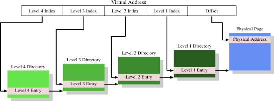
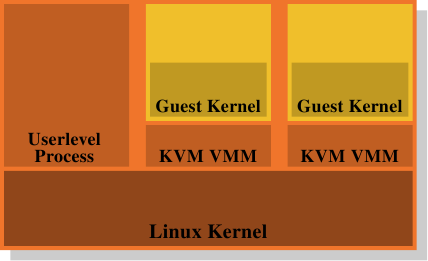

# 4. 虚拟内存

一个处理器的虚拟内存(virtual memory,VM)子系统实现了提供给每个进程的虚拟地址空间.这令每个进程都认为它是独自在系统中的.虚拟内存的优点清单会在其它地方仔细地描述,所以这里就不重复这些了.这一节会聚焦在虚拟内存子系统的实际的实现细节,以及与此相关的成本.

虚拟地址空间是由CPU 的内存(Memory Management Unit,MMU)实现的.OS 必须填写分页表(page table)数据结构,但大多数CPU 会自行做掉剩下的工作.这真的是个非常复杂的机制;理解它的最佳方式是引入使用的数据结构来描述虚拟地址空间.

由MMU 实行的地址翻译的输入为一个虚拟地址.它的值通常有极少量––如果有的话––的限制.在32 位系统上的虚拟地址为32 位的值,而在64 位系统上为64 位的值.在某些系统上,像是x86 与x86-64,使用的地址实际上牵涉到另一层级的间接性:这些架构使用了分段(segment),其只不过是将偏移量加到每个逻辑地址上.我们可以忽略地址产生过程的这个部分,它很琐碎,而且就内存管理的性能而言,不是程序员必须要关心的东西.[^24]

## 4.1. 最简单的地址翻译

有趣的部分是虚拟地址到物理地址的翻译.MMU 能够逐个分页重新映射地址.就如同定址缓存行的时候一样,虚拟地址会被切成多个部分.这些部分用来索引多个用以建构最终物理地址的表.以最简单的模型而言,我们仅有一个层级的表.


图4.1 显示了到底是怎么使用虚拟地址的不同部分的.开头的部分用以选择一个分页目录(Page Directory)中的一个项;在这个目录中的每个项都能由OS 个别设定.分页目录项决定了一个物理内存分页的地址;在分页目录中,能够有多于一个指到相同物理地址的项.记忆单元的完整物理地址是由分页目录的分页地址,结合虚拟地址的低位所决定的.分页目录项也包含一些像是存取权限这类关于分页的额外资讯.

分页目录的数据结构储存于主存中.OS 必须分配连续的物理内存,并将这个内存区域的基底地址(base address)储存在一个特殊的寄存器中.虚拟内存中适当的位量接着会被用作一个分页目录的索引––它实际上是一个目录项的数组.

作为一个实际的例子,以下是在x86 机器上的4MB 分页所使用的布局.虚拟内存的偏移量部分的大小为22 位,足以定址一个4MB 分页中的每个字节.虚拟内存剩余的10 位选择了分页目录里1024 个项中的其中一个.每个项包含一个4MB 分页的一个10 位的基底地址,其会与偏移量结合以构成完整的32 位地址.

## 4.2. 多层级分页表

4MB 的分页并非常态,它们会浪费很多的内存,因为OS 必须执行的许多操作都需要与内存分页对齐(align).以4kB 分页而言(32 位机器,甚至经常是64 位机器上的常态),虚拟地址的偏移量部分的大小仅有12 位.这留了20 位作为分页目录的选择器.一个有着2^20个项的表是不切实际的.即使每个项只会有4 字节,表大小也会有4MB.由于每个进程都可能拥有它自己独有的分页目录,这些分页目录会占据系统中大量的物理内存.

解决方法是使用多个层级的分页表.层次于是形成一个巨大,稀疏的分页目录;没有真的用到的地址空间范围不需要被分配的内存.这种表示法因而紧密得多了,使得内存中能够拥有许多进程的分页表,而不会太过于影响性能.



现今最复杂的分页表结构由四个层级所构成.图4.2 显示了这种实现的示意图.虚拟内存––在这个例子中––被切成至少五个部分.其中四个部分为不同目录的索引.第四层目录被CPU 中一种特殊用途的寄存器所指向.第二层到第四层目录的内容为指向更低层级目录的参考.若是一个目录项被标记为空,它显然不需要指到任何更低层的目录.如此一来,分页表树便能够稀疏且紧密.第一层目录的项为––就像在图4.1 一样––部分的物理地址,加上像存取权限这类辅助数据.

要确定对应到一个虚拟地址的物理地址,处理器首先会确定最高层目录的地址.这个地址通常储存在一个寄存器中.CPU 接着取出对应到这个目录的虚拟内存的索引部分,并使用这个索引来挑选合适的项.这个项是下一个目录的地址,使用虚拟地址的下一个部分来索引.这个过程持续到抵达第一层目录,这时目录项的值为物理地址的高位部分.加上来自虚拟内存的分页偏移位便组成了完整的物理地址.这个过程被称为分页树走访(page tree walking).有些处理器(像是x86 与x86-64)会在硬件中执行这个操作,其它的则需要来自OS 的协助.

每个在系统中执行的进程会需要它自己的分页表树.部分地共享树是可能的,但不如说这是个例外状况.因此,如果分页表树所需的内存尽可能地小的话,对性能与延展性而言都是有益的.理想的情况是将用到的内存彼此靠近地摆在虚拟地址空间中;实际用到的物理地址则无关紧要.对一个小程序而言,仅仅使用在第二,三,四层各自的一个目录,以及少许第一层目录,可能还过得去.在有着4kB 分页以及每目录512 个项的x86-64 上,这能够以总计4 个目录(每层一个)来定址2MB.1GB 的连续内存能够以一个第二到第四层目录,以及512 个第一层目录来定址.

不过,假设能够连续地分配所有内存也太过于简化了.为了弹性起见,一个进程的栈(stack)与堆(heap)区域––在大多情况下––会被分配在地址空间中极为相对的两端.这令两个区域在需要时都能尽可能地增长.这表示,最有可能是两个需要的第二层目录,以及与此相应的,更多低层级的目录.

但即使如此也不总是符合当前的实际状况.为了安全考量,一个可执进程序的多个部分(代码,数据,堆,栈,动态共享对象[Dynamic Shared Object,DSO],又称共享函式库[shared library])会被映射在随机化的地址上[9].随机化扩大了不同部分的相对位置;这暗示着,在一个进程里使用中的不同内存区域会广泛地散布在虚拟地址空间中.由在随机化的地址的位数上施加一些限制也能够限制范围,但这无疑––在大多情况下––会让一个进程无法以仅仅一或两个第二与第三层目录来执行.

若是性能比起安全性真的重要太多了,也能够把随机化关闭.于是OS 通常至少会在虚拟内存中连续地载入所有的DSO.

## 4.3. 优化分页表存取

分页表的所有数据结构都会被保存在主存中;OS 就是在这里建构并更新表的.在一个进程的创建,或是分页表的一次修改之后,都会立即通知CPU.分页表是用以将每个虚拟地址,使用上述的分页表走访来转成物理地址.更准确地说:每一层至少会有一个目录会被用在转换一个虚拟地址的过程中.这需要高达四次内存存取(以执行中进程的一个单一存取而言),这很慢.将这些目录表的项视为普通的数据,并在L1d,L2,等等缓存它们是办得到的,但这可能还是太慢了.

从最早期的虚拟内存开始,CPU 设计者便已采用了一种不同的优化.一个简单的计算能够显示,仅将目录表的项保存在L1d 以及更高层级的缓存中会招致可怕的性能.每个独立的地址计算会需要相符于分页表深度的若干L1d 存取.这些存取无法并行化,因为它们都依赖于前一次查询的结果.单是这样就会––在一台有着四个分页表层次的机器上––需要至少12 个周期.再加上L1d 不命中的机率,结果是指令管道无法隐藏任何东西.额外的L1d 存取也需要将宝贵的带宽偷到缓存去.

所以,不只是将目录表的项缓存起来,而是连物理分页地址的完整计算结果也会被缓存.跟代码与数据缓存行得通的理由相同,这种缓存的地址计算结果是很有效的.由于虚拟地址的分页偏移量的部分不会参与到物理分页地址的计算,仅有虚拟地址的剩余部分会用来作为缓存的标签.视分页大小而定,这代表数百或数千条的指令或数据对象会共享相同的标签,因而共享相同的物理地址前缀(prefix).

储存计算得来的值的缓存被称为转换检测缓冲区(Translation Look-Aside Buffer,TLB).它通常是个很小的缓存,因为它必须非常快.现代的CPU 提供了多层TLB 缓存,就如同其他缓存一样;更高层的缓存更大也更慢.L1TLB 的小容量通常由令缓存为全关联式,加上LRU 逐出策略来弥补.近来,这种缓存的大小已经持续成长,并且––在进行中––被转变为集合关联式.因此,当一个新的项必须被加入时,被逐出并取代的项可能不是最旧的一个.

如同上面所注记的,用来存取TLB 的标签为虚拟地址的一部分.若是在缓存中有比对到标签,最终的物理地址就能够由将来自虚拟地址的分页偏移量加到被缓存的值上而计算出来.这是个非常快的过程;它必须如此,因为物理地址必须可用于每条使用独立地址的指令,以及––在某些情况下––使用物理地址作为键值(key)的L2 查询.若是TLB 查询没有命中,处理器必须要进行一次分页表走访;这可能是非常昂贵的.

透过软件或硬件预取代码或数据时,若是地址在另一个分页上,能够暗自预取TLB 的项.这对于硬件预取而言是不可能的,因为硬件可能会引发无效的分页表走访.程序员因而无法仰赖硬件预取来预取TLB 项.必须明确地使用预取指令来达成.TLB––就像是数据与指令缓存––能够出现在多个层级.就如同数据缓存一样,TLB 通常有两种:指令TLB(ITLB)以及数据TLB(DTLB).像是L2TLB 这种更高层级的TLB 通常是统一式的,与其它缓存的情况相同.

### 4.3.1. 使用TLB 的说明

TLB 是个处理器核心的全局(global)资源.所有执行在处理器核心的线程与进程都使用相同的TLB.由于虚拟到物理地址的翻译是看设置的是哪一个分页表树而定的,因此若是分页表被更改了,CPU 就不能盲目地重复使用缓存的项.每个进程有个不同的分页表树(但同个进程中的线程并非如此).假如有的话,系统内核与VMM(虚拟机器监视器)亦是如此.一个进程的地址空间布局也是可能改变的.有两种处理这个问题的方式:

* 每当分页表树被更改都刷新TLB.
* 扩展TLB 项的标签,以额外且唯一地识别它们所指向到的分页表树.

在第一种情况中,每当上下文切换(context switch)都会刷新TLB.由于––在大多OS 中––从一个线程／进程切换到另一个时,需要执行一些系统内核的代码,TLB 刷新会被限制在离开(有时候是进入)系统内核地址空间时.在虚拟化的系统上,当系统内核必须调用VMM,并在返回的途中时,这也会发生.若是系统内核和／或VMM 不必使用虚拟地址,或是能够重复使用与发出系统／VMM 调用的进程或系统内核相同的虚拟地址(即,地址空间被重叠了),TLB 只须在– –离开系统内核或VMM 后––处理器恢复一个不同的进程或系统内核的执行时刷新.

刷新TLB 有效但昂贵.举例来说,在执行一个系统调用时,系统内核程序可能会被限制在数千行触及––或许––少数的新分页(或者一个大分页,如同在某些架构上的Linux 的情况)的指令.这个操作仅会取代与被触及的分页一样多的TLB 项.以Intel 的Core2 架构,附加它的128 ITLB 与256 DTLB 的项而言,一次完整的刷新可能意味着被不必要地刷新的项(分别)会超过100 与200 个.当系统调用返回(return)到相同的进程时,所有那些被刷新的TLB 项都能够被再次用到,但它们将会被丢掉.对于在系统内核或VMM 中经常用到的代码亦是如此.尽管系统内核以及VMM 的分页表通常不会改变,因此TLB 项––理论上––能够被保存相当长的一段时间,但在每次进入系统内核时,TLB 也必须从零开始填入.这也解释了为何现今处理器中的TLB 缓存并没有更大的原因:程序的执行时间非常可能不会长到足以填入这所有的项.

这个事实––当然––不会逃出CPU 架构师的掌心.优化缓存刷新的一个可能性是,单独令TLB 项失效.举例来说,若是系统内核与数据落在一个特殊的地址范围,那么仅有落在这个地址范围的分页必须从TLB 逐出.这只需要比对标签,因而不怎么昂贵.这个方法在地址空间的一部分––例如,透过一次`munmap` 调用––被更改的情况下也是有用的.

一个好得多的解法是扩展用来TLB 存取的标签.若是––除了虚拟地址的部分以外––为每个分页表树(即,一个进程的地址空间)加上一个唯一的识别子(identifier),TLB 根本就不必完全刷新.系统内核,VMM,以及独立的进程全都能够拥有唯一的识别子.采用这个方案的唯一议题是,可用于TLB 标签的位数量会被严重地限制,而地址空间的数量则否.这表示是有必要重复使用某些识别子的.当这种情况发生时,TLB 必须被部分刷新(如果可能的话).所有带着被重复使用的识别子的项都必须被刷新,但这––但愿如此––是个非常小的集合.

当多个进程执行在系统中时,这种扩展的TLB 标记在虚拟化的范围之外是有优势的.假如每个可执行进程的内存使用(是故TLB 项的使用)受限了,有个好机会是,当一个进程再次被调度时,它最近使用的TLB 项仍然在TLB 中.但还有两个额外的优点:

1. 特殊的地址空间––像是那些被系统内核或VMM 所用到的––通常只会被进入一段很短的时间;后续的控制经常是返回到启动这次进入的地址空间.没有标签的话,便会执行一或两次TLB 刷新.有标签的话,调用地址空间的缓存翻译会被保留,而且––由于系统内核与VMM 地址空间根本不常更改TLB 项––来自前一次系统调用的翻译等仍然可以被使用.
2. 当在两条相同进程的线程之间切换时,根本不需要TLB 刷新.不过,没有扩展的TLB 标签的话,进入系统内核就会销毁第一条线程的项.

某些处理器已经––一段时间了––实现了这些扩展标签.AMD 以Pacifica 虚拟化扩展引入了一种1 位的标签扩展.这个1 位地址空间ID(Address Space ID,ASID)是––在虚拟化的上下文中––用以从客户域(guest domain)的地址空间区别出VMM 的地址空间.这使得OS 得以避免在每次进入VMM(举例来说,处理一个分页错误[page fault])时刷新客户端的TLB 项,或者在返回客户端时刷新VMM 的TLB 项.这个架构未来将会允许使用更多的位.其它主流处理器可能也会遵循这套方法并支持这个功能.

### 4.3.2. 影响TLB 性能

有几个影响TLB 性能的因素.第一个是分页的大小.显然地,分页越大,会被塞进去的指令或数据对象也越多.所以一个比较大的缓存大小减少了所需地址翻译的整体数量,代表TLB 缓存中需要更少的项.大部分架构现今允许使用多种不同的分页大小;有些大小能够并存地使用.举例来说,x86／x86-64 处理器拥有寻常的4kB 分页大小,但它们也分别能够使用4MB 与2MB 的分页.IA-64 与PowerPC 允许像是64kB 的大小作为基础分页大小.

不过,大分页尺寸的使用也随之带来了一些问题.为了大分页而使用的内存区域在物理内存中必须是连续的.若是物理内存管理的单位大小被提高到虚拟内存分页的大小,浪费的内存总量就会增加.各种内存操作(像是载入可执进程序)需要对齐到分页边界.这表示,平均而言,在每次映射的物理内存中,每次映射浪费了一半的分页大小.这种浪费能够轻易地累加;这因此对物理内存分配的合理单位大小加了个上限.

将单位大小提升到2MB,以容纳x86-64 上的大分页无疑并不实际.这个大小太大了.但这又意味着每个大分页必须由多个较小的分页所构成.而且这些小分页在*物理*内存中必须是连续的.以4kB 的单位分页大小分配2MB 的连续物理内存具有挑战性.这需要寻找一个有着512 个连续分页的空闲区域.在系统执行一段时间,并且物理内存变得片段之后,这可能极端困难(或者不可能).

因此在Linux 上,有必要在系统启动的时候使用特殊的`hugetlbfs` 文件系统来分配这些大分页.一个固定数量的物理分页会被保留来专门作为大虚拟分页来使用.这绑住了可能不会一直用到的资源.这也是个有限的池(pool);增加它通常代表着重新启动系统.尽管如此,在性能贵重,资源充足,且麻烦的设置不是个大阻碍的情况下,庞大的分页便为大势所趋.数据库服务器就是个例子.

```shell

$ eu-readelf -l /bin/ls
Program Headers:
  Type Offset VirtAddr PhysAddr FileSiz MemSiz Flg Align
...
  LOAD 0x000000 0x0000000000400000 0x0000000000400000 0x0132ac 0x0132ac RE 0x200000
  LOAD 0x0132b0 0x00000000006132b0 0x00000000006132b0 0x001a71 0x001a71 RW 0x200000
...

```

提高最小的虚拟分页大小(对比于可选的大分页)也有它的问题.内存映射操作(例如,载入应用程序)必须遵循这些分页大小.不可能有更小的映射.一个可执进程序不同部分的位置––对大多架构而言––有个固定的关系.若是分页大小增加到超过在可执进程序或者DSO 创建时所考虑的大小时,就无法执行载入操作.将这个限制记在心上是很重要的.图4.3 显示了能够如何决定一个ELF 二进制数据(binary)的对齐需求的.它被编码在ELF 的程序标头(header).在这个例子中,一个x86-64 的二进制数据,值为 0x200000 = 2,097,152 = 2MB,与处理器所支持的最大分页大小相符.

使用较大的分页大小有个次要的影响:分页表树的层级数量会被减低.由于对应到分页偏移量的虚拟地址部分增加了,就没有剩下那么多需要透过分页目录处理的位了.这表示,在一次TLB 不命中的情况下,必须完成的工作总量减少了.

除了使用大分页尺寸外,也可能由将同时用到的数据搬移到较少的分页上,以减少所需的TLB 项数量.这类似于我们先前讨论的针对缓存使用的一些优化.
Only now the alignment required is large.
考虑到TLB 项的数量非常少,这会是个重要的优化.

## 4.4. 虚拟化的影响

OS 镜像(image)的虚拟化会变得越来越流行;这表示内存管理的另一层会被加到整体中.进程(基本上为监狱[jail])或OS 容器(container)的虚拟化并不属于这个范畴,因为只有一个OS 会牵涉其中.像Xen 或KVM 这类技术能够––无论有没有来自处理器的协助––执行独立OS 镜像.在这些情况下,只有一个直接控制物理内存存取的软件.


在Xen 的情况下(见图4.4),Xen VMM 即是这个软件.不过VMM 本身并不实现太多其它的硬件控制.不若在其它较早期的系统(以及首次释出的Xen VMM)上的VMM,除了内存与处理器之外的硬件是由具有特权的Dom0 域所控制的.目前,这基本上是与没有特权的DomU 系统内核相同的系统内核,而且––就所关心的内存管理而言––它们没什么区别.重要的是,VMM 将物理内存分发给了Dom0 与DomU 系统内核,其因而实现了普通的内存管理,就好像它们是直接执行在一个处理器上一样.

为了实现完成虚拟化所需的域的分离,Dom0 与DomU 系统内核中的内存处理并不具有无限制的物理内存存取.VMM 不是由分发独立的物理分页,并让客户端OS 处理定址的方式来分发内存;这不会提供任何针对有缺陷或者流氓客户域的防范.取而代之地,VMM 会为每个客户域建立它自己拥有的分页表树,并使用这些数据结构来分发内存.好处是能够控制对分页表树的管理资讯的存取.若是程序没有合适的权限,它就什么也无法做.

这种存取控制被利用在Xen 提供的虚拟化之中,无论使用的是半虚拟化(paravirtualization)或是硬件虚拟化(亦称全虚拟化).客户域采用了有意与半虚拟化以及硬件虚拟化十分相似的方式,为每个进程建立了它们的分页表树.无论客户端OS 在何时修改了它的分页表,都会调用VMM.VMM 于是使用在客户域中更新的资讯来更新它自己拥有的影子分页表.这些是实际被硬件用到的分页表.显然地,这个过程相当昂贵:分页表树每次修改都需要一次VMM 的调用.在没有虚拟化的情况下对内存映射的更动并不便宜,而它们现在甚至变得更昂贵了.

考虑到从客户端OS 到VMM 的更改并返回,它们本身已经非常昂贵,额外的成本可能非常大.这即是为何处理器开始拥有额外的功能,以避免影子分页表的建立.这很好,不仅因为速度的关系,它也减少了VMM 的内存消耗.Intel 有扩展分页表(Extended Page Table,EPT),而AMD 称它为巢状分页表(Nested Page Table,NPT).基本上这两个技术都拥有客户端OS 从「客户虚拟地址(guest virtual address)」产生「宿主虚拟地址(host virtual address)」的分页表.宿主虚拟地址接着必须被进一步––使用每个域的EPT／NPT 树––翻译成真正的物理地址.这会令内存处理以几乎是非虚拟化情况的速度来进行,因为大多数内存管理的VMM 项​​目都被移除了.它也减少了VMM 的内存使用,因为现在每个域(对比于进程)都仅有一个必须要维护的分页.

这个额外的地址翻译步骤的结果也会储存在TLB 中.这表示TLB 不会储存虚拟的物理地址,而是查询的完整结果.已经解释过AMD 的Pacifica 扩展引入了ASID 以避免在每个项上的TLB 刷新.ASID 的位数量在最初释出的处理器扩展中只有一位;这足以区隔VMM 与客户端OS 了.Intel 拥有用于相同目的的虚拟处理器ID(virtual processor ID,VPID),只不过有更多的位数.但是对于每个客户域而言,VPID 都是固定的,因此它无法被用来标记个别的进程,也不能在这个层级避免TLB 刷新.

每次地址空间修改所需的工作量是有着虚拟化OS 的一个问题.不过,基于VMM 的虚拟化还有另一个固有的问题:没有办法拥有两层内存处理.但是内存处理很难(尤其在将像NUMA 这类难题纳入考虑的时候,见第五节).Xen 使用一个分离VMM 的方式使得优化的(甚至是好的)处理变得困难,因为所有的内存管理实现的难题––包含像内存区域的探寻这类「琐碎」事––都必须在VMM 中重复.OS 拥有成熟且优化的实现;真的应该避免重复这些事.



这即是为何废除VMM／Dom0 模型是个如此有吸引力的替代方案.图4.5 显示了KVM Linux 系统内核扩展是如何试着解决这个问题的.没有直接执行在硬件上,并控制所有客户的分离VMM;而是一个普通的Linux 系统内核接管了这个功能.这表示在Linux 系统内核上完整且精密的内存处理功能被用来管理系统中的内存.客户域与被创造者称为「客户模式(guest mode)」的普通的用户层级进程一同执行.虚拟化功能––半虚拟化或全虚拟化––是由KVM VMM 所控制.这只不过是另一个用户层级的进程,使用系统内核实现的特殊KVM 设备来控制一个客户域.

这个模型相较于Xen 模型的分离VMM 的优点是,即使在使用客户端OS 时仍然有两个运作的内存处理者,但只需要唯一一种在Linux 系统内核中的实现.没有必要像Xen VMM 一样在另一段代码中重复相同的功能.这导致更少的工作,更少的臭虫,以及––也许––更少两个内存管理者接触的摩擦,因为在一个Linux 客户端中的内存管理者会与外部在裸机上执行的Linux 系统内核的内存管理者做出相同的假设.

总而言之,程序员必须意识到,采用虚拟化的时候,缓存不命中(指令,数据,或TLB)的成本甚至比起没有虚拟化还要高.任何减少这些工作的优化,在虚拟化的环境中甚至会获得更多的回报.处理器设计者将会––随着时间的推移––透过像是EPT 与NPT 这类技术来逐渐减少这个差距,但它永远也不会完全消失.

## 注释

### 24

[^24]: x86 上的分段限制是关于性能的,但这又是另一个故事了.