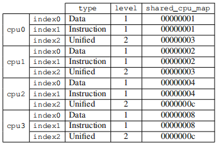
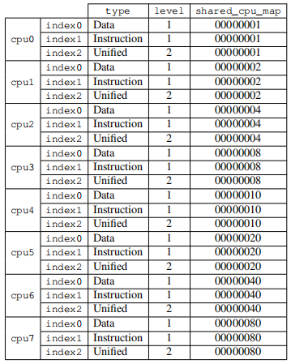
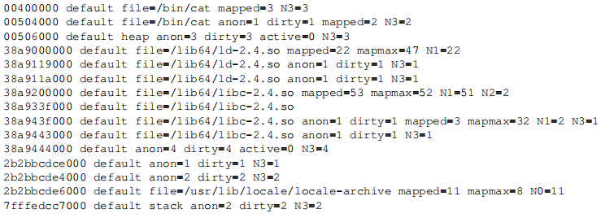

# 5. NUMA Support NUMA支持

In Section 2 we saw that, on some machines, the cost of access to specific regions of physical memory differs depending on where the access originated. This type of hardware requires special care from the OS and the applications. We will start with a few details of NUMA hardware, then we will cover some of the support the Linux kernel provides for NUMA.

在第二节我们看过,在某些机器上,存取物理内存特殊区域的成本差异是视存取的源头而定的.这种类型的硬件需要来自OS 以及应用程序的特殊照顾.我们会以NUMA 硬件的一些细节开头,接着我们会涵盖Linux 系统内核为NUMA 提供的一些支持.

## 5.1. NUMA 硬件

Non-uniform memory architectures are becoming more and more common. In the simplest form of NUMA, a processor can have local memory (see Figure 2.3) which is cheaper to access than memory local to other processors. The difference in cost for this type of NUMA system is not high, i.e., the NUMA factor is low.

非均匀内存架构正变得越来越普遍.在最简单的NUMA 类型中,一个处理器能够拥有本地内存(见图2.3),存取它比存取其它处理器的本地内存还便宜.对这种类型的NUMA 系统而言,成本差异并不大,即,NUMA 因子很小.

NUMA is also—and especially—used in big machines. We have described the problems of having many processors access the same memory. For commodity hardware all processors would share the same Northbridge (ignoring the AMD Opteron NUMA nodes for now, they have their own problems). This makes the Northbridge a severe bottleneck since all memory traffic is routed through it. Big machines can, of course, use custom hardware in place of the Northbridge but, unless the memory chips used have multiple ports—i.e. they can be used from multiple busses—there still is a bottleneck. Multiport RAM is complicated and expensive to build and support and, therefore, it is hardly ever used.

NUMA 也会,而且尤其会,用在大机器中.我们已经描述过拥有多个存取相同内存的处理器的问题.对商用硬件而言,所有处理器都会共享相同的北桥(此刻忽略AMD Opteron NUMA 节点,它们有它们自己的问题).这使得北桥成为一个严重的瓶颈,因为所有内存流量都会经过它.当然,大机器能够使用客制的硬件来代替北桥,但除非使用的内存芯片拥有多个端口,即,它们能够从多条总线使用,不然依旧有个瓶颈在.多端口RAM 很复杂,而且建立与支持起来很昂贵,因此几乎不会被使用.

The next step up in complexity is the model AMD uses where an interconnect mechanism (Hypertransport in AMD's case, technology they licensed from Digital) provides access for processors which are not directly connected to the RAM. The size of the structures which can be formed this way is limited unless one wants to increase the diameter (i.e., the maximum distance between any two nodes) arbitrarily.

下一个复杂度上的改进为AMD 使用的模型,其中的互连机制(在AMD 情况下为超传输〔Hyper Transport〕,是它们由Digital 授权而来的技术)为没有直接连接到RAM 的处理器提供了存取.能够以这种方式组成的结构大小是有限的,除非你想要任意地增加直径(diameter)(即,任意两节点之间的最大距离).

An efficient topology for the nodes is the hypercube, which limits the number of nodes to 2^C where C is the number of interconnect interfaces each node has. Hypercubes have the smallest diameter for all systems with 2^n CPUs. Figure 5.1 shows the first three hypercubes. Each hypercube has a diameter of C which is the absolute minimum. AMD's first-generation Opteron processors have three hypertransport links per processor. At least one of the processors has to have a Southbridge attached to one link, meaning, currently, that a hypercube with C=2 can be implemented directly and efficiently. The next generation is announced to have four links, at which point C=3 hypercubes will be possible.

一种连接节点的有效拓扑(topology)为超立方体(hypercube),其将节点的数量限制在2^C,其中C 为每个节点拥有的交互连接接口的数量.以所有有着2^n 个CPU 与n 条交互连接的系统而言,超立方体拥有最小的直径.图5.1 显示了前三种超立方体.每个超立方体拥有绝对最小(the absolute minimum)的直径 C .AMD 第一世代的Opteron 处理器,每个处理器拥有三条超传输连结.至少有一个处理器必须有个附属在一条连结上的南桥,代表,目前而言,一个 C = 2  的超立方体能够直接且有效率地实现.下个世代将在某个时间点拥有四条连结,届时将可能有 C = 3  的超立方体.

This does not mean, though, that larger accumulations of processors cannot be supported. There are companies which have developed crossbars allowing larger sets of processors to be used (e.g., Newisys's Horus). But these crossbars increase the NUMA factor and they stop being effective at a certain number of processors.

不过,这不代表无法支持更大的处理器集合体(accumulation).有些公司已经开发出能够使用更大的处理器集合的crossbar(例如,Newisys 的Horus).但这些crossbar 提高了NUMA 因子,而且在一定数量的处理器上便不再有效.

The next step up means connecting groups of CPUs and implementing a shared memory for all of them. All such systems need specialized hardware and are by no means commodity systems. Such designs exist at several levels of complexity. A system which is still quite close to a commodity machine is IBM x445 and similar machines. They can be bought as ordinary 4U, 8-way machines with x86 and x86-64 processors. Two (at some point up to four) of these machines can then be connected to work as a single machine with shared memory. The interconnect used introduces a significant NUMA factor which the OS, as well as applications, must take into account.

下一个改进为连接CPU 的群组,并为它们全体实现一个共享的内存.所有这类系统都需要特制化的硬件,绝不是商用系统.
Such designs exist at several levels of complexity.
一个仍然十分接近于商用机器的系统为IBM x445 以及类似的机器.它们能够当作有着x86 与x86-64 的普通4U,8 路机器购买.两台(某些时候高达四台)这种机器就能够被连接起来运作,如同一台有着共享内存的机器.使用的交互连接引入了一个OS,以及应用程序,必须纳入考量的重要的NUMA 因子.

At the other end of the spectrum, machines like SGI's Altix are designed specifically to be interconnected. SGI's NUMAlink interconnect fabric is very fast and has a low latency; both of these are requirements for high-performance computing (HPC), especially when Message Passing Interfaces (MPI) are used. The drawback is, of course, that such sophistication and specialization is very expensive. They make a reasonably low NUMA factor possible but with the number of CPUs these machines can have (several thousands) and the limited capacity of the interconnects, the NUMA factor is actually dynamic and can reach unacceptable levels depending on the workload.

在光谱的另一端,像SGI 的Altix 这样的机器是专门被设计来互连的.SGI 的NUMAlink 互连结构非常地快,同时拥有很短的等待时间；两个特性对于高性能计算(high-performance computing,HPC)都是必要条件,尤其是在使用消息传递接口(Message Passing Interface, MPI)的时候.当然,缺点是,这种精密与特制化是非常昂贵的.它们令合理地低的NUMA 因子成为可能,但以这些机器能拥有的CPU 数量(几千个)以及有限的互连能力,NUMA 因子实际上是动态的,而且可能因工作负载而达到不可接受的程度.

More commonly used are solutions where clusters of commodity machines are connected using high-speed networking. But these are not NUMA machines; they do not implement a shared address space and therefore do not fall into any category which is discussed here.

更常使用的解决方法是,使用高速网络将许多商用机器连接起来,组成一个集群(cluster).不过,这些并非NUMA 机器；它们没有实现共享的地址空间,因此不会归于这里讨论的任何一个范畴中.

## 5.2. OS 对NUMA 的支持

To support NUMA machines, the OS has to take the distributed nature of the memory into account. For instance, if a process is run on a given processor, the physical RAM assigned to the process's address space should come from local memory. Otherwise each instruction has to access remote memory for code and data. There are special cases to be taken into account which are only present in NUMA machines. The text segment of DSOs is normally present exactly once in a machine's physical RAM. But if the DSO is used by processes and threads on all CPUs (for instance, the basic runtime libraries like libc) this means that all but a few processors have to have remote accesses. The OS ideally would “mirror” such DSOs into each processor's physical RAM and use local copies. This is an optimization, not a requirement, and generally hard to implement. It might not be supported or only in a limited fashion.

为了支持NUMA 机器,OS 必须将内存分散式的性质纳入考量.举例来说,若是一个进程执行在一个给定的处理器上,被指派给进程地址空间的物理RAM 理想上应该要来自本地内存.否则每条指令都必须为了代码与数据去存取远程的内存.有些仅存于NUMA 机器的特殊情况要被考虑进去.DSO 的文字区段(text segment)在一台机器的物理RAM 中通常正好出现一次.但若是DSO 被所有CPU 上的进程与线程用到(例如,像`libc` 这类基本的执行期函式库),这表示并非一些,而是全部的处理器都必须拥有远程的地址.OS 理想上会将这种DSO「映像(mirror)」到每个处理器的物理RAM 中,并使用本地的副本.这并非一种最佳化,而是个必要条件,而且通常难以实现.它可能没有被支持,或者仅以有限的形式支持.

To avoid making the situation worse, the OS should not migrate a process or thread from one node to another. The OS should already try to avoid migrating processes on normal multi-processor machines because migrating from one processor to another means the cache content is lost. If load distribution requires migrating a process or thread off of a processor, the OS can usually pick an arbitrary new processor which has sufficient capacity left. In NUMA environments the selection of the new processor is a bit more limited. The newly selected processor should not have higher access costs to the memory the process is using than the old processor; this restricts the list of targets. If there is no free processor matching that criteria available, the OS has no choice but to migrate to a processor where memory access is more expensive.

为了避免情况变得更糟,OS 不该将一个进程或线程从一个节点迁移到另一个.OS 应该已经试着避免在一般的多处理器机器上迁移进程,因为从一个处理器迁移到另一个处理器意味着缓存内容遗失了.若是负载分配需要将一个进程或线程迁出一个处理器,OS 通常能够挑选任一个拥有足够剩余容量的新处理器.在NUMA 环境中,新处理器的选择受到了稍微多一些的限制.对于进程正在使用的内存,新选择的处理器不该有比旧的处理器还高的存取成本；这限制了目标的清单.若是没有符合可用标准的空闲处理器,OS 除了迁移到内存存取更为昂贵的处理器以外别无他选.

In this situation there are two possible ways forward. First, one can hope the situation is temporary and the process can be migrated back to a better-suited processor. Alternatively, the OS can also migrate the process's memory to physical pages which are closer to the newly-used processor. This is quite an expensive operation. Possibly huge amounts of memory have to be copied, albeit not necessarily in one step. While this is happening the process, at least briefly, has to be stopped so that modifications to the old pages are correctly migrated. There are a whole list of other requirements for page migration to be efficient and fast. In short, the OS should avoid it unless it is really necessary.

在这种情况下,有两种可能的方法.首先,可以期盼这种情况是暂时的,而且进程能够被迁回到一个更合适的处理器上.或者,OS 也能够将进程的内存迁移到更靠近新使用的处理器的物理分页上.这是个相当昂贵的操作.可能得要复制大量的内存,尽管不必在一个步骤中完成.当发生这种情况的时候,进程必须,至少短暂地,中止,以正确地迁移对旧分页的修改.有了让分页迁移有效又快速,有整整一串其它的必要条件.简而言之,OS 应该避免它,除非它是真的有必要的.

Generally, it cannot be assumed that all processes on a NUMA machine use the same amount of memory such that, with the distribution of processes across the processors, memory usage is also equally distributed. In fact, unless the applications running on the machines are very specific (common in the HPC world, but not outside) the memory use will be very unequal. Some applications will use vast amounts of memory, others hardly any. This will, sooner or later, lead to problems if memory is always allocated local to the processor where the request is originated. The system will eventually run out of memory local to nodes running large processes.

一般来说,不能够假设在一台NUMA 机器上的所有进程都使用等量的内存,使得,由于遍及各个处理器的进程的分布,内存的使用也会被均等地分配.事实上,除非执行在机器上的应用程序非常特殊(在HPC 世界中很常见,但除此之外则否),不然内存的使用是非常不均等的.某些应用程序会使用巨量的内存,其余的几乎不用.若总是分配产生请求的处理器本地的内存,这将会,或早或晚,造成问题.系统最终将会耗尽执行大进程的节点本地的内存.

In response to these severe problems, memory is, by default, not allocated exclusively on the local node. To utilize all the system's memory the default strategy is to stripe the memory. This guarantees equal use of all the memory of the system. As a side effect, it becomes possible to freely migrate processes between processors since, on average, the access cost to all the memory used does not change. For small NUMA factors, striping is acceptable but still not optimal (see data in Section 5.4).

为了应对这些严重的问题,内存,预设情况下,不会只分配给本地的节点.为了利用所有系统的内存,预设策略是条带化(stripe)内存.这保证了所有系统内存的同等使用.作为一个副作用,有可能变得能在处理器之间自由迁移进程,因为,平均而言,对于所有用到的内存的存取成本没有改变.由于很小的NUMA 因子,条带化是可以接受的,但仍不是最好的(见5.4 节的数据).

This is a pessimization which helps the system avoid severe problems and makes it more predictable under normal operation. But it does decrease overall system performance, in some situations significantly. This is why Linux allows the memory allocation rules to be selected by each process. A process can select a different strategy for itself and its children. We will introduce the interfaces which can be used for this in Section 6.

这是个帮助系统避免严重问题,并在普通操作下更为能够预测的劣化(pessimization).但它降低了整体的系统性能,在某些情况下尤为显著.这即是Linux 允许每个进程选择内存分配规则的原因.一个进程能够为它自己以及它的子进程选择不同的策略.我们将会在第六节介绍能用于此的接口.

## 5.3. 被发布的信息

The kernel publishes, through the sys pseudo file system (sysfs), information about the processor caches below

系统内核透过`sys` 虚拟文件系统(sysfs)将处理器缓存的信息发布在

`/sys/devices/system/cpu/cpu*/cache`

In Section 6.2.1 we will see interfaces which can be used to query the size of the various caches. What is important here is the topology of the caches. The directories above contain subdirectories (named index*) which list information about the various caches the CPU possesses. The files type, level, and shared_cpu_map are the important files in these directories as far as the topology is concerned. For an Intel Core 2 QX6700 the information looks as in Table 5.1.

在6.2.1 节,我们会看到能用来查询不同缓存大小的接口.这里重要的是缓存的拓朴.上面的目录包含了列出CPU 拥有的不同缓存信息的子目录(叫做`index*`).文件`type`,`level`,与`shared_cpu_map` 是在这些目录中与拓朴有关的重要文件.一个Intel Core 2 QX6700 的信息看起来就如表5.1.

What this data means is as follows:

这份数据的意义如下：

* Each core has three caches: L1i, L1d, L2.
* The L1d and L1i caches are not shared with anybody—each core has its own set of caches. This is indicated by the bitmap in shared_cpu_map having only one set bit.
* The L2 cache on cpu0 and cpu1 is shared, as is the L2 on cpu2 and cpu3.
* 每颗核心[[25]](#25)拥有三个缓存：L1i,L1d,L2.
* L1d 与L1i 缓存没有被任何其它的核心所共享,每颗核心有它自己的一组缓存.这是由`shared_cpu_map` 中的位图(bitmap)只有一个被设置的位所暗示的.
* `cpu0` 与`cpu1` 的L2 缓存是共享的,正如`cpu2` 与`cpu3` 上的L2 一样.

If the CPU had more cache levels, there would be more index* directories.

若是CPU 有更多缓存层次,也会有更多的`index*` 目录.

For a four-socket, dual-core Opteron machine the cache information looks like Table 5.2:

对于一个四插槽,双核的Opteron 机器,缓存信息看起来如表5.2.

As can be seen these processors also have three caches: L1i, L1d, L2. None of the cores shares any level of cache. The interesting part for this system is the processor topology. Without this additional information one cannot make sense of the cache data. The sys file system exposes this information in the files below

可以看出这些处理器也有三种缓存：L1i,L1d,L2.没有核心共享任何层次的缓存.这个系统有趣的部分在于处理器拓朴.少了这个额外信息,就无法理解缓存数据.`sys` 文件系统将这个信息摆在下面这个文件

`/sys/devices/system/cpu/cpu*/topology`

Table 5.3 shows the interesting files in this hierarchy for the SMP Opteron machine.

表5.3 显示了在SMP Opteron 机器的这个层次里头的令人感兴趣的文件.

Taking Table 5.2 and Table 5.3 together we can see that no CPU has hyper-threads (the thread_siblings bitmaps have one bit set), that the system in fact has four processors (physical_package_id 0 to 3), that each processor has two cores, and that none of the cores share any cache. This is exactly what corresponds to earlier Opterons.

将表5.2 与5.3 摆在一起,我们能够发现,这正好与较早期的Opteron 一致.

* 没有CPU 拥有超线程(`thethread_siblings` 位图有一个位被设置),
* 这个系统实际上共有四个处理器(`physical_package_id` 0 到3),
* 每个处理器有两颗核心,以及
* 没有核心共享任何缓存.

What is completely missing in the data provided so far is information about the nature of NUMA on this machine. Any SMP Opteron machine is a NUMA machine. For this data we have to look at yet another part of the sys file system which exists on NUMA machines, namely in the hierarchy below

目前为止提供的数据中完全缺少的是,有关这台机器上的NUMA 性质的信息.任何SMP Opteron 机器都是一台NUMA 机器.为了这份数据,我们必须看看在NUMA 机器上存在的`sys` 文件系统的另一个部分,即下面的层次中

`/sys/devices/system/node`

This directory contains a subdirectory for every NUMA node on the system. In the node-specific directories there are a number of files. The important files and their content for the Opteron machine described in the previous two tables are shown in Table 5.4.

这个目录包含在系统上的每个NUMA 节点的子目录.在特定节点的目录中有许多文件.在前两张表中描述的Opteron 机器的重要文件与它们的内容显示在表5.4.

This information ties all the rest together; now we have a complete picture of the architecture of the machine. We already know that the machine has four processors. Each processor constitutes its own node as can be seen by the bits set in the value in cpumap file in the node* directories. The distance files in those directories contains a set of values, one for each node, which represent a cost of memory accesses at the respective nodes. In this example all local memory accesses have the cost 10, all remote access to any other node has the cost 20.This means that, even though the processors are organized as a two-dimensional hypercube (see Figure 5.1), accesses between processors which are not directly connected is not more expensive. The relative values of the costs should be usable as an estimate of the actual difference of the access times. The accuracy of all this information is another question.

这个信息将所有的一切连系在一起；现在我们有个机器架构的完整轮廓了.我们已经知道机器拥有四个处理器.每个处理器构成它自己的节点,能够从`node*` 目录的`cpumap` 文件中的值里头设置的位看出来.在那些目录的`distance` 文件包含一组值,一个值代表一个节点,表示在各个节点上存取内存的成本.在这个例子中,所有本地内存存取的成本为10,所有对任何其它节点的远程存取的成本为20.[[26]](#26)这表示,即使处理器被组织成一个二维超立方体(见图5.1),在没有直接连接的处理器之间存取也没有比较贵.成本的相对值应该能用来作为存取时间的实际差距的估计.所有这些信息的准确性是另一个问题了.

## 5.4. 远程存取成本

The distance is relevant, though. In [[1]](F.bibliography.md#1) AMD documents the NUMA cost of a four socket machine. For write operations the numbers are shown in Figure 5.3.

不过,距离是有关系的.AMD 在[[参考资料1]](F.bibliography.md#1) 提供了一台四插槽机器的NUMA 成本的文件.写入操作的数据显示在图5.2.

Writes are slower than reads, this is no surprise. The interesting parts are the costs of the 1- and 2-hop cases. The two 1-hop cases actually have slightly different costs. See [amdccnuma] for the details. The fact we need to remember from this chart is that 2-hop reads and writes are 30% and 49% (respectively) slower than 0-hop reads. 2-hop writes are 32% slower than 0-hop writes, and 17% slower than 1-hop writes. The relative position of processor and memory nodes can make a big difference. The next generation of processors from AMD will feature four coherent HyperTransport links per processor. In that case a four socket machine would have diameter of one. With eight sockets the same problem returns, with a vengeance, since the diameter of a hypercube with eight nodes is three.

写入比读取还慢,这并不让人意外.有趣的部分在于1 与2 跳(1- and 2-hop)情况下的成本.两个1 跳的成本实际上有略微不同.细节见[[参考资料1]](F.bibliography.md#1). 2 跳读取与写入(分别)比0 跳读取慢了30% 与49%.2 跳写入比0 跳写入慢了32%,比1 跳写入慢了17%.处理器与内存节点的相对位置能够造成很大的差距.来自AMD 下个世代的处理器将会以每个处理器四条连贯的超传输连结为特色.在这个例子中,一台四插槽机器的直径会是一.但有八个插槽的话,同样的问题又,来势汹汹地,回来了,因为一个有着八个节点的超立方体的直径为三.

All this information is available but it is cumbersome to use. In Section 6.5 we will see an interface which helps accessing and using this information easier.

所有这些信息都能够取得,但用起来很麻烦.在6.5 节,我们会看到较容易存取与使用这个信息的接口.

The last piece of information the system provides is in the status of a process itself. It is possible to determine how the memory-mapped files, Copy-On-Write (COW) pages and anonymous memory are distributed over the nodes in the system. {Copy-On-Write is a method often used in OS implementations when a memory page has one user at first and then has to be copied to allow independent users. In many situations the copying is unnecessary, at all or at first, in which case it makes sense to only copy when either user modifies the memory. The operating system intercepts the write operation, duplicates the memory page, and then allows the write instruction to proceed.} Each process has a file /proc/PID/numa_maps, where PID is the ID of the process, as shown in Figure 5.2.

系统提供的最后一块信息就在进程自身的状态中.能够确定内存映射文件,写时复制(Copy-On-Write,COW)[[27]](#27)分页与匿名内存(anonymous memory)是如何散布在系统中的节点上的.系统内核为每个处理器提供一个虚拟文件(pseudo-file)/proc/PID/numa_maps,其中**PID** 为进程的ID ,如图5.3 所示.

The important information in the file is the values for N0 to N3, which indicate the number of pages allocated for the memory area on nodes 0 to 3. It is a good guess that the program was executed on a core on node 3. The program itself and the dirtied pages are allocated on that node. Read-only mappings, such as the first mapping for ld-2.4.so and libc-2.4.so as well as the shared file locale-archive are allocated on other nodes.

文件中的重要信息为`N0` 到`N3` 的值,它们表示为节点0 到3 上的内存区域分配的分页数量.一个可靠的猜测是,程序是执行在节点3 的一颗核心上.程序本身与被弄脏的分页被分配在这个节点上.只读映射,像是`ld-2.4.so` 与`libc-2.4.so` 的第一次映射,以及共享文件`locale-archive` 是被分配在其它节点上的.

As we have seen in Figure 5.3 the read performance across nodes falls by 9% and 30% respectively for 1- and 2-hop reads. For execution, such reads are needed and, if the L2 cache is missed, each cache line incurs these additional costs. All the costs measured for large workloads beyond the size of the cache would have to be increased by 9%/30% if the memory is remote to the processor.

如同我们已经在图5.2 看到的,当横跨节点操作时,1 与2 跳读取的性能分别掉了9% 与30%.对执行来说,这种读取是必须的,而且若是没有命中L2 缓存的话,每个缓存行都会招致这些额外成本.若是内存离处理器很远,对超过缓存大小的大工作负载而言,所有测量的成本都必须提高9%／30%.

To see the effects in the real world we can measure the bandwidth as in Section 3.5.1 but this time with the memory being on a remote node, one hop away. The result of this test when compared with the data for using local memory can be seen in Figure 5.4. The numbers have a few big spikes in both directions which are the result of a problem of measuring multi-threaded code and can be ignored. The important information in this graph is that read operations are always 20% slower. This is significantly slower than the 9% in Figure 5.3, which is, most likely, not a number for uninterrupted read/write operations and might refer to older processor revisions. Only AMD knows.

为了看到在现实世界的影响,我们能够像3.5.1 节一样测量带宽,但这次使用的是在远程,相距一跳的节点上的内存.这个测试相比于使用本地内存的数据的结果能在图5.4 中看到.数字在两个方向都有一些大起伏,这是一个测量多线程程序的问题所致,能够忽略.在这张图上的重要信息是,读取操作总是慢了20%.这明显慢于图5.2 中的9%,这极有可能不是连续读／写操作的数字,而且可能与较旧的处理器修订版本有关.只有AMD 知道了.

For working set sizes which fit into the caches, the performance of write and copy operations is also 20% slower. For working sets exceeding the size of the caches, the write performance is not measurably slower than the operation on the local node. The speed of the interconnect is fast enough to keep up with the memory. The dominating factor is the time spent waiting on the main memory.

以塞得进缓存的工作集大小而言,写入与复制操作的性能也慢了20%.当工作集大小超过缓存大小时,写入性能不再显著地慢于本地节点上的操作.互连的速度足以跟上内存的速度.主要因素是花费在等待主内存的时间.

## 注释

### 25

{The knowledge that cpu0 to cpu3 are cores comes from another place that will be explained shortly.}

`cpu0` 到`cpu3` 为核心的知识来自于另一个将会简短介绍的地方.

### 26

{This is, by the way, incorrect. The ACPI information is apparently wrong since, although the processors used have three coherent HyperTransport links, at least one processor must be connected to a Southbridge. At least one pair of nodes must therefore have a larger distance.}

顺带一提,这是不正确的.这个ACPI 信息明显是错的,因为,虽然用到的处理器拥有三条连贯的超传输连结,至少一个处理器必须被连接到一个南桥上.至少一对节点必须因此有比较大的距离.

### 27

当一个内存分页起初有个用户,然后必须被复制以允许独立的用户时,写时复制是一种经常在OS 实现用到的方法.在许多情境中,复制,起初或完全,是不必要的.在这种情况下,只在任何一个用户修改内存的时候复制是合理的.作业系统拦截写入操作,复制内存分页,然后允许写入指令继续执行.
