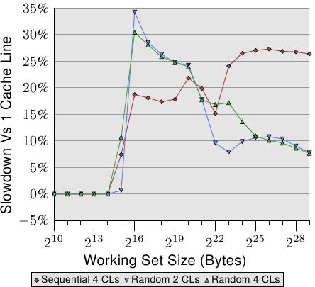
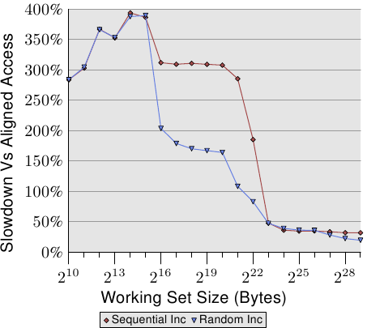
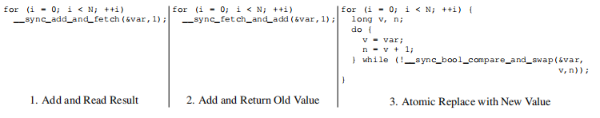

# 6. 程序员可以做什么

After the descriptions in the previous sections it is clear that there are many, many opportunities for programmers to influence a program's performance, positively or negatively. And this is for memory-related operations only. We will proceed in covering the opportunities from the ground up, starting with the lowest levels of physical RAM access and L1 caches, up to and including OS functionality which influences memory handling.

在前面几节的描述之后,无疑地,程序员有非常非常多––正向或者负向地––影响程序性能的机会.而这里仅讨论与内存有关的操作.我们将会全面地解释这些部分,由最底层的物理RAM 存取以及L1 缓存开始,一路涵盖到影响内存管理的OS 功能.

## 6.1. 绕过缓存

When data is produced and not (immediately) consumed again, the fact that memory store operations read a full cache line first and then modify the cached data is detrimental to performance. This operation pushes data out of the caches which might be needed again in favor of data which will not be used soon. This is especially true for large data structures, like matrices, which are filled and then used later. Before the last element of the matrix is filled the sheer size evicts the first elements, making caching of the writes ineffective.

当数据被产生,并且没有(立即)被再次使用时,内存储存操作会先读取完整的缓存行然后修改缓存数据,这点对性能是有害的.这个操作会将可能再次用到的数据替换出缓存,以让给那些短期内不会再次被用到的数据.尤其是像矩阵––它会先被填值,接着才被使用––这类大数据结构.在填入矩阵的最后一个元素前,第一个元素就会因为矩阵太大被替换出缓存,导致写入缓存丧失效率.

For this and similar situations, processors provide support for non-temporal write operations. Non-temporal in this context means the data will not be reused soon, so there is no reason to cache it. These non-temporal write operations do not read a cache line and then modify it; instead, the new content is directly written to memory.

对于这类情况,处理器提供了对非暂存(*non-temporal*)写入操作的支持.这个情境下的非暂存指的是数据在短期内不会被使用,所以没有任何缓存它的理由.这些非暂存的写入操作不会先读取缓存行然后才修改它;反之,新的内容会被直接写进内存.

This might sound expensive but it does not have to be. The processor will try to use write-combining (see Section 3.3.3) to fill entire cache lines. If this succeeds no memory read operation is needed at all. For the x86 and x86-64 architectures a number of intrinsics are provided by gcc:

这听来代价高昂,但并不是非得如此.处理器会试着使用合并写入(见3.3.3 节)来填入整个缓存行.若是成功了,那么内存读取操作是完全不必要的.如x86 以及x86-64 架构,gcc 提供了若干内建函数:

```c
#include <emmintrin.h>
void _mm_stream_si32(int *p, int a);
void _mm_stream_si128(int *p, __m128i a);
void _mm_stream_pd(double *p, __m128d a);
#include <xmmintrin.h>
void _mm_stream_pi(__m64 *p, __m64 a);
void _mm_stream_ps(float *p, __m128 a);
#include <ammintrin.h>
void _mm_stream_sd(double *p, __m128d a);
void _mm_stream_ss(float *p, __m128 a);
```

These instructions are used most efficiently if they process large amounts of data in one go. Data is loaded from memory, processed in one or more steps, and then written back to memory. The data “streams” through the processor, hence the names of the intrinsics.

最有效率地使用这些指令的情况是一次处理大量数据.数据从内存载入,经过一或多步处理,而后写回内存.数据"流(stream)"经处理器,这些指令便得名于此.

The memory address must be aligned to 8 or 16 bytes respectively. In code using the multimedia extensions it is possible to replace the normal _mm_store_* intrinsics with these non-temporal versions. In the matrix multiplication code in Section 9.1 we do not do this since the written values are reused in a short order of time. This is an example where using the stream instructions is not useful. More on this code in Section 6.2.1.

内存位置必须各自对齐至8 或16 字节.在使用多媒体扩展指令集(multimedia extension)的代码中,也可以用这些非暂存的版本替换一般的`_mm_store_*` 指令.我们并没有在A.1 节的矩阵相乘程序中这么做,因为写入的值会在短时间内被再次使用.这是流指令无所助益的一个例子.6.2.1 节会更加深入这段代码.

The processor's write-combining buffer can hold requests for partial writing to a cache line for only so long. It is generally necessary to issue all the instructions which modify a single cache line one after another so that the write-combining can actually take place. An example for how to do this is as follows:

处理器的合并写入缓冲区可以将部分写入缓存行的请求延迟一小段时间.一个接着一个执行所有修改单一缓存行的指令,以令合并写入能真的发挥功用通常是必要的.以下是一个如何实践的例子:

```c
#include <emmintrin.h>
void setbytes(char *p, int c)
{
  __m128i i = _mm_set_epi8(c, c, c, c,
                           c, c, c, c,
                           c, c, c, c,
                           c, c, c, c);
  _mm_stream_si128((__m128i *)&p[0], i);
  _mm_stream_si128((__m128i *)&p[16], i);
  _mm_stream_si128((__m128i *)&p[32], i);
  _mm_stream_si128((__m128i *)&p[48], i);
}
```

Assuming the pointer p is appropriately aligned, a call to this function will set all bytes of the addressed cache line to c. The write-combining logic will see the four generated movntdq instructions and only issue the write command for the memory once the last instruction has been executed. To summarize, this code sequence not only avoids reading the cache line before it is written, it also avoids polluting the cache with data which might not be needed soon. This can have huge benefits in certain situations. An example of everyday code using this technique is the memset function in the C runtime, which should use a code sequence like the above for large blocks.

假设指针`p` 被适当地对齐,调用这个函数会将指向的缓存行中的所有字节设为`c`.合并写入逻辑会看到四个生成的`movntdq` 指令,并仅在最后一个指令被执行之后,才对内存发出写入命令.总而言之,这段程序不仅避免了在写入前读取缓存行,也避免缓存被并非立即需要的数据污染.这在某些情况下有着巨大的好处.一个经常使用这项技术的例子即是C 函数库中的`memset` 函数,它在处理大块内存时应该要使用类似于上述程序的作法.

Some architectures provide specialized solutions. The PowerPC architecture defines the dcbz instruction which can be used to clear an entire cache line. The instruction does not really bypass the cache since a cache line is allocated for the result, but no data is read from memory. It is more limited than the non-temporal store instructions since a cache line can only be set to all-zeros and it pollutes the cache (in case the data is non-temporal), but no write-combining logic is needed to achieve the results.

某些架构提供了专门的解法.PowerPC 架构定义了`dcbz` 指令,它能用以清除整个缓存行.这个指令不会真的绕过缓存,因为缓存行仍会被分配来存放结果,但没有任何数据会从内存被读出来.这相比于非暂存储存指令更加受限,因为缓存行只能全部被清空而污染了缓存(在数据为非暂存的情况),但其不需合并写入逻辑来达到这个结果.

To see the non-temporal instructions in action we will look at a new test which is used to measure writing to a matrix, organized as a two-dimensional array. The compiler lays out the matrix in memory so that the leftmost (first) index addresses the row which has all elements laid out sequentially in memory. The right (second) index addresses the elements in a row. The test program iterates over the matrix in two ways: first by increasing the column number in the inner loop and then by increasing the row index in the inner loop. This means we get the behavior shown in Figure 6.1.

为了一探非暂存指令的运作,我们将观察一个用以测量矩阵––由一个二维数组所组成––写入性能的新测试.编译器将矩阵置放于内存中,以令最左边的(第一个)索引指向一列在内存中连续置放的所有元素.右边的(第二个)索引指向一列中的元素.测试程序以两种方式迭代矩阵:第一种是在内部循环增加行号,第二种是在内部循环增加列号.这代表其行为如图6.1 所示.


We measure the time it takes to initialize a 3000×3000 matrix. To see how memory behaves, we use store instructions which do not use the cache. On IA-32 processors the “non-temporal hint” is used for this. For comparison we also measure ordinary store operations. The results can be seen in Table 6.1.

我们测量了初始化一个3000 × 3000 矩阵所花的时间.为了观察内存的表现,我们采用不会使用缓存的储存指令.在IA-32 处理器上,"非暂存提示(non-temporal hint)"即被用在于此.作为比较,我们也测量了一般的储存操作.结果见于表6.1.


For the normal writes which do use the cache we see the expected result: if memory is used sequentially we get a much better result, 0.048s for the whole operation translating to about 750MB/s, compared to the more-or-less random access which takes 0.127s (about 280MB/s). The matrix is large enough that the caches are essentially ineffective.

对于使用缓存的一般写入操作,我们观察到预期中的结果:若是内存被顺序地使用,我们会得到比较好的结果,整个操作费了0.048s,相当于750MB/s,几近于随机存取的情况却花了0.127s(大约280MB/s).这个矩阵已经大到令缓存没那么有效了.

The part we are mainly interested in here are the writes bypassing the cache. It might be surprising that the sequential access is just as fast here as in the case where the cache is used. The reason for this behavior is that the processor is performing write-combining as explained above. Additionally, the memory ordering rules for non-temporal writes are relaxed: the program needs to explicitly insert memory barriers (sfence instructions for the x86 and x86-64 processors). This means the processor has more freedom to write back the data and thereby using the available bandwidth as well as possible.

我们感兴趣的部分主要是绕过缓存的写入操作.可能令人吃惊的是,在这里顺序存取跟使用缓存的情况一样快.这个结果的原因是处理器执行了上述的合并写入操作.此外,对于非暂存写入的*内存排序(memory ordering)*规则亦被放宽:程序需要明确地插入内存屏障(memory barriers)(如x86 与x86-64 处理器的`sfence` 指令) .意味着处理器在写回数据时有着更多的自由,因此能尽可能地善用可用的带宽.

In the case of column-wise access in the inner loop the situation is different. The results are significantly slower than in the case of cached accesses (0.16s, about 225MB/s). Here we can see that no write combining is possible and each memory cell must be addressed individually. This requires constantly selecting new rows in the RAM chips with all the associated delays. The result is a 25% worse result than the cached run.

内部循环以行向(column-wise)存取的情况就不同了.无缓存存取的结果明显地慢于缓存存取(0.16s,约225MB/s).这里我们可以理解到,合并写入是不可能的,每个记忆单元都必须被独立处理.这需要不断地从RAM 芯片上选取新的几列,附带着与此相应的延迟.结果是比有缓存的情况还慢了25%.

On the read side, processors, until recently, lacked support aside from weak hints using non-temporal access (NTA) prefetch instructions. There is no equivalent to write-combining for reads, which is especially bad for uncacheable memory such as memory-mapped I/O. Intel, with the SSE4.1 extensions, introduced NTA loads. They are implemented using a small number of streaming load buffers; each buffer contains a cache line. The first movntdqa instruction for a given cache line will load a cache line into a buffer, possibly replacing another cache line. Subsequent 16-byte aligned accesses to the same cache line will be serviced from the load buffer at little cost. Unless there are other reasons to do so, the cache line will not be loaded into a cache, thus enabling the loading of large amounts of memory without polluting the caches. The compiler provides an intrinsic for this instruction:

在读取操作上,处理器––直到最近––除了非暂存存取(Non-Temporal Access,NTA)预取指令的弱提示之外,仍欠缺相应的支持.没有与合并写入对等的读取操作,这对诸如内存映射I/O(memory-mapped I/O)这类无法被缓存的内存尤其糟糕.Intel 附带SSE4.1 扩展引入了NTA 载入.它们以一些流载入缓冲区(streaming load buffer)实现;每个缓冲区包含一个缓存行.针对一个缓存行的第一个`movntdqa` 指令会将缓存行载入一个缓冲区––可能会替换掉另一个缓存行.随后,对同一个缓存行,以16 字节对齐的存取操作将会由载入缓冲区以少量的成本来提供服务.除非有其它理由,缓存行将不会被载入到缓存中,于是便能够在不污染缓存的情况下载入大量的内存.编译器为这个指令提供了一个内建函数:

```c
#include <smmintrin.h>
__m128i _mm_stream_load_si128 (__m128i *p);
```

This intrinsic should be used multiple times, with addresses of 16-byte blocks passed as the parameter, until each cache line is read. Only then should the next cache line be started. Since there are a few streaming read buffers it might be possible to read from two memory locations at once.

这个内建函数应该要以16 字节区块的地址做为参数执行多次,直到每个缓存行都被读取为止.在这时才应该开始处理下一个缓存行.由于只有少数几个流读取缓冲区,可能要一次从两个内存位置进行读取.

What we should take away from this experiment is that modern CPUs very nicely optimize uncached write and (more recently) read accesses as long as they are sequential. This knowledge can come in very handy when handling large data structures which are used only once. Second, caches can help to cover up some—but not all—of the costs of random memory access. Random access in this example is 70% slower due to the implementation of RAM access. Until the implementation changes, random accesses should be avoided whenever possible.

我们应该从这个实验得到的是,现代的CPU 非常巧妙地优化了无缓存写入––近来甚至包括读取操作,只要它们是顺序操作的.在处理只会被用到一次的大数据结构时,这个知识是非常有用的.再者,缓存能够降低一些––但不是全部––随机内存存取的成本.在这个例子中,由于RAM 存取的实现,导致随机存取慢了70%.在实现改变以前,无论何时都应该避免随机存取.

In the section about prefetching we will again take a look at the non-temporal flag.

我们将会在谈论预取的章节再次一探非暂存标志.

## 6.2. 缓存存取

The most important improvements a programmer can make with respect to caches are those which affect the level 1 cache. We will discuss it first before including the other levels. Obviously, all the optimizations for the level 1 cache also affect the other caches. The theme for all memory access is the same: improve locality (spatial and temporal) and align the code and data.

希望改进他们程序性能的程序员会发现,最好聚焦在影响一阶缓存的改变上,因为这很可能会产生最好的结果.我们将会在讨论延伸到其它层级之前先讨论它.显然地,所有针对一阶缓存的优化也会影响其它缓存.所有内存存取的主题都是相同的:改进局部性(空间与时间)并对齐代码与数据.

### 6.2.1. 优化一阶数据缓存存取

In section Section 3.3 we have already seen how much the effective use of the L1d cache can improve performance. In this section we will show what kinds of code changes can help to improve that performance. Continuing from the previous section, we first concentrate on optimizations to access memory sequentially. As seen in the numbers of Section 3.3, the processor automatically prefetches data when memory is accessed sequentially.

在3.3 节,我们已经看过L1d 缓存的有效使用能够提升性能.在这一节,我们会展示什么样的代码改变能够协助改进这个性能.延续前一节,我们首先聚焦在顺序存取内存的优化.如同在3.3 节中看到的数字,处理器在内存被顺序存取的时候会自动预取数据.

The example code used is a matrix multiplication. We use two square matrices of 1000×1000 double elements. For those who have forgotten the math, given two matrices A and B with elements aij and bij with 0 ≤ i,j < N the product is

使用的范例代码为矩阵乘法.我们使用两个 ```1000 * 1000 double``` 元素的方阵(square matrices).对于那些忘记数学的人,给定元素为 a_{ij}与b_{ij} 的矩阵A 与B ,0 < i,j < N ,乘积为


A straight-forward C implementation of this can look like this:

一个直观的C 实现看起来可能像这样

```c
for (i = 0; i < N; ++i)
  for (j = 0; j < N; ++j)
    for (k = 0; k < N; ++k)
      res[i][j] += mul1[i][k] * mul2[k][j];
```

The two input matrices are mul1 and mul2. The result matrix res is assumed to be initialized to all zeroes. It is a nice and simple implementation. But it should be obvious that we have exactly the problem explained in Figure 6.1. While mul1 is accessed sequentially, the inner loop advances the row number of mul2. That means that mul1 is handled like the left matrix in Figure 6.1 while mul2 is handled like the right matrix. This cannot be good.

两个输入矩阵为`mul1` 与`mul2`.假定结果矩阵`res` 全被初始化为零.这是个既好又简单的实现.但应该很明显的是,我们有个正好是在图6.1 解释过的问题.在`mul1` 被顺序存取的时候,内部的循环增加了`mul2` 的列号.这表示`mul1` 是像图6.1 中左边的矩阵那样处理,而`mul2` 是像右边的矩阵那样处理.这可能不太好.

There is one possible remedy one can easily try. Since each element in the matrices is accessed multiple times it might be worthwhile to rearrange (“transpose,” in mathematical terms) the second matrix mul2 before using it.

有一个能够轻易尝试的可能补救方法.由于矩阵中的每个元素会被多次存取,是值得在使用第二个矩阵`mul2` 之前将它重新排列(数学术语,"转置[transpose]")的.


After the transposition (traditionally indicated by a superscript ‘T’) we now iterate over both matrices sequentially. As far as the C code is concerned, it now looks like this:

在转置之后(通常以上标"T"表示),我们现在顺序地迭代两个矩阵.就C 程序而言,现在看起来像这样:

```c
double tmp[N][N];
for (i = 0; i < N; ++i)
  for (j = 0; j < N; ++j)
    tmp[i][j] = mul2[j][i];
for (i = 0; i < N; ++i)
  for (j = 0; j < N; ++j)
    for (k = 0; k < N; ++k)
      res[i][j] += mul1[i][k] * tmp[j][k];
```

We create a temporary variable to contain the transposed matrix. This requires touching more memory, but this cost is, hopefully, recovered since the 1000 non-sequential accesses per column are more expensive (at least on modern hardware). Time for some performance tests. The results on a Intel Core 2 with 2666MHz clock speed are (in clock cycles):

我们建立一个容纳被转置的矩阵的临时变量(temporary variable).这需要动到额外的内存,但这个成本会被––希望如此––弥补回来,因为每行1000 次非顺序存取是更为昂贵的(至少在现代的硬件上).是进行一些性能测试的时候了.在有着2666MHz 时钟的Intel Core 2 上的结果为(以时钟周期为单位):

|        | 原始           | 转置          |
| ------ | -------------- | ------------- |
| 周期数 | 16,765,297,870 | 3,922,373,010 |
| 相对值 | 100%           | 23.4%         |

Through the simple transformation of the matrix we can achieve a 76.6% speed-up! The copy operation is more than made up. The 1000 non-sequential accesses really hurt.

虽然只是个简单的矩阵转置,但我们能达到76.6% 的提速！复制操作的处罚完全被弥补了.1000 次非顺序存取真的很伤.

The next question is whether this is the best we can do. We certainly need an alternative method anyway which does not require the additional copy. We will not always have the luxury to be able to perform the copy: the matrix can be too large or the available memory too small.

下个问题是,我们是否能做得更好.无论如何,我们确实需要一个不需额外复制的替代方法.我们并不是总有多余能进行复制:矩阵可能太大,或者可用的内存太小.

The search for an alternative implementation should start with a close examination of the math involved and the operations performed by the original implementation. Trivial math knowledge allows us to see that the order in which the additions for each element of the result matrix are performed is irrelevant as long as each addend appears exactly once. {We ignore arithmetic effects here which might change the occurrence of overflows, underflows, or rounding.} This understanding allows us to look for solutions which reorder the additions performed in the inner loop of the original code.

替代实现的探寻应该从彻底地检验涉及到的数学与原始实现所执行的操作开始.简单的数学知识让我们能够发现,只要每个加数(addend)正好出现一次,对结果矩阵的每个元素执行的加法顺序是无关紧要的.[[28]](#28)这个理解让我们能够寻找将执行在原始代码内部循环的加法重新排列的解法.

Now let us examine the actual problem in the execution of the original code. The order in which the elements of mul2 are accessed is: (0,0), (1,0), …, (N-1,0), (0,1), (1,1), …. The elements (0,0) and (0,1) are in the same cache line but, by the time the inner loop completes one round, this cache line has long been evicted. For this example, each round of the inner loop requires, for each of the three matrices, 1000 cache lines (with 64 bytes for the Core 2 processor). This adds up to much more than the 32k of L1d available.

现在,让我们来检验在原始代码执行中的实际问题.被存取的`mul2` 元素的顺序为:(0, 0) ,(1, 0) , ... ,(N - 1, 0) ,(0,1) ,(1, 1) , ....元素(0, 0) 与(0, 1) 位于同一个缓存行中,但在内部循环完成一轮的时候,这个缓存行早已被逐出了.以这个例子而言,每一轮内部循环都需要––对三个矩阵的每一个而言––1000 个缓存行(Core 2 处理器为64 字节).这加起来远比L1d 可用的32k 还多.

But what if we handle two iterations of the middle loop together while executing the inner loop? In this case we use two double values from the cache line which is guaranteed to be in L1d. We cut the L1d miss rate in half. That is certainly an improvement, but, depending on the cache line size, it still might not be as good as we can get it. The Core 2 processor has a L1d cache line size of 64 bytes. The actual value can be queried using

但若是我们在执行内部循环的期间,一起处理中间循环的两次迭代呢？在这个情况下,我们使用两个来自必定在L1d 中的缓存行的`double` 值.我们将L1d 不命中率减半了.[[译注1]](#译注1)这当然是个改进,但––视缓存行的大小而定––也许仍不是我们能够得到的最好结果.Core 2 处理器有个缓存行大小为64 字节的L1d.实际的大小能够使用

`sysconf (_SC_LEVEL1_DCACHE_LINESIZE)`

at runtime or using the getconf utility from the command line so that the program can be compiled for a specific cache line size. With sizeof(double) being 8 this means that, to fully utilize the cache line, we should unroll the middle loop 8 times. Continuing this thought, to effectively use the res matrix as well, i.e., to write 8 results at the same time, we should unroll the outer loop 8 times as well. We assume here cache lines of size 64 but the code works also well on systems with 32-byte cache lines since both cache lines are also 100% utilized. In general it is best to hardcode cache line sizes at compile time by using the getconf utility as in:

在执行期查询,或是使用命令行(*command line*)的`getconf` 工具程序(utility),以让程序能够针对特定的缓存行大小编译.以`sizeof(double)` 为8 来说,这表示––为了完全利用缓存行––我们应该展开内部循环8 次.继续这个想法,为了有效地使用`res` 矩阵––即,为了同时写入8 个结果––我们也该展开外部循环8 次.我们假设这里的缓存行大小为64,但这个代码也能在32 字节缓存行的系统上运作,因为缓存行也会被100% 利用.一般来说,最好在编译期像这样使用`getconf` 工具程序来写死(hardcode)缓存行大小:

`gcc -DCLS=$(getconf LEVEL1_DCACHE_LINESIZE) ...`

If the binaries are supposed to be generic, the largest cache line size should be used. With very small L1ds this might mean that not all the data fits into the cache but such processors are not suitable for high-performance programs anyway. The code we arrive at looks something like this:

若是二进制文件是假定为通用(generic)的话,应该使用最大的缓存行大小.使用非常小的L1d 表示并非所有数据都能塞进缓存,但这种处理器无论如何都不适合高性能程序.我们写出的代码看起来像这样:

```c
#define SM (CLS / sizeof (double))
for (i = 0; i < N; i += SM)
  for (j = 0; j < N; j += SM)
    for (k = 0; k < N; k += SM)
      for (i2 = 0, rres = &res[i][j],
           rmul1 = &mul1[i][k]; i2 < SM;
           ++i2, rres += N, rmul1 += N)
        for (k2 = 0, rmul2 = &mul2[k][j];
             k2 < SM; ++k2, rmul2 += N)
          for (j2 = 0; j2 < SM; ++j2)
            rres[j2] += rmul1[k2] * rmul2[j2];
```

This looks quite scary. To some extent it is but only because it incorporates some tricks. The most visible change is that we now have six nested loops. The outer loops iterate with intervals of SM (the cache line size divided by sizeof(double)). This divides the multiplication in several smaller problems which can be handled with more cache locality. The inner loops iterate over the missing indexes of the outer loops. There are, once again, three loops. The only tricky part here is that the k2 and j2 loops are in a different order. This is done since, in the actual computation, only one expression depends on k2 but two depend on j2.

这看起来超可怕的.在某种程度上它是如此,但只是因为它包含了一些技巧.最显而易见的改变是,我们现在有六层循环了.外部循环以`SM`(缓存行大小除掉`sizeof(double)`)为间隔迭代.这将乘法切成多个能够以更多缓存局部性处理的较小的问题.内部循环迭代外部循环漏掉的索引.再一次,这里有三层循环.这里唯一巧妙的部分是`k2` 与`j2` 循环的顺序不同.这是因为在实际运算中,仅有一个表示式取决于`k2`,但有两个取决于`j2`.

The rest of the complication here results from the fact that gcc is not very smart when it comes to optimizing array indexing. The introduction of the additional variables rres, rmul1, and rmul2 optimizes the code by pulling common expressions out of the inner loops, as far down as possible. The default aliasing rules of the C and C++ languages do not help the compiler making these decisions (unless restrict is used, all pointer accesses are potential sources of aliasing). This is why Fortran is still a preferred language for numeric programming: it makes writing fast code easier. {In theory the restrict keyword introduced into the C language in the 1999 revision should solve the problem. Compilers have not caught up yet, though. The reason is mainly that too much incorrect code exists which would mislead the compiler and cause it to generate incorrect object code.}

这里其余的复杂之处来自gcc 在优化数组索引的时候并不是非常聪明的结果.额外变量`rres`,`rmul1`,与`rmul2` 的引入,由将内部循环的常用表示式(expression)尽可能地拉出来,以优化代码.C 与C++ 语言预设的别名规则(aliasing rule)并不能帮助编译器做出这些决定(除非使用`restrict`,所有指针存取都是别名的潜在来源).这即是为何对于数值程序设计而言,Fortran 仍是一个偏好语言的原因:它令快速程序的编写更简单.[[29]](#29)


How all this work pays off can be seen in Table 6.2.By avoiding the copying we gain another 6.1% of performance. Plus, we do not need any additional memory. The input matrices can be arbitrarily large as long as the result matrix fits into memory as well. This is a requirement for a general solution which we have now achieved.

所有努力所带来的成果能够在表6.2 看到.由避免复制,我们增加了额外的6.1% 性能.此外,我们不需要任何额外的内存.只要结果矩阵也能塞进内存,输入矩阵可以是任意大小的.这是我们现在已经达成的一个通用解法的一个必要条件.

There is one more column in Table 6.2 which has not been explained. Most modern processors nowadays include special support for vectorization. Often branded as multi-media extensions, these special instructions allow processing of 2, 4, 8, or more values at the same time. These are often SIMD (Single Instruction, Multiple Data) operations, augmented by others to get the data in the right form. The SSE2 instructions provided by Intel processors can handle two double values in one operation. The instruction reference manual lists the intrinsic functions which provide access to these SSE2 instructions. If these intrinsics are used the program runs another 7.3% (relative to the original) faster. The result is a program which runs in 10% of the time of the original code. Translated into numbers which people recognize, we went from 318 MFLOPS to 3.35 GFLOPS. Since we are here only interested in memory effects here, the program code is pushed out into Section A.1.

在表6.2 中还有一栏没有被解释过.大多现代处理器现今包含了针对向量化(vectorization)的特殊支持.经常被标为多媒体扩展指令集,这些特殊指令能够同时处理2,4,8,或者更多值.这些经常是SIMD(单指令多数据,Single Instruction, Multiple Data)操作,由其它操作的协助,以便以正确的形式获取数据.由Intel 处理器提供的SSE2 指令能够在一个操作中处理两个`double` 值.指令参考手册列出了提供对这些SSE2 指令存取的内建函数.若是用了这些内建函数,程序执行会变快7.3%(相对于原始实现).结果是,一个以原始代码10% 的时间执行的程序.翻译成人们认识的数字,我们从318 MFLOPS 变为3.35 GFLOPS.由于我们在这里仅对内存的影响有兴趣,程序的原始码被摆到了A.1 节.

It should be noted that, in the last version of the code, we still have some cache problems with mul2; prefetching still will not work. But this cannot be solved without transposing the matrix. Maybe the cache prefetching units will get smarter to recognize the patterns, then no additional change would be needed. 3.19 GFLOPS on a 2.66 GHz processor with single-threaded code is not bad, though.

应该注意的是,在最后一版的代码中,我们仍然有一些`mul2` 的缓存问题;预取仍然无法运作.但这无法在不转置矩阵的情况下解决.或许缓存预取单元将会变得聪明地足以识别这些模式,那时就不需要额外的更动了.不过,以一个2.66 GHz 处理器上的单线程程序而言,3.19 GFLOPS 并不差了.

What we optimized in the example of the matrix multiplication is the use of the loaded cache lines. All bytes of a cache line are always used. We just made sure they are used before the cache line is evacuated. This is certainly a special case.

我们在矩阵乘法的例子中优化的是被载入的缓存行的使用.一个缓存行的所有字节总是会被用到.我们只是确保在缓存行被逐出前会用到它们.这当然是个特例.

It is much more common to have data structures which fill one or more cache lines where the program uses only a few members at any one time. In Figure 3.11 we have already seen the effects of large structure sizes if only few members are used.

更常见的是,拥有塞满一或多个缓存行的数据结构,而程序在任何时间点都只会使用几个成员.我们已经在图3.11 看过,大结构尺寸在只有一些成员被用到时的影响.



Figure 6.2 shows the results of yet another set of benchmarks performed using the by now well-known program. This time two values of the same list element are added. In one case, both elements are in the same cache line; in the other case, one element is in the first cache line of the list element and the second is in the last cache line. The graph shows the slowdown we are experiencing.

图6.2 显示了使用现在已熟知的程序执行另一组基准测试的结果.这次会加上同个列表元素的两个值.在一个案例中,两个元素都在同一个缓存行内;在另一个案例中,一个元素位在列表元素的第一个缓存行,而第二个位在最后一个缓存行.这张图显示了我们正遭受的性能衰减.

Unsurprisingly, in all cases there are no negative effects if the working set fits into L1d. Once L1d is no longer sufficient, penalties are paid by using two cache lines in the process instead of one. The red line shows the data when the list is laid out sequentially in memory. We see the usual two step patterns: about 17% penalty when the L2 cache is sufficient and about 27% penalty when the main memory has to be used.

不出所料,在所有情况下,若是工作集塞得进L1d 就不会有任何负面影响.一旦L1d 不再充足,则是使用一个进程的两个缓存行来弥补处罚,而非一个.红线显示了列表被顺序地排列时的数据.我们看到寻常的两步模式:当L2 缓存充足时的大约17% 的处罚,以及当必须用到主存时的大约27% 的处罚.

In the case of random memory accesses the relative data looks a bit different. The slowdown for working sets which fit into L2 is between 25% and 35%. Beyond that it goes down to about 10%. This is not because the penalties get smaller but, instead, because the actual memory accesses get disproportionally more costly. The data also shows that, in some cases, the distance between the elements does matter. The Random 4 CLs curve shows higher penalties because the first and fourth cache lines are used.

在随机内存存取的情况下,相对的数据看起来有点不同.对于塞得进L2 的工作集而言的性能衰减介于25% 到35% 之间.再往后它下降到了大约10%.这不是因为处罚变小了,而是因为实际的内存存取不成比例地变得更昂贵了.这份数据也显示了,在某些情况下,元素之间的距离是很重要的.Random 4 CLs 的曲线显示了较高的处罚,因为用到了第一个与第四个缓存行.

An easy way to see the layout of a data structure compared to cache lines is to use the pahole program (see [[dwarves]](F.bibliography.md#4))). This program examines the data structures defined in a binary. Take a program containing this definition:

要查看一个数据结构对比于缓存行的布局,一个简单的方法是使用pahole 程序(见[[参考资料4]](F.bibliography.md#4)).这个程序检验了定义在二进制文件中的数据结构.取一个包含这个定义的程序:

```c
struct foo {
  int a;
  long fill[7];
  int b;
};
```

Compiled on a 64-bit machine, the output of pahole contains (among other things) the information shown in Figure 6.3.This output tells us a lot. First, it shows that the data structure uses up more than one cache line. The tool assumes the currently-used processor's cache line size, but this value can be overridden using a command line parameter. Especially in cases where the size of the structure is barely over the limit of a cache line, and many objects of this type are allocated, it makes sense to seek a way to compress that structure. Maybe a few elements can have a smaller type, or maybe some fields are actually flags which can be represented using individual bits.

当在一台64 位机器上编译时,pahole 程序的输出(在其它东西之中)包含了显示于图6.3 的输出.这个输出结果告知了我们很多东西.首先,它显示了这个数据结构使用了超过一个缓存行.这个工具假设了当前使用的处理器的缓存行大小,但这个值能够使用一个命令行参数来覆盖.尤其在结构大小几乎没有超过一个缓存行,以及许多这种类型的对象会被分配的情况下,寻求一个压缩这种结构的方式是合理的.或许几个元素能有比较小的类型,又或者某些栏位实际上是能使用独立位来表示的标志.

```c
struct foo {
        int a; /* 0 4 */

        /* XXX 4 bytes hole, try to pack */

        long int fill[7]; /* 8 56 */
        /* --- cacheline 1 boundary (64 bytes) --- */
        int b; /* 64 4 */
}; /* size: 72, cachelines: 2 */
   /* sum members: 64, holes: 1, sum holes: 4 */
   /* padding: 4 */
   /* last cacheline: 8 bytes */
```


In the case of the example the compression is easy and it is hinted at by the program. The output shows that there is a hole of four bytes after the first element. This hole is caused by the alignment requirement of the structure and the fill element. It is easy to see that the element b, which has a size of four bytes (indicated by the 4 at the end of the line), fits perfectly into the gap. The result in this case is that the gap no longer exists and that the data structure fits onto one cache line. The pahole tool can perform this optimization itself. If the —reorganize parameter is used and the structure name is added at the end of the command line the output of the tool is the optimized structure and the cache line use. Besides moving elements to fill gaps, the tool can also optimize bit fields and combine padding and holes. For more details see [dwarves].

在这个范例的情况中,压缩是很容易的,而且它也被这支程序所暗示.输出显示了在第一个元素后面有个四位的洞(hole).这个洞是由结构的对齐需求以及`fill` 元素所造成的.很容易发现元素`b`––其大小为四字节(由那行结尾的4 所指出的)––完美地与这个间隔(gap)相符.在这个情况下的结果是,间隔不再存在,而这个数据结构塞得进一个缓存行中.pahole 工具能自己完成这个优化.若是使用了`--reorganize` 参数,并将结构的名称加到命令行的结尾,这个工具的输出即是优化的结构,以及使用的缓存行.除了移动栏位以填补间隔之外,这个工具也能够优化位栏位以及合并填充(padding)与洞.更多细节见[[参考资料4]](F.bibliography.md#4)).

Having a hole which is just large enough for the trailing element is, of course, the ideal situation. For this optimization to be useful it is required that the object itself is aligned to a cache line. We get to that in a bit.

有个正好大得足以容纳尾端元素的洞当然是个理想的情况.为了让这个优化有用,对象本身也必须对齐缓存行.我们马上就会开始处理这点.

The pahole output also makes it easier to determine whether elements have to be reordered so that those elements which are used together are also stored together. Using the pahole tool, it is easily possible to determine which elements are in the same cache line and when, instead, the elements have to be reshuffled to achieve that. This is not an automatic process but the tool can help quite a bit.

pahole 输出也能够轻易看出元素是否必须被重新排列,以令那些一起用到的元素也会被储存在一起.使用pahole 工具,很容易就能够确定哪些元素要在同个缓存行,而不是必须在重新排列元素时才能达成.这并不是一个自动的过程,但这个工具能帮助很多.

The position of the individual structure elements and the way they are used is important, too. As we have seen in Section 3.5.2 the performance of code with the critical word late in the cache line is worse. This means a programmer should always follow the following two rules:

各个结构元素的位置,以及它们被使用的方式也很重要.如同我们已经在3.5.2 节看到的,晚到缓存行的关键字的程序性能是很糟的.这表示一位程序员应该总是遵循下列两个原则:

* Always move the structure element which is most likely to be the critical word to the beginning of the structure.
* When accessing the data structures, and the order of access is not dictated by the situation, access the elements in the order in which they are defined in the structure.

1. 总是将最可能为关键字的结构元素移到结构的开头.
2. 存取数据结构,以及存取顺序不受情况所约束时,以它们定义在结构中的顺序来存取.

For small structures, this means that the programmer should arrange the elements in the order in which they are likely accessed. This must be handled in a flexible way to allow the other optimizations, such as filling holes, to be applied as well. For bigger data structures each cache line-sized block should be arranged to follow the rules.

以小结构而言,这表示元素应该以它们可能被存取的顺序排列.这必须以灵活的方式处理,以允许其它像是补洞之类的优化也能被使用.对于较大的数据结构,每个缓存行大小的区块应该遵循这些原则来排列.

Reordering elements is not worth the time it takes, though, if the object itself is not aligned. The alignment of an object is determined by the alignment requirement of the data type. Each fundamental type has its own alignment requirement. For structured types the largest alignment requirement of any of its elements determines the alignment of the structure. This is almost always smaller than the cache line size. This means even if the members of a structure are lined up to fit into the same cache line an allocated object might not have an alignment matching the cache line size. There are two ways to ensure that the object has the alignment which was used when designing the layout of the structure:

不过,若是对象自身不若预期地对齐,就不值得花时间来重新排列它.一个对象的对齐,是由数据类型的对齐需求所决定的.每个基础类型有它自己的对齐需求.对于结构类型,它的任意元素中最大的对齐需求决定了这个结构的对齐.这几乎总是小于缓存行大小.这表示即使一个结构的成员被排列成塞得进同一个缓存行,一个被分配的对象也可能不具有相符于缓存行大小的对齐.有两种方法能确保对象拥有在设计结构布局时使用的对齐:

* the object can be allocated with an explicit alignment requirement. For dynamic allocation a call to malloc would only allocate the object with an alignment matching that of the most demanding standard type (usually long double). It is possible to use posix_memalign, though, to request higher alignments.
* 对象能够以明确的对齐需求分配.对于动态分配(dynamic allocation),调用`malloc` 仅会以相符于最严格的标准类型(通常是`long double`)的对齐来分配对象.不过,使用`posix_memalign` 请求较高的对齐也是可能的.

    ```c
    #include <stdlib.h>
    int posix_memalign(void **memptr,
                       size_t align,
                       size_t size);
    ```
The function stores the pointer to the newly-allocated memory in the pointer variable pointed to by memptr. The memory block is size bytes in size and is aligned on a align-byte boundary.

这个函数将一个指到新分配的内存的指针储存到由`memptr` 指到的指针变量中.内存区块大小为`size` 字节,并在`align` 字节边界上对齐.

For objects allocated by the compiler (in .data, .bss, etc, and on the stack) a variable attribute can be used:

对于由编译器分配的对象(在`.data`,`.bss` 等,以及在栈中),能够使用一个变量属性(attribute):

    ```c
    struct strtype variable
       __attribute((aligned(64)));
    ```
In this case the variable is aligned at a 64 byte boundary regardless of the alignment requirement of the strtype structure. This works for global variables as well as automatic variables.

在这个情况下,不管`strtype` 结构的对齐需求为何,`variable` 都会在64 字节边界上对齐.这对全局变量与自动变量也行得通.

This method does not work for arrays, though. Only the first element of the array would be aligned unless the size of each array element is a multiple of the alignment value. It also means that every single variable must be annotated appropriately. The use of posix_memalign is also not entirely free since the alignment requirements usually lead to fragmentation and/or higher memory consumption.

对于数组,这个方法并不如你可能预期的那般运作.只有数组的第一个元素会被对齐,除非每个元素的大小是对齐值的倍数.这也代表了每个单一变量都必须被适当地标注.`posix_memalign` 的使用也不是完全不受控制的,因为对齐需求通常会导致碎片与／或更高的内存消耗.

* the alignment requirement of a type can be changed using a type attribute:
* 一个用户定义类型的对齐需求能够使用一个类型属性来改变:

    ```c
    struct strtype {
        ...members...
    } __attribute((aligned(64)));
    ```
This will cause the compiler to allocate all objects with the appropriate alignment, including arrays. The programmer has to take care of requesting the appropriate alignment for dynamically allocated objects, though. Here once again posix_memalign must be used. It is easy enough to use the alignof operator gcc provides and pass the value as the second parameter to posix_memalign.

这会使编译器以合适的对齐来分配所有的对象,包含数组.不过,程序员必须留意针对动态分配对象的合适对齐的请求.这里必须再一次使用`posix_memalign`.使用gcc 提供的`alignof` 操作符(operator),并将这个值作为第二个参数传递给`posix_memalign` 是很简单的.

The multimedia extensions previously mentioned in this section almost always require that the memory accesses are aligned. I.e., for 16 byte memory accesses the address is supposed to be 16 byte aligned. The x86 and x86-64 processors have special variants of the memory operations which can handle unaligned accesses but these are slower. This hard alignment requirement is nothing new for most RISC architectures which require full alignment for all memory accesses. Even if an architecture supports unaligned accesses this is sometimes slower than using appropriate alignment, especially if the misalignment causes a load or store to use two cache lines instead of one.

之前在这一节提及的多媒体扩展指令集几乎总是需要对齐内存存取.即,对于16 字节的内存存取而言,地址是被假定以16 字节对齐的.x86 与x86-64 处理器拥有能够处理非对齐存取的内存操作的特殊变体,但这些操作比较慢.对于所有内存存取都需要完全对齐的大多RISC 架构而言,这种严格的对齐需求并不新奇.即使一个架构支持非对齐的存取,这有时也比使用合适的对齐还慢,尤其是在不对齐导致一次载入或储存使用了两个缓存行,而非一个的情况下.



Figure 6.4 shows the effects of unaligned memory accesses. The now well-known tests which increment a data element while visiting memory (sequentially or randomly) are measured, once with aligned list elements and once with deliberately misaligned elements. The graph shows the slowdown the program incurs because of the unaligned accesses. The effects are more dramatic for the sequential access case than for the random case because, in the latter case, the costs of unaligned accesses are partially hidden by the generally higher costs of the memory access. In the sequential case, for working set sizes which do fit into the L2 cache, the slowdown is about 300%. This can be explained by the reduced effectiveness of the L1 cache. Some increment operations now touch two cache lines, and beginning work on a list element now often requires reading of two cache lines. The connection between L1 and L2 is simply too congested.

图6.4 显示了非对齐内存存取的影响.现已熟悉的测试会在(顺序或随机)走访内存被测量的期间递增一个数据元素,一次使用对齐的列表元素,一次使用刻意不对齐的元素.图表显示了程序因非对齐存取而招致的性能衰减.顺序存取情况下的影响比起随机的情况更为显著,因为在后者的情况下,非对齐存取会部分地被一般来说较高的内存存取成本所隐藏.在顺序的情况下,对于塞得进L2 缓存的工作集大小来说,性能衰减大约是300%.这能够由L1 缓存的有效性降低来解释.某些递增操作现在会碰到两个缓存行,而且现在在一个列表元素上操作经常需要两次缓存行的读取.L1 与L2 之间的连接简直太壅塞了.

For very large working set sizes, the effects of the unaligned access are still 20% to 30%—which is a lot given that the aligned access time for those sizes is long. This graph should show that alignment must be taken seriously. Even if the architecture supports unaligned accesses, this must not be taken as “they are as good as aligned accesses”.

对于非常大的工作集大小,非对齐存取的影响仍然是20% 至30%––考虑到对于这种大小的对齐存取时间很长,这是非常多的.这张图表应该显示了对齐是必须被严加对待的.即使架构支持非对齐存取,也绝对不要认为"它们跟对齐存取一样好".

There is some fallout from these alignment requirements, though. If an automatic variable has an alignment requirement, the compiler has to ensure that it is met in all situations. This is not trivial since the compiler has no control over the call sites and the way they handle the stack. This problem can be handled in two ways:

不过,有一些来自这些对齐需求的附带结果.若是一个自动变量拥有一个对齐需求,编译器必须确保它在所有情况下都能够被满足.这并不容易,因为编译器无法控制调用点(call site)与它们处理栈的方式.这个问题能够以两种方式处理:

1. The generated code actively aligns the stack, inserting gaps if necessary. This requires code to check for alignment, create alignment, and later undo the alignment.产生的程序主动地对齐栈,必要时插入间隔.这需要程序检查对齐,建立对齐,并在之后还原对齐.
2. Require that all callers have the stack aligned.要求所有的调用端都将栈对齐.

All of the commonly used application binary interfaces (ABIs) follow the second route. Programs will likely fail if a caller violates the rule and alignment is needed in the callee. Keeping alignment intact does not come for free, though.

所有常用的应用程序二进制接口(application binary interface,ABI)都遵循第二条路.如果一个调用端违反了规则,并且对齐为被调用端所需,程序很可能会失去作用.不过,对齐的完美保持并不会平白得来.

The size of a stack frame used in a function is not necessarily a multiple of the alignment. This means padding is needed if other functions are called from this stack frame. The big difference is that the stack frame size is, in most cases, known to the compiler and, therefore, it knows how to adjust the stack pointer to ensure alignment for any function which is called from that stack frame. In fact, most compilers will simply round the stack frame size up and be done with it.

在一个函数中使用的一个栈框(frame)的大小不必是对齐的倍数.这表示,若是从这个栈框调用了其它函数,填充就是必要的.很大的不同是,在大部分情况下,栈框的大小对编译器而言是已知的,因此它知道如何调整栈指针,以确保任何从这个栈框调用的函数的对齐.事实上,大多编译器会直接将栈框的大小调高,并以它来完成操作.

This simple way to handle alignment is not possible if variable length arrays (VLAs) or alloca are used. In that case, the total size of the stack frame is only known at runtime. Active alignment control might be needed in this case, making the generated code (slightly) slower.

如果使用了可变长度数组(variable length array,VLA)或`alloca`,这种简单的对齐处理方式就不合适了.在这种情况下,栈框的总大小只会在执行期得知.在这种情况下可能会需要主动的对齐控制,使得产生的代码(略微地)变慢.

On some architectures, only the multimedia extensions require strict alignment; stacks on those architectures are always minimally aligned for the normal data types, usually 4 or 8 byte alignment for 32- and 64-bit architectures respectively. On these systems, enforcing the alignment incurs unnecessary costs. That means that, in this case, we might want to get rid of the strict alignment requirement if we know that it is never depended upon. Tail functions (those which call no other functions) which do no multimedia operations do not need alignment. Neither do functions which only call functions which need no alignment. If a large enough set of functions can be identified, a program might want to relax the alignment requirement. For x86 binaries gcc has support for relaxed stack alignment requirements:

在某些架构上,只有多媒体扩展指令集需要严格的对齐;在那些架构上的栈总是当作普通的数据类型进行最低限度的对齐,对于32 与64 位架构通常分别是4 或8 字节.在这些系统上,强制对齐会招致不必要的成本.这表示,在这种情况下,我们可能会想要摆脱严格的对齐需求,如果我们知道不会依赖它的话.不进行多媒体操作的尾端函数(tail function)(那些不调用其它函数的函数)不必对齐.只调用不需对齐的函数的函数也不用.若是能够识别出够大一组函数,一个程序可能会想要放宽对齐需求.对于x86 的二进制文件,gcc 拥有宽松栈对齐需求的支持:

`-mpreferred-stack-boundary=2`

If this option is given a value of N, the stack alignment requirement will be set to 2N bytes. So, if a value of 2 is used, the stack alignment requirement is reduced from the default (which is 16 bytes) to just 4 bytes. In most cases this means no additional alignment operation is needed since normal stack push and pop operations work on four-byte boundaries anyway. This machine-specific option can help to reduce code size and also improve execution speed. But it cannot be applied for many other architectures. Even for x86-64 it is generally not applicable since the x86-64 ABI requires that floating-point parameters are passed in an SSE register and the SSE instructions require full 16 byte alignment. Nevertheless, whenever the option is usable it can make a noticeable difference.

若是这个选项(option)的值为N ,栈对齐需求将会被设为2^N 字节.所以,若是使用了2 为值,栈对齐需求就被从预设值(为16 字节)降低成只有4 字节.在大多情况下,这表示不需额外的对齐操作,因为普通的栈推入(push)与弹出(pop)操作无论如何都是在四字节边界上操作的.这个机器特定的选项能够帮忙减少程序大小,也能够提升执行速度.但它无法被套用到许多其它的架构上.即使对于x86-64,一般来说也不适用,因为x86-64 ABI 要求在SSE 寄存器中传递浮点数参数,而SSE 指令需要完整的16 字节对齐.然而,只要能够使用这个选项,就能造成明显的差别.

Efficient placement of structure elements and alignment are not the only aspects of data structures which influence cache efficiency. If an array of structures is used, the entire structure definition affects performance. Remember the results in Figure 3.11: in this case we had increasing amounts of unused data in the elements of the array. The result was that prefetching was increasingly less effective and the program, for large data sets, became less efficient.

结构元素的有效摆放与对齐并非数据结构影响缓存效率的唯一面向.若是使用了一个结构的数组,整个结构的定义都会影响性能.回想一下图3.11 的结果:在这个情况中,我们增加了数组元素中未使用的数据总量.结果是预取越来越没效果,而程序––对于大数据集––变得越来越没效率.

For large working sets it is important to use the available cache as well as possible. To achieve this, it might be necessary to rearrange data structures. While it is easier for the programmer to put all the data which conceptually belongs together in the same data structure, this might not be the best approach for maximum performance. Assume we have a data structure as follows:

对于大工作集,尽可能地使用可用的缓存是很重要的.为了达到如此,可能有必要重新排列数据结构.虽然对程序员而言,将所有概念上属于一块儿的数据摆在同个数据结构是比较简单的,但这可能不是最大化性能的最好方法.假设我们有个如下的数据结构:

```c
struct order {
  double price;
  bool paid;
  const char *buyer[5];
  long buyer_id;
};
```

Further assume that these records are stored in a big array and that a frequently-run job adds up the expected payments of all the outstanding bills. In this scenario, the memory used for the buyer and buyer_id fields is unnecessarily loaded into the caches. Judging from the data in Figure 3.11 the program will perform up to 5 times worse than it could.

进一步假设这些纪录会被存在一个大数组中,并且有个经常执行的工作(job)会加总所有帐单的预期付款.在这种情境中,`buyer` 与`buyer_id` 使用的内存是不必被载入到缓存中的.根据图3.11 的数据来判断,程序将会表现得比它能达到的还糟了高达五倍.

It is much better to split the order data structure in two, storing the first two fields in one structure and the other fields elsewhere. This change certainly increases the complexity of the program, but the performance gains might justify this cost.

将`order` 切成两块,前两个栏位储存在一个结构中,而另一个栏位储存在别处要好得多了.这个改变无疑提高了程序的复杂度,但性能提升证明了这个成本的正当性.

Finally, let's consider another cache use optimization which, while also applying to the other caches, is primarily felt in the L1d access. As seen in Figure 3.8 an increased associativity of the cache benefits normal operation. The larger the cache, the higher the associativity usually is. The L1d cache is too large to be fully associative but not large enough to have the same associativity as L2 caches. This can be a problem if many of the objects in the working set fall into the same cache set. If this leads to evictions due to overuse of a set, the program can experience delays even though much of the cache is unused. These cache misses are sometimes called conflict misses. Since the L1d addressing uses virtual addresses, this is actually something the programmer can have control over. If variables which are used together are also stored together the likelihood of them falling into the same set is minimized. Figure 6.5 shows how quickly the problem can hit.

最后,让我们考虑一下另一个––虽然也会被应用在其它缓存上––主要是影响L1d 存取的缓存使用的优化.如同在图3.8 看到的,增加的缓存关联度有利于一般的操作.缓存越大,关联度通常也越高.L1d 缓存太大,以致于无法为全关联式,但又没有足够大到要拥有跟L2 缓存一样的关联度.若是工作集中的许多对象属于相同的缓存集,这可能会是个问题.如果这导致了由于过于使用一组集合而造成逐出,即使大多缓存都没被用到,程序还是可能会受到延迟.这些缓存不命中有时被称为*冲突性不命中(conflict miss)*.由于L1d 定址使用了虚拟地址,这实际上是能够受程序员控制的.如果一起被用到的变量也储存在一块儿,它们属于相同集合的可能性是被最小化的.图6.5 显示了多快就会碰上这个问题.


In the figure, the now familiar Follow {The test was performed on a 32-bit machine, hence NPAD=15 means one 64-byte cache line per list element.} with NPAD=15 test is measured with a special setup. The X–axis is the distance between two list elements, measured in empty list elements. In other words, a distance of 2 means that the next element's address is 128 bytes after the previous one. All elements are laid out in the virtual address space with the same distance. The Y–axis shows the total length of the list. Only one to 16 elements are used, meaning that the total working set size is 64 to 1024 bytes. The z–axis shows the average number of cycles needed to traverse each list element.

在这张图中,现在熟悉的,使用`NPAD`=15 的Follow[[30]](#30) 测试是以特殊的配置来测量的.X 轴是两个列表元素之间的距离,以空列表元素为单位测量.换句话说,距离为2 代表下一个元素的地址是在前一个元素的128 字节之后.所有元素都以相同的距离在虚拟内存空间中摆放.Y 轴显示了列表的总长度.仅会使用1 至16 个元素,代表工作集总大小为64 至1024 字节.Z 轴显示了寻访每个列表元素所需的平均周期数.

The result shown in the figure should not be surprising. If few elements are used, all the data fits into L1d and the access time is only 3 cycles per list element. The same is true for almost all arrangements of the list elements: the virtual addresses are nicely mapped to L1d slots with almost no conflicts. There are two (in this graph) special distance values for which the situation is different. If the distance is a multiple of 4096 bytes (i.e., distance of 64 elements) and the length of the list is greater than eight, the average number of cycles per list element increases dramatically. In these situations all entries are in the same set and, once the list length is greater than the associativity, entries are flushed from L1d and have to be re-read from L2 the next round. This results in the cost of about 10 cycles per list element.

图中显示的结果应该不让人吃惊.若是被用到的元素很少,所有的数据都塞得进L1d,而每个列表元素的存取时间仅有3 个周期.对于几乎所有列表元素的安排都是如此:虚拟地址以几乎没有冲突的方式,被良好地映射到L1d 的槽(slot)中.(在这张图中)有两个情况不同的特殊距离值.若是距离为4096 字节(即,64 个元素的距离)的倍数,并且列表的长度大于八,每个列表元素的平均周期数便大幅地增加.在这些情况下,所有项都在相同的集合中,并且––一旦列表长度大于关联度––项会从L1d 被刷新,而下一轮必须从L2 重新读取.这造成了每个列表元素大约10 个周期的成本.

With this graph we can determine that the processor used has an L1d cache with associativity 8 and a total size of 32kB. That means that the test could, if necessary, be used to determine these values. The same effects can be measured for the L2 cache but, here, it is more complex since the L2 cache is indexed using physical addresses and it is much larger.

使用这张图,我们能够确定使用的处理器拥有一个关联度8,且总大小为32kB 的L1d 缓存.这表示,这个测试能够––必要的话––用以确定这些值.可以为L2 缓存测量相同的影响,但在这里更为复杂,因为L2 缓存是使用物理地址来索引的,而且它要大得多了.

For programmers this means that associativity is something worth paying attention to. Laying out data at boundaries that are powers of two happens often enough in the real world, but this is exactly the situation which can easily lead to the above effects and degraded performance. Unaligned accesses can increase the probability of conflict misses since each access might require an additional cache line.

但愿程序员将这个数据视为值得关注集合关联度的一种暗示.将数据摆放在二的幂次的边界上足够常见于现实世界中,但这正好是容易导致上述影响与性能下降的情况.非对齐存取可能会提高冲突性不命中的可能性,因为每次存取都可能需要额外的缓存行.


If this optimization is performed, another related optimization is possible, too. AMD's processors, at least, implement the L1d as several individual banks. The L1d can receive two data words per cycle but only if both words are stored in different banks or in a bank with the same index. The bank address is encoded in the low bits of the virtual address as shown in Figure 6.6. If variables which are used together are also stored together the likelihood that they are in different banks or the same bank with the same index is high.

如果执行了这种优化,另一个相关的优化也是可能的.AMD 的处理器––至少––将L1d 实现为多个独立的bank.The L1d can receive two data words per cycle but only if both words are stored in different banks or in a bank with the same index.bank 地址是以虚拟地址的低位编码的,如图6.6 所示.
If variables which are used together are also stored together the likelihood that they are in different banks or the same bank with the same index is high.

### 6.2.2. 优化一阶指令缓存存取

Preparing code for good L1i use needs similar techniques as good L1d use. The problem is, though, that the programmer usually does not directly influence the way L1i is used unless s/he writes code in assembler. If compilers are used, programmers can indirectly determine the L1i use by guiding the compiler to create a better code layout.

准备有效使用L1i 的代码需要与有效使用L1d 类似的技术.不过,问题是,程序员通常不会直接影响L1i 的使用方式,除非她／他以汇编语言来编写程序.若是使用了编译器,程序员能够透过引导编译器建立更好的程序布局,来间接地决定L1i 的使用.

Code has the advantage that it is linear between jumps. In these periods the processor can prefetch memory efficiently. Jumps disturb this nice picture because

程序有跳转(jump)之间为线性的优点.在这些期间,处理器能够有效地预取内存.跳转打破了这个美好的想像,因为

* the jump target might not be statically determined;跳转目标(target)可能不是动态决定的;
* and even if it is static the memory fetch might take a long time if it misses all caches.而且即使它是静态的,若是它不命中了所有缓存,内存获取可能会花上很长一段时间.

These problems create stalls in execution with a possibly severe impact on performance. This is why today's processors invest heavily in branch prediction (BP). Highly specialized BP units try to determine the target of a jump as far ahead of the jump as possible so that the processor can initiate loading the instructions at the new location into the cache. They use static and dynamic rules and are increasingly good at determining patterns in execution.

这些问题造成了执行中的停顿,可能严重地影响性能.这即是为何现今的处理器在分支预测(branch prediction,BP)上费尽心思的原因了.高度特制化的BP 单元试着尽可能远在跳转之前确定跳转的目标,使得处理器能够开始将新的位置的指令载入到缓存中.它们使用静态与动态规则,而且越来越擅于判定执行中的模式.

Getting data into the cache as soon as possible is even more important for the instruction cache. As mentioned in Section 3.1, instructions have to be decoded before they can be executed and, to speed this up (important on x86 and x86-64), instructions are actually cached in the decoded form, not in the byte/word form read from memory.

对指令缓存而言,尽早将数据拿到缓存甚至是更为重要的.如同在3.1 节提过的,指令必须在它们被执行之前解码,而且––为了提速(在x86 与x86-64 上很重要)––指令实际上是以被解码的形式,而非从内存读取的字节／字的形式被缓存的.

To achieve the best L1i use programmers should look out for at least the following aspects of code generation:

为了达到最好的L1i 使用,程序员至少应该留意下述的代码产生的面向:

1. reduce the code footprint as much as possible. This has to be balanced with optimizations like loop unrolling and inlining.尽可能地减少代码量(code footprint).这必须与像是循环展开(loop unrolling)与行内展开(inlining)等优化取得平衡.
2. code execution should be linear without bubbles. {Bubbles describe graphically the holes in the execution in the pipeline of a processor which appear when the execution has to wait for resources. For more details the reader is referred to literature on processor design.}程序执行应该是没有气泡(bubble)的线性的.[[31]](#31)
3. aligning code when it makes sense.合理的情况下,对齐代码.

We will now look at some compiler techniques available to help with optimizing programs according to these aspects.

我们现在要看一些根据这些面向可用于协助优化程序的编译器技术.

Compilers have options to enable levels of optimization; specific optimizations can also be individually enabled. Many of the optimizations enabled at high optimization levels (-O2 and -O3 for gcc) deal with loop optimizations and function inlining. In general, these are good optimizations. If the code which is optimized in these ways accounts for a significant part of the total execution time of the program, overall performance can be improved. Inlining of functions, in particular, allows the compiler to optimize larger chunks of code at a time which, in turn, enables the generation of machine code which better exploits the processor's pipeline architecture. The handling of both code and data (through dead code elimination or value range propagation, and others) works better when larger parts of the program can be considered as a single unit.

编译器有启动不同优化层级的选项,特定的优化也能够个别地启用.在高优化层级(gcc 的-O2 与-O3)启用的许多优化处理了循环优化与函数行内展开.一般来说,这些是不错的优化.如果以这些方式优化的代码占了程序总执行时间的很重要的一部分,便能够提升整体的性能.尤其是,函数的行内展开允许编译器一次优化更大的代码块(chunk),从而能够产生更好地利用处理器的流水线架构的机器码.当程序较大的一部分能被视为一个单一单元时,代码与数据的处理(透过死码消除[dead code elimination]或值域传播[value range propagation],等等)的效果更好.

A larger code size means higher pressure on the L1i (and also L2 and higher level) caches. This can lead to less performance. Smaller code can be faster. Fortunately gcc has an optimization option to specify this. If -Os is used the compiler will optimize for code size. Optimizations which are known to increase the code size are disabled. Using this option often produces surprising results. Especially if the compiler cannot really take advantage of loop unrolling and inlining, this option is a big win.

较大的程序大小意味着L1i(以及L2 与更高阶层)缓存上的压力更大.这可能导致较差的性能.较小的程序可能比较快.幸运的是,gcc 有一个针对于此的优化选项.如果使用了-Os,编译器将会为程序大小优化.已知会增加程序大小的优化会被关掉.使用这个选项经常产生惊人的结果.尤其在编译器无法真的获益于循环展开与行内展开的情况下,这个选项就是首选了.

Inlining can be controlled individually as well. The compiler has heuristics and limits which guide inlining; these limits can be controlled by the programmer. The -finline-limit option specifies how large a function must be to be considered too large for inlining. If a function is called in multiple places, inlining it in all of them would cause an explosion in the code size. But there is more. Assume a function inlcand is called in two functions f1 and f2. The functions f1 and f2 are themselves called in sequence.

行内展开也能被个别处理.编译器拥有引导行内展开的启发法(heuristic)与限制;这些限制能够由程序员控制.`-finlinelimit` 选项指定了对行内展开而言,必须被视为过大的函数有多大.若是一个函数在多处被调用,在所有函数中行内展开它便会导致程序大小的剧增.但还有更多细节.假设一个函数`inlcand` 在两个函数`f1` 与`f2` 中被调用.函数`f1` 与`f2` 本身是先后被调用的.


Table 6.3 shows how the generated code could look like in the cases of no inline and inlining in both functions. If the function inlcand is inlined in both f1 and f2 the total size of the generated code is:

表6.3 显示了在两个函数中没有行内展开与行内展开的情况下,产生的代码看起来会怎么样.若是函数`inlcand` 在`f1` 与`f2` 中被行内展开了,产生的代码的大小为

`size f1 + size f2 + 2 * size inlcand`

If no inlining happens, the total size is smaller by size inlcand. This is how much more L1i and L2 cache is needed if f1 and f2 are called shortly after one another. Plus: if inlcand is not inlined, the code might still be in L1i and it will not have to be decoded again. Plus: the branch prediction unit might do a better job of predicting jumps since it has already seen the code. If the compiler default for the upper limit on the size of inlined functions is not the best for the program, it should be lowered.

如果没有进行行内展开的话,总大小减少了size `inlcand`.这即是在`f1` 与`f2` 相互在不久后调用的话,L1i 与L2 缓存额外所需的量.再加上:若是`inlcand` 没被行内展开,代码可能仍在L1i 中,而它就不必被再次解码了.再加上:分支预测单元或许能更好地预测跳转,因为它已经看过这段程序了.如果对程序而言,被行内展开的函数大小上限的编译器预设值并不是最好的,它应该要被降低.

There are cases, though, when inlining always makes sense. If a function is only called once it might as well be inlined. This gives the compiler the opportunity to perform more optimizations (like value range propagation, which might significantly improve the code). That inlining might be thwarted by the selection limits. gcc has, for cases like this, an option to specify that a function is always inlined. Adding the always_inline function attribute instructs the compiler to do exactly what the name suggests.

不过,有些行内展开总是合理的情况.假如一个函数只会被调用一次,它也应该被行内展开.这给了编译器执行更多优化的机会(像是值域传播,其会显著地改进代码).行内展开也许会受选择限制所阻碍.对于像这样的情况,gcc 有个选项来明确指定一个函数总是要被行内展开.加上`always_inline` 函数属性会命令编译器执行恰如这个名称所指示的操作.

In the same context, if a function should never be inlined despite being small enough, the noinline function attribute can be used. Using this attribute makes sense even for small functions if they are called often from different places. If the L1i content can be reused and the overall footprint is reduced this often makes up for the additional cost of the extra function call. Branch prediction units are pretty good these days. If inlining can lead to more aggressive optimizations things look different. This is something which must be decided on a case-by-case basis.

在相同的情境下,若是即便一个函数足够小也不该被行内展开,能够使用`noinline` 函数属性.假如它们经常从多处被调用,即使对于小函数,使用这个属性也是合理的.若是L1i 内容能被重复使用,并且整体的代码量减少了,这往往弥补了额外函数调用的附加成本.如今分支预测单元是非常可靠的.若是行内展开能够促成更进一步的优化,情况就不同了.这是必须视情况来决定的.

The always_inline attribute works well if the inline code is always used. But what if this is not the case? What if the inlined function is called only occasionally:

如果行内展开的代码总是会被用到的话,`always_inline` 属性表现得很好.但假如不是这样呢？如果偶尔才会调用被行内展开的函数会怎么样:

```c
void fct(void) {
  ... code block A ...
  if (condition)
    inlfct()
  ... code block C ...
```

The code generated for such a code sequence in general matches the structure of the sources. That means first comes the code block A, then a conditional jump which, if the condition evaluates to false, jumps forward. The code generated for the inlined inlfct comes next, and finally the code block C. This looks all reasonable but it has a problem.

为这种程序序列产生的代码一般来说与原始码的结构相符.这表示首先会是程序区块A,接着是一个条件式跳转––假如条件式被求值为否(false),就往前跳转.接下来是为行内展开的`inlfct` 产生的代码,最后是程序区块C.这看起来全都很合理,但它有个问题.

If the condition is frequently false, the execution is not linear. There is a big chunk of unused code in the middle which not only pollutes the L1i due to prefetching, it also can cause problems with branch prediction. If the branch prediction is wrong the conditional expression can be very inefficient.

若是`condition` 经常为否,执行就不是线性的了.中间有一大块没用到的代码,不仅因为预取污染了L1i,它也会造成分支预测的问题.若是分支预测错了,条件表示式可能非常没有效率.

This is a general problem and not specific to inlining functions. Whenever conditional execution is used and it is lopsided (i.e., the expression far more often leads to one result than the other) there is the potential for false static branch prediction and thus bubbles in the pipeline. This can be prevented by telling the compiler to move the less often executed code out of the main code path. In that case the conditional branch generated for an if statement would jump to a place out of the order as can be seen in the following figure.

这是个普遍的问题,而且并不专属于函数的行内展开.无论在何时用到了条件执行,而且它是不对称的(即,表示式比起某一种结果还要更常产生另一种结果),就有不正确的静态分支预测,从而有流水线中的气泡的可能性.这能够由告知编译器,以将较不常执行的代码移出主要的程序路径来避免.在这种情况下,为一个`if` 叙述产生的条件分支将会跳转到一个跳脱顺序的地方,如下图所示.


The upper parts represents the simple code layout. If the area B, e.g. generated from the inlined function inlfct above, is often not executed because the conditional I jumps over it, the prefetching of the processor will pull in cache lines containing block B which are rarely used. Using block reordering this can be changed, with a result that can be seen in the lower part of the figure. The often-executed code is linear in memory while the rarely-executed code is moved somewhere where it does not hurt prefetching and L1i efficiency.

上半部表示单纯的程序布局.假如区域B––即,由上面被行内展开的函数`inlfct` 所产生的––因为条件I 跳过它而经常不被执行,处理器的预取会拉进包含鲜少用到的区块B 的缓存行.这能够由区块的重新排列来改变,其结果能够在图的下半部看到.经常执行的代码在内存中是线性的,而鲜少执行的代码被移到不伤及预取与L1i 效率的某处.

gcc provides two methods to achieve this. First, the compiler can take profiling output into account while recompiling code and lay out the code blocks according to the profile. We will see how this works in Section 7. The second method is through explicit branch prediction. gcc recognizes __builtin_expect:

gcc 提供了两个实现这点的方法.首先,编译器能够在重新编译代码的期间将性能分析(profiling)的输出纳入考量,并根据性能分析摆放程序区块.我们将会在第七节看到这是如何运作的.第二个方法则是由明确的分支预测.gcc 认得`__builtin_expect`:

```c
long __builtin_expect(long EXP, long C);
```

This construct tells the compiler that the expression EXP most likely will have the value C. The return value is EXP. __builtin_expect is meant to be used in an conditional expression. In almost all cases will it be used in the context of boolean expressions in which case it is much more convenient to define two helper macros:

这个结构告诉编译器,表示式`EXP` 的值非常有可能会是`C`.回传值为`EXP`.`__builtin_expect` 必须被用在条件表示式中.在几乎所有的情况中,它会被用在布尔表示式的情境中,在这种情况下定义两个辅助宏命令(macro)要更方便一些:

```c
#define unlikely(expr) __builtin_expect(!!(expr), 0)
#define likely(expr) __builtin_expect(!!(expr), 1)
```

These macros can then be used as in

然后可以像这样用这些宏命令

```c
if (likely(a > 1))
```

If the programmer makes use of these macros and then uses the -freorder-blocks optimization option gcc will reorder blocks as in the figure above. This option is enabled with -O2 but disabled for -Os. There is another option to reorder block (-freorder-blocks-and-partition) but it has limited usefulness because it does not work with exception handling.

若是程序员使用了这些宏命令,然后使用了`-freorder-blocks` 优化选项,gcc 会如上图那样重新排列区块.这个选项会随着`-O2` 启用,但对于`-Os` 会被停用.有另一个重新排列区块的gcc 选项(`-freorder-blocks-and-partition`),但它的用途有限,因为它不适用于例外处理.

There is another big advantage of small loops, at least on certain processors. The Intel Core 2 front end has a special feature called Loop Stream Detector (LSD). If a loop has no more than 18 instructions (none of which is a call to a subroutine), requires only up to 4 decoder fetches of 16 bytes, has at most 4 branch instructions, and is executed more than 64 times, than the loop is sometimes locked in the instruction queue and therefore more quickly available when the loop is used again. This applies, for instance, to small inner loops which are entered many times through an outer loop. Even without such specialized hardware compact loops have advantages.

还有另一个小循环的大优点,至少在某些处理器上.Intel Core 2 前端有一个特殊的功能,称作循环指令流检测器(Loop Stream Detector,LSD).若是一个循环拥有不多于18 条指令(没有一个是对子程序[routine]的调用),仅要求至多4 次16 字节的解码器撷取,拥有至多4 条分支指令,并且被执行超过64 次,那么这个循环有时会被锁在指令队列中,因而在循环被再次用到的时候能够更为快速地使用.举例来说,这适用于会通过一个外部循环进入很多次的很小的内部循环.即使没有这种特化的硬件,小巧的循环也有优点.

Inlining is not the only aspect of optimization with respect to L1i. Another aspect is alignment, just as for data. There are obvious differences: code is a mostly linear blob which cannot be placed arbitrarily in the address space and it cannot be influenced directly by the programmer as the compiler generates the code. There are some aspects which the programmer can control, though.

就L1i 而言,行内展开并非优化的唯一面向.另一个面向是对齐,就如数据一般.但有些明显的差异:程序大部分是线性的一团,其无法任意地摆在地址空间中,而且它无法直接受程序员影响,因为是编译器产生这些程序的.不过,有些程序员能够控制的面向.

Aligning each single instruction does not make any sense. The goal is to have the instruction stream be sequential. So alignment only makes sense in strategic places. To decide where to add alignments it is necessary to understand what the advantages can be. Having an instruction at the beginning of a cache line {For some processors cache lines are not the atomic blocks for instructions. The Intel Core 2 front end issues 16 byte blocks to the decoder. They are appropriately aligned and so no issued block can span a cache line boundary. Aligning at the beginning of a cache line still has advantages since it optimizes the positive effects of prefetching.} means that the prefetch of the cache line is maximized. For instructions this also means the decoder is more effective. It is easy to see that, if an instruction at the end of a cache line is executed, the processor has to get ready to read a new cache line and decode the instructions. There are things which can go wrong (such as cache line misses), meaning that an instruction at the end of the cache line is, on average, not as effectively executed as one at the beginning.

对齐每个单一指令没有任何意义.目标是令指令流为连续的.所以对齐仅在战略要地上才有意义.为了决定要在何处加上对齐,理解能有什么好处是必要的.有条在一个缓存行开头的指令[[32]](#32)代表缓存行的预取是最大化的.对指令而言,这也代表着解码器是更有效的.很容易看出,若是执行了一个在缓存行结尾的指令,处理器就必须准备读取一个新的缓存行,并对指令解码.有些事情可能会出错(像是缓存行不命中),代表平均而言,一个在缓存行结尾的指令执行起来并不跟在开头的指令一样有效.

Combine this with the follow-up deduction that the problem is most severe if control was just transferred to the instruction in question (and hence prefetching is not effective) and we arrive at our final conclusion where alignment of code is most useful:

Combine this with the follow-up deduction that the problem is most severe if control was just transferred to the instruction in question (and hence prefetching is not effective) and we arrive at our final conclusion where alignment of code is most useful:

* at the beginning of functions;
* at the beginning of basic blocks which are reached only through jumps;
* to some extent, at the beginning of loops.
* 在函数的开头;
* 在仅会通过跳转到达的基础区块的开头;
* 对某些扩展而言,在循环的开头.

In the first two cases the alignment comes at little cost. Execution proceeds at a new location and, if we choose it to be at the beginning of a cache line, we optimize prefetching and decoding. {For instruction decoding processors often use a smaller unit than cache lines, 16 bytes in case of x86 and x86-64.} The compiler accomplishes this alignment through the insertion of a series of no-op instructions to fill the gap created by aligning the code. This “dead code” takes a little space but does not normally hurt performance.

在前两种情况下,对齐的成本很小.在一个新的位置继续执行,假如决定让它在缓存行的开头,我们便优化了预取与解码.[[33]](#33)编译器由无操作(no-op)指令的插入,填满因对齐程序产生的间隔,而实现了这种对齐.这种"死码(dead code)"占用了一些空间,但通常不伤及性能.

The third case is slightly different: aligning beginning of each loop might create performance problems. The problem is that beginning of a loop often follows other code sequentially. If the circumstances are not very lucky there will be a gap between the previous instruction and the aligned beginning of the loop. Unlike in the previous two cases, this gap cannot be completely dead. After execution of the previous instruction the first instruction in the loop must be executed. This means that, following the previous instruction, there either must be a number of no-op instructions to fill the gap or there must be an unconditional jump to the beginning of the loop. Neither possibility is free. Especially if the loop itself is not executed often, the no-ops or the jump might cost more than one saves by aligning the loop.

第三种情况略有不同:对齐每个循环的开头可能会造成性能问题.问题在于,一个循环的开头往往是连续地接在其它的代码之后.若是情况不是非常凑巧,便会有个在前一个指令与被对齐的循环开头之间的间隔.不像前两种情况,这个间隔无法完全不造成影响.在前一个指令执行之后,必须执行循环中的第一个指令.这表示,在前一个指令之后,要不是非得有若干条无操作指令以填补间隔,要不就是非得有个到循环开头的无条件跳转.两种可能性都不是免费的.特别是循环本身并不常被执行的话,无操作指令或是跳转的开销可能会比对齐循环所省下的还多.

There are three ways the programmer can influence the alignment of code. Obviously, if the code is written in assembler the function and all instructions in it can be explicitly aligned. The assembler provides for all architectures the .align pseudo-op to do that. For high-level languages the compiler must be told about alignment requirements. Unlike for data types and variables this is not possible in the source code. Instead a compiler option is used:

有三种程序员能够影响程序对齐的方法.显然地,若是程序是以汇编语言编写,其中的函数与所有的指令都能够被明确地对齐.汇编语言为所有架构提供了`.align` 假指令(*pseudo-op*)以做到这点.对高阶语言而言,必须将对齐需求告知编译器.不像数据类型与变量那样,这在原始码中是不可能的.而是要使用一个编译器选项:

`-falign-functions=N`

This option instructs the compiler to align all functions to the next power-of-two boundary greater than N. That means a gap of up to N bytes is created. For small functions using a large value for N is a waste. Equally for code which is executed only rarely. The latter can happen a lot in libraries which can contain both popular and not-so-popular interfaces. A wise choice of the option value can speed things up or save memory by avoiding alignment. All alignment is turned off by using one as the value of N or by using the -fno-align-functions option.

这个选项命令编译器将所有函数对齐到下一个大于`N` 的二的幂次的边界.这表示会产生一个至多`N` 字节的间隔.对小函数而言,使用一个很大的`N` 值是个浪费.对只有难得才会执行的程序也相同.在可能同时包含常用与没那么常用的接口的函数库中,后者可能经常发生.选项值的明智选择可以由避免对齐来让工作提速或是节省内存.能够由使用1 作为`N` 的值,或是使用`-fno-align-functions` 选项来关掉所有的对齐.

The alignment for the second case above—beginning of basic blocks which are not reached sequentially—can be controlled with a different option:

有关前述的第二种情况的对齐––无法顺序达到的基础区块的开头––能够使用一个不同的选项来控制:

`-falign-jumps=N`

All the other details are equivalent, the same warning about waste of memory applies.The third case also has its own option:

所有其它的细节都相同,关于浪费内存的警告也同样适用.第三种情况也有它自己的选项:

`-falign-loops=N`

Yet again, the same details and warnings apply. Except that here, as explained before, alignment comes at a runtime cost since either no-ops or a jump instruction has to be executed if the aligned address is reached sequentially.

再一次,同样的细节与警告都适用.除了在这里,如同先前解释过的,对齐会造成执行期的成本,因为在对齐的地址会被顺序地抵达的情况下,要不是必须执行无操作指令就是必须执行跳转指令.

gcc knows about one more option for controlling alignment which is mentioned here only for completeness. -falign-labels aligns every single label in the code (basically the beginning of each basic block). This, in all but a few exceptional cases, slows down the code and therefore should not be used.

gcc 还知道一个用来控制对齐的选项,在这里提起它仅是为了完整起见.`-falign-labels` 对齐了程序中的每个单一标签(label)(基本上是每个基础区块的开头).除了一些例外状况之外,这都会让程序变慢,因而不该被使用.

### 6.2.3. 优化二阶与更高阶缓存存取

Everything said about optimizations for using level 1 cache also applies to level 2 and higher cache accesses. There are two additional aspects of last level caches:

关于一阶缓存的优化所说的一切也适用于二阶与更高阶缓存存取.有两个最后一层缓存的额外面向:

* fallback for the last level cache.缓存不命中一直都非常昂贵.L1 不命中(希望)导致频繁地命中L2 与更高阶缓存,于是限制了其处罚,但最后一层缓存显然没有退路了.
* L2 caches and higher are often shared by multiple cores and/or hyper-threads. The effective cache size available to each execution unit is therefore usually less than the total cache size.L2 缓存与更高阶缓存经常由多颗核心与／或超线程所共享.每个执行单元可用的有效缓存大小因而经常小于总缓存大小.

To avoid the high costs of cache misses, the working set size should be matched to the cache size. If data is only needed once this obviously is not necessary since the cache would be ineffective anyway. We are talking about workloads where the data set is needed more than once. In such a case the use of a working set which is too large to fit into the cache will create large amounts of cache misses which, even with prefetching being performed successfully, will slow down the program.

为了避免缓存不命中的高成本,工作集大小应该配合缓存大小.若是数据只需要一次,这显然不是必要的,因为缓存无论如何都没有效果.我们要讨论的是被需要不只一次的数据集的工作负载.在这种情况下,使用一个太大而不能塞得进缓存的工作集将会产生大量的缓存不命中,即使预取成功地执行了,也会拖慢程序.

A program has to perform its job even if the data set is too large. It is the programmer's job to do the work in a way which minimizes cache misses. For last-level caches this is possible—just as for L1 caches—by working on the job in smaller pieces. This is very similar to the optimized matrix multiplication on Table 6.2. One difference, though, is that, for last level caches, the data blocks which are be worked on can be bigger. The code becomes yet more complicated if L1 optimizations are needed, too. Imagine a matrix multiplication where the data sets—the two input matrices and the output matrix—do not fit into the last level cache together. In this case it might be appropriate to optimize the L1 and last level cache accesses at the same time.

即使数据集太大,一个程序也必须完成它的职责.以最小化缓存不命中的方式完成工作是程序员的职责.对于末层缓存,是可能––如同L1 缓存––以较小的部分来执行工作的.这与表6.2 优化的矩阵乘法非常雷同.不过,有一点不同在于,对于最后一层缓存,要处理的数据区块可能比较大.如果也需要L1 优化,程序会变得更加复杂.想像一个矩阵乘法,其数据集––两个输入矩阵与输出矩阵––无法同时塞进最后一层缓存.在这种情况下,或许适合同时优化L1 与最后一层缓存存取.

The L1 cache line size is usually constant over many processor generations; even if it is not, the differences will be small. It is no big problem to just assume the larger size. On processors with smaller cache sizes two or more cache lines will then be used instead of one. In any case, it is reasonable to hardcode the cache line size and optimize the code for it.

众多处理器世代中的L1 缓存行大小经常是固定的;即使不同,差异也很小.假设为较大的大小是没什么大问题的.在有着较小缓存大小的处理器中,会用到两个或更多缓存行,而非一个.在任何情况下,写死缓存行大小,并为此优化程序都是合理的.

For higher level caches this is not the case if the program is supposed to be generic. The sizes of those caches can vary widely. Factors of eight or more are not uncommon. It is not possible to assume the larger cache size as a default since this would mean the code performs poorly on all machines except those with the biggest cache. The opposite choice is bad too: assuming the smallest cache means throwing away 87% of the cache or more. This is bad; as we can see from Figure 3.14 using large caches can have a huge impact on the program's speed.

对于较高层级的缓存,若程序是假定为一般化的话,就不是这样了.那些缓存的大小可能有很大的差异.八倍或更多倍并不罕见.将较大的缓存大小假定为预设大小是不可能的,因为这可能表示,除了那些有着最大缓存的机器之外,程序在所有机器上都会表现得很差.相反的选择也很糟:假定为最小的缓存,代表浪费掉87% 或者更多的缓存.这很糟;如同我们能从图3.14 看到的,使用大缓存对程序的速度有着巨大的影响.

What this means is that the code must dynamically adjust itself to the cache line size. This is an optimization specific to the program. All we can say here is that the programmer should compute the program's requirements correctly. Not only are the data sets themselves needed, the higher level caches are also used for other purposes; for example, all the executed instructions are loaded from cache. If library functions are used this cache usage might add up to a significant amount. Those library functions might also need data of their own which further reduces the available memory.

这表示程序必须动态地将自身调整为缓存行大小.这是一种程序特有的优化.我们这里能说的是,程序员应该正确地计算程序的需求.不仅数据集本身需要,更高层级的缓存也会被用于其它目的;举例来说,所有执行的指令都是从缓存载入的.若是使用了函数库函数,这种缓存的使用可能会加总为一个可观的量.那些函数库函数也可能需要它们自己的数据,进一步减少了可用的内存.

Once we have a formula for the memory requirement we can compare it with the cache size. As mentioned before, the cache might be shared with multiple other cores. Currently {There definitely will sometime soon be a better way!} the only way to get correct information without hardcoding knowledge is through the /sys filesystem. In Table 5.2 we have seen the what the kernel publishes about the hardware. A program has to find the directory:

一旦我们有一个内存需求的公式,我们就能够将它与缓存大小作比较.如同先前所述,缓存可能会被许多其它核心所共享.当前[[34]](#34),在没有写死知识的情况下,取得正确信息的唯一方法是透过`/sys` 文件系统.在表5.2,我们已经看过系统内核发布的有关于硬件的信息.程序必须在目录:

`/sys/devices/system/cpu/cpu*/cache`

for the last level cache. This can be recognized by the highest numeric value in the level file in that directory. When the directory is identified the program should read the content of the size file in that directory and divide the numeric value by the number of bits set in the bitmask in the file shared_cpu_map.

找到最后一层缓存.这能够由在这个目录里的层级文件中的最高数值来辨别出来.当目录被识别出来时,程序应该读取在这个目录中的`size` 文件的内容,并将数值除以`shared_cpu_map` 文件中的位掩码中设置的数字.

The value which is computed this way is a safe lower limit. Sometimes a program knows a bit more about the behavior of other threads or processes. If those threads are scheduled on a core or hyper-thread sharing the cache, and the cache usage is known to not exhaust its fraction of the total cache size, then the computed limit might be too low to be optimal. Whether more than the fair share should be used really depends on the situation. The programmer has to make a choice or has to allow the user to make a decision.

以这种方式计算的值是个安全的下限.有时一个程序会知道多一些有关其它线程或进程的行为.若是那些线程被调度在共享这个缓存的核心或超线程上,并且已知缓存的使用不会耗尽它在总缓存大小中所占的那份,那么计算出的限制可能会太小,而不是最佳的.是否要比公平共享应该使用的还多,真的要视情况而定.程序员必须做出抉择,或者必须让用户做个决定.

### 6.2.4. 优化TLB 使用

here are two kinds of optimization of TLB usage. The first optimization is to reduce the number of pages a program has to use. This automatically results in fewer TLB misses. The second optimization is to make the TLB lookup cheaper by reducing the number higher level directory tables which must be allocated. Fewer tables means less memory usage which can result is higher cache hit rates for the directory lookup.

有两种TLB 使用的优化.第一种优化是减少一个程序必须使用的分页数.这会自动导致较少的TLB 不命中.第二种优化是由减少必须被分配的较高层目录表的数量,以令TLB 查询便宜一些.较少的目录表代表使用的内存较少,这可能使得目录查询有较高的缓存命中率.

The first optimization is closely related to the minimization of page faults. We will cover that topic in detail in Section 7.5. While page faults usually are a one-time cost, TLB misses are a perpetual penalty given that the TLB cache is usually small and it is flushed frequently. Page faults are orders of magnitude more expensive than TLB misses but, if a program is running long enough and certain parts of the program are executed frequently enough, TLB misses can outweigh even page fault costs. It is therefore important to regard page optimization not only from the perspective of page faults but also from the TLB miss perspective. The difference is that, while page fault optimizations only require page-wide grouping of the code and data, TLB optimization requires that, at any point in time, as few TLB entries are in use as possible.

第一种优化与分页错误的最小化密切相关.我们将会在7.5 节仔细地涵盖这个主题.分页错误经常是个一次性的成本,但由于TLB 缓存通常很小而且会被频繁地刷新,因此TLB 不命中是个长期的处罚.分页错误比起TLB 不命中还贵了数个数量级,但若是一个程序跑得足够久,而且程序的某些部分会被足够频繁地执行,TLB 不命中甚至可能超过分页错误的成本.因此重要的是,不仅要从分页错误的角度,也要从TLB 不命中的角度来考虑分页优化.差异在于,分页错误的优化只要求分页范围内的代码与数据分组,而TLB 优化则要求––在任何时间点––尽可能少的TLB 项.

The second TLB optimization is even harder to control. The number of page directories which have to be used depends on the distribution of the address ranges used in the virtual address space of the process. Widely varying locations in the address space mean more directories. A complication is that Address Space Layout Randomization (ASLR) leads to exactly these situations. The load addresses of stack, DSOs, heap, and possibly executable are randomized at runtime to prevent attackers of the machine from guessing the addresses of functions or variables.

第二种TLB 优化甚至更难控制.必须使用的分页目录数量是视进程的虚拟地址空间中使用的地址范围分布而定的.地址空间中广泛多样的位置代表着更多的目录.一个难题是,地址空间布局随机化(Address Space Layout Randomization,ASLR)恰好造成了这种状况.栈,DSO,堆,与可能的可执行文件的载入地址会在执行期随机化,以防止机器的攻击者猜出函数或变量的地址.

For maximum performance ASLR certainly should be turned off. The costs of the extra directories is low enough, though, to make this step unnecessary in all but a few extreme cases. One possible optimization the kernel could at any time perform is to ensure that a single mapping does not cross the address space boundary between two directories. This would limit ASLR in a minimal fashion but not enough to substantially weaken it.

只有在最大性能至关重要的情况下,才应该关掉ASLR.额外目录的成本低到足以令这步是不必要的,除了一些极端的状况之外.系统内核能随时执行的一个可能的优化是,确保一个单一的映射不会横跨两个目录之间的内存空间边界.这会以最小的方式限制ASLR,但不足以大幅地削弱它.

The only way a programmer is directly affected by this is when an address space region is explicitly requested. This happens when using mmap with MAP_FIXED. Allocating new a address space region this way is very dangerous and hardly ever done. It is possible, though, and, if it is used, the programmer should know about the boundaries of the last level page directory and select the requested address appropriately.

程序员直接受此影响的唯一方式是在明确请求一个地址空间区域的时候.这会在以`MAP_FIXED` 使用`mmap` 的时候发生.Allocating new a address space region this way is very dangerous and hardly ever done. It is possible, though, and, if it is used and the addresses can be freely chosen, the programmer should know about the boundaries of the last level page directory and select the requested address appropriately.

## 6.3. 预取

The purpose of prefetching is to hide the latency of a memory access. The command pipeline and out-of-order (OOO) execution capabilities of today's processors can hide some latency but, at best, only for accesses which hit the caches. To cover the latency of main memory accesses, the command queue would have to be incredibly long. Some processors without OOO try to compensate by increasing the number of cores, but this is a bad trade unless all the code in use is parallelized.Prefetching can further help to hide latency. The processor performs prefetching on its own, triggered by certain events (hardware prefetching) or explicitly requested by the program (software prefetching).

预取的目的是隐藏内存存取的延迟.现今处理器的指令流水线与无序(out-of-order,OOO)执行的功能能够隐藏一些延迟,但最多也只是对命中缓存的存取而言.要掩盖主存存取的延迟,命令队列可能得要非常地长.某些没有OOO 的处理器试着由提高核心数来补偿,但除非所有使用的代码都被并行化,否则这是个不太好的交易.预取能进一步帮助隐藏延迟.处理器靠它自己执行预取,由某些事件触发(硬件预取)或是由程序明确地请求(软件预取).

### 6.3.1. 硬件预取

The trigger for hardware prefetching is usually a sequence of two or more cache misses in a certain pattern. These cache misses can be to succeeding or preceding cache lines. In old implementations only cache misses to adjacent cache lines are recognized. With contemporary hardware, strides are recognized as well, meaning that skipping a fixed number of cache lines is recognized as a pattern and handled appropriately.

CPU 启动硬件预取的触发,通常是二或多个缓存不命中的某种模式的序列.这些缓存不命中可能在缓存行之前或之后.在旧的实现中,只有邻近缓存行的缓存不命中会被识别出来.使用当代硬件,步伐也会被识别出来,代表跳过固定数量的缓存行会被识别为一种模式并被适当地处理.

It would be bad for performance if every single cache miss triggered a hardware prefetch. Random memory accesses, for instance to global variables, are quite common and the resulting prefetches would mostly waste FSB bandwidth. This is why, to kickstart prefetching, at least two cache misses are needed. Processors today all expect there to be more than one stream of memory accesses. The processor tries to automatically assign each cache miss to such a stream and, if the threshold is reached, start hardware prefetching. CPUs today can keep track of eight to sixteen separate streams for the higher level caches.

若每次单一的缓存不命中都会触发一次硬件预取,对于性能来说大概很糟.随机内存存取模式––例如存取全局变量––是非常常见的,而产生的预取会大大地浪费FSB 带宽.这即是为何启动预取需要至少两次缓存不命中.处理器现今全都预期有多于一个内存存取的流.处理器试着自动将每个缓存不命中指派给这样的一个流,并且在达到门槛时启动硬件预取.CPU 现今能追踪更高阶缓存的八到十六个单独的流.

The units responsible for the pattern recognition are associated with the respective cache. There can be a prefetch unit for the L1d and L1i caches. There is most probably a prefetch unit for the L2 cache and higher. The L2 and higher prefetch unit is shared with all the other cores and hyper-threads using the same cache. The number of eight to sixteen separate streams therefore is quickly reduced.

负责模式识别的单元与各自的缓存相关联.可以有一个L1d 与L1i 缓存的预取单元.很可能有一个L2 与更高阶缓存的预取单元.L2 与更高阶缓存的预取单元是被所有使用相同缓存的其它核心与超线程所共享.The number of eight to sixteen separate streams therefore is quickly reduced.

Prefetching has one big weakness: it cannot cross page boundaries. The reason should be obvious when one realizes that the CPUs support demand paging. If the prefetcher were allowed to cross page boundaries, the access might trigger an OS event to make the page available. This by itself can be bad, especially for performance. What is worse is that the prefetcher does not know about the semantics of the program or the OS itself. It might therefore prefetch pages which, in real life, never would be requested. That means the prefetcher would run past the end of the memory region the processor accessed in a recognizable pattern before. This is not only possible, it is very likely. If the processor, as a side effect of a prefetch, triggered a request for such a page the OS might even be completely thrown off its tracks if such a request could never otherwise happen.

预取有个大弱点:它无法跨越分页边界.理解到CPU 支持需求分页(*demand paging*)时,原因应该很明显.若是预取被允许横跨分页边界,存取可能会触发一个事件,以令分页能够被取得.这本身可能很糟,尤其是对性能而言.更糟的是预取器并不知道程序或OS 本身的语义(*semantic*).它可能因此预取了实际上永远不会被请求的分页.
That means the prefetcher would run past the end of the memory region the processor accessed in a recognizable pattern before.
这不只可能,而且非常有可能.若是处理器––作为一次预取的一个副作用––触发了对这样的分页的请求,OS 甚至可能会在这种请求永远也不会发生时完全扔掉它的追踪纪录.

It is therefore important to realize that, regardless of how good the prefetcher is at predicting the pattern, the program will experience cache misses at page boundaries unless it explicitly prefetches or reads from the new page. This is another reason to optimize the layout of data as described in Section 6.2 to minimize cache pollution by keeping unrelated data out.

因此重要的是认识到,无论预取器在预测模式上有多厉害,程序也会在分页边界上历经缓存不命中,除非它明确地从新的分页预取或是读取.这是如6.2 节描述的优化数据布局,以由将不相关的数据排除在外来最小化缓存污染的另一个理由.

Because of this page limitation the processors do not have terribly sophisticated logic to recognize prefetch patterns. With the still predominant 4k page size there is only so much which makes sense. The address range in which strides are recognized has been increased over the years, but it probably does not make much sense to go beyond the 512 byte window which is often used today. Currently prefetch units do not recognize non-linear access patterns. It is more likely than not that such patterns are truly random or, at least, sufficiently non-repeating that it makes no sense to try recognizing them.

由于这个分页限制,处理器现今并没有非常复杂的逻辑来识别预取模式.以仍占主导地位的4k 分页大小而言,有意义的也就这么多了.这些年来已经提高了识别步伐的地址范围,但超过现今经常使用的512 字节窗格(window)可能没太大意义.当前的预取单元并不认得非线性的存取模式.这种模式较有可能是真的随机,或者至少足够不重复到令试着识别它们不具意义.

If hardware prefetching is accidentally triggered there is only so much one can do. One possibility is to try to detect this problem and change the data and/or code layout a bit. This is likely to prove hard. There might be special localized solutions like using the ud2 instruction {Or non-instruction. It is the recommended undefined opcode.} on x86 and x86-64 processors. This instruction, which cannot be executed itself, is used after an indirect jump instruction; it is used as a signal to the instruction fetcher that the processor should not waste efforts decoding the following memory since the execution will continue at a different location. This is a very special situation, though. In most cases one has to live with this problem.

若是硬件预取被意外地触发,能做的只有这么多.一个可能是试着找出这个问题,并稍微改变量据与／或程序布局.这大概满困难的.可能有特殊的在地化(localized)解法,像是在x86 与x86-64 处理器上使用`ud2` 指令[[35]](#35).这个无法自己执行的指令是在一个间接的跳转指令后被使用;它被作为指令获取器(*fetcher*)的一个信号使用,表示处理器不应浪费精力解码接下来的内存,因为执行将会在一个不同的位置继续.不过,这是个非常特殊的情况.在大部分情况下,必须要忍受这个问题.

It is possible to completely or partially disable hardware prefetching for the entire processor. On Intel processors an Model Specific Register (MSR) is used for this (IA32_MISC_ENABLE, bit 9 on many processors; bit 19 disables only the adjacent cache line prefetch). This, in most cases, has to happen in the kernel since it is a privileged operation. If profiling shows that an important application running on a system suffers from bandwidth exhaustion and premature cache evictions due to hardware prefetches, using this MSR is a possibility.

能够完全或部分地停用整个处理器的硬件预取.在Intel 处理器上,一个特定模型寄存器(Model Specific Register,MSR)便用于此(IA32_MISC_ENABLE,在许多处理器上为位9;位19 只停用邻近缓存行预取).这在大多情况下必须发生在系统内核中,因为它是个特权操作.若是数据分析显示,执行于系统上的一个重要的应用程序因硬件缓存而遭受了带宽耗竭与过早的缓存逐出,使用这个MSR 是一种可能性.

### 6.3.2. 软件预取

The advantage of hardware prefetching is that programs do not have to be adjusted. The drawbacks, as just described, are that the access patterns must be trivial and that prefetching cannot happen across page boundaries. For these reasons we now have more possibilities, software prefetching the most important of them. Software prefetching does require modification of the source code by inserting special instructions. Some compilers support pragmas to more or less automatically insert prefetch instructions. On x86 and x86-64 Intel's convention for compiler intrinsics to insert these special instructions is generally used:

硬件预取的优势在于不必调整程序.缺点如同方才描述的,存取模式必须很直观,而且预取无法横跨分页边界进行.因为这些原因,我们现在有了更多可能性,软件预取它们之中最重要的.软件预取不需由插入特殊的指令来修改原始码.某些编译器支持编译指示(pragma)以或多或少地自动插入预取指令.
On x86 and x86-64 Intel's convention for compiler intrinsics to insert these special instructions is generally used:

```c
#include <xmmintrin.h>
enum _mm_hint
{
  _MM_HINT_T0 = 3,
  _MM_HINT_T1 = 2,
  _MM_HINT_T2 = 1,
  _MM_HINT_NTA = 0
};
void _mm_prefetch(void *p,
                  enum _mm_hint h);
```

Programs can use the _mm_prefetch intrinsic on any pointer in the program. Most processors (certainly all x86 and x86-64 processors) ignore errors resulting from invalid pointers which make the life of the programmer significantly easier. If the passed pointer references valid memory, though, the prefetch unit will be instructed to load the data into cache and, if necessary, evict other data. Unnecessary prefetches should definitely be avoided since this might reduce the effectiveness of the caches and it consumes memory bandwidth (possibly for two cache lines in case the evicted cache line is dirty).

程序能够在程序中的任何指针上使用`_mm_prefetch` 内部函数.许多处理器(当然包含所有x86 与x86-64 处理器)都会忽略无效指针产生的错误,这令程序员的生活好过非常多.若是被传递的指针指向合法的内存,会命令预取单元将数据载入到缓存中,并且––必要的话––逐出其它数据.不必要的预取应该被确实地避免,因为这会降低缓存的有效性,而且它会耗费内存带宽(在被逐出的缓存行是脏的情况下,可能需要两个缓存行的带宽).

The different hints to be used with the _mm_prefetch intrinsic are implementation defined. That means each processor version can implement them (slightly) differently. What can generally be said is that _MM_HINT_T0 fetches data to all levels of the cache for inclusive caches and to the lowest level cache for exclusive caches. If the data item is in a higher level cache it is loaded into L1d. The _MM_HINT_T1 hint pulls the data into L2 and not into L1d. If there is an L3 cache the _MM_HINT_T2 hints can do something similar for it. These are details, though, which are weakly specified and need to be verified for the actual processor in use. In general, if the data is to be used right away using _MM_HINT_T0 is the right thing to do. Of course this requires that the L1d cache size is large enough to hold all the prefetched data. If the size of the immediately used working set is too large, prefetching everything into L1d is a bad idea and the other two hints should be used.

要与`_mm_prefetch` 一起使用的不同提示(hint)是由实现定义的.这表示每个处理器版本能够(稍微)不同地实现它们.一般能说的是,`_MM_HINT_T0` 会为包含式缓存将数据获取到所有缓存层级,并为独占式缓存获取到最低层级的缓存.若是数据项在较高层级的缓存中,它会被载入到L1d 中.`_MM_HINT_T1` 提示将数据拉进L2 而非L1d.若是有个L3 缓存,`_MM_HINT_T2` 能做到类似于此的事情.不过,这些是没怎么被明确指定的细节,需要对所使用的实际处理器进行验证.一般来说,若是数据在使用`_MM_HINT_T0` 之后立刻被用到就没错了.当然这要求L1d 缓存大小要大得足以容纳所有被预取的数据.若是立即被使用的工作集大小太大,将所有东西预取到L1d 就是个坏点子,而应该使用其它两种提示.

The fourth hint, _MM_HINT_NTA, is special in that it allows telling the processor to treat the prefetched cache line specially. NTA stands for non-temporal aligned which we already explained in Section 6.1. The program tells the processor that polluting caches with this data should be avoided as much as possible since the data is only used for a short time. The processor can therefore, upon loading, avoid reading the data into the lower level caches for inclusive cache implementations. When the data is evicted from L1d the data need not be pushed into L2 or higher but, instead, can be written directly to memory. There might be other tricks the processor designers can deploy if this hint is given. The programmer must be careful using this hint: if the immediate working set size is too large and forces eviction of a cache line loaded with the NTA hint, reloading from memory will occur.

第四种提示,`_MM_HINT_NTA` 能够吩咐处理器特殊地对待预取的缓存行.NTA 代表非暂存对齐(non-temporal aligned),我们已经在6.1 节解释过了.程序告诉处理器应该尽可能地避免以这个数据污染缓存,因为数据只在一段很短的期间内会被使用.对于包含式缓存实现,处理器因而能够在载入时避免将数据读取进较低层级的缓存.当数据从L1d 逐出时,数据不必被推进L2 或更高层级的缓存中,但能够直接写到内存中.可能有其它处理器设计师在给定这个提示时能够部属的其它手法.程序员必须谨慎地使用这个提示:若是当前的工作集大小太大,并强制逐出以NTA 提示载入的缓存行,就要重新从内存载入.


Figure 6.7 shows the results of a test using the now familiar pointer chasing framework. The list is randomized. The difference to previous test is that the program actually spends some time at each list node (about 160 cycles). As we learned from the data in Figure 3.15, the program's performance suffers badly as soon as the working set size is larger than the last-level cache.

图6.7 显示了使用现已熟悉的指针跟踪框架(pointer chasing framework)的测试结果.列表是随机地被摆放在内存中的.与先前测试的不同之处在于,程序真的会在每个列表节点上花一些时间(大约160 周期).如同我们从图3.15 的数据中学到的,一旦工作集大小大于最末层缓存,程序的性能就会受到严重的影响.

We can now try to improve the situation by issuing prefetch requests ahead of the computation. I.e., in each round of the loop we prefetch a new element. The distance between the prefetched node in the list and the node which is currently worked on must be carefully chosen. Given that each node is processed in 160 cycles and that we have to prefetch two cache lines (NPAD=31), a distance of five list elements is enough.

我们现在能够试着在计算之前发出预取请求来改善这种状况.即,我们在循环的每一轮预取一个新元素.列表中被预取的节点与正在处理的节点之间的距离必须被谨慎地选择.假定每个节点在160 周期内被处理,并且我们必须预取两个缓存行(`NPAD`=31),五个列表元素的距离便足够了.

The results in Figure 6.7 show that the prefetch does indeed help. As long as the working set size does not exceed the size of the last level cache (the machine has 512kB = 219B of L2) the numbers are identical. The prefetch instructions do not add a measurable extra burden. As soon as the L2 size is exceeded the prefetching saves between 50 to 60 cycles, up to 8%. The use of prefetch cannot hide all the penalties but it does help a bit.

图6.7 的结果显示了预取确实有帮助.只要工作集大小不超过最后一层缓存的大小(这台机器拥有512kB = 2^19 B 的L2),数字就是相同的.预取指令并不会增加能测量出来的额外负担.一旦超过L2 大小,预取省下了50 到60 周期之间,高达8%.预取的使用无法隐藏任何处罚,但它稍微有点帮助.

AMD implements, in their family 10h of the Opteron line, another instruction: prefetchw. This instruction has so far no equivalent on the Intel side and is not available through intrinsics. The prefetchw instruction prefetches the cache line into L1 just like the other prefetch instructions. The difference is that the cache line is immediately put into 'M' state. This will be a disadvantage if no write to the cache line follows later. If there are one or more writes, they will be accelerated since the writes do not have to change the cache state—that already happened when the cache line was prefetched.

AMD 在它们Opteron 产品线的10h 家族实现了另一个指令:`prefetchw`.在Intel 这边迄今仍没有这个指令的等价物,也不能透过内部函数使用.`prefetchw` 指令命令CPU 将缓存行预取到L1 中,就如同其它预取指令一样.差异在于缓存行会立即变成"M"状态.若是之后没有接着对缓存行的写入,这将会是个不利之处.但若是有一或多次写入,它们将会被提速,因为写入操作不必改变缓存状态––其在缓存行被预取时就被设好了.这对于竞争的缓存行尤为重要,其中在另一个处理器的缓存中的缓存行的一次普通的读取操作会先在两个缓存中将状态改成"S".

Prefetching can have bigger advantages than the meager 8% we achieved here. But it is notoriously hard to do right, especially if the same binary is supposed to perform well on a variety of machines. The performance counters provided by the CPU can help the programmer analyze prefetches. Events which can be counted and sampled include hardware prefetches, software prefetches, useful software prefetches, cache misses at the various levels, and more. In Section 7.1 we will introduce a number of these events. All these counters are machine specific.

预取可能有比我们这里达到的微薄的8% 还要更大的优势.但它是众所皆知地难以做得正确,尤其是在预期相同的二进制文件在各种各样的机器上都表现良好的情况.由CPU 提供的性能计数器能够帮助程序员分析预取.能够被计数并取样的事件包含硬件预取,软件预取,有用的／使用的软件预取,在不同层级的缓存不命中,等等.在7.1 节,我们将会介绍这些事件.这所有的计数器都是机器特有的.

When analyzing programs one should first look at the cache misses. When a large source of cache misses is located one should try to add a prefetch instruction for the problematic memory accesses. This should be done in one place at a time. The result of each modification should be checked by observing the performance counters measuring useful prefetch instructions. If those counters do not increase the prefetch might be wrong, it is not given enough time to load from memory, or the prefetch evicts memory from the cache which is still needed.

在分析程序时,应该要先看看缓存不命中.找出大量缓存不命中来源的所在时,应该试着针对碰上问题的内存存取加上预取指令.这应该一次处理一个地方.每次修改的结果应该由观察测量有用预取指令的性能计数器来检验.若是那些计数器没有提升,那么预取可能是错的,它并没有给予足够的时间来从内存载入,或者预取从缓存逐出了仍然需要的内存.

gcc today is able to emit prefetch instructions automatically in one situation. If a loop is iterating over an array the following option can be used:

gcc 现今能够在唯一一种情况下自动发出预取指令.若是一个循环迭代在一个数组上,能够使用下面的选项:

`-fprefetch-loop-arrays`

The compiler will figure out whether prefetching makes sense and, if so, how far ahead it should look. For small arrays this can be a disadvantage and, if the size of the array is not known at compile time, the results might be worse. The gcc manual warns that the benefits highly depend on the form of the code and that in some situation the code might actually run slower. Programmers have to use this option carefully.

编译器会计算出预取是否合理,以及––如果是的话––它应该往前看多远.对小数组而言,这可能是个不利之处,而且若是在编译期不知道数组的大小的话,结果可能更糟.gcc 手册提醒道,这个好处极为仰赖于代码的形式,而在某些情况下,程序可能真的会跑得比较慢.程序员必须谨慎地使用这个选项.

### 6.3.3. 特殊的预取类型:猜测

The OOO execution capability of a processor allows moving instructions around if they do not conflict with each other. For instance (using this time IA-64 for the example):

一个现代处理器的OOO 执行能力允许在不与彼此冲突的情况下搬移指令.举例来说(这次使用IA-64 为例):

```s
st8 [r4] = 12
add r5 = r6, r7;;
st8 [r18] = r5
```

This code sequence stores 12 at the address specified by register r4, adds the content of registers r6 and r7 and stores it in register r5. Finally it stores the sum at the address specified by register r18. The point here is that the add instruction can be executed before—or at the same time as—the first st8 instruction since there is no data dependency. But what happens if one of the addends has to be loaded?

这段程序序列将12 储存至由寄存器`r4` 指定的地址,将`r6` 与`r7` 寄存器的内容相加,并将它储存在寄存器`r5` 中.最后,它将总和储存至由寄存器`r18` 指定的地址.这里的重点在于,加法指令能够在第一个`st8` 指令之前––或者同时––执行,因为并没有数据的依赖关系.但假如必须载入其中一个加数会怎么样呢？

```s
st8 [r4] = 12
ld8 r6 = [r8];;
add r5 = r6, r7;;
st8 [r18] = r5
```

The extra ld8 instruction loads the value from the address specified by the register r8. There is an obvious data dependency between this load instruction and the following add instruction (this is the reason for the ;; after the instruction, thanks for asking). What is critical here is that the new ld8 instruction—unlike the add instruction—cannot be moved in front of the first st8. The processor cannot determine quickly enough during the instruction decoding whether the store and load conflict, i.e., whether r4 and r8 might have same value. If they do have the same value, the st8 instruction would determine the value loaded into r6. What is worse, the ld8 might also bring with it a large latency in case the load misses the caches. The IA-64 architecture supports speculative loads for this case:

额外的`ld8` 指令将值载入到由`r8` 指令的地址.在这个载入指令与接下来的`add` 指令之间有个明确的数据依赖关系(这便是指令后面的`;;` 的理由了,感谢提问).这里的关键在于,新的`ld8` 指令––不若`add` 指令––无法被移到第一个`st8` 前面.处理器无法在指令解码的期间足够快速地决定储存与载入是否冲突––即,`r4` 与`r8` 是否可能有相同的值.假如它们有相同的值,`st8` 指令会决定载入到`r6` 的值.更糟的是,在载入不命中缓存的情况下,`ld8` 可能也会随之带来漫长的延迟.IA 64 架构针对这种情况支持了猜测式载入(speculative load):

```s
ld8.a r6 = [r8];;
[... other instructions ...]
st8 [r4] = 12
ld8.c.clr r6 = [r8];;
add r5 = r6, r7;;
st8 [r18] = r5
```

The new ld8.a and ld8.c.clr instructions belong together and replace the ld8 instruction in the previous code sequence. The ld8.a instruction is the speculative load. The value cannot be used directly but the processor can start the work. At the time when the ld8.c.clr instruction is reached the content might have been loaded already (given there is a sufficient number of instructions in the gap). The arguments for this instruction must match that for the ld8.a instruction. If the preceding st8 instruction does not overwrite the value (i.e., r4 and r8 are the same), nothing has to be done. The speculative load does its job and the latency of the load is hidden. If the store and load do conflict the ld8.c.clr reloads the value from memory and we end up with the semantics of a normal ld8 instruction.

新的`ld8.a` 与`ld8.c.clr` 指令是一对的,并取代了前一段程序序列的`ld8` 指令.`ld8.a` 为猜测式载入.这个值无法被直接使用,但处理器能开始运作.这时,当到达`ld8.c.clr` 指令的时候,这个内容可能已经被载入了(假定这个间隔中有足够数量的指令).这个指令的引数(argument)必须与`ld8.a` 指令相符.若是前面的`st8` 指令没有覆盖这个值(即`r4` 与`r8` 相同[[译注2]](#译注2)),就什么也不必做.猜测式载入做了它的工作,而载入的延迟被隐藏了.若是载入与储存冲突了,`ld8.c.clr` 会重新从内存载入值,而我们最终会得到一个正常的`ld8` 指令的语义.

Speculative loads are not (yet?) widely used. But as the example shows it is a very simple yet effective way to hide latencies. Prefetching is basically equivalent and, for processors with fewer registers, speculative loads probably do not make much sense. Speculative loads have the (sometimes big) advantage of loading the value directly into the register and not into the cache line where it might be evicted again (for instance, when the thread is descheduled). If speculation is available it should be used.

猜测式载入(仍？)没有被广泛使用.但如同这个例子所显示的,它是个非常简单而有效的隐藏延迟的方法.预取基本上是等同的东西,并且对有着少量寄存器的处理器而言,猜测式载入可能没多大意义.猜测式载入有直接将值载入到寄存器中,而不载入到可能会被再次逐出的缓存行(举例来说,当线程被移出调度[deschedule]的时候)这个(有时很大的)优点.如果能够使用猜测的话,应该要使用它.

### 6.3.4. 辅助线程

When one tries to use software prefetching one often runs into problems with the complexity of the code. If the code has to iterate over a data structure (a list in our case) one has to implement two independent iterations in the same loop: the normal iteration doing the work and the second iteration, which looks ahead, to use prefetching. This easily gets complex enough that mistakes are likely.

在尝试使用软件预取时,往往会碰到程序复杂度的问题.若是程序必须迭代于一个数据结构上(在我们的情况中是个列表),必须在同个循环中实现两个独立的迭代:执行作业的普通迭代,与往前看以使用预取的第二个迭代.这轻易地变得足够复杂到容易产生失误.

Furthermore, it is necessary to determine how far to look ahead. Too little and the memory will not be loaded in time. Too far and the just loaded data might have been evicted again. Another problem is that prefetch instructions, although they do not block and wait for the memory to be loaded, take time. The instruction has to be decoded, which might be noticeable if the decoder is too busy, for instance, due to well written/generated code. Finally, the code size of the loop is increased. This decreases the L1i efficiency. If one tries to avoid parts of this cost by issuing multiple prefetch requests in a row (in case the second load does not depend on the result of the first) one runs into problems with the number of outstanding prefetch requests.

此外,决定要往前看多远是必要的.太短的话,内存将无法及时被载入.太远的话,刚载入的数据可能会被再一次逐出.另一个问题是,虽然它不会阻挡或等待内存载入,但预取指令很花时间.指令必须被解码,假如解码器太忙碌的话––举例来说,由于良好编写／产生的代码––这可能很明显.最后,循环的程序大小会增加.这降低了L1i 的效率.若由一次发出多个预取指令来试着避免部分成本,则会碰到显著的预取请求数的问题.

An alternative approach is to perform the normal operation and the prefetch completely separately. This can happen using two normal threads. The threads must obviously be scheduled so that the prefetch thread is populating a cache accessed by both threads. There are two special solutions worth mentioning:

一个替代方法是完全独立地执行一般的操作与预取.这能使用两个普通的线程来进行.线程显然必须被调度,以令预取线程填充一个被两个线程存取的缓存.有两个值得一提的特殊解法:

* Use hyper-threads (see Figure 3.22) on the same core. In this case the prefetch can go into L2 (or even L1d).在相同的核心上使用超线程(见3.3.4 节,超线程).在这种情况下,预取能够进入L2(或者甚至是L1d).
* Use “dumber” threads than SMT threads which can do nothing but prefetch and other simple operations. This is an option processor manufacturers might explore.使用比SMT 线程"更愚笨的(dumber)"线程,其除了预取与其它简单的操作之外什么也不做.这是个处理器厂商可能会探究的选项.

The use of hyper-threads is particularly intriguing. As we have seen on Figure 3.22, the sharing of caches is a problem if the hyper-threads execute independent code. If, instead, one thread is used as a prefetch helper thread this is not a problem. To the contrary, it is the desired effect since the lowest level cache is preloaded. Furthermore, since the prefetch thread is mostly idle or waiting for memory, the normal operation of the other hyper-thread is not disturbed much if it does not have to access main memory itself. The latter is exactly what the prefetch helper thread prevents.

超线程的使用是尤其令人感兴趣的.如同我们已经在3.3.4 节看到的,假如超线程执行独立的代码的话,缓存的共享是个问题.反而,在一个线程被用作一个预取辅助线程(helper thread)时,这并不是个问题.与此相反,这是个令人渴望的结果,因为最低层级的缓存被预载了.此外,由于预取线程大多是空闲或者在等待内存,所以假如不必自己存取主存的话,其余超线程的一般操作并不会太受干扰.后者正好是预取辅助线程所预防的.

The only tricky part is to ensure that the helper thread is not running too far ahead. It must not completely pollute the cache so that the oldest prefetched values are evicted again. On Linux, synchronization is easily done using the futex system call [futexes] or, at a little bit higher cost, using the POSIX thread synchronization primitives.

唯一棘手的部分是确保辅助线程不会往前跑得太远.它不能完全污染缓存,以致最早被预取的值被再次逐出.在Linux 上,使用`futex` 系统调用[[参考资料7]](F.bibliography.md#7) 或是––以稍微高一些的成本––使用POSIX 线程同步基本指令(primitive),是很容易做到同步的.


The benefits of the approach can be seen in Figure 6.8. This is the same test as in Figure 6.7 only with the additional result added. The new test creates an additional helper thread which runs about 100 list entries ahead and reads (not only prefetches) all the cache lines of each list element. In this case we have two cache lines per list element (NPAD=31 on a 32-bit machine with 64 byte cache line size).

这个方法的好处能够在图6.8 中看到.这是与图6.7 中相同的测试,只不过加上了额外的结果.新的测试建立了一个额外的辅助线程,往前执行大约100 个列表项,并读取(不只预取)每个列表元素的所有缓存行.在这种情况下,我们每个列表元素有两个缓存行(在一台有着64 字节缓存行大小的32 位机器上,`NPAD`=31).

The two threads are scheduled on two hyper-threads of the same core. The test machine has only one core but the results should be about the same if there is more than one core. The affinity functions, which we will introduce in Section 6.4.3, are used to tie the threads down to the appropriate hyper-thread.

两个线程被调度在相同核心的两个超线程上.测试机仅有一颗核心,但结果应该与多于一颗核心的结果大致相同.亲和性函数––我们将会在6.4.3 节介绍––被用来将线程绑到合适的超线程上.

To determine which two (or more) processors the OS knows are hyper-threads, the NUMA_cpu_level_mask interface from libNUMA can be used (see Section D).

要确定OS 知道哪两个(或更多)处理器为超线程,可以使用来自libNUMA 的`NUMA_cpu_level_mask` 接口(见附录D).

```c
#include <libNUMA.h>
ssize_t NUMA_cpu_level_mask(size_t destsize,
                            cpu_set_t *dest,
                            size_t srcsize,
                            const cpu_set_t*src,
                            unsigned int level);
```

This interface can be used to determine the hierarchy of CPUs as they are connected through caches and memory. Of interest here is level 1 which corresponds to hyper-threads. To schedule two threads on two hyper-threads the libNUMA functions can be used (error handling dropped for brevity):

这个接口能用来决定透过缓存与内存绑定的CPU 阶层架构.这里感兴趣的是对应于超线程的一阶缓存.为了在两个超线程上调度两个线程,能够使用libNUMA 函数(为了简洁起见,省略了错误处理):

```c
cpu_set_t self;
NUMA_cpu_self_current_mask(sizeof(self),
                           &self);
cpu_set_t hts;
NUMA_cpu_level_mask(sizeof(hts), &hts,
                    sizeof(self), &self, 1);
CPU_XOR(&hts, &hts, &self);
```

After this code is executed we have two CPU bit sets. self can be used to set the affinity of the current thread and the mask in hts can be used to set the affinity of the helper thread. This should ideally happen before the thread is created. In Section 6.4.3 we will introduce the interface to set the affinity. If there is no hyper-thread available the NUMA_cpu_level_mask function will return 1. This can be used as a sign to avoid this optimization.

在执行这段程序之后,我们有两个CPU 位集.`self` 能用来设定当前线程的亲和性,而`hts` 中的掩码能被用来设定辅助线程的亲和性.这在理想上应该在线程被建立前发生.在6.4.3 节,我们会介绍设定亲和性的接口.若是没有可用的超线程,`NUMA_cpu_level_mask` 函数会回传1.这能够用以作为避免这个优化的征兆.

The result of this benchmark might be surprising (or maybe not). If the working set fits into L2, the overhead of the helper thread reduces the performance by between 10% and 60% (ignore the smallest working set sizes again, the noise is too high). This should be expected since, if all the data is already in the L2 cache, the prefetch helper thread only uses system resources without contributing to the execution.

这个基准测试的结果可能出乎意料(也可能不会).若是工作集塞得进L2,辅助线程的间接成本将性能降低了10% 到60% 之间(主要在比较低的那端,再次忽略最小的工作集大小,杂讯太多了).这应该在预料之中,因为若是所有数据都已经在L2 缓存中,预取辅助线程仅仅使用了系统资源,却没有对执行有所贡献.

Once the L2 size is exhausted the picture changes, though. The prefetch helper thread helps to reduce the runtime by about 25%. We still see a rising curve simply because the prefetches cannot be processed fast enough. The arithmetic operations performed by the main thread and the memory load operations of the helper thread do complement each other, though. The resource collisions are minimal which causes this synergistic effect.

不过,一旦不再足够的L2 大小耗尽,情况就改变了.预取辅助线程协助将执行时间降低了大约25%.我们仍旧看到一个上升的曲线,只不过是因为无法足够快速地处理预取.不过,主线程执行的算术操作与辅助线程的内存载入操作彼此互补.资源冲突是最小的,其导致了这种相辅相成的结果.

The results of this test should be transferable to many other situations. Hyper-threads, often not useful due to cache pollution, shine in these situations and should be taken advantage of. The sys file system allows a program to find the thread siblings (see the thread_siblings column in Table 5.3). Once this information is available the program just has to define the affinity of the threads and then run the loop in two modes: normal operation and prefetching. The amount of memory prefetched should depend on the size of the shared cache. In this example the L2 size is relevant and the program can query the size using

这个测试的结果应该能够被转移到更多其它的情境.由于缓存污染而经常无用的超线程,在这些情境中表现出众,并且应该被善用.附录D 介绍的NUMA 函数库令线程兄弟的找寻非常容易(见这个附录中的范例).若是函数库不可用,`sys` 文件系统令一个程序能够找出线程的兄弟(见表5.3 的`thread_siblings` 栏位).一旦能够取得这个信息,程序就必须定义线程的亲和性,然后以两种模式执行循环:普通的操作与预取.被预取的内存总量应该视共享的缓存大小而定.在这个例子中,L2 大小是有关的,程序能够使用来查询大小.

`sysconf(_SC_LEVEL2_CACHE_SIZE)`

Whether or not the progress of the helper thread must be restricted depends on the program. In general it is best to make sure there is some synchronization since scheduling details could otherwise cause significant performance degradations.

辅助线程的进度是否必须被限制取决于程序.一般来说,最好确定有一些同步,因为调度细节可能会导致显著的性能降低.

### 6.3.5. 直接缓存存取

One sources of cache misses in a modern OS is the handling of incoming data traffic. Modern hardware, like Network Interface Cards (NICs) and disk controllers, has the ability to write the received or read data directly into memory without involving the CPU. This is crucial for the performance of the devices we have today, but it also causes problems. Assume an incoming packet from a network: the OS has to decide how to handle it by looking at the header of the packet. The NIC places the packet into memory and then notifies the processor about the arrival. The processor has no chance to prefetch the data since it does not know when the data will arrive, and maybe not even where exactly it will be stored. The result is a cache miss when reading the header.

在现代OS 中,缓存不命中的一个来源是到来的数据流量的处理.像网络接口卡(Network Interface Card,NIC)与硬盘控制器等现代硬件,能够在不涉及CPU 的情况下,直接将接收或读取的数据写入到内存中.这对于我们现今拥有的设备的性能而言至关重要,但它也造成了问题.假使有个从网络传入的封包:OS 必须检查封包的标头(header)以决定要如何处理它.NIC 将封包摆进内存,然后通知处理器它的到来.处理器没有机会去预取数据,因为它并不知道数据将何时抵达,甚至可能不会确切知道它将会被存在哪.结果是在读取标头时的一次缓存不命中.

Intel has added technology in their chipsets and CPUs to alleviate this problem [[directcacheaccess]](F.bibliography.md#14). The idea is to populate the cache of the CPU which will be notified about the incoming packet with the packet's data. The payload of the packet is not critical here, this data will, in general, be handled by higher-level functions, either in the kernel or at user level. The packet header is used to make decisions about the way the packet has to be handled and so this data is needed immediately.

Intel 已经在它们的芯片组与CPU 中加上了技术以缓解这个问题[[参考资料14]](F.bibliography.md#14).构想是将封包的数据填入将会被通知到来的封包的CPU 的缓存.封包的承载内容在这里并不重要,这个数据一般将会由更高阶的函数––要不是在系统内核中,就是在用户层级––处理.封包标头被用来决定封包必须以什么方式处理,因此这个数据是立即所需的.

The network I/O hardware already has DMA to write the packet. That means it communicates directly with the memory controller which potentially is integrated in the Northbridge. Another side of the memory controller is the interface to the processors through the FSB (assuming the memory controller is not integrated into the CPU itself).

网络I/O 硬件已有DMA 以写入封包.这表示它直接地与潜在整合在北桥中的内存控制器进行沟通.内存控制器的另一边是通过FSB 到处理器的接口(假设内存控制器没有被整合到CPU 自身).


The idea behind Direct Cache Access (DCA) is to extend the protocol between the NIC and the memory controller. In Figure 6.9 the first figure shows the beginning of the DMA transfer in a regular machine with North- and Southbridge.

直接缓存存取(Direct Cache Access,DCA)背后的想法是,扩展NIC 与内存控制器之间的通讯协定.在图6.9 中,第一张图显示了在一台有着南北桥的正规机器上的DMA 传输的起始.NIC 被连接到南桥上(或作为其一部分).它启动了DMA 存取,但提供了关于封包标头的新信息,其应该被推进处理器的缓存中.

The NIC is connected to (or is part of) the Southbridge. It initiates the DMA access but provides the new information about the packet header which should be pushed into the processor's cache.

The traditional behavior would be, in step two, to simply complete the DMA transfer with the connection to the memory. For the DMA transfers with the DCA flag set the Northbridge additionally sends the data on the FSB with a special, new DCA flag. The processor always snoops the FSB and, if it recognizes the DCA flag, it tries to load the data directed to the processor into the lowest cache. The DCA flag is, in fact, a hint; the processor can freely ignore it. After the DMA transfer is finished the processor is signaled.

在第二步中,传统的行为仅会是以绑定到内存的连线完成DMA 传输.对于被设置DCA 标志的DMA 传输,北桥会以特殊的,新的DCA 标志在FSB 上同时送出数据.处理器一直监视着FSB,并且若是它认出了DCA 标志,它会试着将寄给处理器的数据载入到最低阶缓存中.事实上,DCA 标志是个提示;处理器能够自由地忽略它.在DMA 传输完成之后,会以信号通知处理器.

The OS, when processing the packet, first has to determine what kind of packet it is. If the DCA hint is not ignored, the loads the OS has to perform to identify the packet most likely hit the cache. Multiply this saving of hundreds of cycles per packet with tens of thousands of packets which can be processed per second, and the savings add up to very significant numbers, especially when it comes to latency.

在处理封包时,OS 必须先确定是哪种封包.若是DCA 提示没有被忽略的话,OS 必须执行,以识别封包的载入操作很有可能会命中缓存.将每个封包数以百计个循环的节约,乘上每秒能处理的成千上万个封包,节省的加总量是个非常可观的数字,尤其在谈到延迟的时候.

Without the integration of I/O hardware (NIC in this case), chipset, and CPUs such an optimization is not possible. It is therefore necessary to make sure to select the platform wisely if this technology is needed.

少了I/O 硬件(在这个例子中为NIC),芯片组与CPU 的整合,这种优化是不可能的.因此,假如需要这个技术的话,确保明智地挑选平台是必要的.

## 6.4. 多线程优化

When it comes to multi-threading, there are three different aspects of cache use which are important:

* Concurrency
* Atomicity
* Bandwidth

关于多线程,有三个缓存使用的面向是很重要的:

* 并行(Concurrency)
* 原子性(Atomicity)
* 带宽

These aspects also apply to multi-process situations but, because multiple processes are (mostly) independent, it is not so easy to optimize for them. The possible multi-process optimizations are a subset of those available for the multi-thread scenario. So we will deal exclusively with the latter here.

这些面向也适用于多进程的情况,但因为多进程(大多数)是独立的,因此为它们优化并没有那么容易.可能的多进程优化是那些可用于多线程情况的子集.所以这里我们会专门讨论后者.

Concurrency in this context refers to the memory effects a process experiences when running more than one thread at a time. A property of threads is that they all share the same address space and, therefore, can all access the same memory. In the ideal case, the memory regions used by the threads are distinct, in which case those threads are coupled only lightly (common input and/or output, for instance). If more than one thread uses the same data, coordination is needed; this is when atomicity comes into play. Finally, depending on the machine architecture, the available memory and inter-processor bus bandwidth available to the processors is limited. We will handle these three aspects separately in the following sections—although they are, of course, closely linked.

在这种前后文下,并行指的是在一次执行多于一个线程时,一个进程所历经的内存影响.线程的一个特性是它们全都共享相同的地址空间,因此全都能够存取相同的内存.在理想的情况下,线程所使用的内存区域在多数时候都是不同的.在这种情况下,那些线程仅稍许耦合(couple)(举例来说,共有的输入与／或输出).若是多于一个线程使用了相同的数据,就需要协调了:这即是原子性发挥作用的时候.最后,视机器架构而定,可用的内存与可用于处理器的处理器之间的总线带宽是有限的.我们将会在接下来的章节分别论及这三个面向––虽然它们是紧密相连的.

### 6.4.1. 并行优化

Initially, in this section, we will discuss two separate issues which actually require contradictory optimizations. A multi-threaded application uses common data in some of its threads. Normal cache optimization calls for keeping data together so that the footprint of the application is small, thus maximizing the amount of memory which fits into the caches at any one time.

一开始,我们将会在本节讨论两个个别的议题,其实际上需要对立的优化.一个多线程应用程序在一些它的线程中使用共有的数据.一般的缓存优化要求将数据保存在一起,使得应用程序的内存使用量很小,从而最大化在任意时间塞得进缓存的内存总量.[译注3](#译注3)

There is a problem with this approach, though: if multiple threads write to a memory location, the cache line must be in ‘E’ (exclusive) state in the L1d of each respective core. This means that a lot of RFO requests are sent, in the worst case one for each write access. So a normal write will be suddenly very expensive. If the same memory location is used, synchronization is needed (maybe through the use of atomic operations, which is handled in the next section). The problem is also visible, though, when all the threads are using different memory locations and are supposedly independent.

不过,使用这个方法有个问题:若是多个线程写入到一个内存位置,每个相对应核心的L1d 中的缓存行必须处于"E"(独占)状态.这表示会送出许多的RFO 信息.在最糟的情况下,每次写入存取都会送出一个信息.所以一个普通的写入将会突然变得非常昂贵.若是使用了相同的内存位置,同步就是必须的(可能透过原子操作的使用,其会在下个章节讨论到).不过,当所有线程都使用了不同的内存位置,并且可能是独立的时候,问题也显而易见.


Figure 6.10 shows the results of this “false sharing”. The test program (shown in Section 9.3) creates a number of threads which do nothing but increment a memory location (500 million times). The measured time is from the program start until the program finishes after waiting for the last thread. The threads are pinned to individual processors. The machine has four P4 processors. The blue values represent runs where the memory allocations assigned to each thread are on separate cache lines. The red part is the penalty occurred when the locations for the threads are moved to just one cache line.

图6.10 显示了这种"假共享(false sharing)"的结果.测试程序(显示于A.3 节)建立了若干线程,其除了递增一个内存位置(5 亿次)外什么也不做.测量的时间是从程序启动,直到程序等待最后一个线程结束之后.线程被钉在独立的处理器上.机器拥有四个P4 处理器.蓝色值表示被指派到每个线程的内存分配位在个别缓存行上的执行时间.红色部分为线程的位置被移到仅一个缓存行时出现的处罚.

The blue measurements (when using individual cache lines) match what one would expect. The program scales without penalty to many threads. Each processor keeps its cache line in its own L1d and there are no bandwidth issues since not much code or data has to be read (in fact, it is all cached). The measured slight increase is really system noise and probably some prefetching effects (the threads use sequential cache lines).

蓝色的测量(使用独立的缓存行时所需的时间)与预期的相符.程序在无处罚的情况下延展至多个线程.每个处理器都将它的缓存行保存在它拥有的L1d 中,而且没有带宽问题,因为不必读取太多代码或数据(事实上,它们全都被缓存了).测量的些微提升其实是系统的杂讯,和可能的一些预取影响(线程使用连续的缓存行).

The measured overhead, computed by dividing the time needed when using one cache line versus a separate cache line for each thread, is 390%, 734%, and 1,147% respectively. These large numbers might be surprising at first sight but, when thinking about the cache interaction needed, it should be obvious. The cache line is pulled from one processor's cache just after it has finished writing to the cache line. All processors, except the one which has the cache line at any given moment, are delayed and cannot do anything. Each additional processor will just cause more delays.

使用唯一一个缓存行所需的时间,以及每个线程一个个别的缓存行所需的时间相除所计算出的测量的间接成本分别是390%,734%,以及1,147%.乍看之下,这些很大的数字可能很令人吃惊,但考虑到需要的缓存交互影响,这应该很显而易见.已经完成写入到缓存行之后,就从一个处理器的缓存拉出缓存行.[[译注4]](译注4)在任何给定的时刻,除了拥有缓存行的处理器以外,所有处理器都会被延迟,无法做任何事.每个额外的处理器都会导致更多的延迟.


It is clear from these measurements that this scenario must be avoided in programs. Given the huge penalty, this problem is, in many situations, obvious (profiling will show the code location, at least) but there is a pitfall with modern hardware. Figure 6.11 shows the equivalent measurements when running the code on a single processor, quad core machine (Intel Core 2 QX 6700). Even with this processor's two separate L2s the test case does not show any scalability issues. There is a slight overhead when using the same cache line more than once but it does not increase with the number of cores. {I cannot explain the lower number when all four cores are used but it is reproducible.} If more than one of these processors were used we would, of course, see results similar to those in Figure 6.10. Despite the increasing use of multi-core processors, many machines will continue to use multiple processors and, therefore, it is important to handle this scenario correctly, which might mean testing the code on real SMP machines.

由于这些测量,清楚的是这种情况必须在程序中避免.考虑到巨大的处罚,在许多情况下,这个问题是很显而易见的(至少,性能分析会显示程序位置),但有个使用现代硬件的陷阱.图6.11 显示了当程序执行在一台单处理器,四核心的机器上(Intel Core 2 QX 6700)的等价测量.即使使用这个处理器的两个个别的L2,测试案例也没有显示出任何可延展性的问题.当相同的缓存行被使用超过一次时有些许的间接成本,但它并没有随着核心的数量增加.[[36]](#36)若是用了多于一个这种处理器,我们自然会看到类似于那些在图6.10 中的结果.尽管越来越多多核处理器的使用,许多机器还是会继续使用多处理器.因此,正确的处理这种状况是很重要的,这可能意味着要在真实的SMP 机器上测试程序.

There is a very simple “fix” for the problem: put every variable on its own cache line. This is where the conflict with the previously mentioned optimization comes into play, specifically, the footprint of the application would increase a lot. This is not acceptable; it is therefore necessary to come up with a more intelligent solution.

有个针对这个问题的非常简单的"修正":将每个变量摆在它们自己的缓存行.这是与先前提到的发挥作用的优化的冲突之处,具体来说就是应用程序的内存使用量会增加许多.这是不能忍受的;因此有必要想出一个更聪明的解法.

What is needed is to identify which variables are used by only one thread at a time, those used by only one thread ever, and maybe those which are contested at times. Different solutions for each of these scenarios are possible and useful. The most basic criterion for the differentiation of variables is: are they ever written to and how often does this happen.

需要确定哪些变量一次只会被唯一一个线程使用到,始终只有一个线程使用的那些变量,也可能是那些不时会被争夺的变量.针对这些情况的每一个的不同解法是可能而且有用的.以变​​数的区分来说,最基本的标准是:它们是否曾被写入过,以及这有多常发生.

Variables which are never written to and those which are only initialized once are basically constants. Since RFO requests are only needed for write operations, constants can be shared in the cache (‘S’ state). So, these variables do not have to be treated specially; grouping them together is fine. If the programmer marks the variables correctly with const, the tool chain will move the variables away from the normal variables into the .rodata (read-only data) or .data.rel.ro (read-only after relocation) section {Sections, identified by their names are the atomic units containing code and data in an ELF file.} No other special action is required. If, for some reason, variables cannot be marked correctly with const, the programmer can influence their placement by assigning them to a special section.

不曾被写入,以及那些仅会被初始化一次的变量基本上是常量(constant).由于仅有写入操作需要RFO 信息,因此能够被在缓存中共享常量("S"状态).所以,不必特别处理这些变量;将它们归在一起很好.若是程序员正确地以`const` 标记这些变量,工具链将会把这些变量从普通的变量移出到`.rodata`(只读数据)或`.data.rel.ro`(重定位[relocation ]后只读) 数据段(section).[[37]](#37)不需其他特别的行为.若是出于某些理由,变量无法正确地以`const` 标记,程序员能够由将它们指派到一个特殊的数据段来影响它们的摆放.

When the linker constructs the final binary, it first appends the sections with the same name from all input files; those sections are then arranged in an order determined by the linker script. This means that, by moving all variables which are basically constant but are not marked as such into a special section, the programmer can group all of those variables together. There will not be a variable which is often written to between them. By aligning the first variable in that section appropriately, it is possible to guarantee that no false sharing happens. Assume this little example:

当绑定器构造出最后的二进制文件时,它首先会附加来自所有输入文件,具有相同名称的数据段;那些数据段接着会以绑定器脚本所决定的顺序排列.这表示,由将所有基本上为常量,但没被这样标记的变量移到一个特殊的数据段,程序员便能够将那些变量全部群组在一起.它们之中不会有个经常被写入的变量.由适当地对齐在这个数据段中的第一个变量,就可能保证不会发生假共享.假定这个小例子:

```c
int foo = 1;
int bar __attribute__((section(".data.ro"))) = 2;
int baz = 3;
int xyzzy __attribute__((section(".data.ro"))) = 4;
```

If compiled, this input file defines four variables. The interesting part is that the variables foo and baz, and bar and xyzzy are grouped together respectively. Without the attribute definitions the compiler would allocate all four variables in the sequence in which they are defined in the source code the a section named .data. {This is not guaranteed by the ISO C standard but it is how gcc works.} With the code as-is the variables bar and xyzzy are placed in a section named .data.ro. The section name .data.ro is more or less arbitrary. A prefix of .data. guarantees that the GNU linker will place the section together with the other data sections.

假如被编译的话,这个输入文件定义了四个变量.有趣的部分是,变量`foo` 与`baz`,以及`bar` 与`xyzzy` 被各自群组在一起.少了那个属性定义,编译器就会以原始码中定义的顺序将四个变量全都分配在一个叫做`.data` 的数据段中.[[38]](#38)使用现有这段程序,变量`bar` 与`xyzzy` 会被放置在一个叫做`.data.ro` 的数据段中.将这个数据段叫做`.data.ro` 或多或少有些随意.一个`.data.` 的前缀保证GNU 绑定器会将这个数据段与其它数据段摆在一起.

The same technique can be applied to separate out variables which are mostly read but occasionally written. Simply choose a different section name. This separation seems to make sense in some cases like the Linux kernel.

相同的技术能被用于分离出主要是读取,但偶尔也会被写入的变量.只要选择一个不同的数据段名称就可以了.在某些像是Linux 系统内核的情况中,这种分离看起来很合理.

If a variable is only ever used by one thread, there is another way to specify the variable. In this case it is possible and useful to use thread-local variables (see [mytls]). The C and C++ language in gcc allow variables to be defined as per-thread using the __thread keyword.

若是一个变量永远仅会被一个线程用到的话,有另一个指定变量的方式.在这种情况下,使用线程区域变量(thread-local variable)是可能而且有用的(见[8]).gcc 中的C 与C++ 语言允许使用`__thread` 关键字将变量定义为各个线程的.

```c
int foo = 1;
__thread int bar = 2;
int baz = 3;
__thread int xyzzy = 4;
```

The variables bar and xyzzy are not allocated in the normal data segment; instead each thread has its own separate area where such variables are stored. The variables can have static initializers. All thread-local variables are addressable by all other threads but, unless a thread passes a pointer to a thread-local variable to those other threads, there is no way the other threads can find that variable. Due to the variable being thread-local, false sharing is not a problem—unless the program artificially creates a problem. This solution is easy to set up (the compiler and linker do all the work), but it has its cost. When a thread is created, it has to spend some time on setting up the thread-local variables, which requires time and memory. In addition, addressing thread-local variables is usually more expensive than using global or automatic variables (see [mytls] for explanations of how the costs are minimized automatically, if possible).

变量`bar` 与`xyzzy` 并非被分配在普通的数据段中;而是每个线程拥有它自己的,储存这种变量的分离区域.这些变量能够拥有静态初始子(static initializer).所有线程区域变量都能够被所有其它的线程定址,但除非一个线程将线程区域变量的指针传递给那些其它的线程,其它线程也没法找到这个变量.由于变量为线程区域的,假共享就不是个问题––除非程序人为地造成问题.这个解法很容易设置(编译器与绑定器做了所有的事),但它有它的成本.当建立线程时,它必须花上一些时间来设置线程区域变量,这需要时间与内存.此外,定址线程区域变量通常比使用全局或自动变量更昂贵(如何自动地将成本最小化––如果可能的话––的解释见[8]).

One drawback of using thread-local storage (TLS) is that, if the use of the variable shifts over to another thread, the current value of the variable in the old thread is not available to new thread. Each thread's copy of the variable is distinct. Often this is not a problem at all and, if it is, the shift over to the new thread needs coordination, at which time the current value can be copied.

另一个使用线程区域储存区(thread-local storage,TLS)的缺点是,假如变量的使用转移给另一个线程,在旧线程的当前值是无法被新线程取得的.每个线程的变量副本都是不同的.通常这根本不是问题,但假如是的话,转移到新的线程就需要协调,能够在这个时刻复制当前值.

A second, bigger problem is possible waste of resources. If only one thread ever uses the variable at any one time, all threads have to pay a price in terms of memory. If a thread does not use any TLS variables, the lazy allocation of the TLS memory area prevents this from being a problem (except for TLS in the application itself). If a thread uses just one TLS variable in a DSO, the memory for all the other TLS variables in this object will be allocated, too. This could potentially add up if TLS variables are used on a large scale.

一个更大的问题是可能浪费资源.假如在任何时候都仅有一个线程会使用这个变量,所有线程都必须付出内存的代价.若是一个线程不使用任何TLS 变量的话,TLS 内存区域的惰性分配(lazy allocation)会防止它成为问题(除了在应用程序本身的TLS).若是一个线程仅在DSO 中使用了一个TLS 变量,所有在这个对象中的其它TLS 变量也都会被分配内存.假如大规模地使用TLS,这可能会潜在地累加.

In general the best advice which can be given is

1. Separate at least read-only (after initialization) and read-write variables. Maybe extend this separation to read-mostly variables as a third category.
2. Group read-write variables which are used together into a structure. Using a structure is the only way to ensure the memory locations for all of those variables are close together in a way which is translated consistently by all gcc versions..
3. Move read-write variables which are often written to by different threads onto their own cache line. This might mean adding padding at the end to fill a remainder of the cache line. If combined with step 2, this is often not really wasteful. Extending the example above, we might end up with code as follows (assuming bar and xyzzy are meant to be used together):Some code changes are needed (references to bar have to be replaced with rwstruct.bar, likewise for xyzzy) but that is all. The compiler and linker do all the rest. {This code has to be compiled with -fms-extensions} on the command line.}
4. If a variable is used by multiple threads, but every use is independent, move the variable into TLS.

一般来说,可以给出的最好的建议是

1. 至少分离只读(初始化之后)与读写变量.可能将这种分离扩展到,以主要是读取的变量作为第三种类别.
2. 将一起用到的读写变量一起群组在一个结构中.使用结构,是确保在某种程度上,被所有gcc 版本一致翻译成,所有那些变量的内存区域都紧靠在一起的唯一方法.
3. 将经常被不同线程写入的读写变量移到它们自己的缓存行.这可能代表要在末端加上填充,以填满缓存行的剩余部分.若是结合步骤2,这经常不是真的浪费.扩展上面的例子,我们可能会产生下列程序(假定`bar` 与`xyzzy` 要一起使用):

    ```c
    int foo = 1;
    int baz = 3;
    struct {
      struct al1 {
        int bar;
        int xyzzy;
      };
      char pad[CLSIZE sizeof(struct al1)];
    } rwstruct __attribute__((aligned(CLSIZE))) =
      { { .bar = 2, .xyzzy = 4 } };
    ```

    某些程序的改变是必要的(`bar` 的参考必须被取代为`rwstruct.bar`,`xyzzy` 亦同),但就这样了.编译器与绑定器会做完剩下的事情.[[39]](#39)
4. 若是一个变量被多个线程用到,但每次使用都是独立的,则将变量移入TLS.

### 6.4.2. 原子性优化

If multiple threads modify the same memory location concurrently, processors do not guarantee any specific result. This is a deliberate decision made to avoid costs which are unnecessary in 99.999% of all cases. For instance, if a memory location is in the ‘S’ state and two threads concurrently have to increment its value, the execution pipeline does not have to wait for the cache line to be available in the ‘E’ state before reading the old value from the cache to perform the addition. Instead it reads the value currently in the cache and, once the cache line is available in state ‘E’, the new value is written back. The result is not as expected if the two cache reads in the two threads happen simultaneously; one addition will be lost.

假如多个线程同时修改了相同的内存位置,处理器并不保证任何具体的结果.这是个为了避免在所有情况的99.999% 中的不必要成本而做出的慎重决定.举例来说,若有个在"S"状态的内存位置,并且有两个线程同时必须增加它的值的时候,在从缓存读出旧值以执行加法之前,执行流水线不必等待缓存行变为"E"状态.而是会读取当前缓存中的值,并且一旦缓存行变为"E"状态,新的值便会被写回去.若是在两个线程中的两次缓存读取同时发生,结果并不如预期;其中一个加法会没有效果.

To assure this does not happen, processors provide atomic operations. These atomic operations would, for instance, not read the old value until it is clear that the addition could be performed in a way that the addition to the memory location appears as atomic. In addition to waiting for other cores and processors, some processors even signal atomic operations for specific addresses to other devices on the motherboard. All this makes atomic operations slower.

对于可能发生并行操作的情况,处理器提供了原子操作.举例来说,这些原子操作可能在直到能以像是原子地对内存位置进行加法的方式执行加法之前,不会读取旧值.除了等待其它核心与处理器之外,某些处理器甚至会将特定地址的原子操作发给在主机板上的其它设备.这全都会令原子操作变慢.

Processor vendors decided to provide different sets of atomic operations. Early RISC processors, in line with the ‘R’ for reduced, provided very few atomic operations, sometimes only an atomic bit set and test. {HP Parisc still does not provide more…} At the other end of the spectrum, we have x86 and x86-64 which provide a large number of atomic operations. The generally available atomic operations can be categorized in four classes:

* Bit Test:These operations set or clear a bit atomically and return a status indicating whether the bit was set before or not.
* Load Lock/Store Conditional (LL/SC): {Some people use “linked” instead of “lock”, it is all the same.}These operations work as a pair where the special load instruction is used to start an transaction and the final store will only succeed if the location has not been modified in the meantime. The store operation indicates success or failure, so the program can repeat its efforts if necessary.
* Compare-and-Swap (CAS): This is a ternary operation which writes a value provided as a parameter into an address (the second parameter) only if the current value is the same as the third parameter value;
* Atomic Arithmetic: These operations are only available on x86 and x86-64, which can perform arithmetic and logic operations on memory locations. These processors have support for non-atomic versions of these operations but RISC architectures do not. So it is no wonder that their availability is limited.

处理器厂商决定提供不同的一组原子操作.早期的RISC 处理器,与代表简化(reduced)的"R"相符,提供了非常少的原子操作,有时仅有一个原子的位设置与测试.[[40]](#40)在光谱的另一端,我们有提供了大量原子操作的x86 与x86-64.普遍来说可用的原子操作能够归纳成四类:

* 位测试: 这些操作原子地设置或者清除一个位,并回传一个代表位先前是否被设置的状态.
* 载入锁定／条件储存(Load Lock/Store Conditional,LL/SC)[[41]](#41): LL/SC 操作成对使用,其中特殊的载入指令用以开始一个事务(transaction),而最后的储存仅会在这个位置没有在这段期间内被修改的情况才会成功.储存操作指出了成功或失败,所以程序能够在必要时重复它的工作.
* 比较并交换(Compare-and-Swap,CAS): 这是个三元(ternary)操作,仅在当前值与第三个参数值相同的时候,将一个以参数提供的值写入到一个地址中(第二个参数);
* 原子算术: 这些操作仅在x86 与x86-64 可用,其能够在内存位置上执行算术与逻辑操作.这些处理器拥有对这些操作的非原子版本的支持,但RISC 架构则否.所以,怪不得它们的可用性是有限的.

An architecture supports either the LL/SC or the CAS instruction, not both. Both approaches are basically equivalent; they allow the implementation of atomic arithmetic operations equally well, but CAS seems to be the preferred method these days. All other operations can be indirectly implemented using it. For instance, an atomic addition:

一个架构要不支持LL/SC 指令,要不支持CAS 指令,并不会两者都支持.两种方法基本上相同;它们能提供一样好的原子算术操作实现,但看起来CAS 是近来偏好的方法.其它所有的操作都能够间接地以它来实现.例如,一个原子加法:

```c
int curval;
int newval;
do {
  curval = var;
  newval = curval + addend;
} while (CAS(&var, curval, newval));
```

The result of the CAS call indicates whether the operation succeeded or not. If it returns failure (non-zero value), the loop is run again, the addition is performed, and the CAS call is tried again. This repeats until it is successful. Noteworthy about the code is that the address of the memory location has to be computed in two separate instructions. {The CAS opcode on x86 and x86-64 can avoid the load of the value in the second and later iterations but, on this platform, we can write the atomic addition in a simpler way, with a single addition opcode.} For LL/SC the code looks about the same.

调用`CAS` 的结果指出了操作是否成功.若是它回传失败(非零的值),循环会再次执行,执行加法,并且再次尝试调用`CAS`.这会重复到成功为止.这段程序值得注意的是,内存位置的地址必须以两个独立的指令来计算.[[42]](#42)对于LL/SC,程序看起来大致相同:

```c
int curval;
int newval;
do {
  curval = LL(var);
  newval = curval + addend;
} while (SC(var, newval));
```

Here we have to use a special load instruction (LL) and we do not have to pass the current value of the memory location to SC since the processor knows if the memory location has been modified in the meantime.

这里我们必须使用一个特殊的载入指令(`LL`),而且我们不必将内存位置的当前值传递给`SC`,因为处理器知道内存位置是否曾在这期间被修改过.



The big differentiators are x86 and x86-64 where we have the atomic operations and, here, it is important to select the proper atomic operation to achieve the best result. Figure 6.12 shows three different ways to implement an atomic increment operation.

The big differentiators are x86 and x86-64, where we have the atomic operations and, here, it is important to select the proper atomic operation to achieve the best result.

All three produce different code on x86 and x86-64 while the code might be identical on other architectures. There are huge performance differences. The following table shows the execution time for 1 million increments by four concurrent threads. The code uses the built-in primitives of gcc (__sync_*).

图6.12 显示了实现一个原子递增操作的三种方法.在x86 与x86-64 上,三种方法全都会产生不同的程序,而在其它的架构上,程序则可能完全相同.性能的差异很大.下面的表格显示了由四个并行的线程进行1 百万次递增的执行时间.程序使用了gcc 的内建函数(`__sync_*`)

| 1. Exchange Add | 2. Add Fetch | 3. CAS |
| --------------- | ------------ | ------ |
| 0.23s           | 0.21s        | 0.73s  |

The first two numbers are similar; we see that returning the old value is a little bit faster. The important piece of information is the highlighted field, the cost when using CAS. It is, unsurprisingly, a lot more expensive. There are several reasons for this: 1. there are two memory operations, 2. the CAS operation by itself is more complicated and requires even conditional operation, and 3. the whole operation has to be done in a loop in case two concurrent accesses cause a CAS call to fail.

前两个数字很相近;我们看到回传旧值稍微快了一点点.重要的信息在被强调的那一栏,使用CAS 时的成本.毫不意外,它要昂贵许多.对此有诸多理由:1. 有两个内存操作,2. CAS 操作本身比较复杂,甚至需要条件操作,以及3. 整个操作必须在一个循环中完成,以防两个同时的存取造成一次CAS 调用失败.

Now a reader might ask a question: why would somebody use the complicated and longer code which utilizes CAS? The answer to this is: the complexity is usually hidden. As mentioned before, CAS is currently the unifying atomic operation across all interesting architectures. So some people think it is sufficient to define all atomic operations in terms of CAS. This makes programs simpler. But as the numbers show, the results can be everything but optimal. The memory handling overhead of the CAS solution is huge. The following illustrates the execution of just two threads, each on its own core.

现在读者可能会问个问题:为什么有人会使用这种利用CAS 的复杂,而且较长的程序？对此的回答是:复杂性通常会被隐藏.如同先前提过的,CAS 是横跨所有有趣架构的统一原子操作.所以有些人认为,以CAS 定义所有的原子操作就足够了.这令程序更为简单.但就如数字所显示的,这绝对不是最好的结果.CAS 解法的内存管理的间接成本很大.下面示意了仅有两个线程的执行,每个在它们自己的核心上.

| 线程#1    | 线程#2    | var 缓存状态       |
| --------- | --------- | ------------------ |
| v = var   | 0.21s     | 在Proc 1 上为"E"   |
| n = v + 1 | v = var   | 在Proc 1+2 上为"S" |
| CAS(var)  | n = v + 1 | 在Proc 1 上为"E"   |
|           | CAS(var)  | 在Proc 2 上为"E"   |

We see that, within this short period of execution, the cache line status changes at least three times; two of the changes are RFOs. Additionally, the second CAS will fail, so that thread has to repeat the whole operation. During that operation the same can happen again.

我们看到,在这段很短的执行期间内,缓存行状态至少改变了三次;两次改变为RFO.再加上,因为第二个CAS 会失败,所以这个线程必须重复整个操作.在这个操作的期间,相同的情况可能会再度发生.

In contrast, when the atomic arithmetic operations are used, the processor can keep the load and store operations needed to perform the addition (or whatever) together. It can ensure that concurrently-issued cache line requests are blocked until the atomic operation is done. Each loop iteration in the example therefore results in, at most, one RFO cache request and nothing else.

相比之下,在使用原子算术操作时,处理器能够将执行加法(或者其它什么的)所需的载入与储存操作保持在一起.能够确保同时发出的缓存行请求直到原子操作完成前都会被阻挡.

What all this means is that it is crucial to define the machine abstraction at a level at which atomic arithmetic and logic operations can be utilized. CAS should not be universally used as the unification mechanism.

因此,在范例中的每次循环迭代至多会产生一次RFO 缓存请求,就没有别的了.这所有的一切都意味着,在一个能够使用原子算术与逻辑操作的层级定义机器抽象是很重要的.CAS 不该被普遍地用作统一的机制.

For most processors, the atomic operations are, by themselves, always atomic. One can avoid them only by providing completely separate code paths for the case when atomicity is not needed. This means more code, a conditional, and further jumps to direct execution appropriately.

对于大多数处理器而言,原子操作本身一直是原子的.对于不需要原子性的情况,只有由提供完全独立的程序路径时,才能够避免这点.This means more code, a conditional, and further jumps to direct execution appropriately.

For x86 and x86-64 the situation is different: the same instructions can be used in both atomic and non-atomic ways. To make them atomic, a special prefix for the instruction is used: the lock prefix. This opens the door for atomic operations to avoid the high costs if the atomicity requirement in a given situation is not needed. Generic code in libraries, for example, which always has to be thread-safe if needed, can benefit from this. No information is needed when writing the code, the decision can be made at runtime. The trick is to jump over the lock prefix. This trick applies to all the instructions which the x86 and x86-64 processor allow to prefix with lock.

对于x86 与x86-64,情况就不同了:相同的指令能够以原子与非原子的方式使用.为了令它们原子化,便对指令用上一个特殊的前缀:`lock` 前缀.假如在一个给定的情况下,原子性需求是不必要的,这为原子操作提供了避免高成本的机会.例如,在函数库中,在需要时必须一直是线程安全(thread-safe)的程序就能够受益于此.没有编写程序时所需的信息,决策能够在执行期进行.技巧是跳过`lock` 前缀.这个技巧适用于x86 与x86-64 允许以`lock` 前缀的所有指令.

```s
    cmpl $0, multiple_threads
    je 1f
    lock
1: add $1, some_var
```

If this assembler code appears cryptic, do not worry, it is simple. The first instruction checks whether a variable is zero or not. Nonzero in this case indicates that more than one thread is running. If the value is zero, the second instruction jumps to label 1. Otherwise, the next instruction is executed. This is the tricky part. If the je instruction does not jump, the add instruction is executed with the lock prefix. Otherwise it is executed without the lock prefix.

如果这段组语程序看起来很神秘,别担心,它很简单的.第一个指令检查一个变量是否为零.非零在这个情况中表示有多于一个执行中的线程.若是这个值为零,第二个指令就会跳到标签`1`.否则,就执行下一个指令.这就是狡猾的部分了.若是`je` 没有跳转,`add` 指令便会以`lock` 前缀执行.否则,它会在没有`lock` 前缀的情况下执行.

Adding a relatively expensive operation like a conditional jump (expensive in case the branch prediction fails) seems to be counter productive. Indeed it can be: if multiple threads are running most of the time, the performance is further decreased, especially if the branch prediction is not correct. But if there are many situations where only one thread is in use, the code is significantly faster. The alternative of using an if-then-else construct introduces an additional unconditional jump in both cases which can be slower. Given that an atomic operation costs on the order of 200 cycles, the cross-over point for using the trick (or the if-then-else block) is pretty low. This is definitely a technique to be kept in mind. Unfortunately this means gcc's __sync_* primitives cannot be used.

增加像是条件跳转这样一个潜在昂贵的操作(在分支预测错误的情况下是很昂贵的)看似事与愿违.确实可能如此:若是大多时候都有多个线程在执行中,性能会进一步降低,尤其在分支预测不正确的情况.但若是有许多仅有一个线程在使用中的情况,程序是明显比较快的.使用一个if-then-else 构造的替代方法在两种情况下都会引入额外的非条件跳转,这可能更慢.假定一次原子操作花费大约200 个周期,使用这个技巧(或是if-then-else 区块)的交叉点是相当低的.这肯定是个要记在心上的技术.不幸的是,这表示无法使用gcc 的`__sync_*` 内部函数.

### 6.4.3. 带宽考量

When many threads are used, and they do not cause cache contention by using the same cache lines on different cores, there still are potential problems. Each processor has a maximum bandwidth to the memory which is shared by all cores and hyper-threads on that processor. Depending on the machine architecture (e.g., the one in Figure 2.1), multiple processors might share the same bus to memory or the Northbridge.

当使用多个线程,并且它们不会因为在不同的核心上使用相同的缓存行而造成缓存争夺时,仍然会有潜在的问题.每个处理器拥有连接到与这个处理器上所有核心与超线程共享的内存的最大带宽.取决于机器架构(如,图2.1 中的那个),多个核心可能会共享绑定到内存或北桥的相同的总线.

The processor cores themselves run at frequencies where, at full speed, even in perfect conditions, the connection to the memory cannot fulfill all load and store requests without waiting. Now, further divide the available bandwidth by the number of cores, hyper-threads, and processors sharing a connection to the Northbridge and suddenly parallelism becomes a big problem. Programs which are, in theory, very efficient may be limited by the memory bandwidth.

处理器核心本身即便在完美的情况下全速运转,到内存的连线也无法在不等待的前提下满足所有载入与储存的请求.现在,将可用的带宽进一步以核心,超线程,以及共享一个到北桥的连线的处理器的数量划分,并行突然变成一个大问题.有效率程序的性能可能会受限于可用的内存带宽.

In Figure 3.32 we have seen that increasing the FSB speed of a processor can help a lot. This is why, with growing numbers of cores on a processor, we will also see an increase in the FSB speed. Still, this will never be enough if the program uses large working sets and it is sufficiently optimized. Programmers have to be prepared to recognize problems due to limited bandwidth.

图3.32 显示了增加处理器的FSB 速度能帮上大忙.这就是为什么随着处理器核心数量的成长,我们也会看到FSB 速度上的提升.尽管如此,若是程序使用了很大的工作集,并且被充分优化过了,这也永远不会足够.程序员必须准备好识别由有限带宽所致的问题.

The performance measurement counters of modern processors allow the observation of FSB contention. On Core 2 processors the NUS_BNR_DRV event counts the number of cycles a core has to wait because the bus is not ready. This indicates that the bus is highly used and loads from or stores to main memory take even longer than usual. The Core 2 processors support more events which can count specific bus actions like RFOs or the general FSB utilization. The latter might come in handy when investigating the possibility of scalability of an application during development. If the bus utilization rate is already close to 1.0 then the scalability opportunities are minimal.

现代处理器的性能测量计数器能够观察到FSB 的争夺.在Core 2 处理器上,`NUS_BNR_DRV` 事件计算了一颗核心因为总线尚未准备就绪而必须等待的周期数.这指出总线被重度使用,而且载入或储存至主存要花费比平常还要更长的时间.Core 2 处理器支持更多事件,能够计算像RFO 或一般的FSB 使用率等特定的总线行为.在开发期间研究一个应用程序的可延展性的可能性的时候,后者可能会派上用场.若是总线使用率已经接近1.0 了,可延展性的机会是最小的.

If a bandwidth problem is recognized, there are several things which can be done. They are sometimes contradictory so some experimentation might be necessary. One solution is to buy faster computers, if there are some available. Getting more FSB speed, faster RAM modules, and possibly memory local to the processor, can—and probably will—help. It can cost a lot, though. If the program in question is only needed on one (or a few machines) the one-time expense for the hardware might cost less than reworking the program. In general, though, it is better to work on the program.

若是识别出一个带宽问题,有几件能够做到的事情.它们有时候是矛盾的,所以某些实验可能是必要的.一个解法是去买更快的电脑,假如有什么可买的话.取得更多的FSB 速度,更快的RAM 模块,或许还有处理器本地的内存,大概––而且很可能会––有帮助.不过,这可能成本高昂.若是程序仅在一台机器(或少数几台机器)上需要,硬件的一次性开销可能会比重写程序的成本还低.不过一般来说,最好是对程序下手.

After optimizing the program itself to avoid cache misses, the only option left to achieve better bandwidth utilization is to place the threads better on the available cores. By default, the scheduler in the kernel will assign a thread to a processor according to its own policy. Moving a thread from one core to another is avoided when possible. The scheduler does not really know anything about the workload, though. It can gather information from cache misses etc but this is not much help in many situations.

在优化代码本身以避免缓存不命中之后,达到更好带宽使用率的唯一剩余选项是将线程更妥善地放在可用的核心上.预设情况下,系统内核中的调度器会根据它自己的策略,将一个线程指派给一个处理器.将一个线程从一颗核心移到另一颗是被尽可能避免的.不过,调度器并不真的知道关于工作负载的任何事情.它能够从缓存不命中等收集信息,但这在许多情况下并不是非常有帮助.


One situation which can cause big FSB usage is when two threads are scheduled on different processors (or cores which do not share a cache) and they use the same data set. Figure 6.13 shows such a situation. Core 1 and 3 access the same data (indicated by the same color for the access indicator and the memory area). Similarly core 2 and 4 access the same data. But the threads are scheduled on different processors. This means each data set has to be read twice from memory. This situation can be handled better.

一个可能导致很大的内存总线使用率的情况,是在两个线程被调度在不同的处理器(或是在不同缓存区域的核心)上,而且它们使用相同的数据集的时候.图6.13 显示了这种状况.核心1 与3 存取了相同的数据(以相同颜色的存取指示与内存区域表示).同样地,核心2 与4 存取了相同的数据.但线程被调度在不同的处理器上.这表示每次数据集都必须要从内存读取两次.这种状况能够被更好地处理.


In Figure 6.14 we see how it should ideally look like. Now the total cache size in use is reduced since now core 1 and 2 and core 3 and 4 work on the same data. The data sets have to be read from memory only once.

在图6.14 中,我们看到理想上来看应该要是怎么样.现在被使用的总缓存大小减少了,因为现在核心1 与2 以及3 与4 都在相同的数据上运作.数据集只需从记忆​​体读取一次.

This is a simple example but, by extension, it applies to many situations. As mentioned before, the scheduler in the kernel has no insight into the use of data, so the programmer has to ensure that scheduling is done efficiently. There are not many kernel interfaces available to communicate this requirement. In fact, there is only one: defining thread affinity.

这是个简单的例子,但透过扩展,它适用于许多情况.如同先前提过的,系统内核中的调度器对数据的使用并没有深刻的理解,所以程序员必须确保调度是被有效率地完成的.没有很多系统内核的接口可用于传达这个需求.事实上,只有一个:定义线程亲和性.

Thread affinity means assigning a thread to one or more cores. The scheduler will then choose among those cores (only) when deciding where to run the thread. Even if other cores are idle they will not be considered. This might sound like a disadvantage, but it is the price one has to pay. If too many threads exclusively run on a set of cores the remaining cores might mostly be idle and there is nothing one can do except change the affinity. By default threads can run on any core.

线程亲和性表示,将一个线程指派给一颗或多颗核心.调度器接着将会在决定在哪执行这个线程的时候,(只)在那些核心中选择.即使有其它闲置的核心,它们也不会被考虑.这听来可能像是个缺陷,但这是必须弥补的代价.假如太多线程排外地执行在一组核心上,剩余的核心可能大多数都是闲置的,而除了改变亲和性之外就没什么能做的了.预设情况下,线程能够执行在任一核心上.

There are a number of interfaces to query and change the affinity of a thread:

有一些查询与改变一个线程的亲和性的接口:

```c
#define _GNU_SOURCE
#include <sched.h>
int sched_setaffinity(pid_t pid, size_t size,
                      const cpu_set_t *cpuset);
int sched_getaffinity(pid_t pid, size_t size,
                      cpu_set_t *cpuset);
```

These two interfaces are meant to be used for single-threaded code. The pid argument specifies which process's affinity should be changed or determined. The caller obviously needs appropriate privileges to do this. The second and third parameter specify the bitmask for the cores. The first function requires the bitmask to be filled in so that it can set the affinity. The second fills in the bitmask with the scheduling information of the selected thread. The interfaces are declared in <sched.h>.

这两个接口必须要被用在单线程的程序上.`pid` 引数指定了哪个进程的亲和性应该要被改变或测定.调用者显然需要适当的权限来做这件事.第二与第三个参数指定了核心的位掩码.第一个函数需要填入位掩码,使得它能够设定亲和性.第二个函数以选择的线程的调度信息来填充位掩码.这些接口都被声明在`<sched.h>` 中.

The cpu_set_t type is also defined in that header, along with a number of macros to manipulate and use objects of this type.

`cpu_set_t` 类型也和一些操作与使用这个类型对象的宏命令一同被定义在这个头文件中.

```c
#define _GNU_SOURCE
#include <sched.h>
#define CPU_SETSIZE
#define CPU_SET(cpu, cpusetp)
#define CPU_CLR(cpu, cpusetp)
#define CPU_ZERO(cpusetp)
#define CPU_ISSET(cpu, cpusetp)
#define CPU_COUNT(cpusetp)
```

CPU_SETSIZE specifies how many CPUs can be represented in the data structure. The other three macros manipulate cpu_set_t objects. To initialize an object CPU_ZERO should be used; the other two macros should be used to select or deselect individual cores. CPU_ISSET tests whether a specific processor is part of the set. CPU_COUNT returns the number of cores selected in the set. The cpu_set_t type provide a reasonable default value for the upper limit on the number of CPUs. Over time it certainly will prove too small; at that point the type will be adjusted. This means programs always have to keep the size in mind. The above convenience macros implicitly handle the size according to the definition of cpu_set_t. If more dynamic size handling is needed an extended set of macros should be used:

`CPU_SETSIZE` 指定有多少CPU 能够以这个数据结构表示.其它三个宏命令运用了`cpu_set_t` 对象.要初始化一个对象,应该使用`CPU_ZERO`;其它两个宏命令应该用以选择或取消选择个别的核心.`CPU_ISSET` 测试一个指定的处理器是否为集合的一部分.`CPU_COUNT` 回传集合中被选择的核心数量.`cpu_set_t` 类型为CPU 数量的上限提供了一个合理的预设值.随着时间推移,肯定会证实它太小了;在这个时间点,这个类型将会被调整.这表示程序必须一直将这个大小放在心上.上述的便利宏命令根据`cpu_set_t` 的定义,隐式地处理了这个大小.若是需要更动态的大小管理,应该使用一组扩展的宏命令:

```c
#define _GNU_SOURCE
#include <sched.h>
#define CPU_SET_S(cpu, setsize, cpusetp)
#define CPU_CLR_S(cpu, setsize, cpusetp)
#define CPU_ZERO_S(setsize, cpusetp)
#define CPU_ISSET_S(cpu, setsize, cpusetp)
#define CPU_COUNT_S(setsize, cpusetp)
```

These interfaces take an additional parameter with the size. To be able to allocate dynamically sized CPU sets three macros are provided:

这些接口接收一个对应于这个大小的额外参数.为了能够分配动态大小的CPU 集,提供了三个宏命令:

```c
#define _GNU_SOURCE
#include <sched.h>
#define CPU_ALLOC_SIZE(count)
#define CPU_ALLOC(count)
#define CPU_FREE(cpuset)
```

The CPU_ALLOC_SIZE macro returns the number of bytes which have to be allocated for a cpu_set_t structure which can handle count CPUs. To allocate such a block the CPU_ALLOC macro can be used. The memory allocated this way should be freed with CPU_FREE. The functions will likely use malloc and free behind the scenes but this does not necessarily have to remain this way.
Finally, a number of operations on CPU set objects are defined:

`CPU_ALLOC_SIZE` 宏命令的回传值为,必须为一个能够处理CPU 计数的`cpu_set_t` 结构而分配的字节数量.为了分配这种区块,能够使用`CPU_ALLOC` 宏命令.以这种方式分配的内存必须使用一次`CPU_FREE` 的调用来释放.这些宏命令可能会在背后使用`malloc` 与`free`,但并不是非得要维持这种方式.最后,定义了一些对CPU 集对象的操作:

```c
#define _GNU_SOURCE
#include <sched.h>
#define CPU_EQUAL(cpuset1, cpuset2)
#define CPU_AND(destset, cpuset1, cpuset2)
#define CPU_OR(destset, cpuset1, cpuset2)
#define CPU_XOR(destset, cpuset1, cpuset2)
#define CPU_EQUAL_S(setsize, cpuset1, cpuset2)
#define CPU_AND_S(setsize, destset, cpuset1,
                  cpuset2)
#define CPU_OR_S(setsize, destset, cpuset1,
                 cpuset2)
#define CPU_XOR_S(setsize, destset, cpuset1,
                  cpuset2)
```

These two sets of four macros can check two sets for equality and perform logical AND, OR, and XOR operations on sets. These operations come in handy when using some of the libNUMA functions (see Section 12).A process can determine on which processor it is currently running using the sched_getcpu interface:

这两组四个宏命令的集合能够检查两个集合的相等性,以及对集合执行逻辑AND,OR,与XOR 操作.这些操作在使用一些libNUMA 函数(见附录D)的时候会派上用场.一个进程能够使用`sched_getcpu` 接口来确定它当前跑在哪个处理器上:

```c
#define _GNU_SOURCE
#include <sched.h>
int sched_getcpu(void);
```

he result is the index of the CPU in the CPU set. Due to the nature of scheduling this number cannot always be 100% correct. The thread might have been moved to a different CPU between the time the result was returned and when the thread returns to userlevel. Programs always have to take this possibility of inaccuracy into account. More important is, in any case, the set of CPUs the thread is allowed to run on. This set can be retrieved using sched_getaffinity. The set is inherited by child threads and processes. Threads cannot rely on the set to be stable over the lifetime. The affinity mask can be set from the outside (see the pid parameter in the prototypes above); Linux also supports CPU hot-plugging which means CPUs can vanish from the system—and, therefore, also from the affinity CPU set.In multi-threaded programs, the individual threads officially have no process ID as defined by POSIX and, therefore, the two functions above cannot be used. Instead <pthread.h> declares four different interfaces:

结果为CPU 在CPU 集中的索引.由于调度的本质,这个数字并不总是100% 正确.在回传结果的时间,与线程回到用户层级的时间之间,线程可能已经被移到一个不同的CPU 上.程序必须总是将这种不正确的可能性纳入考量.在任何情况下,更为重要的是被允许执行线程的那组CPU.这个集合能够使用`sched_getaffinity` 来查询.集合会被子线程与进程继承.线程不能指望集合在生命周期中是稳定的.亲和性掩码能够从外界设置(见上面原型中的`pid` 参数);Linux 也支持CPU 热插拔(hot-plugging),这意味着CPU 能够从系统中消失––因此,也能从亲和CPU 集消失.在多线程程序中,个别的线程并没有如POSIX 定义的正式进程ID,因此无法使用上面两个函数.作为替代,`<pthread.h>` 声明了四个不同的接口:

```c
#define _GNU_SOURCE
#include <pthread.h>
int pthread_setaffinity_np(pthread_t th,
                           size_t size,
                           const cpu_set_t *cpuset);
int pthread_getaffinity_np(pthread_t th,
                           size_t size,
                           cpu_set_t *cpuset);
int pthread_attr_setaffinity_np(
                           pthread_attr_t *at,
                           size_t size,
                           const cpu_set_t *cpuset);
int pthread_attr_getaffinity_np(
                           pthread_attr_t *at,
                           size_t size,
                           cpu_set_t *cpuset);
```

The first two interfaces are basically equivalent to the two we have already seen, except that they take a thread handle in the first parameter instead of a process ID. This allows addressing individual threads in a process. It also means that these interfaces cannot be used from another process, they are strictly for intra-process use. The third and fourth interfaces use a thread attribute. These attributes are used when creating a new thread. By setting the attribute, a thread can be scheduled from the start on a specific set of CPUs. Selecting the target processors this early—instead of after the thread already started—can be of advantage on many different levels, including (and especially) memory allocation (see NUMA in Section 6.5).

前两个接口基本上与我们已经看过的那两个相同,除了它们在第一个参数拿的是一个线程的控制柄(handle),而非一个进程ID.这能够定址在一个进程中的个别线程.这也代表这些接口无法在另一个进程使用,它们完全是为了进程内部使用的.第三与第四个接口使用了一个线程属性.这些属性是在建立一个新的线程的时候使用的.由设置属性,一个线程能够在开始时就被调度在一个特定的CPU 集合上.这么早选择目标处理器––而非在线程已经启动之后––能够在许多不同层面上受益,包含(而且尤其是)内存分配(见6.5 节的NUMA).

Speaking of NUMA, the affinity interfaces play a big role in NUMA programming, too. We will come back to that case shortly.

说到NUMA,亲和性接口在NUMA 程序设计中也扮演着一个重要的角色.我们不久后就会回到这个案例.

So far, we have talked about the case where the working set of two threads overlaps such that having both threads on the same core makes sense. The opposite can be true, too. If two threads work on separate data sets, having them scheduled on the same core can be a problem. Both threads fight for the same cache, thereby reducing each others effective use of the cache. Second, both data sets have to be loaded into the same cache; in effect this increases the amount of data that has to be loaded and, therefore, the available bandwidth is cut in half.

目前为止,我们已经谈过两个线程的工作集重叠,使得在相同核心上拥有两个线程是合理的情况.反之亦然.假如两个线程在个别的数据集上运作,将它们调度在相同的核心上可能是个问题.两个线程为相同的缓存斗争,因而相互减少了缓存的有效使用.其次,两个数据集都得被载入到相同的缓存中;实际上,这增加了必须载入的数据总量,因此可用的带宽被砍半了.

The solution in this case is to set the affinity of the threads so that they cannot be scheduled on the same core. This is the opposite from the previous situation, so it is important to understand the situation one tries to optimize before making any changes.

在这种情况中的解法是,设置线程的亲和性,使得它们无法被调度在相同的核心上.这与先前的情况相反,所以在做出任何改变之前,理解试着要优化的情况是很重要的.

Optimizing for cache sharing to optimize bandwidth is in reality an aspect of NUMA programming which is covered in the next section. One only has to extend the notion of “memory” to the caches. This will become ever more important once the number of levels of cache increases. For this reason, the solution to multi-core scheduling is available in the NUMA support library. See the code samples in Section 12 for ways to determine the affinity masks without hardcoding system details or diving into the depth of the /sys filesystem.

针对缓存共享优化以优化带宽,实际上是将会在下一节涵盖的NUMA 程序设计的一个面相.只要将"内存"的概念扩展至缓存.一旦缓存的层级数增加,这会变得越来越重要.基于这个理由,NUMA 支持函数库中提供了一个多核调度的解决方法.在不写死系统细节,或是钻入`/sys` 文件系统的深度的前提下,决定亲和性掩码的方法请参阅附录D 中的程序例子.

## 6.5. NUMA 程序设计

For NUMA programming everything said so far about cache optimizations applies as well. The differences only start below that level. NUMA introduces different costs when accessing different parts of the address space. With uniform memory access we can optimize to minimize page faults (see Section 7.5) but that is about it. All pages are created equal.

以NUMA 程序设计而言,目前为止说过的有关缓存优化的所有东西也都适用.差异仅在这个层级以下才开始.NUMA 在存取地址空间的不同部分时引入了不同的成本.使用均匀内存存取的话,我们能够优化以最小化分页错误(见7.5 节),但这是对它而言.所有建立的分页都是均等的.

NUMA changes this. Access costs can depend on the page which is accessed. Differing access costs also increase the importance of optimizing for memory page locality. NUMA is inevitable for most SMP machines since both Intel with CSI (for x86,x86-64, and IA-64) and AMD (for Opteron) use it. With an increasing number of cores per processor we are likely to see a sharp reduction of SMP systems being used (at least outside data centers and offices of people with terribly high CPU usage requirements). Most home machines will be fine with just one processor and hence no NUMA issues. But this a) does not mean programmers can ignore NUMA and b) it does not mean there are not related issues.

NUMA 改变了这点.存取成本可能取决于被存取的分页.存取成本的差异也增加了针对内存分页的局部性进行优化的重要性.NUMA 对于大多SMP 机器而言都是无可避免的,因为有着CSI 的Intel(for x86, x86-64, and IA-64)与AMD(for Opteron)都会使用它.随着每个处理器的核心数量增加,我们很可能会看到被使用的SMP 系统急遽减少(至少除了数据中心与有着非常高CPU 使用率需求的人们的办公室之外).大多家用机器仅有一个处理器就很好了,因此没有NUMA 的问题.但这a) 不代表程序员能够忽略NUMA,以及b) 不代表没有相关的问题.

If one thinks about generalizations to NUMA one quickly realizes the concept extends to processor caches as well. Two threads on cores using the same cache will collaborate faster than threads on cores not sharing a cache. This is not a fabricated case:

* early dual-core processors had no L2 sharing.
* Intel's Core 2 QX 6700 and QX 6800 quad core chips, for instance, have two separate L2 caches.
* as speculated early, with more cores on a chip and the desire to unify caches, we will have more levels of caches.

假如理解NUMA 的一般化的话,也能快速意识到拓展至处理器缓存的概念.在使用相同缓存的核心上的两个线程,会合作得比不共享缓存的核心上的线程还快.这不是个杜撰的状况:

* 早期的双核处理器没有L2 共享.
* 举例来说,Intel 的Core 2 QX 6700 与QX 6800 四核芯片拥有两个独立的L2 缓存.
* 正如早先猜测的,由于一片芯片上的更多核心,以及统一缓存的渴望,我们将会有更多层的缓存.

Caches form their own hierarchy, and placement of threads on cores becomes important for sharing (or not) of caches. This is not very different from the problems NUMA is facing and, therefore, the two concepts can be unified. Even people only interested in non-SMP machines should therefore read this section.

缓存形成它们自己的阶层结构;线程在核心上的摆放,对于许多缓存的共享(或者没有)来说变得很重要.这与NUMA 面对的问题并没有很大的不同,因此能够统一这两个概念.即使是只对非SMP 机器感兴趣的人也该读一读本节.

In Section 5.3 we have seen that the Linux kernel provides a lot of information which is useful—and needed—in NUMA programming. Collecting this information is not that easy, though. The currently available NUMA library on Linux is wholly inadequate for this purpose. A much more suitable version is currently under construction by the author.

在5.3 节中,我们已经看到Linux 系统内核提供了许多在NUMA 程序设计中有用––而且需要––的信息.不过,收集这些信息并没有这么简单.以这个目的而言,当前在Linux 上可用的NUMA 函数库是完全不足的.一个更为合适的版本正由本作者建造中.

The existing NUMA library, libnuma, part of the numactl package, provides no access to system architecture information. It is only a wrapper around the available system calls together with some convenience interfaces for commonly used operations. The system calls available on Linux today are:

* mbind: Select binding for specified memory pages to nodes.
* set_mempolicy: Set the default memory binding policy.
* get_mempolicy: Get the default memory binding policy.
* migrate_pages: Migrate all pages of a process on a given set of nodes to a different set of nodes.
* move_pages: Move selected pages to given node or request node information about pages.

现有的NUMA 函数库,`libnuma`––numactl 套件(package)的一部分––并不提供对系统架构信息的存取.它仅是一个对可用系统调用的包装(wrapper),与针对常用操作的一些方便的接口.现今在Linux 上可用的系统调用为:

* mbind: 选择指定内存分页的绑定(binding).
* set_mempolicy: 设定预设的内存绑定策略.
* get_mempolicy: 取得预设的内存绑定策略.
* migrate_pages: 将一组给定节点上的一个进程的所有分页迁移到一组不同的节点上
* move_pages: 将选择的分页移到给定的节点,或是请求关于分页的节点信息.

These interfaces are declared in <numaif.h> which comes along with the libnuma library. Before we go into more details we have to understand the concept of memory policies.

这些接口被声明在与`libnuma` 函数库一起出现的`<numaif.h>` 头文件中.在我们深入更多细节之前,我们必须理解内存策略的概念.

### 6.5.1. 内存策略

The idea behind defining a memory policy is to allow existing code to work reasonably well in a NUMA environment without major modifications. The policy is inherited by child processes, which makes it possible to use the numactl tool. This tool can be used to, among other things, start a program with a given policy.

定义一个内存策略背后的构想是,令现有的程序在不大幅度修改的情况下,能够在一个NUMA 环境中适度良好地运作.策略由子进程继承,这使得我们能够使用numactl 工具.这个工具的用途之一是能够用来以给定的策略来启动一个程序.

The Linux kernel supports the following policies:

* MPOL_BIND: Memory is allocated only from the given set of nodes. If this is not possible allocation fails.
* MPOL_PREFERRED: Memory is preferably allocated from the given set of nodes. If this fails memory from other nodes is considered.
* MPOL_INTERLEAVE: Memory is allocated equally from the specified nodes. The node is selected either by the offset in the virtual memory region for VMA-based policies, or through a free-running counter for task-based policies.
* MPOL_DEFAULT: Choose the allocation based on the default for the region.

Linux 系统内核支持下列策略:

* MPOL_BIND: 内存只会从一组给定的节点分配.假如不能做到,则分配失败.
* MPOL_PREFERRED: 内存最好是从一组给定的节点分配.若是这失败了,才考虑来自其它节点的内存.
* MPOL_INTERLEAVE: 内存是平等地从指定的节点分配.节点要不是针对基于VMA 的策略,以虚拟内存区域中的偏移量来选择,就是针对基于任务(task)的策略,透过自由执行的计数器来选择.
* MPOL_DEFAULT: 根据内存区域的预设值来选择分配方式.


This list seems to recursively define policies. This is half true. In fact, memory policies form a hierarchy (see Figure 6.15).f an address is covered by a VMA policy then this policy is used. A special kind of policy is used for shared memory segments. If no policy for the specific address is present, the task's policy is used. If this is also not present the system's default policy is used.The system default is to allocate memory local to the thread requesting the memory. No task and VMA policies are provided by default. For a process with multiple threads the local node is the “home” node, the one which first ran the process. The system calls mentioned above can be used to select different policies.

这份清单似乎递回地定义了策略.这对了一半.事实上,内存策略形成了一个阶层结构(见图6.15).若是一个地址被一个VMA 策略所涵盖,就会使用这个策略.一种特殊的策略被用在共享的内存区段上.假如没有针对特定地址的策略,就会使用任务的策略.若是连这也没有,便使用系统的预设策略.系统预设是分配请求内存的那个线程本地的内存.预设不会提供任务与VMA 策略.对于一个有着多个线程的进程,本地节点为首先执行进程的"家"节点.上面提到的系统调用能够用来选择不同的策略.

### 6.5.2. 指定策略

The set_mempolicy call can be used to set the task policy for the current thread (task in kernel-speak). Only the current thread is affected, not the entire process.

`set_mempolicy` 调用能够用以为当前的线程(对系统内核来说的任务)设定任务策略.仅有当前的线程会受影响,而非整个进程.

```c
#include <numaif.h>
long set_mempolicy(int mode,
                   unsigned long *nodemask,
                   unsigned long maxnode);
```

The mode parameter must be one of the MPOL_* constants introduced in the previous section. The nodemask parameter specifies the memory nodes to use and maxnode is the number of nodes (i.e., bits) in nodemask. If MPOL_DEFAULT is used the nodemask parameter is ignored. If a null pointer is passed as nodemask for MPOL_PREFERRED the local node is selected. Otherwise MPOL_PREFERRED uses the lowest node number with the corresponding bit set in nodemask.

`mode` 参数必须为前一节介绍过的其中一个`MPOL_*` 常量.`nodemask` 参数指定了未来分配要使用的内存节点,而`maxnode` 为`nodemask` 中的节点(即位)数量.若是`mode` 为`MPOL_DEFAULT`,就不需要指定内存节点,并且会忽略`nodemask` 参数.若是为`MPOL_PREFERRED` 传递了一个空指针作为`nodemask`,则会选择本地节点.否则,`MPOL_PREFERRED` 会使用`nodemask` 中设置的位所对应的最低的节点编号.

Setting a policy does not have any effect on already-allocated memory. Pages are not automatically migrated; only future allocations are affected. Note the difference between memory allocation and address space reservation: an address space region established using mmap is usually not automatically allocated. The first read or write operation on the memory region will allocate the appropriate page. If the policy changes between accesses to different pages of the same address space region, or if the policy allows allocation of memory from different nodes, a seemingly uniform address space region might be scattered across many memory nodes.

对于已经分配的内存,设定策略并没有任何影响.分页不会被自动迁移;只有未来的分配会受影响.注意到内存分配与预留地址空间之间的不同:一个使用`mmap` 建立的地址空间区域通常不会被自动分配.在内存区域上首次的读取或写入操作会分配合适的分页.若是策略在存取相同地址空间区域的不同分页之间改变了,或者策略允许内存的分配来自不同节点,那么一个看似均匀的地址空间区域可能会被分散在许多内存节点之中.

### 6.5.3. 置换与策略

If physical memory runs out, the system has to drop clean pages and save dirty pages to swap. The Linux swap implementation discards node information when it writes pages to swap. That means when the page is reused and paged in the node which is used will be chosen from scratch. The policies for the thread will likely cause a node which is close to the executing processors to be chosen, but the node might be different from the one used before.

若是物理内存耗尽了,系统就必须丢弃干净的分页,并将脏的分页储存到置换空间(swap)中.Linux 的置换实现会在将分页写入置换空间的时候丢弃节点信息.这表示当分页被重复使用并载入分页(page in)时,将会从头开始选择被使用的节点.线程的策略很可能会导致一个靠近执行中处理器的节点被选到,但这个节点可能跟先前使用的节点不同.

This changing association means that the node association cannot be stored by a program as a property of the page. The association can change over time. For pages which are shared with other processes this can also happen because a process asks for it (see the discussion of mbind below). The kernel by itself can migrate pages if one node runs out of space while other nodes still have free space.

这种变换的关联(association)意味着节点关联无法由一个程序被储存为分页的一个属性.关联可能会随着时间改变.对于与其它进程共享的分页,这也可能会因为一个进程的请求而发生(见下面`mbind` 的讨论).系统内核本身能够在一个节点耗尽空间,而其它节点仍有闲置空间的时候迁移分页.

Any node association the user-level code learns about can therefore be true for only a short time. It is more of a hint than absolute information. Whenever accurate knowledge is required the get_mempolicy interface should be used (see Section 6.5.5).

任何用户层级程序得知的节点关联因而只能在一段很短的时间内为真.它比起纯粹的信息,更像是一个提示.每当需要精确的消息时,应该使用`get_mempolicy` 接口(见6.5.5 节).

### 6.5.4. VMA 策略

To set the VMA policy for an address range a different interface has to be used:

要为一个地址范围设定VMA 策略,必须使用一个不同的接口:

```c
#include <numaif.h>
long mbind(void *start, unsigned long len,
           int mode,
           unsigned long *nodemask,
           unsigned long maxnode,
           unsigned flags);
```

This interface registers a new VMA policy for the address range [start, start + len). Since memory handling operates on pages the start address must be page-aligned. The len value is rounded up to the next page size.

这个接口为地址范围[`start`, `start` + `len`) 注册了一个新的VMA 策略.由于内存管理是在分页上操作,所以起始地址必须是对齐分页的.`len` 值会被无条件进位至下一个分页大小.

The mode parameter specifies, again, the policy; the values must be chosen from the list in Section 6.5.1. As with set_mempolicy, the nodemask parameter is only used for some policies. Its handling is identical.

`mode` 参数再次指定了策略;这个值必须从6.5.1 节的清单中挑选.与使用`set_mempolicy` 相同,`nodemask` 参数只会用在某些策略上.它的处理是一样的.

The semantics of the mbind interface depends on the value of the flags parameter. By default, if flags is zero, the system call sets the VMA policy for the address range. Existing mappings are not affected. If this is not sufficient there are currently three flags to modify this behavior; they can be selected individually or together:

* MPOL_MF_STRICT: The call to mbind will fail if not all pages are on the nodes specified by nodemask. In case this flag is used together with MPOL_MF_MOVE and/or MPOL_MF_MOVEALL the call will fail if any page cannot be moved.
* MPOL_MF_MOVE: The kernel will try to move any page in the address range allocated on a node not in the set specified by nodemask. By default, only pages used exclusively by the current process's page tables are moved.
* MPOL_MF_MOVEALL: Like MPOL_MF_MOVE but the kernel will try to move all pages, not just those used by the current process's page tables alone. This has system-wide implications since it influences the memory access of other processes—which are possibly not owned by the same user—as well. Therefore MPOL_MF_MOVEALL is a privileged operation (CAP_NICE capability is needed).

`mbind` 接口的语义取决于`flags` 参数的值.预设情况下,若是`flags` 为零,系统调用会为这个地址范围设定VMA 策略.现有的映射不受影响.假如这还不够,目前有三种修改这种行为的标志;它们能够被单独或者一起被选择:

* MPOL_MF_STRICT: 假如并非所有分页都在由nodemask 指定的节点上,对mbind 的调用将会失败.在这个标志与MPOL_MF_MOVE 和／或MPOL_MF_MOVEALL 一起使用的情况下,调用会在任何分页无法被移动的时候失败.
* MPOL_MF_MOVE: 系统内核将会试着移动地址范围中,任何分配在一个不在由nodemask 指定的集合中的节点上的分页.预设情况下,仅有被当前进程的分页表专用的分页会被移动.
* MPOL_MF_MOVEALL: 如同MPOL_MF_MOVE,但系统内核会试着移动所有分页,而非仅有那些独自被当前进程的分页表使用的分页.这个操作具有系统层面的影响,因为它也影响了其它––可能不是由相同用户所拥有的––进程的内存存取.因此MPOL_MF_MOVEALL 是个特权操作(需要CAP_NICE 的能力).

Note that support for MPOL_MF_MOVE and MPOL_MF_MOVEALL was added only in the 2.6.16 Linux kernel.Calling mbind without any flags is most useful when the policy for a newly reserved address range has to be specified before any pages are actually allocated.

注意到针对`MPOL_MF_MOVE` 与`MPOL_MF_MOVEALL` 的支持仅在2.6.16 Linux 系统内核中才被加入.在没有任何标志的情况下调用`mbind`,在任何分页真的被分配之前必须为一个新预留的地址范围指定策略的时候是最有用的.

```c
void *p = mmap(NULL, len,
               PROT_READ|PROT_WRITE,
               MAP_ANON, -1, 0);
if (p != MAP_FAILED)
  mbind(p, len, mode, nodemask, maxnode,
        0);
```

This code sequence reserve an address space range of len bytes and specifies that the policy mode referencing the memory nodes in nodemask should be used. Unless the MAP_POPULATE flag is used with mmap, no memory will have been allocated by the time of the mbind call and, therefore, the new policy applies to all pages in that address space region.

这段程序序列保留了一段`len` 字节的地址空间范围,并指定应该使用指涉了`nodemask` 中的内存节点的策略`mode`.除非`MAP_POPULATE` 标志与`mmap` 一起使用,否则在`mbind` 调用的时候并不会分配任何内存,因此新的策略会套用在这个地址空间区域中的所有分页.

The MPOL_MF_STRICT flag alone can be used to determine whether any page in the address range described by the start and len parameters to mbind is allocated on nodes other than those specified by nodemask. No allocated pages are changed. If all pages are allocated on the specified nodes, the VMA policy for the address space region will be changed according to mode.

单独的`MPOL_MF_STRICT` 标志能用来确定,传给`mbind` 的`start` 与`len` 参数所描述的地址范围中的任何分页,是否都被分配在那些由`nodemask` 指定的那些节点以外的节点上.已分配的分页不会被改变.若是所有分页都被分配在指定的节点上,那么地址空间区域的VMA 策略会根据`mode` 改变.

Sometimes the rebalancing of memory is needed, in which case it might be necessary to move pages allocated on one node to another node. Calling mbind with MPOL_MF_MOVE set makes a best effort to achieve that. Only pages which are solely referenced by the process's page table tree are considered for moving. There can be multiple users in the form of threads or other processes which share that part of the page table tree. It is not possible to affect other processes which happen to map the same data. These pages do not share the page table entries.

有时候是需要内存的重新平衡的.在这种情况下,可能必须将一个节点上分配的分页移到另一个节点上.以设置`MPOL_MF_MOVE` 调用的`mbind` 会尽最大努力来达成这点.仅有单独被进程的分页表树指涉到的分页会被考虑是否移动.可能有多个以线程或其他进程的形式共享部分分页表树的用户.不可能影响碰巧映射相同数据的其它进程.这些分页并不共享分页表项.

If both MPOL_MF_STRICT and MPOL_MF_MOVE are passed to mbind the kernel will try to move all pages which are not allocated on the specified nodes. If this is not possible the call will fail. Such a call might be useful to determine whether there is a node (or set of nodes) which can house all the pages. Several combinations can be tried in succession until a suitable node is found.

若是传递给`mbind` 的`flags` 参数中设置了`MPOL_MF_STRICT` 与`MPOL_MF_MOVE` 位,系统内核会试着移动并非分配在指定节点上的所有分页.假如这无法做到,这个调用将会失败.这种调用可能有助于确定是否有个节点(或是一组节点)能够容纳所有的分页.可以连续尝试多种组合,直到找到一个合适的节点.

The use of MPOL_MF_MOVEALL is harder to justify unless running the current process is the main purpose of the computer. The reason is that even pages that appear in multiple page tables are moved. That can easily affect other processes in a negative way. This operation should thus be used with caution.

除非执行当前的进程是这台电脑的主要目的,否则`MPOL_MF_MOVEALL` 的使用是较难以证明为正当的.理由是,即使是出现在多张分页表的分页也会被移动.这会轻易地以负面的方式影响其它进程.因而应该要谨慎地使用这个操作.

### 6.5.5. 查询节点信息

The get_mempolicy interface can be used to query a variety of facts about the state of NUMA for a given address.

`get_mempolicy` 接口能用以查询关于一个给定地址的NUMA 状态的各种事实.

```c
#include <numaif.h>
long get_mempolicy(int *policy,
             const unsigned long *nmask,
             unsigned long maxnode,
             void *addr, int flags);
```

When get_mempolicy is called without a flag set in flags, the information about the policy for address addr is stored in the word pointed to by policy and in the bitmask for the nodes pointed to by nmask. If addr falls into an address space region for which a VMA policy has been specified, information about that policy is returned. Otherwise information about the task policy or, if necessary, system default policy will be returned.

当`get_mempolicy` 以零作为`flags` 参数调用时,关于地址`addr` 的策略信息会被储存在由`policy` 指到的字,以及由`nmask` 指到的节点的位掩码中.若是`addr` 落在一段已经被指定一个VMA 策略的地址空间范围中,就回传关于这个策略的信息.否则,将会回传关于任务策略或者––必要的话––系统预设策略的信息.

If the MPOL_F_NODE flag is set in flags, and the policy governing addr is MPOL_INTERLEAVE, the value stored in the word pointed to by policy is the index of the node on which the next allocation is going to happen. This information can potentially be used to set the affinity of a thread which is going to work on the newly-allocated memory. This might be a less costly way to achieve proximity, especially if the thread has yet to be created.

若是`flags` 中设置了`MPOL_F_NODE`,并且管理`addr` 的策略为`MPOL_INTERLEAVE`,那么`policy` 所指到的字为要进行下一次分配的节点索引.这个信息能够潜在地用来设定打算要在新分配的内存上运作的一个线程的亲和性.这可能是实现逼近的一个比较不昂贵的方法,尤其是在线程仍未被建立的情况.

The MPOL_F_ADDR flag can be used to retrieve yet another completely different data item. If this flag is used, the value stored in the word pointed to by policy is the index of the memory node on which the memory for the page containing addr has been allocated. This information can be used to make decisions about possible page migration, to decide which thread could work on the memory location most efficiently, and many more things.

`MPOL_F_ADDR` 标志能用来检索另一个完全不同的数据项.假如使用这个标志,`policy` 所指到的字为已经为包含`addr` 的分页分配了内存的内存节点索引.这个信息能用来决定可能的分页迁移,决定哪个线程能够最有效率地运作在内存位置上,还有更多更多的事情.

The CPU—and therefore memory node—a thread is using is much more volatile than its memory allocations. Memory pages are, without explicit requests, only moved in extreme circumstances. A thread can be assigned to another CPU as the result of rebalancing the CPU loads. Information about the current CPU and node might therefore be short-lived. The scheduler will try to keep the thread on the same CPU, and possibly even on the same core, to minimize performance losses due to cold caches. This means it is useful to look at the current CPU and node information; one only must avoid assuming the association will not change.

一个线程正在使用的CPU––以及因此用到的内存节点––比起它的内存分配还要更加变化无常.在没有明确请求的情况下,内存分页只会在极端的情况下被移动.一个线程能被指派给另一个CPU,作为重新平衡CPU 负载的结果.关于当前CPU 与节点的信息可能因而仅在短期内有效.调度器会试着将线程维持在同一个CPU 上,甚至可能在相同的核心上,以最小化由于冷缓存(cold cache)造成的性能处罚.这表示,查看当前CPU 与节点的信息是有用的;只要避免假设关联性不会改变.

libNUMA provides two interfaces to query the node information for a given virtual address space range:

libNUMA 提供了两个接口,以查询一段给定虚拟地址空间范围的节点信息:

```c
#include <libNUMA.h>
int NUMA_mem_get_node_idx(void *addr);
int NUMA_mem_get_node_mask(void *addr,
                           size_t size,
                           size_t __destsize,
                           memnode_set_t *dest);
```

NUMA_mem_get_node_mask sets in dest the bits for all memory nodes on which the pages in the range [addr, addr+size) are (or would be) allocated, according to the governing policy. NUMA_mem_get_node only looks at the address addr and returns the index of the memory node on which this address is (or would be) allocated. These interfaces are simpler to use than get_mempolicy and probably should be preferred.

`NUMA_mem_get_node_mask` 根据管理策略,在`dest` 中设置代表所有分配(或者可能分配)范围[`addr`, `addr`+`size`) 中的分页的内存节点的位.`NUMA_mem_get_node` 只看地址`addr`,并回传分配(或者可能分配)这个地址的内存节点的索引.这些接口比`get_mempolicy` 还容易使用,而且应该是首选.

The CPU currently used by a thread can be queried using sched_getcpu (see Section 6.4.3). Using this information, a program can determine the memory node(s) which are local to the CPU using the NUMA_cpu_to_memnode interface from libNUMA:

当前正由一个线程使用的CPU 能够使用`sched_getcpu` 来查询(见6.4.3 节).使用这个信息,一个程序能够使用来自libNUMA 的`NUMA_cpu_to_memnode` 接口来确定CPU 本地的内存节点(们):

```c
#include <libNUMA.h>
int NUMA_cpu_to_memnode(size_t cpusetsize,
                        const cpu_set_t *cpuset,
                        size_t memnodesize,
                        memnode_set_t *
                        memnodeset);
```

A call to this function will set (in the memory node set pointed to by the fourth parameter) all the bits corresponding to memory nodes which are local to any of the CPUs in the set pointed to by the second parameter. Just like CPU information itself, this information is only correct until the configuration of the machine changes (for instance, CPUs get removed and added).

对这个函数的一次调用会设置所有对应于任何在第二个参数指到的集合中的CPU 本地的内存节点的位.就如同CPU 信息本身,这个信息直到机器的配置改变(例如,CPU 被移除或新增)时才会是正确的.

The bits in the memnode_set_t objects can be used in calls to the low-level functions like get_mempolicy. It is more convenient to use the other functions in libNUMA. The reverse mapping is available through:

`memnode_set_t` 对象中的位能被用在像`get_mempolicy` 这种低阶函数的调用上.使用libNUMA 中的其它函数会更加方便.反向映射能透过下述函数取得:

```c
#include <libNUMA.h>
int NUMA_memnode_to_cpu(size_t memnodesize,
                        const memnode_set_t *
                        memnodeset,
                        size_t cpusetsize,
                        cpu_set_t *cpuset)
```

The bits set in the resulting cpuset are those of the CPUs local to any of the memory nodes with corresponding bits set in memnodeset. For both interfaces, the programmer has to be aware that the information can change over time (especially with CPU hot-plugging). In many situations, a single bit is set in the input bit set, but it is also meaningful, for instance, to pass the entire set of CPUs retrieved by a call to sched_getaffinity to NUMA_cpu_to_memnode to determine which are the memory nodes the thread ever can have direct access to.

在产生的`cpuset` 中设置的位为任何在`memnodeset` 中设置的位所对应的内存节点本地的那些CPU.对于这两个接口,程序员都必须意识到,信息可能随着时间改变(尤其是使用CPU 热插拔的情况).在许多情境中,在输入的位集中只会设置单一个位,但举例来说,将`sched_getaffinity` 调用检索到的整个CPU 集合传递到`NUMA_cpu_to_memnode`,以确定哪些内存节点能够被线程直接存取到,也是有意义的.

### 6.5.6. CPU 与节点集合

Adjusting code for SMP and NUMA environments by changing the code to use the interfaces described so far might be prohibitively expensive (or impossible) if the sources are not available. Additionally, the system administrator might want to impose restrictions on the resources a user and/or process can use. For these situations the Linux kernel supports so-called CPU sets. The name is a bit misleading since memory nodes are also covered. They also have nothing to do with the cpu_set_t data type.

由将程序改变为使用目前为止所描述的接口来为SMP 与NUMA 环境调整程序,在来源[[译注5]](#译注5)无法取得的情况下可能会极为昂贵(或者不可能).此外,系统管理员可能想要对用户和／或进程能够使用的资源施加限制.对于这些情境,Linux 系统内核支持了所谓的CPU 集.这个名称有一点误导,因为内存节点也被涵盖其中.它们也与`cpu_set_t` 数据类型无关.

The interface to CPU sets is, at the moment, a special filesystem. It is usually not mounted (so far at least). This can be changed with

此刻,CPU 集的接口为一个特殊的文件系统.它通常没有被挂载(mount)(至少到目前为止).这能够使用

`mount -t cpuset none /dev/cpuset`

Of course the mount point /dev/cpuset must exist. The content of this directory is a description of the default (root) CPU set. It comprises initially all CPUs and all memory nodes. The cpus file in that directory shows the CPUs in the CPU set, the mems file the memory nodes, the tasks file the processes.

改变.挂载点`/dev/cpuset` 在这个时间点当然必须存在.这个目录的内容为预设(根)CPU 集的描述.它起初由所有的CPU 与所有的内存节点所构成.这个目录中的`cpus` 文件显示了在CPU 集中的CPU,`mems` 文件显示了内存节点,`tasks` 文件显示了进程.

To create a new CPU set one simply creates a new directory somewhere in the hierarchy. The new CPU set will inherit all settings from the parent. Then the CPUs and memory nodes for new CPU set can be changed by writing the new values into the cpus and mems pseudo files in the new directory.

为了建立一个新的CPU 集,只要在阶层结构中的某个地方建立一个新的目录.新的CPU 集会继承来自父集合的所有设定.接着,新的CPU 集的CPU 与内存节点能够由将新值写到在新目录中的`cpus` 与`mems` 虚拟文件来更改.

If a process belongs to a CPU set, the settings for the CPUs and memory nodes are used as masks for the affinity and memory policy bitmasks. That means the program cannot select any CPU in the affinity mask which is not in the cpus file for the CPU set the process is using (i.e., where it is listed in the tasks file). Similarly for the node masks for the memory policy and the mems file.

若是一个进程属于一个CPU 集,CPU 与内存节点的设定会被用作亲和性与内存策略位掩码的掩码.这表示,程序无法在亲和性掩码里选择不在进程正在使用的CPU 集(即,它在`tasks` 文件中列出的位置)的`cpus` 文件中的任何CPU.对于内存策略的节点掩码与`mems` 文件也是类似的.

The program will not experience any errors unless the bitmasks are empty after the masking, so CPU sets are an almost-invisible means to control program execution. This method is especially efficient on large machines with lots of CPUs and/or memory nodes. Moving a process into a new CPU set is as simple as writing the process ID into the tasks file of the appropriate CPU set.

除非位掩码在掩码后为空,否则程序不会经历任何错误,因此CPU 集是一种控制程序执行的近乎无形的手段.这种方法在有着大量CPU 与／或内存节点时是尤其有效率的.将一个进程移到一个新的CPU 集,就跟将进程ID 写到合适CPU 集的`tasks` 文件一样简单.

The directories for the CPU sets contain a number of other files which can be used to specify details like behavior under memory pressure and exclusive access to CPUs and memory nodes. The interested reader is referred to the file Documentation/cpusets.txt in the kernel source tree.

CPU 集的目录包含许多其它文件,能用来指定像是内存压力下,以及独占存取CPU 与内存节点时的行为.感兴趣的读者请参阅系统内核原始码树中的文件`Documentation/cpusets.txt`.

### 6.5.7. 明确的NUMA 优化

All the local memory and affinity rules cannot help out if all threads on all the nodes need access to the same memory regions. It is, of course, possible to simply restrict the number of threads to a number supportable by the processors which are directly connected to the memory node. This does not take advantage of SMP NUMA machines, though, and is therefore not a real option.

假如所有节点上的所有线程都需要存取相同的内存区域时,所有的本地内存与亲和性规则都无法帮上忙.当然,简单地将线程的数量限制为直接连接到内存节点的处理器所能支​​援的数量是可能的.不过,这并没有善用SMP NUMA 机器,因此并不是个实际的选项.

If the data in question is read-only there is a simple solution: replication. Each node can get its own copy of the data so that no inter-node accesses are necessary. Code to do this can look like this:

若是所需的数据是只读的,有个简单的解法:复制(replication).每个节点能够得到它自己的数据副本,这样就不必进行节点之间的存取了.这样做的代码看起来可能像这样:

```c
void *local_data(void) {
  static void *data[NNODES];
  int node =
    NUMA_memnode_self_current_idx();
  if (node == -1)
    /* Cannot get node, pick one. */
    node = 0;
  if (data[node] == NULL)
    data[node] = allocate_data();
  return data[node];
}
void worker(void) {
  void *data = local_data();
  for (...)
    compute using data
}
```

In this code the function worker prepares by getting a pointer to the local copy of the data by a call to local_data. Then it proceeds with the loop, which uses this pointer. The local_data function keeps a list of the already allocated copies of the data around. Each system has a limited number of memory nodes, so the size of the array with the pointers to the per-node memory copies is limited in size. The NUMA_memnode_system_count function from libNUMA returns this number. If the pointer for the current node, as determined by the NUMA_memnode_self_current_idx call, is not yet known a new copy is allocated.

在这段程序中,函数`worker` 由一次`local_data` 的调用来取得一个数据的本地副本的指针来进行准备.接着它继续执行使用了这个指针的循环.`local_data` 函数保存一个已经被分配的数据副本的列表.每个系统拥有有限的内存节点,所以带有各节点内存副本的指针的数组大小是受限的.来自libNUMA 的`NUMA_memnode_system_count` 函数回传了这个数字.若是给定节点的内存还没被分配给当前节点(由`data` 在`NUMA_memnode_self_current_idx` 调用所回传的索引位置的空指针来识别),就分配一个新的副本.

It is important to realize that nothing terrible happens if the threads get scheduled onto another CPU connected to a different memory node after the sched_getcpu system call. It just means that the accesses using the data variable in worker access memory on another memory node. This slows the program down until data is computed anew, but that is all. The kernel will always avoid gratuitous rebalancing of the per-CPU run queues. If such a transfer happens it is usually for a good reason and will not happen again for the near future.

重要的是要意识到,如果在`getcpu` 系统调用之后,线程被调度在另一个连接到不同内存节点的CPU 上时,是不会发生什么可怕的事情的.[[43]](#43)它只代表在`worker` 中使用`data` 变量的存取,存取了另一个内存节点上的内存.这直到`data` 被重新计算为止会拖慢程序,但就这样了.系统内核总是会避免不必要的,每颗CPU 执行队列的重新平衡.若是这种转移发生了,通常是为了一个很好的理由,并且在不久的未来不会再次发生.

Things are more complicated when the memory area in question is writable. Simple duplication will not work in this case. Depending on the exact situation there might a number of possible solutions.

当处理中的内存区域是可写入的,事情会更为复杂.在这种情况下,单纯的复制是行不通的.根据具体情况,或许有一些可能的解法.

For instance, if the writable memory region is used to accumulate results, it might be possible to first create a separate region for each memory node in which the results are accumulated. Then, when this work is done, all the per-node memory regions are combined to get the total result. This technique can work even if the work never really stops, but intermediate results are needed. The requirement for this approach is that the accumulation of a result is stateless, i.e., it does not depend on the previously collected results.

举例来说,若是可写入的内存区域是用来累积(accumulate)结果的,首先为结果被累积的每个内存节点建立一个分离的区域.接着,当这项工作完成时,所有的每节点的内存区域会被结合以得到全体的结果.即使运作从不真的停止,这项技术也能行得通,但中介结果是必要的.这个方法的必要条件是,结果的累积是无状态的(stateless).即,它不会依赖先前收集起来的结果.

It will always be better, though, to have direct access to the writable memory region. If the number of accesses to the memory region is substantial, it might be a good idea to force the kernel to migrate the memory pages in question to the local node. If the number of accesses is really high, and the writes on different nodes do not happen concurrently, this could help. But be aware that the kernel cannot perform miracles: the page migration is a copy operation and as such it is not cheap. This cost has to be amortized.

不过,拥有对可写入内存区域的直接存取总是比较好的.若是对内存区域的存取数量很可观,那么强迫系统内核将处理中的内存分页迁移到本地节点可能是个好点子.若是存取的数量非常高,并且在不同节点上的写入并未同时发生,这可能有帮助.但要留意,系统内核无法产生奇迹:分页迁移是一个复制操作,并且以此而论并不便宜.这个成本必须被分期偿还.

### 6.5.8. 利用所有带宽

The numbers in Figure 5.4 show that access to remote memory when the caches are ineffective is not measurably slower than access to local memory. This means a program could possibly save bandwidth to the local memory by writing data it does not have to read again into memory attached to another processor. The bandwidth of the connection to the DRAM modules and the bandwidth of the interconnects are mostly independent, so parallel use could improve overall performance.

在图5.4 中的数据显示了,当缓存无效时,对远程内存的存取并不显著慢于对本地内存的存取.这表示,一个程序也许能借着将它不必再次读取的数据写入到附属于另一个处理器的内存中来节省带宽.到DRAM 模块的连线带宽与交互连线的带宽大多数是独立的,所以并行使用能提升整体性能.

Whether this is really possible depends on many factors. One really has to be sure that caches are ineffective since otherwise the slowdown related to remote accesses is measurable. Another big problem is whether the remote node has any needs for its own memory bandwidth. This possibility must be examined in detail before the approach is taken. In theory, using all the bandwidth available to a processor can have positive effects. A family 10h Opteron processor can be directly connected to up to four other processors. Utilizing all that additional bandwidth, perhaps coupled with appropriate prefetches (especially prefetchw) could lead to improvements if the rest of the system plays along.

这是否真的可能,取决于许多因素.必须确保缓存无效,否则与远程存取相关的减慢是很显著的.另一个大问题是,远程节点是否有任何它所拥有的内存带宽的需求.在采用这个方法之前,必须详加检验这种可能性.理论上,使用一个处理器可用的所有带宽可能有正面影响.一个10h Opteron 家族的处理器能够直接连接到高达四个其它的处理器.假如系统的其余部分合作的话,利用所有这种额外带宽,也许结合合适的预取(尤其是`prefetchw`),可能致使改进.

## 注释

### 28

我们这里忽略了可能会改变上溢位(*overflow*),下溢位(*underflow*),或是四舍五入(rounding)的发生的算术影响.

### 译注1

这里可能讲得比较抽象.作者的意思是:在一开始三层循环的实现中,最内部的每一次`k` 循环迭代同时处理`res[i][j] += mul1[i][k] * mul2 [k][j]` 与`res[i][j + 1] += mul1[i][k] * mul2[k][j + 1]`.由于才刚存取过`mul2[k][j]` 与`res[i][j]`,所以`mul2[k][j + 1]` 与`res[i][j + 1]` 还在L1d 缓存中,因而降低了不命中率.后述的方法是这个方法的一般化(generalization).

### 29

理论上在1999 修订版引入C 语言的`restrict` 关键字应该解决这个问题.不过编译器还是不理解.原因主要是存在着太多不正确的代码,其会误导编译器,并导致它产生不正确的目的码(object code).

### 30

测试是在一台32 位机器上执行的,因此`NPAD`=15 代表每个列表元素一个64 字节缓存行.

### 31

气泡生动地描述了在一个处理器的流水线中执行的空隙,其会在执行必须等待资源的时候发生.关于更多细节,请读者参阅处理器设计的文献.

### 32

对某些处理器而言,缓存行并非指令的最小区块(atomic block).Intel Core 2 前端会将16 字节区块发给解码器.它们会被适当的对齐,因此没有任何被发出的区块能横跨缓存行边界.对齐到缓存行的开头仍有优点,因为它优化了预取的正面影响.

### 33

对于指令解码,处理器往往会使用比缓存行还小的单元,在x86 与x86-64 的情况中为16 字节.

### 34

当然很快就会有更好的方法！

### 35

Or non-instruction. It is the recommended undefined opcode.

### 译注2

`r4` 与`r8` 相同指的是"值会被覆盖的情况".

### 译注3

因为缓存的最小单位为缓存行.因此若是数据摆在一起,代表它们所占用的缓存行数量较少,因此一次能缓存的数据量就变多了.

### 译注4

因为所有线程写入的数据都在同个缓存行内.因此刚写入的缓存行立刻就会因为其它线程也要对相同的缓存行进行写入,而变为"I(无效)"状态.

### 36

我无法解释在四颗核心全都用上时的较低的数字,但它是能够重现的.

### 37

数据段,由它们的名字所识别,为一个ELF 文件中包含程序与数据的原子单元.

### 38

这并不受ISO C 标准保证,但gcc 是这么做的.

### 39

到目前为止,这段程序都必须在命令行以`-fms-extensions` 编译.

### 40

HP Parisc 仍然没有提供更多的操作...

### 41

有些人会使用"链表(linked)"而非"锁定",这是一样的.

### 42

x86 与x86-64 上的`CAS` 操作码(opcode)能够避免第二次与后续迭代中的值的载入,但在这个平台上,我们能够用一个单一的加法操作码,以一个较简单的方式来编写原子加法.

### 译注5

根据前后文猜测,这里的"来源"指的应该是程序使用的CPU 与内存节点.

### 43

用户层级的`sched_getcpu` 接口是使用`getcpu` 系统调用来实现的.后者不该被直接使用,并且有一个不同的接口.